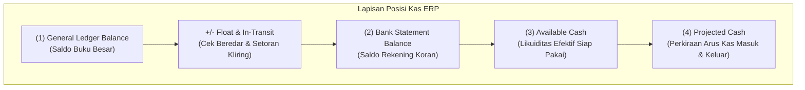
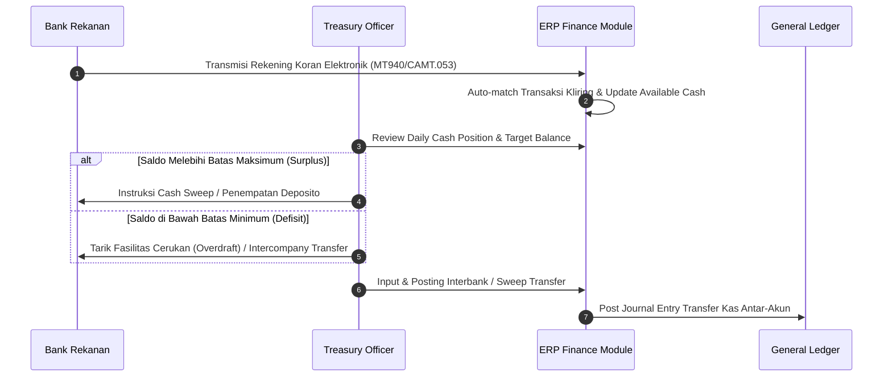

# Cash Management

## Definition

**Cash Management** dalam konteks ERP adalah proses operasional dan strategis untuk memantau, mengumpulkan, menyalurkan, menginvestasikan, dan merencanakan kas dan setara kas (*cash and cash equivalents*) organisasi secara *real-time*. 

Cash Management menjembatani pencatatan akuntansi (*General Ledger Cash*) dengan ketersediaan fisik dana di bank dan brankas, memastikan bahwa perusahaan senantiasa memiliki likuiditas yang cukup untuk memenuhi kewajiban jangka pendek tanpa menahan kas menganggur (*idle cash*) yang berlebihan.

Dalam ERP modern, Cash Management membedakan lima lapisan saldo kas:

1. **Accounting / Book Balance**: Saldo akun kas di buku besar (*General Ledger*) yang mencatat seluruh transaksi yang telah dibukukan (*posted*).
2. **Bank Statement Balance**: Saldo kas riil yang tercantum pada rekening koran (*bank statement*) yang diterbitkan oleh perbankan pada waktu tertentu.
3. **Available / Cleared Cash**: Dana riil di bank yang telah efektif kliring dan dapat ditarik atau ditransfer seketika tanpa risiko penolakan (*bounced*).
4. **Float / In-Transit Cash**: Selisih sementara antara buku besar dan rekening koran akibat jeda waktu kliring, mencakup *collection float* (setoran dalam proses/deposit in transit) dan *disbursement float* (cek/bilyet giro beredar/unpresented checks).
5. **Projected Cash Position**: Estimasi posisi kas masa depan yang menggabungkan saldo efektif saat ini dengan *expected cash inflows* (faktur penjualan jatuh tempo) dan *expected cash outflows* (faktur pembelian, payroll, dan pajak yang dijadwalkan).

---

## Purpose

1. **Mempertahankan Solvabilitas Operasional**: Memastikan ketersediaan dana likuid untuk melunasi kewajiban jangka pendek (vendor, payroll, pajak, utang bank) tepat waktu demi mencegah *default* atau denda penalti.
2. **Optimalisasi Pengembalian Dana (*Yield Optimization*)**: Menghindari *idle cash* yang tidak produktif melalui mekanisme penempatan deposito jangka pendek (*overnight deposit*) atau *cash sweep*.
3. **Mitigasi Biaya Keuangan**: Meminimalkan biaya bunga pinjaman bank (*overdraft interest*) atau biaya cerukan akibat kesalahan proyeksi kas.
4. **Visibilitas Sentral Likuiditas Multientitas**: Memantau posisi kas di seluruh rekening bank, unit bisnis, dan mata uang secara terkonsolidasi (*centralized cash pooling*).
5. **Pencegahan Fraud dan Kebocoran Kas**: Menerapkan kontrol ketat atas uang tunai fisik (*petty cash*) dan rekening operasional melalui pemisahan fungsi dan limitasi transfer.

---

## Business Process

Siklus Cash Management harian dalam ERP mencakup alur berikut:

### 1. Daily Cash Positioning
Setiap awal hari kerja, *Treasury Officer* memuat data rekening koran terbaru ke dalam ERP. Sistem secara otomatis menghitung *Net Cash Position* per rekening dan per mata uang:

$$\text{Net Cash Position} = \text{Available Bank Balance} + \text{Petty Cash} - \text{Urgent Outflows (Hari Ini)}$$

### 2. Petty Cash Management (Kas Kecil)
Pengelolaan uang tunai fisik di kantor untuk pengeluaran bernilai kecil (*incidental expenses*):
- **Imprest Fund System (Sistem Dana Tetap)**: Saldo kas kecil ditetapkan pada jumlah tertentu (misal Rp5.000.000). Pengeluaran dicatat dengan kuitansi fisik/digital tanpa langsung mengkredit akun kas besar. Saat saldo menipis mencapai batas minimum (*reorder level*), diajukan *replenishment* (penggantian dana) persis sebesar akumulasi bukti pengeluaran, sehingga saldo kas kecil kembali ke jumlah nominal semula.
- **Fluctuating Fund System (Sistem Dana Berfluktuasi)**: Saldo kas kecil berubah-ubah sesuai pengeluaran dan penambahan dana tanpa batas plafon tetap.

### 3. Intercompany Cash Pooling & Zero-Balance Accounts (ZBA)
Pada grup perusahaan dengan banyak anak entitas:
- Rekening operasional anak perusahaan diatur sebagai *Zero-Balance Account* (ZBA).
- Setiap akhir hari, sisa saldo di rekening anak perusahaan secara otomatis ditransfer (*swept*) ke *Master Pooling Account* di rekening induk untuk memusatkan likuiditas (*cash concentration*).
- Jika rekening ZBA membutuhkan dana untuk disbursement, dana ditransfer dari *Master Account* persis sebesar nominal tagihan yang akan dibayar.

---

## Business Rules

1. **Minimum Cash Balance Requirement**: Setiap rekening operasional wajib mempertahankan saldo pengaman minimum (*liquidity safety buffer*) untuk mencegah biaya cerukan.
2. **Dual Authorization for Cash Movements**: Setiap pemindahan dana antar-rekening (*interbank transfer*) atau penempatan investasi wajib menerapkan prinsip *four-eyes* (maker-checker).
3. **Imprest Replenishment Threshold**: Kas kecil wajib di-replenish ketika fisik kas telah terpakai minimal 70% atau pada tanggal penutupan buku bulanan, mana saja yang lebih dulu.
4. **Clearing Account Mandate**: Pemindahan dana antar-rekening tidak boleh langsung mendebit satu akun bank dan mengkredit akun bank lain dalam satu jurnal manual, melainkan wajib melalui *Bank Clearing / Cash-in-Transit Account* untuk memfasilitasi rekonsiliasi independen di kedua bank.
5. **Cut-off Time Compliance**: Pengajuan transfer antar-bank wajib mematuhi batas waktu sistem kliring nasional (BI-RTGS, BI-FAST, atau SKNBI di Indonesia) agar tidak terjadi keterlambatan settlement.

---

## Accounting Impact

Transaksi Cash Management melibatkan mutasi aset lancar dan akun penyeimbang kliring (*intercompany / clearing accounts*).

### 1. Pembentukan dan Pengisian Kas Kecil (Imprest Fund)
Ketika dana kas kecil dibentuk pertama kali atau diisi kembali:

| Akun | Debit (IDR) | Kredit (IDR) | Keterangan |
| :--- | :--- | :--- | :--- |
| `111100 - Petty Cash` | 5.000.000 | - | Pembentukan saldo tetap kas kecil |
| `111200 - Bank Mandiri Operasional` | - | 5.000.000 | Penarikan dana dari rekening operasional |

### 2. Penggantian Dana Kas Kecil (Replenishment pada Sistem Imprest)
Pengeluaran operasional diakui secara akrual saat *replenishment* disetujui:

| Akun | Debit (IDR) | Kredit (IDR) | Keterangan |
| :--- | :--- | :--- | :--- |
| `610100 - Office Supplies Expense` | 2.100.000 | - | ATK kantor |
| `610200 - Courier & Postage Expense` | 900.000 | - | Ongkos kirim ekspedisi dokumen |
| `610300 - Refreshment & Pantry Expense` | 800.000 | - | Konsumsi pantry kantor |
| `111200 - Bank Mandiri Operasional` | - | 3.800.000 | Penggantian dana tunai yang terpakai |

*(Catatan: Akun `Petty Cash` tidak berubah saldonya, tetap Rp5.000.000).*

### 3. Pemindahan Dana Antar-Bank (Interbank Transfer)
Untuk memindahkan likuiditas dari rekening penerimaan ke rekening pembayaran via akun transit:

**Langkah A — Pengiriman Dana (Disbursement):**
| Akun | Debit (IDR) | Kredit (IDR) | Keterangan |
| :--- | :--- | :--- | :--- |
| `111900 - Cash Transfer Clearing Account` | 25.000.000 | - | Dana dalam perjalanan transfer |
| `111210 - Bank BCA Collection` | - | 25.000.000 | Pengurangan saldo bank pengirim |

**Langkah B — Penerimaan Dana (Receipt Settlement):**
| Akun | Debit (IDR) | Kredit (IDR) | Keterangan |
| :--- | :--- | :--- | :--- |
| `111220 - Bank Mandiri Disbursement` | 25.000.000 | - | Penambahan saldo bank penerima |
| `111900 - Cash Transfer Clearing Account` | - | 25.000.000 | Kliring akun transit menjadi nol (0) |

---

## Example: Daily Cash Positioning di PT Maju Bersama

Pada tanggal 18 Maret 2026 pukul 08:30 WIB, Treasury Officer PT Maju Bersama mengevaluasi posisi kas harian:

1. **Buku Besar Kas & Bank**:
   - `Bank BCA Collection`: Rp45.000.000
   - `Bank Mandiri Disbursement`: Rp55.000.000
   - `Petty Cash Head Office`: Rp5.000.000
   - **Total Book Balance**: **Rp105.000.000**

2. **Rekonsiliasi & Float Kliring**:
   - Terdapat Cek Vendor yang belum dicairkan (*unpresented checks*) oleh PT Sumber Teknologi: Rp15.000.000 (mempengaruhi saldo bank riil).
   - Terdapat pembayaran bilyet giro dari pelanggan PT Mitra Niaga dalam proses kliring kliring BI: Rp25.000.000.
   - **Bank Statement Balance**: Rp105.000.000 + Rp15.000.000 - Rp25.000.000 = **Rp95.000.000**.

3. **Komitmen Pengeluaran Hari Ini**:
   - Pembayaran PPh 21 masa Februari jatuh tempo: Rp12.000.000.
   - Pelunasan tagihan supplier urgent: Rp18.000.000.
   - **Total Outflows Hari Ini**: **Rp30.000.000**.

4. **Kebutuhan Kas Operasional Minimum**:
   - Manajemen menetapkan batas minimum kas operasional harian sebesar Rp20.000.000 di Bank Mandiri Disbursement.
   - Saldo yang tersedia di Bank Mandiri saat ini: Rp55.000.000.
   - Setelah pembayaran hari ini (Rp30.000.000), sisa saldo Bank Mandiri: Rp25.000.000 (masih di atas buffer Rp20.000.000).
   - Treasury Officer memutuskan **tidak perlu melakukan cerukan** atau transfer likuiditas darurat dari BCA.

---

## ERP Implementation

Perbandingan fungsional modul Cash Management pada berbagai software ERP terkemuka:

| Aspek Fungsional | Odoo Enterprise | ERPNext | Microsoft Dynamics 365 | SAP S/4HANA Finance |
| :--- | :--- | :--- | :--- | :--- |
| **Pemisahan Jurnal Kas/Bank** | Dedicated *Bank & Cash Journals* per rekening bank | Master *Account* tipe Bank/Cash dengan integrasi *Mode of Payment* | *Bank accounts* terhubung ke *Ledger posting profiles* | *Bank Accounts* dan *House Banks* terintegrasi ke *Cash Management* |
| **Interbank Transfer** | Fitur *Internal Transfer* otomatis menggunakan *Liquidity Transfer Account* | Dokumen *Journal Entry* tipe *Inter-Company Transfer* atau *Bank Transfer* | *Bank transfer slip* dengan *Bridging account posting* | *Cash Transfer* atau *Payment Request* dengan kliring otomatis |
| **Petty Cash Workflow** | Menggunakan *Cash Register* atau modul pengeluaran *Expense Sheet* | Dokumen *Expense Claim* atau dedicated akun kas kecil imprest | *Cash and Bank Management petty cash register* | *Cash Journal* (*FBCJ*) terpisah untuk kasir fisik |
| **Cash Pooling & Concentration** | Memerlukan modul custom atau proses manual | Memerlukan custom script / intercompany multi-currency journal | Native fitur *Cash concentration* & *Target balance accounts* | Komprehensif via *SAP Treasury & Cash Management (FIN-FSCM-CLM)* |

---

## Naventra Consideration

Dalam perancangan arsitektur Cash Management pada Naventra ERP:

1. **Strict Clearing Account Policy**: Modul Treasury Naventra mewajibkan seluruh mutasi dana antar-rekening melewati *Cash-in-Transit Account* (`111900`). Tidak diperbolehkan jurnal manual satu baris Debit Bank A - Kredit Bank B untuk menjamin integritas audit rekonsiliasi bank.
2. **Digital Imprest Fund Ledger**: Kasir kas kecil tidak perlu mengakses modul GL penuh; Naventra menyediakan antarmuka khusus *Petty Cash Custodian* untuk menginput kuitansi, mengunggah foto bukti fisik, dan menekan tombol *Request Replenishment* yang otomatis membentuk draft Journal Entry untuk disetujui Finance Manager.
3. **Threshold Alert System**: Naventra menyertakan *early warning notification* otomatis melalui dashboard dan webhook ketika saldo rekening operasional turun di bawah *Minimum Cash Reserve* atau saldo kas kecil terpakai melampaui 75%.

---

## References

- International Accounting Standards Board (IASB). *IAS 7: Statement of Cash Flows*. IFRS Foundation.
- Association for Financial Professionals (AFP). *Treasury Management Body of Knowledge (TMBoK)*, 5th Edition.
- SAP SE. *Cash Operations in SAP S/4HANA Finance*. SAP Help Portal.
- Microsoft Corporation. *Cash and Bank Management Overview*. Microsoft Learn.
- Odoo S.A. *Manage Bank Accounts and Transfers*. Odoo Documentation.
- Frappe Technologies. *Managing Bank Accounts & Petty Cash*. ERPNext Documentation.
