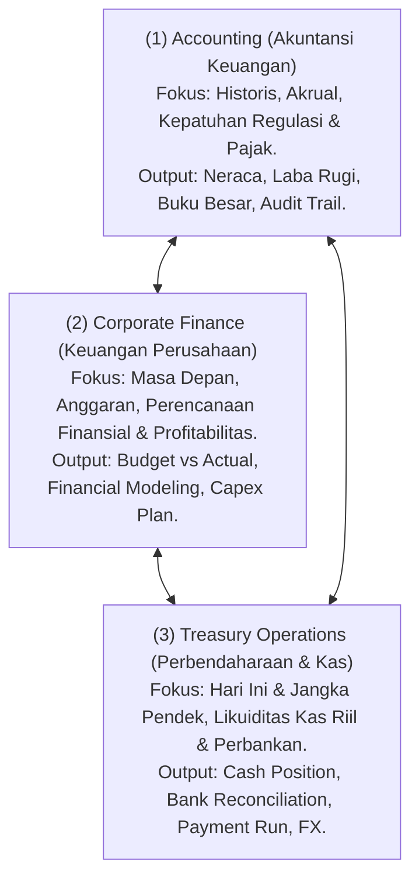
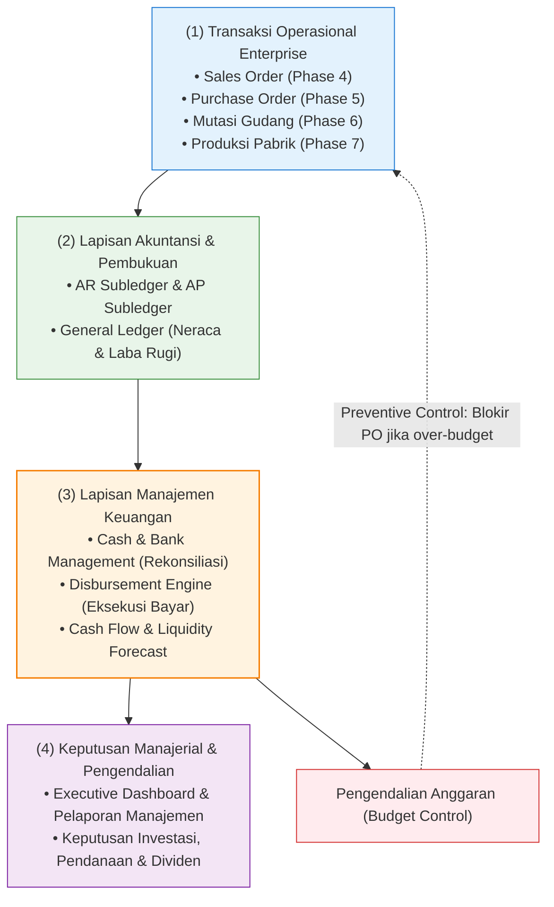

# Finance Fundamentals in ERP

## Definition

**Finance Management (Manajemen Keuangan)** dalam arsitektur Enterprise Resource Planning (ERP) adalah domain fungsional terpadu yang mengelola likuiditas, peredaran kas dan bank, perencanaan anggaran, proyeksi arus kas, manajemen modal kerja, serta pengendalian finansial organisasi untuk mendukung pengambilan keputusan strategis dan menjaga solvabilitas perusahaan.

Jika [[02-accounting/accounting-fundamentals|Phase 3 — Accounting]] berfokus pada **pencatatan historis transaksi masa lalu (*what happened*)** yang taat pada prinsip akrual dan standar pelaporan keuangan formal (IFRS/PSAK), maka domain Finance berfokus pada **pengelolaan likuiditas saat ini dan masa depan (*what is happening and what will happen*)**: memastikan uang kas riil selalu tersedia untuk memenuhi kewajiban operasional, mengoptimalkan penempatan dana, serta mengendalikan komitmen pengeluaran sebelum dana benar-benar keluar dari rekening bank.

---

## Business Purpose

1. **Menjamin Solvabilitas dan Likuiditas (*Liquidity Assurance*)**: Mencegah kegagalan pembayaran (*default risk*) terhadap tagihan vendor, penggajian karyawan, kewajiban pajak, dan cicilan perbankan.
2. **Optimalisasi Pengelolaan Kas (*Cash Optimization*)**: Menghilangkan dana mengendap yang tidak produktif (*idle cash*) melalui konsolidasi rekening (*cash concentration*) dan perencanaan arus kas yang presisi.
3. **Pengendalian Pengeluaran Berbasis Komitmen (*Preventive Spending Control*)**: Mengontrol pemakaian anggaran secara preventif sejak penerbitan dokumen pengadaan (*budget encumbrance*), bukan sekadar mencatat realisasi biaya setelah faktur tiba.
4. **Penyediaan Wawasan untuk Keputusan Strategis (*Decision Support*)**: Menyajikan dasbor keuangan manajerial (*Management Reporting*) dan analisis skenario masa depan (*Rolling Forecasts*) bagi jajaran direksi (CFO/CEO).

---

## Batasan Domain: Accounting vs. Finance vs. Treasury

Dalam organisasi skala menengah hingga enterprise, peran keuangan sering kali terbagi ke dalam tiga disiplin yang saling melengkapi namun memiliki fokus dan metrik yang berbeda:



### Matriks Perbandingan Tiga Disiplin:

| Dimensi | Accounting (Akuntansi) | Corporate Finance (Keuangan) | Treasury Operations (Perbendaharaan) |
| :--- | :--- | :--- | :--- |
| **Orientasi Waktu** | Masa Lalu (*Past / Historical*) | Masa Depan (*Future / Forward-Looking*) | Saat Ini & Sangat Dekat (*Present & Near-Term*) |
| **Basis Pengukuran** | **Prinsip Akrual (*Accrual Basis*)** | Rencana, Target, dan Estimasi Varian | **Arus Kas Riil (*Cash Basis*)** |
| **Pertanyaan Kunci** | *"Berapa laba bersih dan nilai aset kita bulan lalu?"* | *"Berapa anggaran yang boleh dibelanjakan tahun depan?"* | *"Apakah saldo bank hari ini cukup untuk membayar vendor besok pagi?"* |
| **Dokumen Utama** | Journal Entry, General Ledger, Laporan Keuangan Audit. | Budget Allocation, Rolling Forecast, Laporan Varian. | Cash Position Dashboard, Payment Batch, Rekening Koran Bank. |
| **Sasaran Kepatuhan** | IFRS, GAAP, Regulasi Perpajakan (DJP). | Kebijakan Internal Perusahaan, Target Dewan Komisaris. | Regulasi Perbankan, Kontrak Kredit, Manajemen Risiko Pasar. |

---

## Mental Model Arsitektur Aliran Informasi Keuangan

Aliran data dalam sistem ERP bergerak dari transaksi operasional harian hingga menjadi laporan keputusan finansial:



---

## Spektrum Fungsional Domain Finance dalam ERP

Modul Finance di dalam ERP enterprise mengintegrasikan serangkaian kapabilitas terstruktur:

1. **Cash Management**: Mengidentifikasi posisi saldo kas riil perusahaan setiap hari, memisahkan dana bebas vs dana terikat (*restricted cash*), dan mengelola kas kecil (*petty cash*).
2. **Bank Account Management**: Mengelola siklus hidup rekening bank perusahaan, penandatangan sah (*authorized signatories*), dan pemisahan fungsi rekening (operasional, penampungan, pembayaran gaji).
3. **Operational Bank Reconciliation**: Mengimpor mutasi rekening koran elektronik (*electronic bank statement*), mencocokkan mutasi secara otomatis, dan menangani pos-pos terbuka (*unmatched exceptions*).
4. **Payment and Cash Disbursement**: Mengelompokkan kewajiban jatuh tempo ke dalam proposal pembayaran (*payment proposal*), persetujuan berjenjang (*maker-checker*), dan transmisi file pembayaran ke perbankan.
5. **Budget Management & Control**: Menetapkan alokasi plafon belanja departemen, mengunci dana komitmen (*encumbrance*) saat pesanan pembelian disetujui, dan memblokir pengeluaran yang melampaui anggaran.
6. **Cash Flow Planning & Liquidity**: Memproyeksikan arus masuk (*cash inflows*) dari piutang dan arus keluar (*cash outflows*) dari utang usaha untuk mengantisipasi defisit atau surplus likuiditas.
7. **Working Capital Management**: Mengoptimalkan siklus konversi kas (*Cash Conversion Cycle*) melalui percepatan penagihan piutang (DSO), perpanjangan utang yang wajar (DPO), dan efisiensi persediaan (DIO).
8. **Financial Closing Governance**: Mengatur tata kelola penutupan buku (*period-end closing*) melalui daftar kendali (*closing checklist*), penguncian periode (*period lock*), dan validasi kesiapan pelaporan.

---

## ERP Implementation Comparison

| Aspek Arsitektur | Odoo Enterprise | ERPNext | Microsoft Dynamics 365 Finance |
| :--- | :--- | :--- | :--- |
| **Struktur Modul** | Terintegrasi erat dalam modul *Accounting* (menu *Treasury*, *Budgets*, dan *Reconciliation* berada dalam aplikasi akuntansi yang sama). | Menggabungkan akuntansi dan keuangan di dalam modul *Accounts* (fitur *Budgeting*, *Cash Flow Mapper*, dan *Payment Order*). | Memisahkan formal arsitektur enterprise: **Dynamics 365 Finance** (dengan sub-modul terdedikasi *Cash and Bank Management*, *Budgeting*, *Financial Period Close*). |
| **Kontrol Anggaran (Budget Control)** | Pengendalian anggaran berbasis persentase analitik; default bersifat *Soft Control* (notifikasi/laporan varian). | Mendukung opsi *Stop* (Hard Control) atau *Warn* (Soft Control) saat dokumen Material Request / PO disubmit. | Sangat komprehensif: **Budget Control Framework** tingkat industri yang mengevaluasi saldo draft, commitment, dan actual secara real-time. |
| **Konektivitas Perbankan** | Fitur bawaan *Bank Synchronization* via agregator pihak ketiga (Plaid, Yodlee) atau impor file standar (OFX, QIF, CAMT.053). | Mendukung integrasi Plaid dan impor file CSV/Excel rekening koran via *Bank Statement Import*. | Fitur enterprise canggih: Modul **Bank Connectivity & Electronic Banking** mendukung transmisi ISO 20022 XML, Host-to-Host (H2H), dan SWIFT. |

---

## Naventra Consideration

Untuk perancangan modul Finance pada sistem ERP enterprise seperti **Naventra**:

1. **Pemisahan Domain Model Finansial dari Jurnal Umum (GL)**:
   Meskipun transaksi keuangan bermuara pada pencatatan debit/kredit di buku besar, rancang entitas operasional keuangan (`payment_proposals`, `bank_accounts`, `budget_allocations`, `cash_positions`) sebagai lapisan layanan terpisah (*Finance Service*). Hal ini memungkinkan tim perbendaharaan mengelola draf pembayaran dan simulasi arus kas tanpa mengotori buku besar akuntansi dengan transaksi yang belum definitif.
2. **Arsitektur Kontrol Komitmen Anggaran Terdistribusi**:
   Terapkan mekanisme pemeriksaan anggaran (*Budget Validation Hook*) pada saat pembuatan dokumen hulu:
   ```sql
   -- Logika validasi komitmen anggaran sebelum rilis PO
   IF (v_actual_spend + v_committed_spend + new_order_amount) > v_budget_limit THEN
       IF v_enforcement_type = 'STRICT_BLOCK' THEN
           RAISE EXCEPTION 'Pengeluaran sebesar % melebihi sisa anggaran tersedia (%) untuk departemen %',
               new_order_amount, (v_budget_limit - v_actual_spend - v_committed_spend), v_department_code;
       END IF;
   END IF;
   ```
3. **Pemberlakuan Audit Trail Immutability pada Transaksi Kas**:
   Seluruh catatan pengeluaran kas dan persetujuan transfer perbankan wajib menerapkan prinsip pencatatan permanen (*append-only ledger*) dengan tanda tangan digital otorisator untuk memenuhi standar audit kepatuhan internal dan eksternal.

---

## References

- IFRS Foundation. *IAS 7: Statement of Cash Flows (Cash and Cash Equivalents Definitions)*.
- Committee of Sponsoring Organizations of the Treadway Commission (COSO). *Internal Control — Integrated Framework: Control Environment and Information & Communication*.
- Association for Financial Professionals (AFP). *Treasury Management Body of Knowledge (TMBoK): Cash Management and Corporate Liquidity Standards*.
- Microsoft Learn. *Cash and Bank Management Architecture in Dynamics 365 Finance*.
- Frappe ERPNext Documentation. *Accounts and Financial Management Concepts*.
- Odoo 17 Documentation. *Bank, Cash, and Budgetary Management Architecture*.
