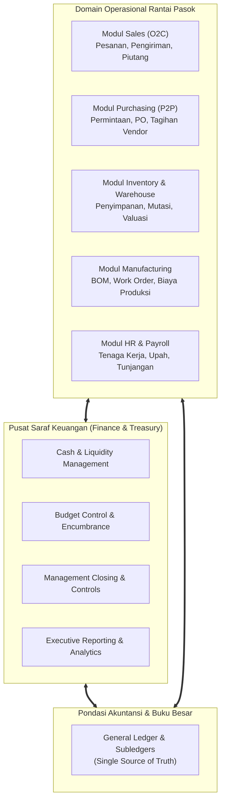

# Cross-Module Finance Integration

## Definition

**Cross-Module Finance Integration** adalah puncak arsitektur fungsional dalam sistem ERP di mana domain Finance bertindak sebagai sistem saraf pusat (*central nervous system*) yang menghubungkan seluruh transaksi operasional logistik, manufaktur, pengadaan, penjualan, dan sumber daya manusia ke dalam satu kesatuan arus kas, penganggaran, pengendalian, dan pelaporan strategis.

Di dalam ERP terpadu, tidak ada modul operasional yang terisolasi. Setiap pergerakan barang, pesanan pembelian, jam kerja mesin, atau pengiriman produk secara seketika (*real-time*) mentransmisikan data nilai moneter, memperbarui komitmen anggaran, menggerakkan posisi likuiditas, dan membentuk indikator kinerja manajerial.



---

## Purpose

1. **Eliminasi Silo Data Operasional dan Keuangan**: Menghilangkan ketidaksinkronan data antara angka laporan gudang, status pengiriman barang sales, dan saldo kas riil di perbankan.
2. **Pengendalian Terpadu di Titik Awal Transaksi (*Shift-Left Governance*)**: Menegakkan batas pagu anggaran dan batas kredit pelanggan pada saat transaksi diinisiasi di modul operasional, bukan menunggu saat pembayaran atau penagihan.
3. **Visibilitas Likuiditas Real-Time (*Single Source of Truth*)**: Memberikan pandangan menyeluruh atas seluruh komitmen kas masa depan (*future cash obligations & receipts*) dari pesanan yang sedang berjalan di seluruh departemen.
4. **Otomatisasi Alur Kerja Tanpa Sentuhan (*Touchless Straight-Through Processing*)**: Mempercepat transisi transaksi dari order penjualan hingga pengakuan laba dan rekonsiliasi kas tanpa intervensi manual yang memicu kesalahan input.
5. **Keterlacakan Forensik Penuh (*End-to-End Auditability*)**: Memungkinkan penelusuran balik dari saldo kas di neraca langsung ke riwayat interaksi pelanggan atau nomor seri komponen di lini perakitan pabrik.

---

## Master Integration Matrix

Matriks berikut menguraikan titik integrasi mendalam antara modul Finance dengan modul-modul fungsional ERP lainnya:

| Modul Terintegrasi | Titik Interaksi Utama | Dampak Finansial & Treasury | Dampak Anggaran & Kontrol | Dokumen Terkait |
| :--- | :--- | :--- | :--- | :--- |
| **Sales & Distribution (O2C)** | Konfirmasi Sales Order, Pengiriman Barang, Faktur Penjualan | Menggerakkan proyeksi kas masuk (*Inflow Forecast*), perhitungan DSO, dan pemulihan limit kredit pelanggan | Validasi limit kredit pelanggan (*Credit Limit Check*); penguncian pengiriman jika menunggak | `SO` $\rightarrow$ `Delivery Order` $\rightarrow$ `Customer Invoice` $\rightarrow$ `Payment Receipt` |
| **Purchasing & Procurement (P2P)** | Pembuatan PR, Rilis PO, Penerimaan Faktur Vendor | Menggerakkan proyeksi kas keluar (*Outflow Forecast*), optimasi diskon tunai (2/10, n/30), dan perhitungan DPO | *Budget Availability Check (AVC)*: penguncian dana *Commitment/Encumbrance* pada PR/PO | `PR` $\rightarrow$ `PO` $\rightarrow$ `GRN` $\rightarrow$ `Vendor Bill` $\rightarrow$ `Payment Batch` |
| **Inventory & Warehouse** | Penerimaan Barang, Mutasi Antar-Gudang, Stock Opname Fisik | Perhitungan modal terikat (*DIO* & *Working Capital Requirement*), evaluasi kas mengendap pada barang usang | Peringatan barang lambat bergerak (*Slow-Moving Flag*); kontrol persetujuan selisih stok | `Goods Receipt` $\rightarrow$ `Internal Transfer` $\rightarrow$ `Inventory Adjustment` |
| **Manufacturing & Production** | Rilis Work Order, Konsumsi Material, Konfirmasi Hasil Jadi | Penyerapan biaya tenaga kerja & overhead ke nilai persediaan barang jadi; perhitungan varian biaya standar | Alokasi biaya *Overhead Cost Center*; analisis varian harga vs pemakaian (*Price vs Usage Variance*) | `BOM` $\rightarrow$ `Work Order` $\rightarrow$ `Material Issue` $\rightarrow$ `Production Costing` |
| **HR & Payroll** | Rekapitulasi Absensi, Perhitungan Gaji Bulanan, Bonus | Pembentukan kewajiban kas keluar gaji (*Payroll Run*); pembayaran iuran BPJS dan PPh 21 tepat waktu | Kontrol anggaran pos belanja pegawai (*Personnel Budget* per Cost Center) | `Timesheet` $\rightarrow$ `Salary Structure` $\rightarrow$ `Payroll Entry` $\rightarrow$ `Bank Transfer File` |

---

## Master Canonical Scenario: Siklus Terpadu PT Maju Bersama

Untuk membuktikan integrasi komprehensif lintas modul, skenario kanonikal berikut menggambarkan siklus penuh perakitan dan penjualan **100 unit Laptop Pro** di PT Maju Bersama:

```mermaid
sequenceDiagram
    autonumber
    participant Pur as Purchasing & Vendor
    participant Prod as Pabrik Perakitan
    participant Sales as Sales & Pelanggan
    participant Fin as Finance & Treasury
    participant GL as General Ledger / Books

    Note over Pur,Fin: Tahap 1: Pengadaan Bahan Baku & Kontrol Anggaran
    Pur->>Fin: Terbitkan PO Bahan Baku ke PT Sumber Teknologi (Rp80.000.000 + PPN)
    Fin->>Fin: AVC Engine: Kunci Pagu Anggaran Belanja Bahan Baku (Commitment)
    Pur->>GL: Terima Komponen di Gudang (GRN) -> Catat GR/IR Clearing

    Note over Prod,GL: Tahap 2: Manufaktur & Penyerapan Biaya
    Prod->>GL: Rilis Work Order: Konsumsi Bahan Baku Rp80 Juta + Biaya Tenaga Kerja Rp15 Juta
    Prod->>GL: Hasil Produksi 100 Unit Laptop Pro Selesai -> Masuk Persediaan Barang Jadi (Rp95 Juta)

    Note over Sales,Fin: Tahap 3: Penjualan & Pengiriman Barang
    Sales->>Fin: Pesanan PT Mitra Niaga: 100 Unit @ Rp1.200.000 (Total Rp120.000.000 + PPN)
    Fin->>Fin: Validasi Kredit PT Mitra Niaga: Plafon Rp200 Juta (Lolos Verifikasi)
    Sales->>GL: Kirim 100 Unit Laptop Pro -> Akui Penjualan & COGS Rp95 Juta
    Fin->>Fin: Update Proyeksi Arus Kas Masuk Minggu ke-3 Sebesar Rp133.200.000

    Note over Fin,Pur: Tahap 4: Pelunasan Vendor & Penangkapan Diskon
    Fin->>Fin: Eksekusi Batch Pembayaran ke PT Sumber Teknologi (Manfaatkan Diskon Tunai 2%)
    Fin->>Pur: Bayar Rp87.024.000 Bersih via API Bank Mandiri (Hemat Diskon Rp1.776.000)

    Note over Fin,Sales: Tahap 5: Pelunasan Pelanggan & Rekonsiliasi Otomatis
    Sales->>Fin: PT Mitra Niaga Transfer Rp133.200.000 via Virtual Account BCA
    Fin->>Fin: Ingestion CAMT.053: Auto-Reconciliation 100% Cocok -> Pulihkan Limit Kredit Pelanggan

    Note over Fin,GL: Tahap 6: Analisis Kinerja, Working Capital, & Penutupan Buku
    Fin->>Fin: Evaluasi Modal Kerja: CCC Tercapai 33,6 Hari; Laba Kotor Rp25 Juta (Margin 20,8%)
    Fin->>GL: Kunci Periode Fiskal (Subledger -> GL Hard Lock) & Rilis Laporan Manajemen
```

### Penelusuran Langkah Skenario Kanonikal:

1. **Pengadaan Komponen & Kontrol Anggaran**:
   - Purchasing menerbitkan PO pengadaan motherboard, prosesor, dan layar senilai Rp80.000.000 (sebelum PPN 11%) kepada **PT Sumber Teknologi**.
   - Mesin AVC mengunci Rp80.000.000 dari pagu belanja komponen pada *Cost Center Produksi* sebagai *Commitment*.
   - Saat komponen tiba di gudang, penerimaan barang (*GRN*) membukukan debit pada akun Persediaan Bahan Baku dan kredit pada *GR/IR Clearing Account*.

2. **Manufaktur & Pembentukan Biaya Barang Jadi**:
   - Modul produksi merilis *Work Order* untuk merakit 100 unit Laptop Pro.
   - Bahan baku senilai Rp80.000.000 dikeluarkan ke proses perakitan (*WIP*), ditambah biaya tenaga kerja langsung sebesar Rp15.000.000 (Rp150.000/unit).
   - Setelah pengetesan kualitas selesai, 100 unit Laptop Pro masuk ke gudang barang jadi dengan total nilai persediaan Rp95.000.000 (biaya standar unit Rp950.000).

3. **Penjualan, Validasi Kredit, & Pembaruan Proyeksi Kas**:
   - Pelanggan institusional **PT Mitra Niaga** memesan 100 unit Laptop Pro dengan harga jual Rp1.200.000 per unit (Total Rp120.000.000 + PPN 11% Rp13.200.000 = Rp133.200.000) dengan syarat pembayaran *Net 30*.
   - Mesin kontrol kredit memvalidasi saldo piutang PT Mitra Niaga (saldo saat ini Rp40.000.000 + pesanan baru Rp133.200.000 = Rp173.200.000, masih di bawah plafon limit kredit Rp200.000.000). Pesanan disetujui.
   - Mesin *Cash Flow Forecast* secara otomatis menjadwalkan arus kas masuk sebesar Rp133.200.000 pada tangga likuiditas (*Cash Ladder*) minggu ke-3.

4. **Pembayaran Vendor & Optimalisasi Diskon Tunai**:
   - Tagihan PT Sumber Teknologi senilai Rp88.800.000 (termasuk PPN) memiliki klausul diskon tunai $2/10, n/30$.
   - Treasury menjalankan proposal pembayaran pada hari ke-9 untuk memanfaatkan diskon 2% (penghematan kas Rp1.776.000).
   - Transfer bersih senilai Rp87.024.000 dieksekusi melalui API Bank Mandiri. Beban komitmen anggaran dibebaskan (*released*) dan tercatat sebagai beban aktual.

5. **Pelunasan Piutang & Rekonsiliasi Perbankan Otomatis**:
   - Pada tanggal jatuh tempo, PT Mitra Niaga melunasi seluruh tagihan Rp133.200.000 ke rekening *BCA Collection* menggunakan nomor *Virtual Account* unik.
   - Berkas mutasi rekening koran elektronik (*CAMT.053*) ditarik otomatis oleh sistem pada pukul 06:00 WIB.
   - Mesin rekonsiliasi mencocokkan nomor Virtual Account dengan kepastian 100% (*Auto-Reconciled*). Faktur penjualan ditutup (*Paid*), kas riil bertambah, dan limit kredit PT Mitra Niaga kembali pulih sebesar Rp133.200.000.

6. **Evaluasi Modal Kerja, Analisis Kinerja, & Fast Close**:
   - Modul analitik menghitung efisiensi siklus: $\text{DIO} = 44,8 \text{ hari}$, $\text{DSO} = 30,4 \text{ hari}$, $\text{DPO} = 41,6 \text{ hari}$, menghasilkan $\text{CCC} = \mathbf{33,6 \text{ hari}}$.
   - Laba kotor tercapai sebesar Rp25.000.000 (margin 20,83%). Seluruh metrik tersaji pada *Executive Dashboard*.
   - Tim Akuntansi mengeksekusi penutupan buku bertahap (*Fast Close T+5*) dengan penguncian berurutan: Logistik $\rightarrow$ Subledger AP/AR $\rightarrow$ GL Hard Lock. Laporan keuangan disahkan secara digital tanpa selisih rekonsiliasi.

---

## ERP Architecture Patterns

Dalam mengimplementasikan integrasi keuangan lintas modul, software ERP terkemuka menerapkan beberapa pola arsitektur utama:

| Pola Arsitektur | Karakteristik Desain | Keunggulan Utama | Software Penerap |
| :--- | :--- | :--- | :--- |
| **Universal Journal Architecture (Single Table)** | Seluruh data operasional, akuntansi, dan biaya digabungkan dalam satu tabel raksasa terpadu | Tidak ada redundansi data; rekonsiliasi antar-modul dieliminasi secara inheren | SAP S/4HANA (Tabel `ACDOCA`) |
| **Event-Driven Asynchronous Integration** | Transaksi logistik mempublikasikan peristiwa (*event*) yang dikonsumsi oleh modul finansial | Kinerja input operasional sangat cepat; toleran terhadap beban puncak transaksi | Arsitektur Microservices Modern / Cloud ERP |
| **Two-Tier Ledger Model (Subledger + General Ledger)** | Modul operasional memelihara buku pembantu (*subledger*) rinci dan memposting ringkasan jurnal ke GL | Pemisahan beban kerja komputasi; ukuran basis data buku besar tetap ramping | Microsoft Dynamics 365, Oracle Cloud ERP |
| **Direct Document Relational Linking** | Dokumen operasional dan entri jurnal saling terhubung melalui relasi kunci asing (*Foreign Keys*) | Sangat mudah ditelusuri (*traceable*); fleksibilitas tinggi untuk kustomisasi | Odoo Enterprise, ERPNext |

---

## Naventra Consideration

Rancangan arsitektur integrasi lintas modul pada Naventra ERP:

1. **Transactional Event-Bus Pipeline**: Setiap mutasi di modul rantai pasok (misal konfirmasi surat jalan atau penerimaan barang) memicu *Domain Event* terstandarisasi yang dieksekusi dalam transaksi basis data terisolasi. Hal ini menjamin bahwa kegagalan kalkulasi analitik keuangan di latar belakang tidak akan menggagalkan kelancaran proses fisik serah terima barang di gudang.
2. **Atomic Consistency Guarantee**: Naventra menerapkan pola *Outbox Pattern* untuk komunikasi antar-layanan. Transaksi operasional dan pencatatan komitmen anggaran disimpan dalam satu blok transaksi atomik (*ACID guarantee*), mencegah terjadinya transaksi operasional yang lolos tanpa validasi pagu anggaran.
3. **Automated Cross-Module Integrity Validator**: Naventra menyertakan daemon pemantau integritas data (*System Health Bot*) yang setiap malam memvalidasi konsistensi matematis antar-tabel: memastikan saldo stok gudang $\times$ harga pokok sama dengan saldo akun persediaan di GL, dan total faktur terbuka di modul AR sama dengan saldo akun kontrol piutang.

---

## References

- SAP SE. *The Universal Journal (ACDOCA): Architecture and Data Model in SAP S/4HANA*. SAP Technical Whitepaper.
- Microsoft Corporation. *Financial Management Architecture in Dynamics 365*. Microsoft Learn.
- Association for Financial Professionals (AFP). *Integrated Treasury and ERP Architecture*.
- Chartered Institute of Management Accountants (CIMA). *Enterprise Governance and Inter-Departmental Control Systems*.
- Fowler, Martin. *Patterns of Enterprise Application Architecture*. Addison-Wesley.
