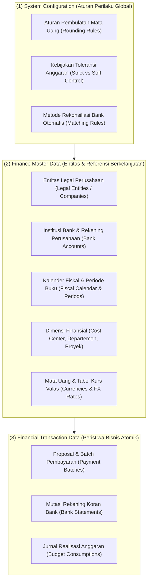
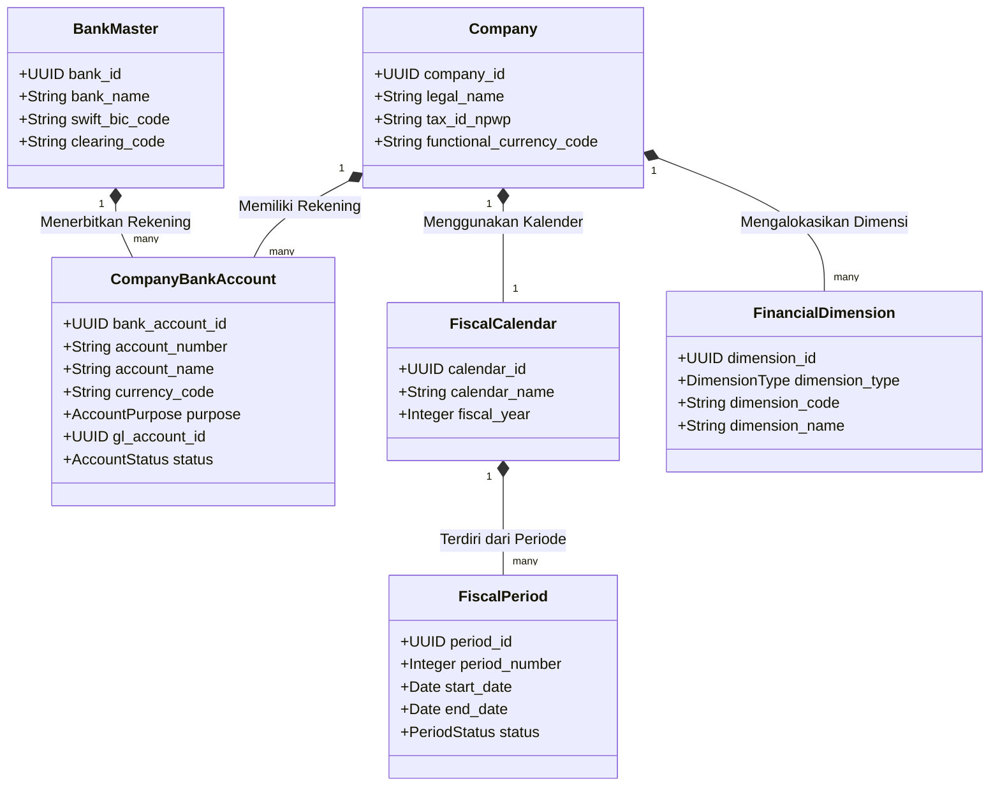

# Finance Master Data Architecture

## Definition

**Finance Master Data Architecture** adalah kumpulan data induk terpusat dan berumur panjang (*long-lived reference data*) dalam sistem ERP yang mendefinisikan entitas legal, institusi perbankan, rekening kas, mata uang, kalender fiskal, struktur anggaran, dan dimensi analitik yang digunakan untuk mencatat, mengontrol, dan melaporkan seluruh aktivitas perbendaharaan dan keuangan perusahaan.

Sebagaimana telah ditekankan pada [[00-fundamentals/master-data-vs-transaction-data|Phase 1 — Master Data vs Transaction Data]], master data finansial bertindak sebagai **fondasi referensi statis tunggal (*Single Source of Truth*)**. Kesalahan konfigurasi pada data induk keuangan (seperti kesalahan kode bank, pembagian periode fiskal yang salah, atau pemetaan dimensi biaya yang tidak lengkap) akan merusak validitas seluruh laporan manajerial dan kepatuhan perpajakan.

---

## Pemisahan Tiga Lapisan Data Finansial

Sistem ERP enterprise membedakan secara tegas antara konfigurasi sistem, data induk, dan catatan transaksi harian:



---

## Taksonomi Entitas Master Data Keuangan

Modul Finance dalam ERP mengelola beberapa kelompok data induk utama:

### 1. Legal Entity & Company Structure
Mendefinisikan entitas badan hukum perusahaan (PT, CV, Ltd) yang memiliki kewajiban pelaporan pajak dan neraca mandiri (lihat [[00-fundamentals/organizational-structure|Organizational Structure]]). Dalam grup perusahaan (*Holding/Multi-Company*), setiap entitas legal dapat memiliki mata uang fungsional (*Functional Currency*) dan rekening bank yang berbeda.

### 2. Bank & Bank Account Master
* **Bank Master**: Lembaga perbankan tempat perusahaan bermitra (misal: Bank Mandiri, BCA, Citibank), lengkap dengan kode kliring perbankan nasional (*BI-FAST, SKNBI, RTGS*) dan kode internasional (*SWIFT / BIC*).
* **Company Bank Account**: Rekening giro atau tabungan resmi milik perusahaan di bank tersebut, lengkap dengan nomor rekening, mata uang, penandatangan sah (*signatories*), dan akun pembukuan kontrol di buku besar umum ([[02-accounting/chart-of-accounts|Chart of Accounts]]).

### 3. Currency and Exchange Rate Master (Valuta Asing)
* **Base / Functional Currency**: Mata uang utama pembukuan buku besar perusahaan (misal: `IDR` di Indonesia).
* **Transaction Currency**: Mata uang yang tertera pada dokumen transaksi pengadaan atau penjualan (misal: `USD`, `EUR`, `SGD`).
* **Exchange Rate Tables (Tabel Kurs Valas)**:
  * *Kurs Spot / Transaksi Harian*: Digunakan saat posting pembayaran kas/bank.
  * *Kurs Pajak (KMK)*: Kurs resmi mingguan dari Kementerian Keuangan untuk perhitungan Faktur Pajak PPN/PPh.
  * *Kurs Tengah BI / Closing Rate*: Digunakan saat revaluasi saldo valas akhir bulan (lihat [[02-accounting/foreign-currency-accounting|Foreign Currency Accounting]]).

---

### 4. Fiscal Calendar and Financial Periods (Kalender Fiskal)
Kalender akuntansi yang membagi satu tahun buku menjadi periode-periode pelaporan terstruktur:
* Biasanya terdiri dari 12 periode bulanan reguler (Periode 1 s.d. Periode 12).
* Ditambah 1 atau 2 **Periode Penyesuaian Khusus (*Adjustment Periods / Period 13 & 14*)** yang digunakan khusus untuk menampung jurnal penyesuaian audit tahunan (*audit adjustments*) tanpa mengotori laporan operasional bulan Desember normal.

### 5. Financial Dimensions (Dimensi Finansial & Analitik)
Sumbu multidimensi yang disematkan pada setiap baris transaksi keuangan untuk memecah laporan laba rugi dan anggaran tanpa perlu membuat ribuan kode akun baru di Chart of Accounts:
* **Cost Center (Pusat Biaya)**: Unit organisasi yang menyerap biaya (misal: `CC-IT`, `CC-HR`, `CC-GA`).
* **Profit Center (Pusat Laba)**: Unit bisnis atau lini produk yang menghasilkan pendapatan mandiri.
* **Project Code**: Mengaitkan pengeluaran dan pemasukan dengan proyek kontrak pelanggan atau proyek belanja modal (*Capex*).
* **Geographical Region / Branch**: Lokasi kantor cabang fisik (misal: `Cabang Surabaya`, `Cabang Medan`).

### 6. Payment Terms and Payment Methods
* **Payment Terms (Syarat Pembayaran)**: Mendefinisikan perhitungan tanggal jatuh tempo dan diskon pelunasan cepat (misal: `Net 30`, `2/10 Net 30`, `COD`, `Advance 100%`).
* **Payment Methods (Metode Pembayaran)**: Jalur transfer dana fisik (misal: `Bank Transfer / H2H`, `Virtual Account`, `Corporate Credit Card`, `Cek/Giro`, `Petty Cash`).

---

## Hubungan Relasional Antar-Entitas Master Data Finansial

Struktur data induk keuangan saling terikat dalam hubungan relasional yang ketat:



---

## ERP Implementation Comparison

| Aspek | Odoo Enterprise | ERPNext | Microsoft Dynamics 365 Finance |
| :--- | :--- | :--- | :--- |
| **Model Rekening Bank** | Entitas `res.partner.bank` (rekening bank) yang ditautkan ke entitas `account.journal` bertipe *Bank*. | Entitas mandiri `Bank Account` yang ditautkan ke dokumen `Bank` dan akun GL bertipe *Bank*. | Memisahkan formal antara **Bank Facility**, **Bank Groups**, dan **Bank Accounts** di modul Cash and Bank Management. |
| **Dimensi Finansial** | Menggunakan fitur **Analytic Accounts** dan **Analytic Plans** (mendukung multi-dimensi analitik tak terbatas). | Menggunakan konsep **Cost Center** dan **Accounting Dimensions** yang dapat ditambahkan secara fleksibel pada seluruh dokumen transaksi. | Arsitektur kelas industri: **Financial Dimension Framework** dengan struktur hierarki akun gabungan (*Account Structures & Advanced Rules*). |
| **Kalender Fiskal & Periode** | Dikelola melalui rentang tanggal laporan dan fitur penguncian tanggal (*Accounting Closing Dates*). | Dokumen formal `Fiscal Year` yang terdiri dari baris-baris `Fiscal Year Period` bulanan. | Dokumen formal tingkat enterprise: **Fiscal Calendars** dengan status periode terpisah per modul (*Open, On Hold, Permanently Closed*). |

---

## Naventra Consideration

Untuk perancangan modul Master Data Keuangan pada sistem ERP enterprise seperti **Naventra**:

1. **Skema Database Rekening Bank Terstruktur**:
   ```sql
   CREATE TABLE bank_masters (
       id UUID PRIMARY KEY DEFAULT gen_random_uuid(),
       bank_code VARCHAR(20) NOT NULL UNIQUE,
       bank_name VARCHAR(100) NOT NULL,
       swift_code VARCHAR(20),
       clearing_code VARCHAR(20),
       is_active BOOLEAN NOT NULL DEFAULT TRUE
   );

   CREATE TABLE company_bank_accounts (
       id UUID PRIMARY KEY DEFAULT gen_random_uuid(),
       company_id UUID NOT NULL REFERENCES companies(id),
       bank_id UUID NOT NULL REFERENCES bank_masters(id),
       account_number VARCHAR(50) NOT NULL,
       account_name VARCHAR(100) NOT NULL,
       currency_code VARCHAR(3) NOT NULL,
       account_purpose VARCHAR(30) NOT NULL, -- 'OPERATING', 'COLLECTION', 'DISBURSEMENT', 'PAYROLL', 'ESCROW'
       gl_account_id UUID NOT NULL REFERENCES chart_of_accounts(id),
       is_active BOOLEAN NOT NULL DEFAULT TRUE,
       created_at TIMESTAMP WITH TIME ZONE DEFAULT NOW(),
       UNIQUE (company_id, bank_id, account_number)
   );
   ```
2. **Normalisasi Multi-Dimensi Finansial (Financial Dimensions)**:
   Hindari membuat akun buku besar terpisah untuk setiap departemen (misal: `6100-Beban-Gaji-IT`, `6100-Beban-Gaji-HR`). Desain tabel `financial_dimension_values` (`dimension_type`, `code`, `name`) dan sematkan kolom `cost_center_id` serta `project_id` pada setiap baris jurnal transaksi (`gl_entry_lines`).
3. **Pemberlakuan Penguncian Historis pada Perubahan Data Induk**:
   Terapkan kontrol validasi di mana atribut kritis (seperti `currency_code` atau `gl_account_id` pada rekening bank) **dilarang diubah secara langsung** jika rekening tersebut telah memiliki riwayat transaksi di buku besar atau rekonsiliasi.

---

## References

- ISO 4217. *Codes for the Representation of Currencies and Funds*.
- ISO 20022. *Universal Financial Industry Message Scheme: Cash Management and Bank Account Identification*.
- Microsoft Learn. *Financial Dimensions and Account Structures in Dynamics 365 Finance*.
- Frappe ERPNext Documentation. *Bank Account Master and Accounting Dimensions*.
- Odoo 17 Documentation. *Bank and Cash Accounts Setup and Analytic Accounting Plans*.
