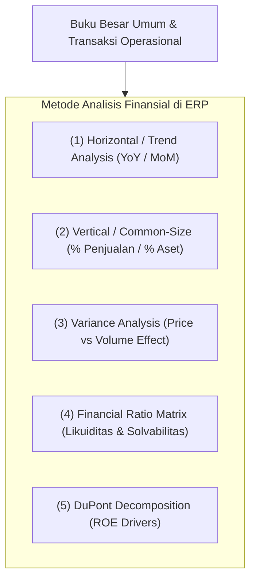
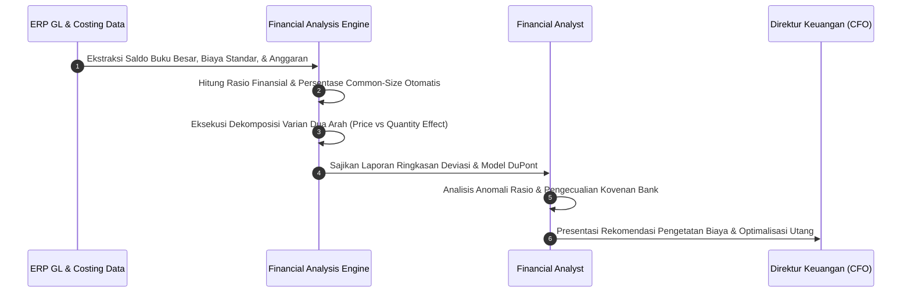

# Financial Analysis & Performance Evaluation

## Definition

**Financial Analysis & Performance Evaluation** dalam sistem ERP adalah proses komputasi, evaluasi, dan interpretasi kuantitatif terhadap data keuangan historis dan data berjalan perusahaan guna menilai kinerja, kesehatan finansial, efisiensi operasional, profitabilitas, serta profil risiko entitas.

Modul analitik keuangan dalam ERP mengubah catatan transaksi buku besar mentah (*raw GL entries*) menjadi indikator kinerja terstruktur melalui lima metode analitis utama:

1. **Horizontal Analysis (Analisis Tren)**: Membandingkan perubahan akun-akun finansial antar-periode waktu secara berurutan (*Month-over-Month / YoY*) untuk mengidentifikasi arah tren pertumbuhan atau penurunan.
2. **Vertical Analysis (Analisis Ukuran Standar / Common-Size)**: Menstandarisasi laporan keuangan dalam bentuk persentase terhadap akun patokan dasar (persentase terhadap Total Penjualan pada Laporan Laba Rugi, atau persentase terhadap Total Aset pada Neraca).
3. **Variance Analysis (Analisis Varian)**: Mengisolasi dan membedah deviasi antara realisasi aktual (*Actual*) terhadap anggaran (*Budget*) atau standar (*Standard Cost*).
4. **Ratio Analysis (Analisis Rasio Keuangan)**: Mengukur hubungan matematis antar-pos keuangan untuk mengevaluasi likuiditas, solvabilitas, efisiensi aktivitas, dan profitabilitas.
5. **DuPont Analysis**: Mendekomposisi rasio pengembalian ekuitas (*Return on Equity - ROE*) menjadi tiga komponen pendorong: efisiensi operasi, efisiensi penggunaan aset, dan leverage keuangan.

---

## Purpose

1. **Diagnosis Kesehatan Finansial Objektif**: Mengidentifikasi kelemahan struktur modal atau penurunan margin sebelum berkembang menjadi krisis solvabilitas yang mengancam kelangsungan usaha.
2. **Evaluasi Efisiensi Manajemen Operasional**: Mengukur seberapa efektif aset perusahaan dimanfaatkan untuk menghasilkan pendapatan melalui rasio perputaran (*turnover ratios*).
3. **Dekomposisi Akar Masalah Varian (*Root Cause Isolation*)**: Mengetahui apakah pembengkakan biaya disebabkan oleh kenaikan harga beli vendor (*Price Variance*) atau ketidakefisienan pemakaian bahan (*Quantity/Usage Variance*).
4. **Pemenuhan Kovenan Perbankan (*Debt Covenant Monitoring*)**: Memantau secara berkala rasio-rasio wajib yang disyaratkan dalam perjanjian pinjaman kredit bank (seperti *Debt-to-Equity Ratio* atau *Debt Service Coverage Ratio*).
5. **Landasan Valuasi dan Keputusan Investasi**: Memberikan gambaran imbal hasil atas modal yang diinvestasikan (*ROIC / ROE*) untuk evaluasi dividen dan ekspansi bisnis.

---

## Business Process

Proses evaluasi finansial dan dekomposisi varian dalam ERP mencakup alur kerja analitis berikut:

### 1. Kerangka Analisis Rasio Finansial (Financial Ratio Matrix)

ERP mengelompokkan perhitungan rasio ke dalam empat pilar utama:

#### A. Rasio Likuiditas (Liquidity Ratios)
- **Current Ratio (Rasio Lancar)**: $\frac{\text{Aset Lancar}}{\text{Kewajiban Lancar}}$ (Standar sehat industri umumnya $1,5 - 2,0$).
- **Quick / Acid-Test Ratio (Rasio Cepat)**: $\frac{\text{Kas} + \text{Efek Pasar Uang} + \text{Piutang Dagang}}{\text{Kewajiban Lancar}}$ (Mengeluarkan persediaan barang dari aset lancar).
- **Cash Ratio**: $\frac{\text{Kas dan Setara Kas}}{\text{Kewajiban Lancar}}$.

#### B. Rasio Profitabilitas (Profitability Ratios)
- **Gross Profit Margin**: $\frac{\text{Laba Kotor}}{\text{Pendapatan Penjualan}} \times 100\%$.
- **Operating Profit Margin (EBIT Margin)**: $\frac{\text{Laba Operasional}}{\text{Pendapatan Penjualan}} \times 100\%$.
- **Net Profit Margin**: $\frac{\text{Laba Bersih}}{\text{Pendapatan Penjualan}} \times 100\%$.
- **Return on Assets (ROA)**: $\frac{\text{Laba Bersih}}{\text{Total Aset}} \times 100\%$.
- **Return on Equity (ROE)**: $\frac{\text{Laba Bersih}}{\text{Total Ekuitas}} \times 100\%$.

#### C. Rasio Aktivitas / Efisiensi (Activity Ratios)
- **Inventory Turnover**: $\frac{\text{Beban Pokok Penjualan (COGS)}}{\text{Rata-rata Persediaan}}$.
- **Receivables Turnover**: $\frac{\text{Penjualan Kredit Bersih}}{\text{Rata-rata Piutang Dagang}}$.
- **Total Asset Turnover**: $\frac{\text{Pendapatan Penjualan}}{\text{Total Aset}}$.

#### D. Rasio Solvabilitas / Leverage (Solvency Ratios)
- **Debt-to-Equity Ratio (DER)**: $\frac{\text{Total Liabilitas}}{\text{Total Ekuitas}}$.
- **Debt-to-Asset Ratio**: $\frac{\text{Total Liabilitas}}{\text{Total Aset}}$.
- **Times Interest Earned (TIE / Interest Coverage)**: $\frac{\text{Laba Operasional (EBIT)}}{\text{Beban Bunga Pinjaman}}$.

### 2. Dekomposisi Model DuPont Tiga Tahap
Model DuPont menguraikan pendorong laba ekuitas (*ROE*) menjadi:

$$\text{ROE} = \underbrace{\left( \frac{\text{Laba Bersih}}{\text{Penjualan}} \right)}_{\text{Net Profit Margin}} \times \underbrace{\left( \frac{\text{Penjualan}}{\text{Total Aset}} \right)}_{\text{Asset Turnover}} \times \underbrace{\left( \frac{\text{Total Aset}}{\text{Ekuitas}} \right)}_{\text{Equity Multiplier}}$$

- **Net Profit Margin**: Mengukur efisiensi penetapan harga dan pengendalian beban operasional.
- **Asset Turnover**: Mengukur efisiensi penggunaan aset pabrik dan modal kerja dalam menciptakan omset.
- **Equity Multiplier**: Mengukur tingkat pengungkit utang (*leverage*) dalam struktur pembiayaan.

### 3. Dekomposisi Varian Biaya (Cost Variance Decomposition)
Ketika terjadi selisih antara biaya bahan baku aktual dan anggaran:

$$\text{Price Variance} = (\text{Harga Aktual} - \text{Harga Standar}) \times \text{Kuantitas Aktual}$$

$$\text{Quantity Variance} = (\text{Kuantitas Aktual} - \text{Kuantitas Standar}) \times \text{Harga Standar}$$

$$\text{Total Material Variance} = \text{Price Variance} + \text{Quantity Variance}$$

---

## Business Rules

1. **Caution on Cross-Industry Benchmarking**: Analisis rasio keuangan dilarang membandingkan metrik secara membabi buta lintas sektor industri yang berbeda (misal rasio perputaran persediaan perusahaan manufaktur perakitan elektronik tidak boleh disandingkan dengan ritel barang konsumsi harian/FMCG).
2. **Exclusion of Extraordinary / One-Off Items**: Dalam menghitung rasio profitabilitas operasional berkelanjutan (*sustainable operating margin*), keuntungan atau kerugian luar biasa satu kali (seperti penjualan tanah pabrik atau sengketa hukum luar biasa) wajib dikeluarkan dari angka EBIT.
3. **Consistent Denominator Conventions**: Dalam menghitung rasio perputaran atau imbal hasil (*return ratios*), pos neraca wajib menggunakan rata-rata saldo awal dan saldo akhir periode ($\frac{\text{Awal} + \text{Akhir}}{2}$) untuk menyelaraskan sifat pos neraca (*point-in-time*) dengan pos laba rugi (*period-of-time*).
4. **Debt Covenant Alert Threshold**: Sistem ERP wajib mengirimkan peringatan eskalasi jika rasio keuangan korporasi mendekati batas pelanggaran kovenan kredit bank (misal: jika bank mensyaratkan $\text{DER} \le 2,0\times$, sistem wajib memberi tanda peringatan kuning saat rasio mencapai $1,8\times$).
5. **Inflation & Currency Distortions Awareness**: Analisis tren horizontal multi-tahun wajib memperhitungkan distorsi devaluasi mata uang atau inflasi tinggi jika transaksi melibatkan entitas anak luar negeri.

---

## Accounting & Financial Impact

Analisis keuangan tidak mengubah jurnal pembukuan buku besar secara langsung, melainkan berfungsi sebagai instrumen evaluasi terhadap dampak keputusan finansial masa lalu terhadap struktur laporan keuangan.

---

## Example: Analisis Rasio & Dekomposisi Kinerja PT Maju Bersama

Pada penutupan Tahun Fiskal 2026, Analis Finansial mengevaluasi laporan keuangan audit PT Maju Bersama:

### 1. Data Ringkasan Laporan Keuangan 2026 (dalam Rupiah)
- **Laba Rugi**: Penjualan: Rp1.440.000.000, Laba Kotor: Rp300.000.000, Laba Operasional (EBIT): Rp160.000.000, Beban Bunga: Rp16.000.000, Laba Bersih: Rp120.000.000.
- **Neraca**: Kas & Deposito: Rp155.000.000, Piutang Dagang: Rp120.000.000, Persediaan: Rp140.000.000 (Total Aset Lancar: Rp415.000.000). Total Aset Tetap: Rp385.000.000. **Total Aset: Rp800.000.000**.
- **Kewajiban & Ekuitas**: Utang Dagang: Rp130.000.000, Utang Bank Jangka Pendek: Rp50.000.000, Biaya Akrual: Rp20.000.000 (Total Kewajiban Lancar: Rp200.000.000). Utang Jangka Panjang: Rp100.000.000. **Total Liabilitas: Rp300.000.000**. **Total Ekuitas: Rp500.000.000**.

### 2. Perhitungan Matriks Rasio Finansial

1. **Rasio Likuiditas**:
   - **Current Ratio**: $\frac{\text{Rp415.000.000}}{\text{Rp200.000.000}} = \mathbf{2,08\times}$ (Sangat sehat, di atas standar 1,5).
   - **Quick Ratio**: $\frac{\text{Rp155.000.000} + \text{Rp120.000.000}}{\text{Rp200.000.000}} = \mathbf{1,38\times}$ (Likuiditas kas dan piutang mampu menutup seluruh utang lancar).
2. **Rasio Profitabilitas**:
   - **Gross Margin**: $\frac{\text{Rp300.000.000}}{\text{Rp1.440.000.000}} = \mathbf{20,83\%}$.
   - **Net Profit Margin**: $\frac{\text{Rp120.000.000}}{\text{Rp1.440.000.000}} = \mathbf{8,33\%}$.
   - **ROA**: $\frac{\text{Rp120.000.000}}{\text{Rp800.000.000}} = \mathbf{15,00\%}$.
3. **Rasio Solvabilitas**:
   - **Debt to Equity Ratio (DER)**: $\frac{\text{Rp300.000.000}}{\text{Rp500.000.000}} = \mathbf{0,60\times}$ (Jauh di bawah batas kovenan bank 2,0x).
   - **Interest Coverage (TIE)**: $\frac{\text{Rp160.000.000}}{\text{Rp16.000.000}} = \mathbf{10,0\times}$ (Kemampuan melunasi bunga sangat kuat).

### 3. Analisis Dekomposisi DuPont atas Kinerja ROE
$$\text{ROE} = \underbrace{8,33\%}_{\text{Net Margin}} \times \underbrace{1,80\times}_{\text{Asset Turnover}} \times \underbrace{1,60\times}_{\text{Equity Multiplier}} = \mathbf{24,00\%}$$

Kesimpulan: Tingkat pengembalian modal pemegang saham sebesar 24% didorong secara seimbang oleh margin laba yang solid (8,33%) dan perputaran aset yang tinggi (1,80x), dengan penggunaan leverage keuangan yang relatif konservatif (pengali 1,60x).

---

## ERP Implementation

Perbandingan kapabilitas analisis performa finansial lintas sistem:

| Fitur Analisis Finansial | Odoo Enterprise | ERPNext | Microsoft Dynamics 365 | SAP S/4HANA Finance |
| :--- | :--- | :--- | :--- | :--- |
| **Kalkulasi Rasio Finansial Bawaan** | Melalui formula analitik di *Odoo Spreadsheet* | Laporan *Financial Ratios* standar | Workspace analitik *Financial Insights* | Aplikasi standar *Financial Key Figures (Fiori)* |
| **Dekomposisi Varian Biaya** | Analisis varian di modul manufacturing | Laporan *Cost to Produce* dan *BOM Variance* | Fitur *Variance analysis* pada modul penetapan biaya standar | Fitur *Production Order Variance Breakdown (KKS2/KOB1)* komprehensif |
| **Analisis Profitabilitas Segmen** | Pelaporan berbasis *Analytic Plan* | Analisis berbasis *Profit Center* / *Cost Center* | *Dimension statement* & analisis segmen pelaporan | Modul terdedikasi *Controlling Profitability Analysis (CO-PA)* |
| **Pemantauan Kovenan Pinjaman** | Tidak ada fitur native | Memerlukan kustom alert | Pelacakan parameter kovenan pada modul *Treasury* | Modul *Treasury and Risk Management (TRM)* dengan alert kovenan |

---

## Naventra Consideration

Rancangan arsitektur modul Financial Analysis & Performance Evaluation pada Naventra ERP:

1. **Automated Financial Ratio Engine**: Naventra menyertakan kalkulator rasio otomatis yang memproses seluruh metrik likuiditas, aktivitas, solvabilitas, dan profitabilitas secara otomatis setiap kali neraca saldo ditutup. Nilai rasio disajikan lengkap dengan indikator lampu lalu lintas (*Traffic-Light KPI System*) yang membandingkan performa dengan target internal.
2. **Interactive DuPont Explorer Canvas**: Pengguna manajerial dapat membuka tampilan visual pohon dekomposisi DuPont. Dengan mengklik cabang komponen (misal *Asset Turnover*), sistem secara otomatis membedah komponen sub-aset yang mengalami perlambatan perputaran.
3. **Automated Two-Way Variance Decomposer**: Pada modul manufaktur dan biaya, Naventra secara otomatis memecah setiap selisih beban pokok produksi menjadi komponen *Price Effect* dan *Usage Effect*, sehingga manajemen pabrik dan manajer pengadaan mengetahui secara pasti pihak yang bertanggung jawab atas varian tersebut.

---

## References

- CFA Institute. *Financial Reporting and Analysis: Learning Ecosystem*.
- Brigham, Eugene F., & Ehrhardt, Michael C. *Financial Management: Theory & Practice*, 16th Edition. Cengage Learning.
- SAP SE. *Profitability and Performance Management in SAP S/4HANA*. SAP Help Portal.
- Microsoft Corporation. *Financial Insights capabilities and ratio analysis in Dynamics 365 Finance*. Microsoft Learn.
- Robinson, Thomas R., et al. *International Financial Statement Analysis*. CFA Institute Investment Series.
