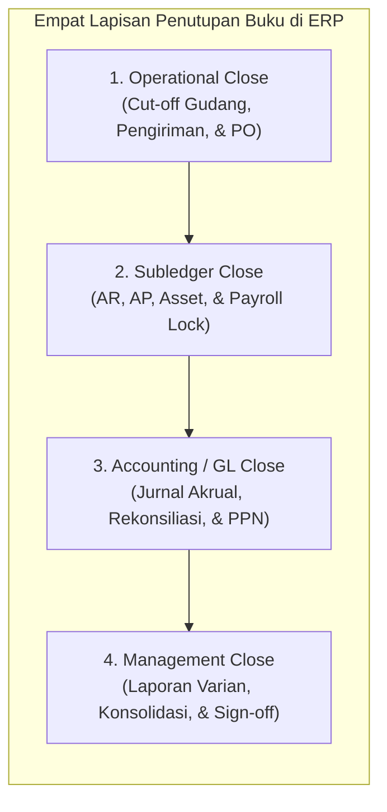
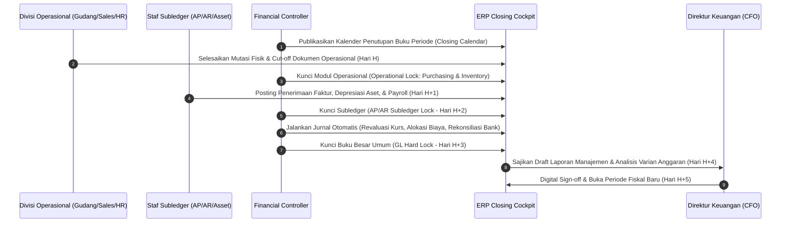
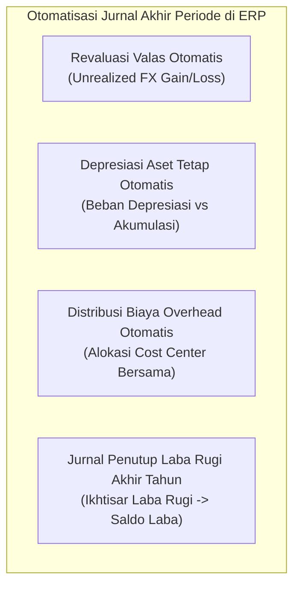

# Financial & Management Closing

## Definition

**Financial & Management Closing** dalam konteks Finance dan Tata Kelola ERP adalah orkestrasi lintas-fungsi yang sistematis dan terstruktur untuk menyelesaikan, memverifikasi, mengonsolidasi, dan membukukan seluruh aktivitas transaksi bisnis pada suatu periode fiskal (bulanan, kuartalan, atau tahunan). Proses ini memastikan bahwa laporan keuangan yang diterbitkan akurat, lengkap, mematuhi prinsip akuntansi, dan siap disajikan kepada manajemen, auditor, maupun otoritas publik.

Berbeda dengan mekanisme jurnal penyesuaian teknis yang telah dibahas pada [[02-accounting/period-closing|Period Closing di Phase 3]], **Financial Closing di Phase 8 berfokus pada tata kelola orkestrasi (*Closing Governance*), manajemen kalender penutupan (*Closing Calendar*), hierarki penguncian modul (*Progressive Period Locking*), dan inisiatif percepatan penutupan buku (*Fast Close*)**.

---

## Purpose

1. **Integritas dan Finalitas Data Finansial**: Memastikan tidak ada transaksi masa lalu yang dapat disisipkan atau diubah secara retrospektif setelah buku dinyatakan tertutup (*data tampering prevention*).
2. **Efisiensi Waktu Pelaporan (*Fast Close*)**: Mempercepat siklus penutupan buku dari belasan hari kerja menjadi 3 s.d. 5 hari kerja (*T+3 s.d. T+5*) melalui otomatisasi tugas berulang dan kejelasan pemilik tanggung jawab.
3. **Penyelarasan Batas Periode (*Strict Cut-Off Compliance*)**: Memastikan pendapatan dan beban dibukukan pada periode yang tepat (*matching principle*) tanpa distorsi pengakuan dini atau penundaan.
4. **Koordinasi Dependensi Antar-Departemen**: Mengelola ketergantungan urutan kerja (*task dependencies*) antar-divisi (misal akuntansi tidak dapat menutup buku sebelum gudang menyelesaikan *stock opname* fisik).
5. **Kepatuhan Audit & Tata Kelola Perusahaan**: Menyediakan jejak audit digital (*audit trail*) yang mencatat kapan suatu modul ditutup, oleh siapa, dan dokumen persetujuan manajerial (*sign-off*) yang mendasarinya.

---

## Business Process

Siklus penutupan buku modern dalam ERP dikendalikan melalui sistem orkestrasi terpusat (*Closing Cockpit*):

### 1. Empat Tingkatan Penutupan Buku (The Four Closing Layers)

#### A. Penutupan Operasional (Operational Close - Hari H s.d. H+1)
- Gudang menyelesaikan penerimaan barang (*Goods Receipt*) dan surat jalan pengiriman (*Delivery Order*).
- Pemotongan nomor seri dokumen fisik (*cut-off physical sequence*).
- Modul logistik dan manufaktur dikunci dari pembuatan transaksi mutasi stok baru.

#### B. Penutupan Subledger (Subledger Close - Hari H+1 s.d. H+2)
- Tim AP memposting seluruh faktur vendor yang telah lolos verifikasi *Three-Way Matching*.
- Tim AR menyelesaikan pencatatan faktur penjualan dan kliring penerimaan kas bank.
- Modul Aset Tetap menjalankan pembebanan depresiasi bulanan.
- Modul Payroll memposting rekapitulasi gaji dan iuran BPJS.
- Modul AR, AP, Asset, dan Payroll dikunci (*Subledger Locked*).

#### C. Penutupan Buku Besar Umum (Accounting / GL Close - Hari H+2 s.d. H+3)
- Rekonsiliasi rekening koran bank operasional dan kliring transit diselesaikan.
- Eksekusi revaluasi mata uang asing (*FX Revaluation*) untuk saldo moneter terbuka.
- Posting jurnal akrual beban (*accrued expenses*) dan pendapatan tangguhan (*deferred revenue*).
- Rekonsiliasi akun perantara (*GR/IR clearing account*).
- *General Ledger* dikunci secara menyeluruh (*GL Hard Lock*).

#### D. Penutupan Manajemen & Konsolidasi (Management Close - Hari H+3 s.d. H+5)
- Eliminasi transaksi antar-perusahaan (*intercompany eliminations*).
- Konsolidasi laporan multi-entitas anak perusahaan.
- Ekstraksi laporan keuangan manajerial dan rapat tinjauan varian (*Budget vs Actual Review*).
- Pengesahan formal (*Digital Sign-Off*) oleh Dewan Direksi.

---

## Business Rules

1. **Strict Sequential Module Locking Hierarchy**: Penguncian periode wajib mengikuti urutan dependensi logis: Logistik/Gudang $\rightarrow$ Subledger AP/AR/Asset $\rightarrow$ Buku Besar Umum (GL) $\rightarrow$ Konsolidasi Grup. GL dilarang dikunci sebelum seluruh subledger berstatus *Closed*.
2. **Soft Lock vs Hard Lock Distinction**:
   - **Soft Lock (Grace Period)**: Periode dikunci bagi seluruh pengguna umum, namun staf akuntansi berwenang masih dapat memposting jurnal penyesuaian koreksi dalam batas waktu tertentu.
   - **Hard Lock (Final Lockdown)**: Periode dikunci secara mutlak bagi seluruh pengguna sistem tanpa terkecuali. Tidak ada jurnal tambahan yang dapat dimasukkan tanpa persetujuan formal CFO dan pembukaan kunci audit (*unfreeze ticket*).
3. **No Unreconciled Subledger-to-GL Variances**: Periode fiskal dilarang dialihkan ke status *Hard Lock* jika terdapat selisih antara saldo buku pembantu (*subledger balance*) dengan saldo akun kontrol di buku besar umum (*GL control account balance*).
4. **Mandatory Cut-Off Evidence**: Setiap penutupan operasional gudang wajib melampirkan nomor dokumen terakhir yang sah (*last physical document number*) untuk membuktikan bahwa tidak ada dokumen yang disisipkan di kemudian hari.
5. **Automated Intercompany Out-of-Balance Threshold**: Transaksi antar-anak perusahaan wajib saling cocok (*matched*) dengan toleransi selisih maksimum Rp0 untuk transaksi dagang, atau toleransi selisih kurs yang telah ditentukan, sebelum konsolidasi manajemen dijalankan.

---

## Accounting & Financial Impact

Financial Closing memastikan bahwa seluruh saldo akun nominal (pendapatan dan beban) dialokasikan dengan benar dan siap diikhtisarkan ke dalam Saldo Laba (*Retained Earnings*).

Pemisahan tanggung jawab penutupan memastikan tidak terjadi pembukuan ganda atas beban akrual dan faktur riil yang masuk terlambat.

---

## Example: Kalender Fast Close Bulanan di PT Maju Bersama

PT Maju Bersama menerapkan target *Fast Close* 5 hari kerja ($T+5$) untuk penutupan buku periode Maret 2026:

| Hari Kerja | Waktu Target | Modul / Aktivitas | Penanggung Jawab | Status Penguncian Sistem |
| :--- | :--- | :--- | :--- | :--- |
| **Hari H (31 Mar)** | 17:00 WIB | Cut-off mutasi fisik gudang bahan baku & barang jadi | Warehouse Manager | Modul Inventory: **LOCKED** |
| **Hari H+1 (1 Apr)** | 12:00 WIB | Verifikasi surat jalan pengiriman & faktur penjualan | Sales Admin & Billing | Modul Sales / AR: **LOCKED** |
| **Hari H+1 (1 Apr)** | 17:00 WIB | Penerimaan faktur supplier & pemrosesan payroll | AP Team & HR Lead | Modul Purchasing & HR: **LOCKED** |
| **Hari H+2 (2 Apr)** | 15:00 WIB | Eksekusi depresiasi aset & rekonsiliasi bank harian | Asset & Treasury Lead | Subledger AP & Bank: **LOCKED** |
| **Hari H+3 (3 Apr)** | 18:00 WIB | Revaluasi valas, jurnal akrual, & review neraca saldo | Accounting Manager | Buku Besar (GL): **SOFT LOCK** |
| **Hari H+4 (6 Apr)** | 16:00 WIB | Eliminasi saldo intercompany & konsolidasi laporan | Group Controller | Buku Besar (GL): **HARD LOCK** |
| **Hari H+5 (7 Apr)** | 10:00 WIB | Rapat evaluasi manajemen & rilis Laporan Keuangan | CFO / Direktur Utama | Periode Maret: **CLOSED & SIGNED** |

Hasil penerapan: Manajemen menerima laporan kinerja keuangan bulanan pada tanggal 7 April pukul 10:00 WIB, memungkinkan evaluasi bisnis kuartal berjalan dilakukan lebih cepat dibandingkan rata-rata industri (yang mencapai 15 hingga 20 hari).

---

## ERP Implementation

Perbandingan kapabilitas manajemen penutupan buku pada berbagai platform:

| Fitur Orkestrasi Penutupan | Odoo Enterprise | ERPNext | Microsoft Dynamics 365 | SAP S/4HANA Finance |
| :--- | :--- | :--- | :--- | :--- |
| **Penguncian Periode Fiskal** | Field *Lock Date for Non-Advisers* dan *Lock Date for All Users* | Master *Period Closing Voucher* & *Freeze Accounting Entries* | *Fiscal calendars* dengan status *Open, On hold, Permanently closed* per subledger | Penguncian bertingkat per tipe akun (Posting Periods: *OB52 / MMRV*) |
| **Orkestrasi Alur Tugas (Task Management)** | Checklist manual pada modul project/dashboard | Fitur *Closing Voucher* mandiri | Ruang kerja khusus *Financial period close workspace* | Solusi enterprise *SAP Advanced Financial Closing (AFC)* & *Closing Cockpit* |
| **Dependensi Tugas & SLA Tracking** | Tidak ada dependensi otomatis bawaan | Tidak didukung secara native | Mendukung konfigurasi dependensi tugas, peran, dan tanggal jatuh tempo | Peta dependensi tugas otomatis (*Gantt Chart* visual) dengan eksekusi job latar belakang |
| **Otomatisasi Eliminasi Konsolidasi** | Modul multi-company intercompany transfer | Jurnal eliminasi manual antar-perusahaan | Modul *Consolidations* dengan aturan eliminasi otomatis | *SAP S/4HANA for Group Reporting* terintegrasi secara *real-time* |

---

## Naventra Consideration

Rancangan arsitektur modul Closing Governance pada Naventra ERP:

1. **Progressive Period Freeze Pipeline**: Naventra menyediakan panel kontrol status periode yang memungkinkan penguncian dilakukan bertahap per modul operasional: `INVENTORY_FROZEN` $\rightarrow$ `BILLING_FROZEN` $\rightarrow$ `AP_FROZEN` $\rightarrow$ `GL_SOFT_LOCKED` $\rightarrow$ `GL_HARD_LOCKED`.
2. **Interactive Closing Cockpit & Dependency Graph**: Sistem menyajikan visualisasi graf dependensi tugas penutupan buku. Pengguna tidak dapat menandai suatu tugas selesai sebelum tugas pendahulunya (*predecessor task*) disahkan oleh penanggung jawabnya.
3. **Emergency Unfreeze Audit Workflow**: Jika ditemukan kesalahan material setelah masa *Hard Lock*, periode hanya dapat dibuka kembali (*unlocked*) melalui tiket darurat yang disetujui bersama oleh CFO dan Lead Auditor Internal. Setiap mutasi yang terjadi selama masa pembukaan darurat dicatat dalam log forensik khusus (*Red-Flag Audit Trail*).

---

## References

- Bragg, Steven M. *Fast Close: A Guide to Closing the Books Quickly*. John Wiley & Sons.
- Institute of Management Accountants (IMA). *Transforming the Financial Close Process*.
- SAP SE. *SAP Advanced Financial Closing in SAP S/4HANA Finance*. SAP Help Portal.
- Microsoft Corporation. *Financial period close workspace in Dynamics 365 Finance*. Microsoft Learn.
- International Accounting Standards Board (IASB). *IAS 10: Events After the Reporting Period*. IFRS Foundation.
