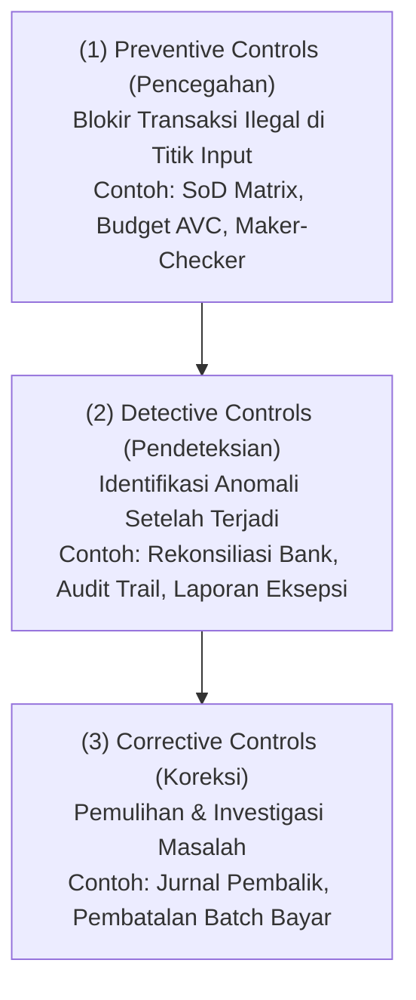
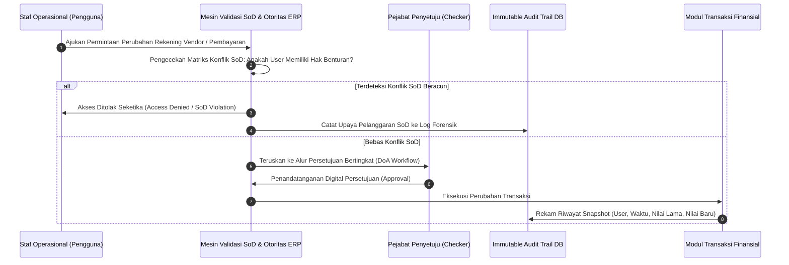

# Financial Controls & Governance

## Definition

**Financial Controls & Governance** dalam arsitektur ERP adalah kerangka kerja sistemik terintegrasi yang terdiri dari kebijakan, aturan bisnis otomatis (*automated validation checks*), matriks pemisahan fungsi (*Segregation of Duties - SoD*), alur persetujuan bertingkat (*Delegation of Authority*), dan jejak audit digital (*immutable audit trails*). Tujuannya adalah mengamankan aset perusahaan, mencegah kecurangan (*fraud*), memastikan integritas laporan keuangan, dan mematuhi regulasi perundang-undangan.

Sistem pengendalian internal dalam ERP modern merujuk pada standar **COSO Internal Control — Integrated Framework**, yang mengkategorikan kontrol ke dalam tiga lini pertahanan operasional:

---

## Purpose

1. **Pencegahan Fraud dan Kebocoran Kas (*Fraud Prevention*)**: Memutus rantai kolusi atau peluang penyelewengan dana internal melalui penegakan sistemik prinsip *Four-Eyes* dan pemisahan fungsi beracun (*Toxic SoD Combinations*).
2. **Jaminan Integritas Pelaporan Finansial (*ICFR / SOX Compliance*)**: Memberikan kepastian memadai (*reasonable assurance*) kepada auditor eksternal dan dewan komisaris bahwa data akuntansi tidak dimanipulasi secara retrospektif.
3. **Penegakan Tata Kelola Kewenangan (*Delegation of Authority*)**: Menjamin bahwa setiap pengeluaran kas atau komitmen kontrak disahkan oleh pejabat dengan tingkat jabatan yang sesuai dengan batas nilai moneter transaksi.
4. **Keterlacakan Forensik Penuh (*Immutable Audit Trail*)**: Merekam rekam jejak digital secara permanen atas setiap perubahan status dokumen, modifikasi master data, dan pembatalan transaksi.
5. **Standardisasi Prosedur Operasional Standar (SOP)**: Menghilangkan ketergantungan pada disiplin manual individu dengan memprogramkan aturan kepatuhan ke dalam kode sistem ERP.

---

## Business Process

Penerapan tata kelola kontrol finansial dalam operasional transaksi ERP bekerja melalui mekanisme terkoordinasi berikut:

### 1. Matriks Pemisahan Tugas (Segregation of Duties - SoD Conflict Matrix)
Prinsip SoD mensyaratkan bahwa langkah-langkah kritis dalam suatu siklus bisnis tidak boleh dikuasai oleh satu individu tunggal. ERP menerapkan matriks benturan (*Toxic Combinations Matrix*):

| Siklus Bisnis | Fungsi A (Pemrakarsa) | Fungsi B (Pengeksekusi / Penyetuju) | Risiko jika Dilakukan 1 Orang | Kebijakan Sistem ERP |
| :--- | :--- | :--- | :--- | :--- |
| **P2P / Utang** | Input Master Rekening Vendor | Eksekusi Pembayaran Tagihan | Penipuan transfer kas ke rekening pribadi | **Hard Stop**: User tidak dapat memiliki kedua *role* ini serentak |
| **P2P / Pengadaan** | Pembuatan Purchase Order (PO) | Penerimaan Barang (GRN) di Gudang | Pencatatan penerimaan barang fiktif | **Hard Stop**: Role PO dilarang mengakses form penerimaan |
| **O2C / Piutang** | Pembuatan Faktur Penjualan | Penerimaan Kas / Kliring Piutang | Penggelapan penerimaan kas (*lapping fraud*) | **Hard Stop**: Staf penagihan tidak memiliki hak kliring bank |
| **Keuangan** | Pembuat Pembayaran (Maker) | Otorisasi Transfer Bank (Checker) | Pengeluaran kas tanpa izin manajemen | **Hard Stop**: User pembuat dilarang menyetujui batch-nya |
| **Treasury** | Eksekusi Pembayaran Bank | Rekonsiliasi Rekening Koran Bank | Menyembunyikan selisih/kebocoran kas | **Hard Stop**: Rekonsiliator harus independen dari pembayar |

### 2. Matriks Pendelegasian Wewenang (Delegation of Authority - DoA)
ERP membatasi otorisasi berdasarkan nilai transaksi secara berjenjang:
- **Level 1 (Supervisor)**: Batas persetujuan belanja $\le$ Rp10.000.000.
- **Level 2 (Department Manager)**: Batas persetujuan belanja $\le$ Rp100.000.000.
- **Level 3 (Divisional Director)**: Batas persetujuan belanja $\le$ Rp500.000.000.
- **Level 4 (CFO & Direktur Utama)**: Batas persetujuan belanja $>$ Rp500.000.000 (wajib *Dual Approval*).

### 3. Jejak Audit Tak Terbantahkan (Immutable Audit Trail)
Setiap mutasi data dalam tabel finansial ERP secara otomatis mencatat 6 dimensi audit:
1. `WHO`: ID pengguna unik (*User ID*) dan sesi login.
2. `WHAT`: Operasi yang dilakukan (*Insert, Update, Soft-Delete*).
3. `WHEN`: Stempel waktu terverifikasi server jaringan (*Network Time Protocol - NTP*).
4. `WHERE`: Alamat IP sumber, MAC address, dan terminal akses.
5. `OLD VALUE`: *Snapshot* nilai data sebelum perubahan.
6. `NEW VALUE`: *Snapshot* nilai data setelah perubahan.

---

## Business Rules

1. **Zero Tolerance for Toxic Role Assignment**: Administrator sistem dilarang menetapkan dua peran yang bertentangan dalam matriks SoD kepada satu akun pengguna aktif tanpa dispensasi tertulis dari Komite Audit Dewan Komisaris.
2. **Immutable Audit Log Policy**: Tabel log audit sistem wajib disimpan dalam basis data terproteksi (*Write Once, Read Many - WORM*) di mana perintah SQL `DELETE` atau `DROP` dinonaktifkan secara permanen, bahkan untuk akun Administrator Sistem (*Superuser*).
3. **No Direct Production Database Manipulation**: Seluruh penyesuaian saldo akun atau status dokumen wajib dilakukan melalui antarmuka modul ERP dengan mekanisme jurnal penyesuaian. Modifikasi data langsung melalui skrip database backend (*direct SQL update*) pada lingkungan produksi dilarang keras.
4. **Mandatory Dual-Factor Authentication for Funds Transfer**: Setiap pengguna yang memiliki hak menandatangani atau melepaskan berkas transfer pembayaran ke bank wajib menggunakan otentikasi dua faktor (*Two-Factor Authentication - 2FA*) berbasis token perangkat keras atau aplikasi otentikator.
5. **Periodic User Access Recertification**: Sistem ERP wajib menjadwalkan tinjauan ulang hak akses pengguna (*User Access Review*) secara otomatis setiap 90 hari, di mana manajer departemen wajib mengonfirmasi ulang relevansi hak akses masing-masing bawahannya.

---

## Accounting & Financial Impact

Penerapan kontrol finansial menjamin kepatuhan terhadap standar pelaporan pengendalian internal (*Internal Control over Financial Reporting - ICFR*). Kegagalan kontrol dapat memicu opini audit auditor eksternal menjadi Wajar Dengan Pengecualian (*Qualified Opinion*) atau Tidak Memberikan Pendapat (*Disclaimer*).

---

## Example: Penanganan Upaya Manipulasi Rekening Vendor di PT Maju Bersama

Pada tanggal 15 April 2026, staf Bagian Utang Dagang (AP Specialist) berinisial "RA" mencoba mengubah nomor rekening bank milik vendor **PT Sumber Teknologi**:

1. **Upaya Transaksi**:
   - Pengguna "RA" membuka form Master Vendor PT Sumber Teknologi dan mengganti nomor rekening Bank Mandiri resmi vendor menjadi nomor rekening bank pribadi.
   - "RA" berniat menyetujui proposal pembayaran mingguan senilai Rp133.200.000 agar dana tertransfer ke rekening tersebut.

2. **Reaksi Sistem Pengendalian ERP**:
   - **Pencegahan 1 (SoD Block)**: Saat "RA" menyimpan perubahan nomor rekening, sistem mendeteksi bahwa "RA" adalah staf operasional AP. Perubahan data rekening vendor memicu status `PENDING_APPROVAL_TREASURY` dan membekukan sementara hak bayar (*Payment Freeze*) ke vendor tersebut selama 72 jam (*Cooling-Off Rule*).
   - **Pencegahan 2 (Maker-Checker Block)**: Ketika "RA" mencoba merilis proposal pembayaran, mesin sistem menolak: *"Access Denied: Payment batch cannot be released by the same user who initiated the transaction"*.
   - **Pendeteksian (Audit Logging)**: Modul kontrol mencatat upaya modifikasi master data ke dalam log insiden keamanan dan secara otomatis mengirimkan notifikasi peringatan berprioritas tinggi (*Security Alert*) ke email Internal Auditor dan CFO.
   - **Tindakan**: Internal Auditor memverifikasi nomor rekening ke pihak manajemen PT Sumber Teknologi melalui saluran resmi dan menemukan upaya penipuan internal sebelum dana perusahaan keluar.

---

## ERP Implementation

Perbandingan kapabilitas tata kelola dan kontrol finansial lintas sistem:

| Fitur Pengendalian Internal | Odoo Enterprise | ERPNext | Microsoft Dynamics 365 | SAP S/4HANA Finance |
| :--- | :--- | :--- | :--- | :--- |
| **Matriks Pemisahan Tugas (SoD)** | Memerlukan kustom grup akses atau modul pihak ketiga | Memerlukan pembatasan *Role Permissions* manual | Fitur native *Segregation of duties rules and conflict mitigation* | Modul enterprise terdepan *SAP Access Control (SAP GRC)* |
| **Hierarki Batas Wewenang (DoA)** | Modul *Approvals* berbasis alur kerja tingkat | Modul *Workflow* berbasis transisi status dan peran | Modul *Signing limits* dan *Purchase order approval policies* | *Release Procedures* & *Flexible Workflow for S/4HANA* |
| **Jejak Audit Forensik** | Fitur *Chatter tracking* dan field log metadata | Dokumen *Version Log* dan *Activity Log* bawaan | Fitur *Database log setup* menyeluruh pada tabel penting | *Change Documents (CDHDR / CDPOS)* dan *SAP Audit Log Service* |
| **Otentikasi & Keamanan Transaksi** | Dukungan 2FA standar pada portal login | Dukungan 2FA bawaan berbasis TOTP | Terintegrasi dengan *Azure Active Directory Conditional Access* | Dukungan *Single Sign-On (SSO)* dan *Digital Signatures (SSSF)* |

---

## Naventra Consideration

Rancangan arsitektur modul Financial Controls & Governance pada Naventra ERP:

1. **Native SoD Conflict Matrix Engine**: Naventra memelihara tabel aturan benturan peran `sod_conflict_rules`. Setiap kali administrator menetapkan hak akses baru kepada seorang staf, mesin sistem mengevaluasi matriks benturan secara *real-time* dan menolak penugasan jika teridentifikasi kombinasi peran beracun.
2. **Tamper-Proof Append-Only Audit Trail**: Log audit finansial pada Naventra dicatat ke dalam tabel partisi khusus yang hanya mengizinkan operasi *append* (sisip data baru). Setiap baris rekaman dilengkapi dengan tanda tangan kriptografi (*SHA-256 Hash Chaining*), sehingga manipulasi riwayat log akan seketika merusak validitas rantai hash audit.
3. **Emergency Four-Eyes Break-Glass Procedure**: Dalam situasi darurat di mana sistem membutuhkan *override* operasional mendesak di luar batas wewenang normal, Naventra menyediakan prosedur *Break-Glass* yang mewajibkan input kata sandi ganda seketika dari dua pejabat level Direktur yang berbeda, disertai kewajiban mengisi formulir alasan darurat yang langsung diteruskan ke Komite Audit.

---

## References

- Committee of Sponsoring Organizations of the Treadway Commission (COSO). *Internal Control — Integrated Framework (2013)*.
- Information Systems Audit and Control Association (ISACA). *IT Control Objectives for Sarbanes-Oxley*, 4th Edition.
- SAP SE. *Governance, Risk, and Compliance (SAP GRC) in SAP S/4HANA*. SAP Help Portal.
- Microsoft Corporation. *Segregation of duties overview in Dynamics 365 Finance*. Microsoft Learn.
- The Institute of Internal Auditors (IIA). *International Standards for the Professional Practice of Internal Auditing*.
