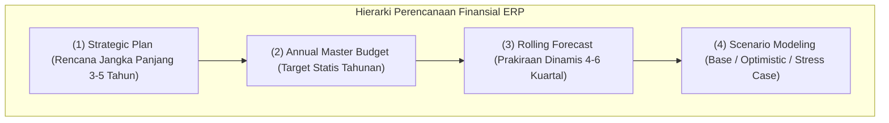
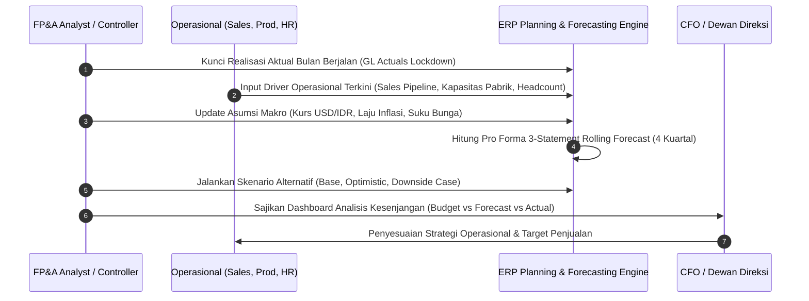
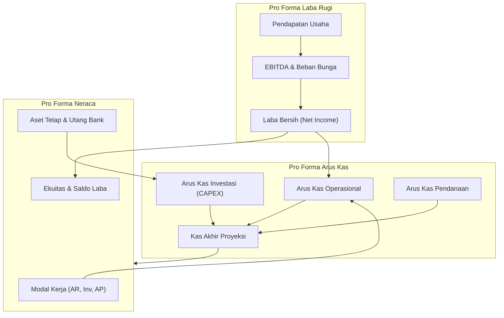

# Financial Planning & Forecasting

## Definition

**Financial Planning & Forecasting** dalam sistem ERP adalah disiplin perancangan model finansial masa depan yang menghubungkan visi strategis korporat dengan realitas operasional. Modul ini memungkinkan organisasi untuk memproyeksikan kinerja keuangan secara dinamis melalui kombinasi **Anggaran Statis (Annual Budget)**, **Prakiraan Bergulir (Rolling Forecast)**, dan **Simulasi Skenario (Scenario & What-If Planning)**.

Dalam arsitektur Corporate Performance Management (CPM) modern yang terhubung ke ERP, terdapat perbedaan mendasar antara tiga instrumen perencanaan:

| Dimensi | Annual Budget (Anggaran Tahunan) | Rolling Forecast (Prakiraan Bergulir) | Scenario Planning (Simulasi Skenario) |
| :--- | :--- | :--- | :--- |
| **Sifat Dokumen** | Komitmen target statis (*Performance Contract*) | Proyeksi realitas dinamis (*Best Estimate*) | Eksplorasi kemungkinan multi-kasus (*What-If Analysis*) |
| **Cakupan Waktu** | 1 Tahun Fiskal (Januari s.d. Desember) | Selalu memandang ke depan (misal: 4 s.d. 6 kuartal ke depan) | Beragam (1 bulan s.d. 5 tahun tergantung krisis/proyek) |
| **Frekuensi Pembaruan** | Statis / Sekali setahun (atau revisi tengah tahun) | Diperbarui secara berkala (bulanan atau kuartalan) | *Ad-hoc* saat terjadi perubahan variabel makroekonomi |
| **Fokus Utama** | Pengendalian biaya & batas kewenangan | Antisipasi tren pasar & penyesuaian kapasitas kas | Mitigasi risiko volatilitas & uji ketahanan likuiditas |

---

## Purpose

1. **Menjembatani Strategi dan Operasional**: Mengonversi target penjualan, ekspansi pabrik, dan peluncuran produk baru ke dalam estimasi kebutuhan modal kerja dan pembiayaan.
2. **Kelincahan Pengambilan Keputusan (*Agility*)**: Menggantikan ketergantungan pada anggaran statis akhir tahun yang sering usang dengan *rolling forecast* yang responsif terhadap dinamika inflasi, kurs, dan permintaan.
3. **Penyusunan Pro Forma Tiga Laporan Keuangan (*Integrated 3-Statement Modeling*)**: Memastikan keterkaitan matematis otomatis antara proyeksi Laba Rugi (*Income Statement*), Neraca (*Balance Sheet*), dan Arus Kas (*Cash Flow*).
4. **Alokasi Modal yang Efisien (*Capital Allocation*)**: Mengidentifikasi titik waktu terjadinya surplus likuiditas untuk ekspansi atau defisit kas yang memerlukan penarikan fasilitas kredit bank.
5. **Uji Ketahanan Bisnis (*Stress Testing*)**: Mengukur dampak penurunan volume penjualan atau kenaikan biaya bahan baku terhadap profitabilitas dan rasio likuiditas.

---

## Business Process

Siklus perencanaan keuangan dan prakiraan bergulir berbasis pemicu operasional (*Driver-Based Planning*) mencakup tahapan berikut:

### 1. Ingestion Data Aktual & Penguncian Periode Baseline
Sistem secara otomatis menarik data realisasi akuntansi (*Actual General Ledger*) dari periode yang baru saja ditutup. Angka aktual ini menjadi dasar (*baseline*) yang tidak dapat diubah untuk periode bulan berjalan ke belakang.

### 2. Pemodelan Berbasis Pemicu (Driver-Based Modeling)
Perencanaan di dalam ERP modern tidak menginput angka nominal GL secara manual, melainkan menggunakan variabel operasional (*business drivers*):
- **Revenue Drivers**: Jumlah unit pesanan (*Sales Volume*) $\times$ Harga jual rata-rata (*Average Selling Price*).
- **Cost of Goods Sold Drivers**: Kebutuhan bahan baku per unit (berdasarkan BOM pada [[06-manufacturing/bill-of-materials|Manufacturing]]), biaya tenaga kerja langsung per jam, dan indeks harga energi.
- **Operating Expense (OPEX) Drivers**: Jumlah karyawan (*Headcount*) $\times$ Rata-rata standar gaji & tunjangan per grade, sewa ruangan kantor per $m^2$.
- **Working Capital Drivers**: Asumsi perputaran piutang (*Days Sales Outstanding - DSO*), persediaan (*Days Inventory Outstanding - DIO*), dan utang dagang (*Days Payable Outstanding - DPO*).

### 3. Integrasi Tiga Laporan Keuangan Terpadu (3-Statement Modeling)
Perubahan pada driver operasional memicu pemutakhiran terintegrasi:
1. **Pro Forma Income Statement**: Menghasilkan estimasi pendapatan, margin kotor, EBITDA, dan laba bersih.
2. **Pro Forma Balance Sheet**: Laba bersih mengalir ke Saldo Laba (*Retained Earnings*), proyeksi DSO/DIO/DPO mengestimasi saldo AR, Persediaan, dan AP, sedangkan depresiasi aset tetap memperbarui nilai buku aset.
3. **Pro Forma Cash Flow**: Menghubungkan laba operasional dengan perubahan modal kerja non-kas untuk menghasilkan *Projected Ending Cash*.

### 4. Manajemen Versi dan Snapshotting
Setiap siklus perencanaan menghasilkan *snapshot* data yang dienkapsulasi ke dalam versi yang tidak dapat diubah (*immutable versions*), misalnya: `BUDGET_2026_V1`, `FORECAST_2026_Q2_BASE`, `FORECAST_2026_Q2_STRESS`.

---

## Business Rules

1. **Immutability of Finalized Versions**: Setelah versi anggaran atau prakiraan disahkan oleh Direksi, seluruh baris data pada versi tersebut dikunci secara permanen menjadi *Read-Only* untuk menjaga integritas data pembanding.
2. **Mandatory Mathematical Balance in Pro Forma Statements**: Model proyeksi keuangan wajib memenuhi persamaan dasar akuntansi ($\text{Aset} = \text{Kewajiban} + \text{Ekuitas}$). Setiap selisih keseimbangan matematis (*cash plug*) wajib dialokasikan secara eksplisit ke akun kas atau fasilitas kredit jangka pendek (*revolving credit*).
3. **Single Source of Truth for Historical Actuals**: Mesin peramalan dilarang mengizinkan modifikasi data historis actual di dalam modul perencanaan; data historis harus diambil langsung secara *read-only* dari modul akuntansi (*General Ledger*).
4. **Governed Macroeconomic Assumptions**: Parameter makro (seperti estimasi nilai tukar valuta asing, tarif pajak, dan asumsi inflasi) wajib dikelola secara terpusat oleh tim Treasury korporat dan berlaku seragam untuk seluruh unit bisnis.
5. **Rolling Window Consistency**: Pada model *rolling forecast*, setiap kali satu bulan atau kuartal terlewati menjadi *actual*, sistem secara otomatis memperpanjang horizon proyeksi satu periode ke depan (misal: penutupan Q1 2026 otomatis membuka horizon proyeksi hingga Q1 2027) untuk mempertahankan rentang pandang konstan.

---

## Accounting & Financial Impact

Meskipun Financial Planning bersifat proyeksi masa depan, hasilnya menjadi dasar penentuan strategi pembiayaan dan alokasi dividen perusahaan.

### 1. Struktur Pro Forma Tiga Laporan Keuangan Terpadu
Hubungan antar-laporan keuangan hasil simulasi perencanaan:

---

## Example: Simulasi Skenario Lini Laptop Pro di PT Maju Bersama

Menghadapi fluktuasi harga semikonduktor global pada Kuartal II 2026, FP&A Controller PT Maju Bersama menyusun simulasi dua skenario untuk produk unggulan **Laptop Pro**:

### 1. Asumsi Pemicu Operasional (Operational Drivers)

| Parameter / Driver | Baseline Case (Rencana Normal) | Downside Stress Case (Kenaikan Biaya & Penurunan Permintaan) |
| :--- | :--- | :--- |
| **Volume Penjualan Triwulan II** | 1.000 unit | 900 unit (Turun 10% akibat pelemahan pasar) |
| **Harga Jual Rata-Rata (ASP)** | Rp1.200.000 / unit | Rp1.200.000 / unit (Tidak dapat dinaikkan karena persaingan) |
| **Biaya Komponen Utama (BOM Cost)** | Rp800.000 / unit | Rp880.000 / unit (Naik 10% akibat depresiasi kurs) |
| **Biaya Tenaga Kerja & Overhead** | Rp150.000 / unit | Rp150.000 / unit |
| **Beban Operasional Tetap (OPEX)** | Rp100.000.000 | Rp100.000.000 |

### 2. Hasil Proyeksi Kinerja Finansial (Pro Forma P&L)

| Komponen Laba Rugi | Baseline Case (IDR) | Downside Case (IDR) | Dampak Varian (IDR) |
| :--- | :--- | :--- | :--- |
| **Pendapatan Penjualan** | 1.200.000.000 | 1.080.000.000 | -120.000.000 (-10%) |
| **Harga Pokok Penjualan (COGS)** | 950.000.000 | 927.000.000 | +23.000.000 (Efisiensi unit turun) |
| **Laba Kotor (Gross Profit)** | 250.000.000 | 153.000.000 | -97.000.000 (-38,8%) |
| *Gross Profit Margin* | *20,83%* | *14,17%* | *-6,66% margin contraction* |
| **Beban Operasional Tetap** | 100.000.000 | 100.000.000 | 0 |
| **Laba Operasional (EBIT)** | **150.000.000** | **53.000.000** | **-97.000.000 (-64,7%)** |

### 3. Dampak Manajerial
Hasil simulasi menunjukkan bahwa penurunan volume 10% yang disertai kenaikan harga bahan baku 10% menyebabkan keruntuhan laba operasional sebesar 64,7%. Manajemen PT Maju Bersama segera mengambil langkah mitigasi:
- Menegosiasikan *forward contract* harga komponen dengan PT Sumber Teknologi.
- Menetapkan rencana cadangan penghematan OPEX sebesar Rp30.000.000 jika skenario *Downside* mulai terealisasi pada akhir bulan April.

---

## ERP Implementation

Perbandingan kapabilitas perencanaan finansial dan peramalan:

| Fitur Perencanaan | Odoo Enterprise | ERPNext | Microsoft Dynamics 365 | SAP S/4HANA Finance |
| :--- | :--- | :--- | :--- | :--- |
| **Model Perencanaan & Forecasting** | Modul *Spreadsheet* terintegrasi data GL dan model analitik | Dokumen master *Budget* bulanan & alat analitik historis | *Finance Insights* (AI/ML Cash & Budget Forecasting) | *SAP Analytics Cloud (SAC)* terintegrasi dengan *BPC* & *S/4HANA IFP* |
| **Driver-Based Calculation** | Formula matematis pada lembar kerja *Odoo Spreadsheet* | Script kustom server-side atau formula lembar sebar eksternal | *Budget planning templates* & aturan alokasi formula | Engine native kalkulasi perencanaan driver pada *SAC Planning Engine* |
| **Manajemen Multi-Skenario** | Duplikasi model spreadsheet antar skenario | Pembuatan budget terpisah per skenario | Fitur *Budget plans* dengan skenario *Original, Revised, Projected* | Fitur versi tak terbatas (*Public/Private Versions*) pada *SAP Analytics Cloud* |
| **Integrasi Pro Forma 3-Statement** | Rumus spreadsheet manual antar-tabel | Memerlukan kustomisasi laporan pro forma | Didukung melalui *Financial Reporting Designer* | Otomatisasi konsolidasi 3-Statement via *SAP Group Reporting / SAC* |

---

## Naventra Consideration

Rancangan arsitektur modul Financial Planning & Forecasting pada Naventra ERP:

1. **Snapshot-Based Versioning Engine**: Naventra menyimpan data rencana keuangan dalam struktur *multi-version cube* berlabel: `VERSION_TYPE` (Budget, Actual, Forecast), `VERSION_CODE` (v1.0, v2.0), dan status integritas data (`DRAFT`, `FROZEN`, `ARCHIVED`).
2. **Bi-Directional Driver Calculation Pipeline**: Formula driver (misal: Unit $\times$ Price) dieksekusi secara asinkron melalui antrean *worker*. Perubahan pada satu parameter volume penjualan secara otomatis memicu pembaruan berantai pada proyeksi beban pokok persediaan dan estimasi saldo piutang dagang.
3. **Visual What-If Interactive Sandbox**: Pengguna level manajerial dapat mengakses antarmuka *Simulation Sandbox* untuk menggeser *slider* parameter biaya dan pendapatan secara langsung pada layar dashboard guna melihat kurva dampak terhadap posisi laba dan kas tanpa mengubah data operasional riil perusahaan.

---

## References

- Chartered Institute of Management Accountants (CIMA). *Planning, Budgeting, and Forecasting in the Digital Age*.
- SAP SE. *Integrated Financial Planning for SAP S/4HANA with SAP Analytics Cloud*. SAP Best Practices.
- Microsoft Corporation. *Financial planning and analysis in Dynamics 365 Finance*. Microsoft Learn.
- Association for Financial Professionals (AFP). *FP&A Body of Knowledge and Best Practices*.
