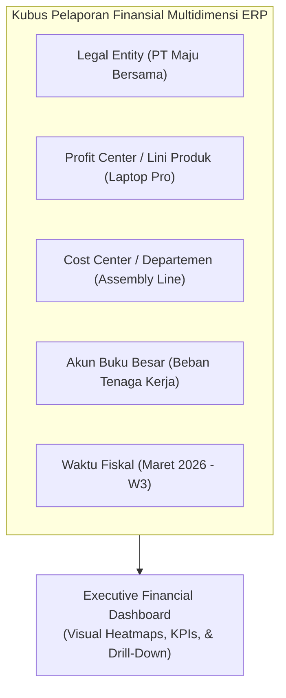
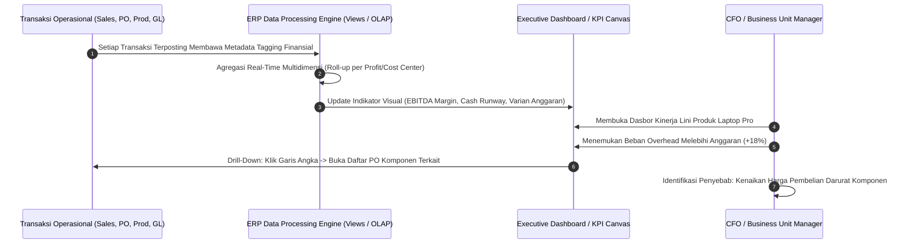
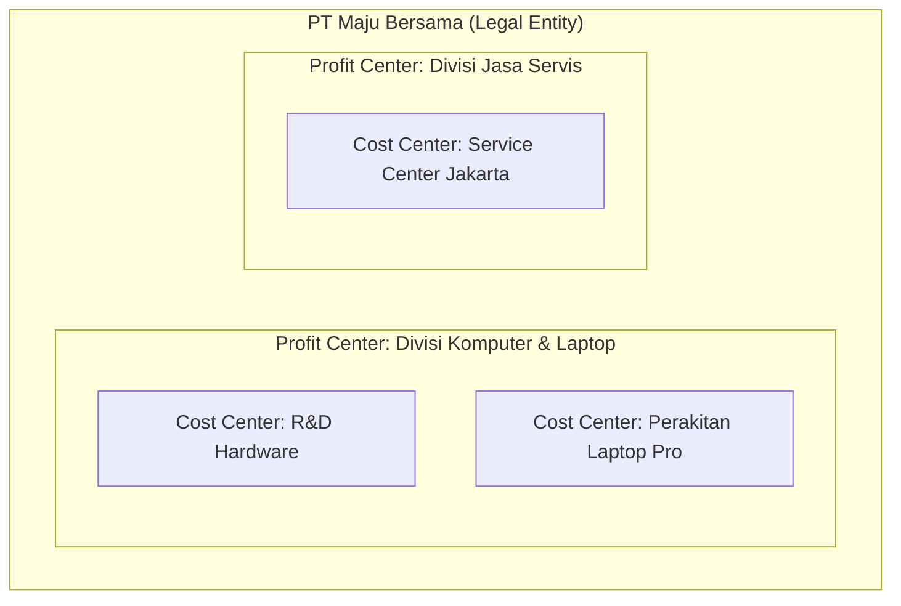

# Management Financial Reporting & Dashboards

## Definition

**Management Financial Reporting & Dashboards** dalam sistem ERP adalah subsistem pelaporan dan penyajian visual intelijen bisnis (*Business Intelligence*) yang dirancang khusus untuk mendukung pengambilan keputusan strategis dan operasional oleh manajemen internal (Direksi, *Business Unit Leaders*, dan *Cost Center Managers*).

Berbeda dengan Pelaporan Finansial Statutori ([[02-accounting/financial-statements|Financial Statements di Phase 3]]) yang berfokus pada kepatuhan aturan standar akuntansi bagi pihak eksternal, **Management Reporting berfokus pada fleksibilitas multidimensi, visualisasi indikator kinerja utama (*KPIs*), analisis profitabilitas segmen, dan kemampuan penelusuran data hingga ke dokumen transaksi operasional sumber (*drill-down to source document*)**.

| Dimensi Perbandingan | Statutory Reporting (Akuntansi Finansial) | Management Reporting (Manajemen Keuangan) |
| :--- | :--- | :--- |
| **Audiens Utama** | Pihak Eksternal (Auditor, Pajak, Pemegang Saham, Bank) | Pihak Internal (C-Level, Manajer Departemen, Operasional) |
| **Kerangka Aturan** | Standar Baku Kepatuhan (IFRS, PSAK, Regulasi Pajak) | Format Fleksibel Sesuai Kebutuhan Bisnis Internal |
| **Frekuensi Pelaporan** | Berkala (Bulanan, Kuartalan, Tahunan Resmi) | *Real-Time*, Harian, Mingguan, atau Sesuai Permintaan |
| **Sudut Pandang Entitas** | Entitas Hukum Lengkap (*Legal Entity*) | Segmen Bisnis, Lini Produk, *Profit Center*, Proyek |
| **Orientasi Waktu** | Historis & Pembuktian Kepatuhan Transaksi | Masa Lalu, Masa Kini, dan Proyeksi Masa Depan |
| **Tingkat Detail** | Ringkasan Saldo Buku Besar (*General Ledger Aggregates*) | Rinci Multidimensi hingga Baris Transaksi Operasional |



---

## Purpose

1. **Akselerasi Pengambilan Keputusan Manajerial**: Menyajikan informasi kinerja margin laba, posisi likuiditas, dan beban operasional dalam hitungan detik secara visual tanpa menunggu cetak buku akuntansi akhir bulan.
2. **Visibilitas Kinerja Segmen Bisnis**: Mengidentifikasi unit bisnis, produk, proyek, atau wilayah pemasaran mana yang memberikan margin kontribusi tertinggi vs yang membebani kas perusahaan (*Profitability Analysis*).
3. **Pengawasan Pengecualian (*Exception Reporting*)**: Mengarahkan perhatian eksekutif secara otomatis kepada anomali operasional (misal departemen yang menghabiskan anggaran melebihi batas toleransi atau piutang yang macet).
4. **Konektivitas Angka Finansial dengan Operasional**: Memungkinkan manajemen menelusuri dari satu angka di laporan rugi laba langsung ke surat jalan gudang atau pesanan pembelian (*Single Click Drill-Down*).
5. **Penyelarasan Metrik Finansial dan Non-Finansial**: Menggabungkan angka moneter dengan indikator efisiensi operasional (*unit output*, utilisasi jam mesin, tingkat retur pelanggan).

---

## Business Process

Penyajian laporan manajemen dan dasbor eksekutif dalam ERP bekerja melalui arsitektur pemrosesan analitik berikut:



### 1. Kemampuan Penelusuran Bertingkat (Drill-Down Hierarchy)
Arsitektur pelaporan ERP modern menjamin keterlacakan penuh (*end-to-end traceability*):

```text
Level 1: Executive KPI Card (Contoh: "Gross Margin Laptop Pro: 20,8%")
   ↓ (Click Drill-Down)
Level 2: Segmented P&L Report (Rincian Pendapatan, Biaya Komponen, Tenaga Kerja, Overhead)
   ↓ (Click Drill-Down)
Level 3: General Ledger Account Details (Daftar Jurnal Pembukuan Akun 510100 - Raw Material Consumed)
   ↓ (Click Drill-Down)
Level 4: Operational Source Document (Dokumen Manufacturing Order / PO / Goods Receipt / Vendor Bill)
```

### 2. Pelaporan Pengecualian Berbasis Aturan (Exception Reporting)
Manajemen tidak perlu memeriksa seluruh baris laporan yang normal. Sistem secara otomatis menyaring dan menyorot transaksi yang memenuhi kriteria deviasi (*Exception Alerts*):
- Biaya operasional cabang yang melonjak $> 15\%$ dibandingkan rata-rata 3 bulan terakhir.
- Penjualan produk dengan margin kotor di bawah ambang batas dasar ($< 10\%$).
- Piutang pelanggan yang umur tunggakannya melampaui 60 hari namun belum memiliki catatan intervensi *dunning*.

---

## Business Rules

1. **Zero Data Discrepancy with General Ledger**: Meskipun format laporan manajemen fleksibel dan multidimensi, total nilai moneter pada laporan manajemen wajib rekonsiliasi dan bernilai sama persis (*100% reconciled*) dengan saldo akun buku besar umum (*General Ledger*) yang mendasarinya.
2. **Access Security & Segregation on Sensitive Figures**: Hak akses terhadap metrik finansial sensitif (seperti margin laba kotor per lini produk, rincian biaya gaji, atau evaluasi laba per pelanggan) wajib diisolasi menggunakan *Role-Based Access Control (RBAC)* dan pembatasan baris data (*Row-Level Security*).
3. **Immutability of Historical Management Snapshots**: Laporan manajemen resmi bulanan yang telah dipresentasikan kepada Dewan Komisaris/Direksi wajib dibekukan dalam bentuk berkas arsip yang tidak berubah (*frozen snapshot*), sehingga penyesuaian akuntansi di masa depan tidak mengubah histori laporan presentasi masa lalu.
4. **Standardized KPI Definitions**: Definisi matematis setiap indikator (seperti EBITDA, Working Capital, Gross Profit) wajib ditetapkan secara korporat dalam *Data Dictionary* sistem ERP untuk mencegah perbedaan perhitungan antar-divisi.
5. **Real-Time vs Batched Refresh Clarity**: Setiap dasbor manajemen wajib mencantumkan secara transparan waktu pembaruan data terakhir (*Last Data Refresh Timestamp*), membedakan apakah angka yang tersaji merupakan kalkulasi seketika (*live streaming*) atau hasil kalkulasi terekam berkala (*nightly batch rollup*).

---

## Accounting & Financial Impact

Manajemen Finansial mengelompokkan laporan ke dalam struktur hierarki *Profit Center* dan *Cost Center* untuk menghasilkan Laporan Laba Rugi Segmen (*Segmented Income Statement*):



Laporan ini memungkinkan penghitungan **Margin Kontribusi (Contribution Margin)**:

$$\text{Contribution Margin} = \text{Revenue} - \text{Variable Production & Sales Costs}$$

$$\text{Segment Margin} = \text{Contribution Margin} - \text{Direct Traceable Fixed Costs}$$

---

## Example: Dasbor Finansial Eksekutif Divisi Laptop Pro di PT Maju Bersama

Pada penutupan operasional bulan Maret 2026, CFO PT Maju Bersama meninjau Dasbor Kinerja Lini Produk **Laptop Pro**:

### 1. Kartu Indikator Kinerja Utama (Executive KPI Cards)

| Indikator Finansial | Realisasi Aktual (Mar 2026) | Target Anggaran (Budget) | Deviasi / Varian | Status Indikator |
| :--- | :--- | :--- | :--- | :--- |
| **Pendapatan Penjualan** | Rp120.000.000 (100 unit) | Rp120.000.000 (100 unit) | Rp0 (0,0%) | On-Track (Hijau) |
| **Margin Laba Kotor (Gross Margin)** | Rp25.000.000 (20,83%) | Rp28.000.000 (23,33%) | -Rp3.000.000 (-2,50%) | Warning (Kuning) |
| **EBITDA Divisi** | Rp15.000.000 (12,50%) | Rp17.500.000 (14,58%) | -Rp2.500.000 (-2,08%) | Warning (Kuning) |
| **Siklus Konversi Kas (CCC)** | 33,6 hari | 30,0 hari | +3,6 hari | Warning (Kuning) |
| **Penyerapan Anggaran OPEX Divisi** | Rp10.000.000 (95,2%) | Rp10.500.000 | +Rp500.000 (Hemat 4,8%) | On-Track (Hijau) |

### 2. Analisis Tindak Lanjut via Drill-Down
1. CFO melihat warna kuning pada kartu **Gross Margin** (-2,5% dari target).
2. Melakukan klik pada kartu tersebut untuk membuka *Segmented Cost Breakdown*.
3. Sistem memperlihatkan bahwa biaya tenaga kerja langsung (*Direct Labor*) dan biaya overhead pabrik berada tepat pada target anggaran, namun pos **Bahan Baku Komponen Utama (Motherboard & RAM)** membengkak sebesar Rp3.000.000.
4. CFO melakukan *drill-down* ke dokumen sumber: Ditemukan bahwa akibat keterlambatan pengiriman reguler, tim purchasing melakukan pemesanan *spot order* darurat ke vendor pengganti dengan harga premi 5% lebih mahal.
5. Keputusan cepat: Menginstruksikan manajer rantai pasok untuk menaikkan level stok pengaman komponen kritis guna menghindari *spot purchasing* darurat di bulan depan.

---

## ERP Implementation

Perbandingan fungsional dasbor dan pelaporan manajemen lintas platform:

| Fitur Pelaporan Manajemen | Odoo Enterprise | ERPNext | Microsoft Dynamics 365 | SAP S/4HANA Finance |
| :--- | :--- | :--- | :--- | :--- |
| **Penyusunan Dasbor Interaktif** | Modul *Dashboard* visual & *Odoo Spreadsheet* terintegrasi | Modul *Dashboard View* dengan chart kustom berbasis kueri | Terintegrasi langsung dengan *Embedded Power BI Workspaces* | Layar berbasis peran *SAP Fiori Launchpad* & *Smart Business Apps* |
| **Kemampuan Drill-Down Dokumen** | *Drill-through* dari spreadsheet atau laporan dinamis ke formulir transaksi | Tombol navigasi dokumen sumber (*View Ledger / Source Doc*) | Fitur *Drill to transaction* dan *Voucher transactions view* | Kemampuan navigasi mendalam lintas aplikasi via *Object Pages* |
| **Pelaporan Multidimensi** | Menggunakan *Analytic Accounts* dan tag dimensi analitik | Menggunakan *Accounting Dimensions* (Cost Center, Project) | *Financial dimensions* yang dapat dikombinasikan tanpa batas | *Universal Journal (ACDOCA)* dengan ratusan dimensi analitik |
| **Pelaporan Pengecualian (Alerts)** | Otomatisasi via *Automated Actions* dan peringatan chatter | Fitur *Notification Engine* berbasis kondisi skrip Python | *Alert rules* dan pemicu alur kerja *Power Automate* | *Situation Handling Engine* yang secara cerdas mendeteksi deviasi |

---

## Naventra Consideration

Rancangan arsitektur modul Financial Reporting & Dashboards pada Naventra ERP:

1. **Real-Time Materialized Metric Views**: Naventra menggunakan tabel agregasi terindeks (*materialized analytics tables*) yang diperbarui secara asinkron setiap kali terjadi pembukuan transaksi jurnal. Hal ini memungkinkan dasbor eksekutif memuat grafik performa ratusan ribu transaksi dalam waktu kurang dari 500 milidetik tanpa membebani basis data transaksi utama.
2. **Deterministic Drill-To-Source Engine**: Setiap baris metrik keuangan pada Naventra memelihara *Lineage Pointer* yang mengaitkan saldo angka dengan ID tabel transaksi operasional sumber (`origin_document_type`, `origin_document_id`). Satu klik pada dasbor langsung mengarahkan pengguna ke dokumen fisik aslinya.
3. **Customizable Executive Widget Canvas**: Naventra menyediakan antarmuka perancang dasbor berbasis kartu (*card widget canvas*) yang memungkinkan Direktur Keuangan menyusun, memfilter, dan mengatur tata letak KPI penting sesuai preferensi kerja individu tanpa memerlukan bantuan staf pemrograman IT.

---

## References

- Chartered Institute of Management Accountants (CIMA). *Management Accounting Guidelines: Performance Management & Reporting*.
- Institute of Management Accountants (IMA). *Management Accounting Quarterly: Best Practices in Executive Dashboards*.
- SAP SE. *Embedded Analytics in SAP S/4HANA Finance*. SAP Help Portal.
- Microsoft Corporation. *Financial reporting overview and Power BI integration in Dynamics 365*. Microsoft Learn.
- Eckerson, Wayne W. *Performance Dashboards: Measuring, Monitoring, and Managing Your Business*. John Wiley & Sons.
