# Finance Management

Selamat datang di modul pembelajaran **Finance Management** dalam knowledge base `erp-notes`.

Modul ini membahas arsitektur domain keuangan tingkat lanjut (*Advanced Financial & Treasury Management*) dalam sistem ERP secara universal dan *vendor-agnostic*. Jika [[02-accounting/index|Phase 3 (Accounting)]] berfokus pada mekanisme pencatatan buku besar (*General Ledger*), kepatuhan standar akuntansi statutori (IFRS/PSAK), dan pelaporan kepatuhan eksternal, maka **Phase 8 (Finance) berfokus pada manajemen likuiditas, pengelolaan kas dan perbankan, perencanaan masa depan (budgeting & forecasting), optimalisasi modal kerja, tata kelola penutupan buku (closing governance), pengendalian internal (internal controls), serta pengambilan keputusan manajerial berbasis analitik**.

---

## Arsitektur Kurikulum Finance (5 Pilar)

Kurikulum Finance disusun dalam 5 pilar berurutan yang mencakup 16 topik kanonikal:

```mermaid
flowchart TD
    subgraph P1["Pilar 1: Fondasi & Master Data"]
        N1["[[07-finance/finance-fundamentals|Finance Fundamentals]]"]
        N2["[[07-finance/finance-master-data|Finance Master Data]]"]
    end

    subgraph P2["Pilar 2: Treasury & Cash Operations"]
        N3["[[07-finance/cash-management|Cash Management]]"]
        N4["[[07-finance/bank-account-management|Bank Account Management]]"]
        N5["[[07-finance/bank-reconciliation|Operational Bank Reconciliation]]"]
        N6["[[07-finance/payment-and-cash-disbursement|Payment & Cash Disbursement]]"]
    end

    subgraph P3["Pilar 3: Planning, Budgeting & Liquidity"]
        N7["[[07-finance/budget-management|Budget Management & Control]]"]
        N8["[[07-finance/financial-planning|Financial Planning & Forecasting]]"]
        N9["[[07-finance/cash-flow-planning|Cash Flow Planning & Forecasting]]"]
        N10["[[07-finance/liquidity-management|Liquidity Management]]"]
        N11["[[07-finance/working-capital-management|Working Capital Management]]"]
    end

    subgraph P4["Pilar 4: Closing, Reporting & Analytics"]
        N12["[[07-finance/financial-closing|Financial & Management Closing]]"]
        N13["[[07-finance/financial-reporting|Management Financial Reporting & Dashboards]]"]
        N14["[[07-finance/financial-analysis|Financial Analysis & Performance Evaluation]]"]
    end

    subgraph P5["Pilar 5: Controls & Master Integration"]
        N15["[[07-finance/financial-controls|Financial Controls & Governance]]"]
        N16["[[07-finance/finance-integration|Cross-Module Finance Integration]]"]
    end

    P1 --> P2 --> P3 --> P4 --> P5
```

---

## Daftar Materi Pembelajaran Lengkap

### Pilar 1: Fondasi & Master Data Keuangan
1. **[[07-finance/finance-fundamentals|Finance Fundamentals]]**  
   Perbedaan mendasar antara Finance, Accounting, dan Treasury; model mental empat kuadran (*Compliance vs Strategy, Historical vs Predictive*); serta ruang lingkup fungsional manajemen keuangan dalam ERP.
2. **[[07-finance/finance-master-data|Finance Master Data]]**  
   Tata kelola master entitas hukum (*Legal Entity*), master bank (*Bank Directory*), rekening bank perusahaan (*House Bank Accounts*), tabel mata uang dan kurs valas (*FX Tables*), kalender fiskal, dimensi finansial, serta metode pembayaran.

### Pilar 2: Treasury & Operasional Kas
3. **[[07-finance/cash-management|Cash Management]]**  
   Pemantauan posisi kas harian (*Daily Cash Positioning*), 5 lapisan saldo kas (Buku Besar, Rekening Koran, Available Cash, Float, Projected Cash), sistem kas kecil (*Imprest vs Fluctuating*), dan pemusatan kas (*Cash Pooling & Zero-Balance Accounts*).
4. **[[07-finance/bank-account-management|Bank Account Management]]**  
   Pengelolaan siklus hidup rekening bank perusahaan, segmentasi tujuan rekening (operasional, collection, disbursement, payroll, restricted cash), matriks otorisasi penandatangan (*Signatory Matrix*), dan pencegahan rekening tidur (*Dormant Accounts*).
5. **[[07-finance/bank-reconciliation|Operational Bank Reconciliation]]**  
   Arsitektur pemrosesan rekening koran elektronik (MT940, CAMT.053), mesin pencocokan otomatis berjenjang (*Automated Matching Engine*), penanganan item eksepsi, pemantauan penuaan item belum terekonsiliasi (*unmatched aging*), dan akun kliring antara.
6. **[[07-finance/payment-and-cash-disbursement|Payment & Cash Disbursement]]**  
   Program pembayaran massal (*Automatic Payment Run*), pembentukan proposal pembayaran, matriks persetujuan ganda (*Maker-Checker*), transmisi berkas perbankan (ISO 20022 PAIN.001 / API), optimasi diskon tunai (2/10, n/30), dan penanganan transfer gagal.

### Pilar 3: Perencanaan, Penganggaran & Likuiditas
7. **[[07-finance/budget-management|Budget Management & Control]]**  
   Tata kelola plafon anggaran operasional (OPEX) dan modal (CAPEX), siklus hidup ketersediaan anggaran ($\text{Available} = \text{Budget} - \text{Actual} - \text{Commitment}$), penegakan kontrol ketersediaan dana (*Availability Control - AVC*), dan akuntansi keterikatan (*Encumbrance Accounting*).
8. **[[07-finance/financial-planning|Financial Planning & Forecasting]]**  
   Perbedaan Anggaran Tahunan, Prakiraan Bergulir (*Rolling Forecast*), dan Simulasi Skenario (*Scenario Planning*); pemodelan berbasis pemicu operasional (*Driver-Based Planning*); dan pemodelan pro forma 3 laporan keuangan terpadu (*3-Statement Model*).
9. **[[07-finance/cash-flow-planning|Cash Flow Planning & Forecasting]]**  
   Proyeksi penerimaan dan pengeluaran kas langsung (*Direct Cash Forecast*) dan tidak langsung; tangga likuiditas 13 minggu (*13-Week Cash Flow Ladder*); pembobotan probabilitas arus kas; dan identifikasi kesenjangan kas (*Cash Gap*).
10. **[[07-finance/liquidity-management|Liquidity Management]]**  
    Pengelolaan kapasitas total likuiditas korporasi, cadangan kas pengaman (*Minimum Cash Buffer*), fasilitas pinjaman siaga (*Committed Credit Lines*), struktur konsentrasi likuiditas (*Physical vs Notional Pooling*), dan kepatuhan pinjaman antar-perusahaan (*Arm's Length Principle*).
11. **[[07-finance/working-capital-management|Working Capital Management]]**  
    Optimasi modal kerja operasional dan Siklus Konversi Kas ($\text{CCC} = \text{DIO} + \text{DSO} - \text{DPO}$), strategi percepatan penagihan piutang, rasionalisasi persediaan barang, negosiasi syarat pembayaran vendor, dan perhitungannya pada arus kas operasional.

### Pilar 4: Penutupan Buku, Pelaporan & Analisis
12. **[[07-finance/financial-closing|Financial & Management Closing]]**  
    Tata kelola penutupan buku (*Closing Governance*), kalender penutupan terkoordinasi, 4 lapisan penutupan (Operasional, Subledger, GL, Manajemen), hierarki penguncian modul (*Progressive Period Locking*), dan inisiatif percepatan penutupan buku (*Fast Close T+5*).
13. **[[07-finance/financial-reporting|Management Financial Reporting & Dashboards]]**  
    Pelaporan keuangan manajerial multidimensi (Lini Produk, Profit Center, Cost Center), penyusunan dasbor eksekutif visual, kemampuan penelusuran balik hingga dokumen operasional fisik (*Single-Click Drill-Down*), dan pelaporan pengecualian berbasis aturan (*Exception Reporting*).
14. **[[07-finance/financial-analysis|Financial Analysis & Performance Evaluation]]**  
    Metode evaluasi kinerja finansial kuantitatif: Analisis Horizontal, Analisis Vertikal (*Common-Size*), Matriks Rasio Keuangan (Likuiditas, Solvabilitas, Aktivitas, Profitabilitas), Dekomposisi Tiga Tahap Model DuPont, dan Dekomposisi Varian Biaya (*Price vs Quantity Variance*).

### Pilar 5: Tata Kelola Kontrol & Integrasi Komprehensif
15. **[[07-finance/financial-controls|Financial Controls & Governance]]**  
    Kerangka kerja pengendalian internal COSO, pencegahan kecurangan finansial, penegakan matriks pemisahan fungsi beracun (*Toxic Segregation of Duties*), pendelegasian wewenang (*Delegation of Authority*), dan jejak audit digital tak terbantahkan (*Immutable Audit Trails*).
16. **[[07-finance/finance-integration|Cross-Module Finance Integration]]**  
    Sintesis arsitektur terpadu yang memetakan integrasi modul Finance dengan Accounting, Sales (O2C), Purchasing (P2P), Inventory/Warehouse, Manufacturing, dan HR/Payroll, disertai penelusuran skenario kanonikal *end-to-end* perakitan Laptop Pro di PT Maju Bersama.

---

## Hubungan dengan Domain Lain dalam `erp-notes`

Modul Finance bertindak sebagai jembatan strategis yang menyatukan konsep-konsep dari fase sebelumnya:
- **[[00-fundamentals/index|Phase 1 (Fundamentals)]]**: Menerapkan konsep arsitektur modular, master data, dan alur transaksi ERP.
- **[[01-business-processes/index|Phase 2 (Business Processes)]]**: Menghubungkan proses O2C, P2P, dan R2R dengan manajemen arus kas dan likuiditas.
- **[[02-accounting/index|Phase 3 (Accounting)]]**: Memanfaatkan jurnal umum, subledger, dan neraca saldo sebagai fondasi angka riil historis.
- **[[03-sales/index|Phase 4 (Sales)]]**: Mengintegrasikan batas kredit pelanggan (*credit limit*) dan arus kas masuk piutang.
- **[[04-purchasing/index|Phase 5 (Purchasing)]]**: Mengunci anggaran komitmen belanja (*encumbrance*) dan menjadwalkan proposal pembayaran vendor.
- **[[05-inventory/index|Phase 6 (Inventory)]]**: Mengukur modal terikat pada persediaan gudang (*DIO*) dan dampaknya terhadap kas.
- **[[06-manufacturing/index|Phase 7 (Manufacturing)]]**: Menyerap biaya bahan baku dan tenaga kerja ke dalam harga pokok serta menganalisis varian produksi.
