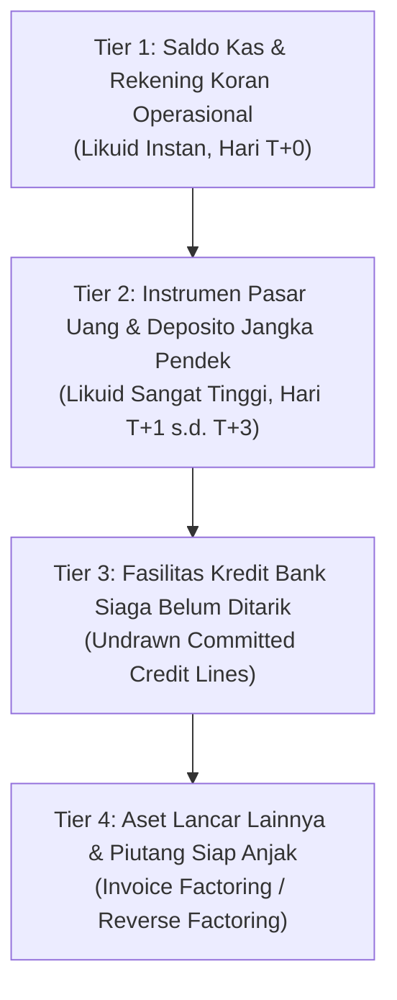
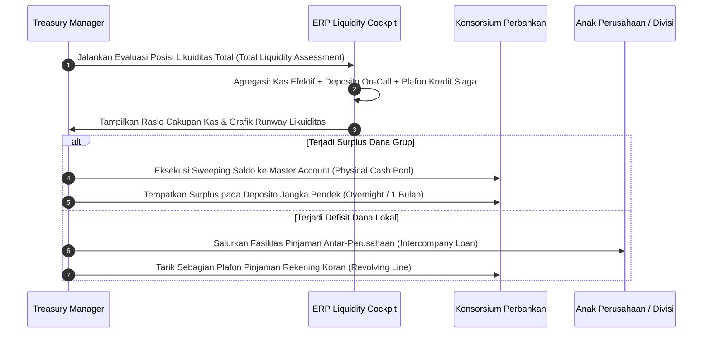

# Liquidity Management

## Definition

**Liquidity Management** dalam domain Finance dan Treasury ERP adalah strategi, kebijakan, dan pengawasan operasional yang menjamin ketersediaan dana likuid perusahaan setiap saat guna memenuhi seluruh kewajiban finansial yang jatuh tempo—tanpa mengganggu operasional normal dan tanpa menanggung biaya darurat yang merugikan.

Berbeda dengan [[07-finance/cash-management|Cash Management]] yang berfokus pada pemrosesan transaksi pembayaran dan penerimaan fisik harian, **Liquidity Management mencakup spektrum yang lebih luas**, meliputi pengelolaan cadangan kas pengaman (*safety buffer*), fasilitas kredit siaga (*standby credit lines*), instrumen pasar uang jangka pendek, struktur konsentrasi dana korporasi (*cash pooling*), serta rencana pendanaan darurat (*Contingency Funding Plan*).

---

## Purpose

1. **Menjamin Kelangsungan Bisnis (*Going Concern*)**: Mencegah risiko kebangkrutan teknis akibat kegagalan bayar seketika (*default risk*) saat terjadi guncangan pasar atau keterlambatan penagihan piutang besar.
2. **Efisiensi Struktur Modal Kerja**: Menghindari penumpukan saldo kas bebas yang terlalu besar pada rekening berbunga rendah dengan menempatkan kelebihan dana pada instrumen pasar uang berimbal hasil optimal.
3. **Sentralisasi Likuiditas Grup Perusahaan**: Memanfaatkan likuiditas anak perusahaan yang mengalami surplus dana untuk mendanai anak perusahaan yang mengalami defisit (*internal lending / cash pooling*), sehingga mengurangi ketergantungan pada pinjaman perbankan eksternal.
4. **Pengendalian Risiko Rekanan Bank (*Counterparty Risk*)**: Menyebarkan penempatan dana kas di beberapa bank bereputasi tinggi guna mencegah kerugian sistemik jika terjadi krisis pada satu institusi keuangan.
5. **Kesiapsiagaan Krisis (*Stress Resilience*)**: Memastikan tersedianya bantalan likuiditas yang memadai untuk menopang *cash burn rate* operasional selama periode penurunan pendapatan mendadak.

---

## Business Process

Siklus tata kelola likuiditas dalam ERP mencakup pemantauan posisi total likuiditas, pengelolaan kas terpusat, dan penanganan ketidakseimbangan dana:

### 1. Perhitungan Posisi Total Likuiditas (Total Liquidity Position)
ERP menghitung kapasitas likuiditas komprehensif organisasi:

$$\text{Total Available Liquidity} = \text{Cash and Bank Balances} + \text{Short-Term Marketable Securities} + \text{Undrawn Committed Credit Facilities}$$

### 2. Cadangan Kas Minimum (Minimum Cash Reserve / Buffer)
Manajemen menentukan batas aman bantalan kas operasional berdasarkan formula hari operasional (*Days of Operational Cash Burn*):

$$\text{Minimum Cash Buffer} = \frac{\text{Budgeted Annual Cash OPEX}}{365} \times \text{Target Buffer Days (misal 30 s.d. 45 hari)}$$

Jika likuiditas turun mendekati batas ini, ERP memicu status peringatan kuning (*Amber Alert*).

### 3. Struktur Pengumpulan Kas (Cash Pooling Structures)
Untuk grup perusahaan dengan beberapa entitas hukum (*multi-entity enterprise*):
- **Physical Cash Pooling (Cash Sweeping)**: Saldo dana dari rekening anak-anak perusahaan ditransfer secara fisik setiap sore ke rekening induk (*Concentration / Header Account*). Transaksi ini dicatat dalam ERP sebagai mutasi pinjaman antar-perusahaan (*intercompany loan / intercompany clearing*).
- **Notional Pooling**: Bank menghitung bunga secara gabungan atas seluruh saldo anak perusahaan tanpa melakukan pemindahan fisik uang antar-rekening (dibatasi oleh regulasi pajak dan devisa di negara tertentu).

---

## Business Rules

1. **Bank Counterparty Limit Enforcement**: Penempatan dana kas dan deposito pada satu institusi perbankan tunggal dilarang melampaui persentase tertentu (misal maksimal 35% dari total portofolio kas perusahaan) demi membatasi risiko gagal bayar bank.
2. **Arm's Length Principle on Intercompany Financing**: Penyaluran likuiditas antar-entitas anak perusahaan dalam mekanisme *cash pooling* wajib diperlakukan sebagai pinjaman antar-perusahaan (*intercompany loan*) dengan pengenaan tingkat suku bunga wajar (*arm's length interest rate*) dan pemotongan pajak penghasilan bunga pinjaman (PPh 23 di Indonesia) sesuai regulasi perpajakan yang berlaku.
3. **Committed vs Uncommitted Facility Distinction**: Fasilitas kredit bank yang belum ditarik hanya boleh dimasukkan ke dalam perhitungan likuiditas resmi jika berstatus *Committed Credit Line* (terikat perjanjian hukum di mana bank wajib mencairkan dana saat diminta). Fasilitas *Uncommitted* tidak boleh dihitung sebagai cadangan likuiditas pasti.
4. **Segregated Liquidity for Collateral**: Dana yang telah diblokir sebagai margin jaminan (*Collateral / Margin Deposit*) atas pembukaan Letter of Credit (L/C) atau garansi bank wajib dikeluarkan secara sistemik dari perhitungan likuiditas operasional yang dapat dibelanjakan.
5. **Multi-Currency Liquidity Isolation**: Likuiditas dalam mata uang asing (seperti USD) dilarang digabungkan begitu saja dengan kas IDR tanpa memperhitungkan risiko volatilitas kurs dan biaya konversi valas (*FX conversion cost & spread*).

---

## Accounting & Financial Impact

Mekanisme likuiditas melibatkan pencatatan pinjaman antar-perusahaan, biaya fasilitas kredit bank, dan pendapatan bunga deposito.

### 1. Pencatatan Penarikan Fasilitas Kredit Rekening Koran (Revolving Credit Drawdown)
Ketika PT Maju Bersama menarik Rp50.000.000 dari plafon kredit bank untuk menutup defisit sementara:

| Akun | Debit (IDR) | Kredit (IDR) | Keterangan |
| :--- | :--- | :--- | :--- |
| `111220 - Bank Mandiri Disbursement` | 50.000.000 | - | Penerimaan dana likuid di rekening operasional |
| `212100 - Short-Term Bank Borrowings` | - | 50.000.000 | Pengakuan kewajiban pinjaman bank jangka pendek |

### 2. Beban Komitmen atas Fasilitas Kredit Belum Ditarik (Commitment Fee)
Biaya provisi/komitmen yang dikenakan bank atas ketersediaan plafon siaga:

| Akun | Debit (IDR) | Kredit (IDR) | Keterangan |
| :--- | :--- | :--- | :--- |
| `620200 - Bank Facility Commitment Fees` | 2.500.000 | - | Beban komitmen fasilitas kredit bank |
| `111220 - Bank Mandiri Disbursement` | - | 2.500.000 | Pemotongan saldo rekening operasional |

### 3. Perlakuan Bunga Pinjaman Antar-Perusahaan (Intercompany Loan Interest)
Dalam struktur *cash pooling*, anak perusahaan yang meminjam dana mencatat beban bunga dan memotong PPh 23 (tarif 15% untuk wajib pajak badan dalam negeri):

| Akun | Debit (IDR) | Kredit (IDR) | Keterangan |
| :--- | :--- | :--- | :--- |
| `630100 - Intercompany Interest Expense` | 10.000.000 | - | Beban bunga pinjaman ke entitas induk |
| `213200 - Withholding Tax Payable (PPh 23)` | - | 1.500.000 | Pemotongan PPh 23 (15%) atas bunga |
| `211800 - Intercompany Payable - Parent Co` | - | 8.500.000 | Utang bunga bersih ke perusahaan induk |

---

## Example: Struktur Likuiditas & Ketahanan Kas PT Maju Bersama

Pada tanggal 31 Maret 2026, Direktur Keuangan mengevaluasi ketahanan likuiditas PT Maju Bersama menghadapi rencana ekspansi perakitan laptop:

### 1. Posisi Likuiditas Total Perusahaan

| Komponen Likuiditas | Saldo Nominal (IDR) | Kategori Likuiditas |
| :--- | :--- | :--- |
| Saldo Rekening BCA Collection | 45.000.000 | Tier 1 (Kas Siap Pakai T+0) |
| Saldo Rekening Mandiri Disbursement | 55.000.000 | Tier 1 (Kas Siap Pakai T+0) |
| Kas Kecil (Petty Cash) | 5.000.000 | Tier 1 (Kas Siap Pakai T+0) |
| Deposito On-Call Bank Mandiri (Jatuh tempo 7 hari) | 50.000.000 | Tier 2 (Pasar Uang Sangat Likuid) |
| Plafon Kredit Siaga Belum Ditarik (*Mandiri Revolving Line*) | 200.000.000 | Tier 3 (Fasilitas Siaga Terikat Kontrak) |
| **Total Kapasitas Likuiditas Tersedia** | **355.000.000** | |

*(Catatan: Saldo BCA Margin Deposit L/C sebesar Rp50.000.000 tidak dimasukkan karena berstatus dana terkunci / restricted).*

### 2. Analisis Ketahanan Runway Likuiditas (Cash Burn Runway)
- Rata-rata beban pengeluaran operasional bulanan (*Monthly Cash OPEX*): Rp120.000.000.
- Pengeluaran kas harian (*Daily Cash Burn Rate*): $\text{Rp120.000.000} / 30 = \text{Rp4.000.000}$ per hari.
- **Ketahanan Kas Murni (*Pure Cash Runway*)**:
  $$\frac{\text{Kas Murni \& Deposito (Rp155.000.000)}}{\text{Beban Harian (Rp4.000.000)}} = 38,75 \text{ hari}$$
- **Ketahanan Likuiditas Komprehensif (*Total Liquidity Runway*)**:
  $$\frac{\text{Total Likuiditas Termasuk Kredit Siaga (Rp355.000.000)}}{\text{Beban Harian (Rp4.000.000)}} = 88,75 \text{ hari}$$

Manajemen menyimpulkan posisi likuiditas berada dalam zona hijau (di atas ambang aman minimum 45 hari), sehingga perusahaan memiliki kapasitas yang aman untuk menandatangani kontrak pengadaan komponen baru.

---

## ERP Implementation

Perbandingan kapabilitas pengelolaan likuiditas lintas platform ERP:

| Fitur Likuiditas | Odoo Enterprise | ERPNext | Microsoft Dynamics 365 | SAP S/4HANA Finance |
| :--- | :--- | :--- | :--- | :--- |
| **Agregasi Likuiditas Multi-Akun** | Widget saldo kas pada dashboard accounting | Laporan ringkasan saldo bank multi-company | Fitur *Cash & Bank Management workspace* | Modul *SAP Cash Management (FIN-FSCM-CLM)* terpusat |
| **Struktur Cash Pooling** | Memerlukan konfigurasi multi-company manual | Memerlukan entitas clearing kustom | *Cash concentration & target balance pooling* native | Solusi *In-House Cash (IHC)* dan *Virtual Bank Accounts* terintegrasi |
| **Pengelolaan Fasilitas Kredit Bank** | Dicatat sebagai akun liabilitas standar | Dicatat sebagai akun liabilitas standar | Fitur pelacakan fasilitas kredit (*Letter of credit & bank facilities*) | Submodul *Treasury and Risk Management (TRM-TM)* komprehensif |
| **Kepatuhan Pinjaman Antar-Perusahaan** | Entri jurnal antar-perusahaan manual | Pembuatan Journal Entry multi-company otomatis | *Intercompany accounting & billing automation* | Perhitungan otomatis bunga pinjaman antar-entitas via *IHC* |

---

## Naventra Consideration

Rancangan arsitektur modul Liquidity Management pada Naventra ERP:

1. **Centralized Liquidity Cockpit**: Naventra menyediakan dasbor terpadu tingkat korporat (*Corporate Liquidity Cockpit*) yang mengagregasikan seluruh saldo rekening operasional, deposito, pinjaman siaga, dan *restricted cash* dari seluruh anak perusahaan dalam tampilan visual hierarkis dengan konversi valuta asing otomatis ke mata uang pelaporan.
2. **Automated Intercompany Lending Engine**: Ketika fitur *Internal Cash Sweeping* dijalankan, Naventra tidak hanya memindahkan dana antar-rekening melainkan secara otomatis membentuk dokumen transaksi *Intercompany Loan Agreement*, menghitung akrual bunga harian, dan menghitung potongan pajak PPh 23 secara otomatis pada saat pembayaran bunga jatuh tempo.
3. **Credit Facility Utilization Tracker**: Sistem memantau batas plafon kredit bank rekanan (*facility headroom*), menghitung saldo ditarik vs saldo tersisa secara *real-time*, dan memperingatkan bendahara jika penggunaan pinjaman telah melampaui batas kovenan perbankan (*debt covenant ratio limits*).

---

## References

- Basel Committee on Banking Supervision (BCBS). *Basel III: The Liquidity Coverage Ratio and liquidity risk monitoring tools*. Bank for International Settlements (BIS).
- Association for Financial Professionals (AFP). *Treasury Management Body of Knowledge: Liquidity Management*.
- SAP SE. *Treasury and Risk Management (TRM) in SAP S/4HANA*. SAP Help Portal.
- Microsoft Corporation. *Set up bank facilities and posting profiles in Dynamics 365*. Microsoft Learn.
- Peraturan Direktur Jenderal Pajak mengenai Perlakuan Perpajakan atas Bunga Pinjaman Antar-Perusahaan dan Hubungan Istimewa.
