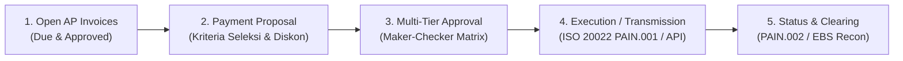
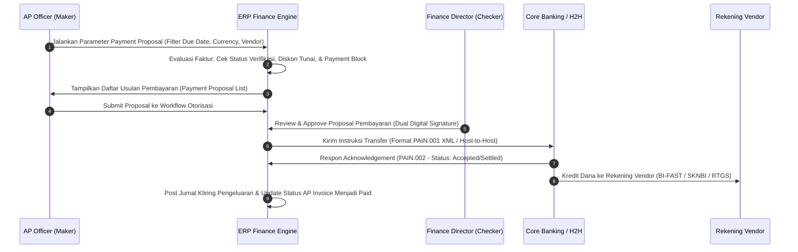

# Payment & Cash Disbursement

## Definition

**Payment & Cash Disbursement** dalam ERP adalah subsistem terintegrasi dalam domain Finance dan Treasury yang mengelola seluruh siklus pengeluaran kas perusahaan secara sistematis, terotorisasi, dan aman. Proses ini mencakup identifikasi kewajiban yang jatuh tempo (*open vendor bills*), pembentukan proposal pembayaran (*payment proposal*), pengelompokan batch pembayaran (*payment run*), persetujuan berjenjang (*dual control approval*), transmisi berkas ke perbankan (*payment file generation / API*), hingga konfirmasi kliring dan penanganan pembayaran gagal (*rejection handling*).

Disbursement menghubungkan modul [[04-purchasing/three-way-matching|Purchasing (P2P)]], [[02-accounting/accounts-payable|Accounts Payable]], Manajemen Kas, dan perbankan eksternal dalam satu rantai kendali yang ketat.

---

## Purpose

1. **Pencegahan Pembayaran Tidak Terotorisasi (*Fraud Prevention*)**: Menerapkan pemisahan tugas (*Segregation of Duties*) dan pengesahan ganda (*dual control*) agar tidak ada dana keluar tanpa persetujuan pihak berwenang.
2. **Optimalisasi Arus Kas & Diskon Tunai (*Cash Discount Capture*)**: Membayar tagihan tepat waktu untuk memanfaatkan potongan pelunasan dini (*early payment discount* seperti syarat 2/10, n/30) sekaligus menghindari denda keterlambatan (*late payment fees*).
3. **Efisiensi Operasional Skala Besar**: Menggantikan penerbitan cek manual satu per satu dengan pemrosesan massal (*batch payment run*) yang dapat mengeksekusi ratusan transaksi dalam hitungan detik.
4. **Mitigasi Biaya Transfer Bank**: Mengonsolidasikan beberapa faktur terbuka untuk vendor yang sama menjadi satu pembayaran tunggal (*payment aggregation*) guna menghemat biaya transaksi perbankan.
5. **Visibilitas dan Audit Trail Penuh**: Merekam status pembayaran secara *end-to-end* sejak tagihan disetujui, dikirim ke bank, hingga status penerimaan dana di rekening vendor.

---

## Business Process

Siklus pembayaran massal terotomatisasi (*Automatic Payment Program*) dalam ERP melibatkan alur berikut:

### 1. Seleksi dan Pembentukan Proposal Pembayaran (Payment Proposal)
Sistem memindai seluruh faktur pembelian terbuka (*open vendor invoices*) berdasarkan kriteria parameter:
- **Jatuh Tempo Faktur (*Due Date*)**: Faktur yang jatuh tempo pada atau sebelum tanggal cut-off yang ditentukan.
- **Kondisi Diskon Tunai (*Cash Discount Limit*)**: Faktur yang masih berada dalam periode diskon tunai (misal syarat pembayaran $2/10, \text{net } 30$) diprioritaskan untuk dilunasi agar memperoleh potongan 2%.
- **Pengecekan Blokir (*Payment Block*)**: Faktur yang memiliki sengketa mutu barang, selisih harga belum selesai, atau menunggu memo debit tidak akan dimasukkan ke dalam proposal.

### 2. Pengelompokan Batch Pembayaran (Payment Batching)
Faktur-faktur terpilih dikelompokkan berdasarkan parameter teknis untuk efisiensi:
- Dikelompokkan per **Vendor / Pihak Penerima** (beberapa faktur dari PT Sumber Teknologi digabung menjadi satu instruksi bayar).
- Dikelompokkan per **Rekening Bank Pembayar (*House Bank*)** dan **Metode Pembayaran** (BI-FAST untuk transaksi ritel $\le$ Rp250 juta, RTGS untuk transaksi bernilai besar $>$ Rp100 juta, SKNBI untuk kliring terjadwal, atau Swift Wire untuk valas).

### 3. Otorisasi Berjenjang (Multi-Tier Approval)
Proposal pembayaran diverifikasi dan ditandatangani secara digital oleh pejabat berwenang sesuai matriks batas nominal:
- Pembuat (*Maker*) menyusun daftar batch.
- Peninjau (*Reviewer/Checker*) memverifikasi keabsahan dokumen pendukung faktur dan nomor rekening tujuan.
- Penyetuju Akhir (*Approver/Releaser*) merilis berkas pembayaran ke gateway perbankan.

### 4. Transmisi Berkas & Eksekusi Perbankan (Payment File Transmission)
ERP menghasilkan berkas pembayaran standar atau mengirimkan pesan API:
- **ISO 20022 PAIN.001 (Customer Credit Transfer Initiation)**: Format XML perbankan internasional modern untuk transfer dana massal.
- **Host-to-Host (H2H) SFTP Transfer**: Berkas batch terenkripsi (PGP) yang diunggah otomatis ke server aman bank.
- **Direct Banking API**: Integrasi API perbankan langsung dengan pengamanan tanda tangan digital HMAC/OAuth2.

### 5. Penanganan Pembayaran Ditolak (Failed / Rejected Payment Handling)
Jika transfer ditolak oleh sistem perbankan (misalnya nomor rekening vendor salah, rekening tujuan tutup, atau nama pemilik rekening tidak cocok):
- Bank mengembalikan pesan status penolakan (**ISO 20022 PAIN.002** atau laporan retur kliring).
- ERP membatalkan jurnal kliring yang telah dibentuk, mengembalikan status faktur vendor ke *Open / Unpaid*, mencabut alokasi dana, dan mengirimkan tiket peringatan ke AP Officer untuk memperbaiki data master bank vendor.

---

## Business Rules

1. **Mandatory Three-Way Matching Compliance**: Tidak ada faktur vendor yang dapat dimasukkan ke dalam proposal pembayaran jika status pencocokan tiga arah (*Three-Way Match*: PO vs Penerimaan Barang/GRN vs Invoice) belum berstatus *Fully Matched* atau *Approved Variance*.
2. **Vendor Bank Account Modification Freeze Rule**: Demi mencegah kejahatan penipuan pengalihan rekening (*vendor bank phishing/BEC fraud*), jika terdapat perubahan nomor rekening pada master data vendor, rekening tersebut wajib dibekukan (*cooling-off period*) selama minimal 3 hari kerja dan wajib diverifikasi via panggilan telepon terkonfirmasi sebelum dapat menerima pembayaran dari ERP.
3. **No Payment Without Maker-Checker Segregation**: Pengguna yang membuat proposal pembayaran dilarang keras memiliki wewenang untuk menyetujui atau merilis berkas pembayaran tersebut ke perbankan.
4. **Early Discount Optimization Policy**: Sistem wajib memprioritaskan faktur dengan diskon tunai yang menguntungkan (imbal hasil annualized di atas biaya modal perusahaan) untuk dibayar pada hari terakhir jendela diskon.
5. **Idempotency in API Payment Execution**: Setiap instruksi pembayaran elektronik yang dikirim melalui API wajib menyertakan *Unique Idempotency Key* untuk mencegah terjadinya eksekusi transfer ganda saat terjadi gangguan koneksi internet (*network timeout*).

---

## Accounting & Financial Impact

Siklus pengeluaran kas melibatkan akun kewajiban dagang, akun transit perbankan, dan pengakuan diskon tunai pelunasan dini.

### 1. Eksekusi Pembayaran dengan Diskon Tunai (Cash Discount Taken)
PT Maju Bersama melunasi tagihan komponen dari PT Sumber Teknologi sebesar Rp133.200.000 dalam periode diskon 2% (mendapat diskon Rp2.664.000, jumlah transfer bersih Rp130.536.000):

| Akun | Debit (IDR) | Kredit (IDR) | Keterangan |
| :--- | :--- | :--- | :--- |
| `211100 - Accounts Payable` | 133.200.000 | - | Menghapus seluruh kewajiban terbuka vendor |
| `111221 - Bank Mandiri Outgoing Clearing` | - | 130.536.000 | Nilai bersih kas yang ditransfer keluar |
| `510200 - Purchase Cash Discounts Taken` | - | 2.664.000 | Pendapatan / pengurang biaya atas diskon 2% |

*(Catatan: Saat rekonsiliasi rekening koran bank terjadi, akun `111221` akan di-debit dan akun riil `111220 Bank Mandiri Disbursement` di-kredit sebesar Rp130.536.000).*

### 2. Pembatalan Pembayaran Akibat Penolakan Bank (Failed Payment Reversal)
Jika transfer ke vendor ditolak oleh bank kliring karena rekening vendor tidak aktif:

| Akun | Debit (IDR) | Kredit (IDR) | Keterangan |
| :--- | :--- | :--- | :--- |
| `111221 - Bank Mandiri Outgoing Clearing` | 130.536.000 | - | Memulihkan kembali saldo akun kliring |
| `510200 - Purchase Cash Discounts Taken` | 2.664.000 | - | Membatalkan pengakuan diskon tunai |
| `211100 - Accounts Payable` | - | 133.200.000 | Memulihkan kembali saldo utang dagang vendor |

---

## Example: Siklus Batch Payment di PT Maju Bersama

Pada hari Kamis tanggal 20 Maret 2026, AP Officer PT Maju Bersama mengeksekusi *Weekly Vendor Payment Run*:

1. **Parameter Seleksi**:
   - Rentang Jatuh Tempo: 20 Maret s.d. 27 Maret 2026.
   - Rekening Pembayar: `BNK-MDR-01` (Bank Mandiri Disbursement IDR).
   - Mata Uang: IDR.

2. **Daftar Faktur Terpilih dalam Proposal**:
   - **PT Sumber Teknologi**: Faktur `INV-ST-2026-088` nominal Rp133.200.000, diskon 2% jika dibayar hari ini (diskon Rp2.664.000). Bersih: Rp130.536.000.
   - **PT Logistik Cepat**: Faktur `INV-LC-2026-012` nominal Rp14.500.000, jatuh tempo murni. Bersih: Rp14.500.000.
   - **CV Sarana Kantor**: Faktur `INV-SK-2026-045` nominal Rp4.200.000, jatuh tempo murni. Bersih: Rp4.200.000.
   - **Total Nilai Batch Pembayaran**: **Rp149.236.000**.

3. **Alur Persetujuan & Eksekusi**:
   - AP Officer membuat batch `PAY-BATCH-2026-03-04`.
   - Treasury Manager meninjau kecukupan saldo di Bank Mandiri (saldo tersedia Rp175.000.000) $\rightarrow$ *Approved*.
   - Direktur Keuangan menandatangani rilis batch $\rightarrow$ *Approved*.
   - ERP secara otomatis memanggil API Bank Mandiri Corporate Portal, mentransmisikan instruksi transfer BI-FAST untuk CV Sarana Kantor & PT Logistik Cepat, serta RTGS untuk PT Sumber Teknologi.
   - Status tagihan pada ketiga vendor secara otomatis berubah menjadi *In-Payment / Paid*.

---

## ERP Implementation

Perbandingan kapabilitas pemrosesan pembayaran massal lintas platform:

| Aspek Pembayaran | Odoo Enterprise | ERPNext | Microsoft Dynamics 365 | SAP S/4HANA Finance |
| :--- | :--- | :--- | :--- | :--- |
| **Program Pembayaran Otomatis** | Fitur *Batch Payments* & integrasi SEPA/PAIN.001 | Dokumen *Payment Order* & *Payment Entry* massal | *Vendor payment proposal* pada *Accounts payable payment journal* | *Automatic Payment Program (F110)* dengan *Payment Medium Workbench (PMW)* |
| **Format Berkas Bank** | Format SEPA XML, BACS, NACHA, CSV ekspor kustom | Format CSV terstruktur perbankan regional | Modul *Electronic Reporting (ER)* mendukung PAIN.001, BACS, MT103 | Mendukung ratusan format pembayaran standar bank global (ISO 20022, EDIFACT) |
| **Integrasi Diskon Tunai** | Perhitungan otomatis diskon pada *Payment Terms* | Field *Discount Amount* pada baris *Payment Entry* | Fitur *Cash discount administration* & toleransi hari | Penentuan otomatis diskon terbaik via *Payment Terms & Tolerance Groups* |
| **Penanganan Pembayaran Gagal** | Tombol *Reject / Cancel Batch Payment* | Pembatalan dokumen *Payment Entry* (status Cancelled) | Fitur *Reverse payment* atau *Bank payment cancellation* | Fitur *Reset Cleared Items (FBRA)* dan *Reverse Payment Run* |

---

## Naventra Consideration

Rancangan arsitektur pembayaran dan pengeluaran kas pada Naventra ERP:

1. **Automated Vendor Bank Account Verification**: Modul Master Vendor Naventra mewajibkan verifikasi API penamaan rekening bank (*Bank Account Name Inquiry API*) sebelum nomor rekening supplier dinyatakan valid. Nama pada rekening bank supplier harus memiliki tingkat kecocokan teks $\ge 90\%$ dengan nama resmi perusahaan rekanan.
2. **Cooling-Off Lockout on Bank Changes**: Setiap pembaruan nomor rekening supplier memicu penguncian otomatis selama 72 jam untuk pembayaran tagihan supplier tersebut, disertai pengiriman notifikasi instan melalui email dan WhatsApp ke tim Purchasing dan Internal Audit.
3. **Atomic API Payment Submission**: Transmisi pembayaran batch via API perbankan dirancang dengan jaminan transaksi atomik (*ACID guarantee*) dan mekanisme penanganan *idempotency*. Jika terjadi kegagalan jaringan di tengah proses transfer, Naventra tidak memposting status pembayaran secara sembarangan sebelum menerima konfirmasi balik status pasti dari server bank.

---

## References

- International Organization for Standardization. *ISO 20022 Financial Services — Payment Initiation (PAIN.001) and Payment Status Report (PAIN.002)*.
- SAP SE. *Automatic Payment Program (FI-AP-AP-PT) in SAP S/4HANA Finance*. SAP Help Portal.
- Microsoft Corporation. *Create and validate vendor payment proposals in Dynamics 365 Finance*. Microsoft Learn.
- Association for Financial Professionals (AFP). *Payments and Cash Settlement Systems Body of Knowledge*.
- Bank Indonesia. *Peraturan Bank Indonesia mengenai Penyelenggaraan Sistem Pembayaran BI-FAST dan SKNBI*.
