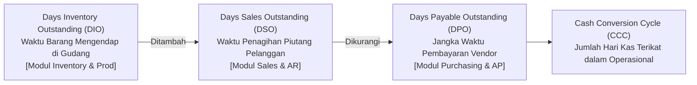
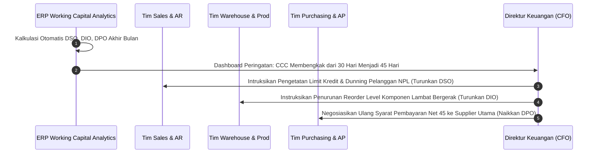

# Working Capital Management

## Definition

**Working Capital Management (WCM)** dalam sistem ERP adalah strategi dan koordinasi operasional lintas-modul untuk mengelola aset lancar (*current assets*) dan kewajiban lancar (*current liabilities*) perusahaan secara optimal. Tujuannya adalah memastikan efisiensi likuiditas harian tanpa mengorbankan kelancaran rantai pasok maupun target pertumbuhan penjualan.

WCM menghubungkan secara langsung tiga domain operasional utama dalam ERP:
1. **Siklus Penjualan & Piutang (O2C)**: Mempercepat penagihan piutang dagang (*Accounts Receivable*).
2. **Siklus Pengadaan & Utang (P2P)**: Menjaga disiplin pelunasan utang dagang (*Accounts Payable*) sesuai batas waktu negosiasi.
3. **Siklus Persediaan & Manufaktur**: Meminimalkan modal yang terikat pada bahan baku, barang dalam proses (*WIP*), dan barang jadi (*Inventory*).

Metrik utama yang mengukur efisiensi modal kerja dalam ERP adalah **Siklus Konversi Kas (Cash Conversion Cycle - CCC)**:

$$\text{CCC} = \text{DIO} + \text{DSO} - \text{DPO}$$

---

## Purpose

1. **Membebaskan Kas Terikat (*Cash Liberation*)**: Mengurangi dana perusahaan yang membeku pada tumpukan stok gudang atau tagihan pelanggan yang terlambat, sehingga dapat dialihkan untuk investasi produktif atau pelunasan utang berbunga.
2. **Menurunkan Biaya Modal (*Cost of Capital Reduction*)**: Meminimalkan kebutuhan pinjaman bank jangka pendek (*working capital credit lines*), yang secara langsung memangkas beban bunga pinjaman (*interest expense*).
3. **Peningkatan Kualitas Rantai Pasok**: Memastikan jadwal pembayaran supplier konsisten dan tepat waktu sehingga reputasi perusahaan terjaga dan memperoleh harga beli bahan baku yang kompetitif.
4. **Mitigasi Risiko Piutang Tak Tertagih (*Bad Debt Reduction*)**: Mengidentifikasi pelanggan dengan tren pembayaran memburuk sedini mungkin melalui pengawasan DSO dan umur piutang (*aging*).
5. **Pencegahan Kelebihan atau Kehabisan Stok (*Stockout vs Overstock Balancing*)**: Menyelaraskan *lead time* pengadaan dengan kecepatan perputaran persediaan barang jadi.

---

## Business Process

### 1. Komponen Penghitungan Siklus Konversi Kas (CCC)

#### A. Days Sales Outstanding (DSO)
Mengukur rata-rata jumlah hari yang dibutuhkan perusahaan untuk mengonversi piutang dagang menjadi uang tunai:

$$\text{DSO} = \frac{\text{Average Accounts Receivable}}{\text{Total Credit Sales}} \times 365$$

- **Integrasi ERP**: Menarik data dari modul [[03-sales/sales-order|Sales Order]], pengiriman barang, dan [[02-accounting/accounts-receivable|Accounts Receivable]].
- **Inisiatif Perbaikan**: Penerapan penagihan otomatis (*automated dunning*), insentif diskon pelunasan dini (*cash discount 2/10*), dan penegakan limit kredit ketat saat konfirmasi *Sales Order*.

#### B. Days Inventory Outstanding (DIO)
Mengukur rata-rata jumlah hari persediaan mengendap di gudang sebelum berhasil dijual atau dikonsumsi:

$$\text{DIO} = \frac{\text{Average Inventory}}{\text{Cost of Goods Sold (COGS)}} \times 365$$

- **Integrasi ERP**: Menarik data dari modul [[05-inventory/warehouse-management|Inventory & Warehouse]] serta [[06-manufacturing/bill-of-materials|Manufacturing (BOM & Routing)]].
- **Inisiatif Perbaikan**: Penerapan pengadaan tepat waktu (*Just-In-Time*), rasionalisasi *Safety Stock*, dan pembersihan stok usang (*slow-moving / obsolete liquidation*).

#### C. Days Payable Outstanding (DPO)
Mengukur rata-rata jumlah hari yang dibutuhkan perusahaan untuk melunasi tagihan kepada pemasok:

$$\text{DPO} = \frac{\text{Average Accounts Payable}}{\text{Cost of Goods Sold (atau Total Pembelian)}} \times 365$$

- **Integrasi ERP**: Menarik data dari modul [[04-purchasing/three-way-matching|Purchasing (P2P)]] dan [[02-accounting/accounts-payable|Accounts Payable]].
- **Inisiatif Perbaikan**: Negosiasi perpanjangan syarat pembayaran (misal dari *Net 30* menjadi *Net 60*), penjadwalan pembayaran tepat pada batas jatuh tempo tanpa membayar terlalu dini secara sia-sia.

### 2. Kebutuhan Modal Kerja (Working Capital Requirement - WCR)
Dalam nilai moneter, kebutuhan likuiditas operasional yang harus didanai perusahaan dihitung sebagai:

$$\text{WCR} = \text{Accounts Receivable} + \text{Inventory} - \text{Accounts Payable}$$

Jika WCR bernilai positif, perusahaan harus mendanai selisih modal tersebut dari modal sendiri (*Equity*) atau utang bank berbunga. Jika WCR bernilai negatif (*Negative Working Capital*, seperti model bisnis ritel e-commerce atau restoran), perusahaan didanai oleh uang muka pelanggan dan utang supplier sebelum barang dilunasi.

---

## Business Rules

1. **Credit Limit Blocking Rule**: Modul Sales wajib secara otomatis memblokir pembentukan atau pengiriman pesanan baru (*Sales Order / Delivery Order*) jika saldo piutang pelanggan ditambah pesanan berjalan telah melampaui plafon kredit (*Credit Limit*) atau memiliki faktur tertunggak melampaui batas toleransi (*Overdue Invoices*).
2. **No Premature Payments Without Discount**: Pembayaran kepada pemasok dilarang dieksekusi sebelum tanggal jatuh tempo (*due date*), kecuali terdapat klausul diskon tunai yang memberikan penghematan finansial terverifikasi.
3. **Automated Slow-Moving Inventory Flagging**: Barang yang tidak mengalami mutasi keluar (*no stock movement*) selama lebih dari 90 hari wajib ditandai secara otomatis oleh ERP sebagai *Slow-Moving* untuk memicu evaluasi penurunan nilai stok (*inventory write-down*) atau program promosi cuci gudang.
4. **Consistency in Day-Count Convention**: Penghitungan DSO, DIO, dan DPO pada seluruh dashboard manajerial wajib menggunakan konvensi basis hari yang seragam (umumnya 365 hari atau 360 hari) agar angka pembanding tren tahunan konsisten.
5. **Exclusion of Non-Trade Payables**: Penghitungan DPO murni hanya mencakup utang dagang pengadaan bahan baku dan barang dagang (*Trade Payables*). Utang pajak, utang dividen, dan utang bunga bank wajib dikecualikan agar tidak mendistorsi rasio rantai pasok operasional.

---

## Accounting & Financial Impact

Efisiensi modal kerja tercermin secara langsung pada bagian Aktivitas Operasional Laporan Arus Kas (*Cash Flow from Operating Activities - Indirect Method*):

| Perubahan Elemen Modal Kerja | Dampak terhadap Laporan Arus Kas Operasional | Keterangan Finansial |
| :--- | :--- | :--- |
| **Kenaikan Saldo Piutang (AR Naik)** | Arus Kas Operasional **Berkurang** (-) | Kas belum diterima, tertahan di pelanggan |
| **Penurunan Saldo Piutang (AR Turun)** | Arus Kas Operasional **Bertambah** (+) | Kas berhasil ditagih ke rekening perusahaan |
| **Kenaikan Persediaan (Inventory Naik)** | Arus Kas Operasional **Berkurang** (-) | Kas terserap untuk pembelian stok di gudang |
| **Penurunan Persediaan (Inventory Turun)** | Arus Kas Operasional **Bertambah** (+) | Barang terjual tanpa penambahan pembelian baru |
| **Kenaikan Utang Dagang (AP Naik)** | Arus Kas Operasional **Bertambah** (+) | Pemasok mendanai pembelian barang sementara waktu |
| **Penurunan Utang Dagang (AP Turun)** | Arus Kas Operasional **Berkurang** (-) | Kas dikeluarkan untuk melunasi tagihan supplier |

---

## Example: Analisis Siklus Modal Kerja di PT Maju Bersama

Pada penutupan Tahun Fiskal 2026, PT Maju Bersama mengevaluasi kinerja modal kerja untuk lini manufaktur **Laptop Pro**:

### 1. Data Keuangan Tahunan
- Total Penjualan Kredit Bersih (*Annual Credit Sales*): **Rp1.440.000.000**.
- Beban Pokok Penjualan (*Annual COGS*): **Rp1.140.000.000**.
- Rata-rata Piutang Dagang (*Average AR*): **Rp120.000.000**.
- Rata-rata Persediaan Bahan Baku & Barang Jadi (*Average Inventory*): **Rp140.000.000**.
- Rata-rata Utang Dagang (*Average AP - PT Sumber Teknologi*): **Rp130.000.000**.
- Biaya Modal Rata-Rata Tertimbang (*WACC / Interest Rate*): **10% per tahun**.

### 2. Perhitungan Rasio Siklus Konversi Kas (CCC)

1. **Days Sales Outstanding (DSO)**:
   $$\text{DSO} = \frac{\text{Rp120.000.000}}{\text{Rp1.440.000.000}} \times 365 = 30,42 \text{ hari}$$
2. **Days Inventory Outstanding (DIO)**:
   $$\text{DIO} = \frac{\text{Rp140.000.000}}{\text{Rp1.140.000.000}} \times 365 = 44,82 \text{ hari}$$
3. **Days Payable Outstanding (DPO)**:
   $$\text{DPO} = \frac{\text{Rp130.000.000}}{\text{Rp1.140.000.000}} \times 365 = 41,62 \text{ hari}$$
4. **Siklus Konversi Kas (CCC)**:
   $$\text{CCC} = 44,82 + 30,42 - 41,62 = \mathbf{33,62 \text{ hari}}$$

### 3. Kebutuhan Modal Kerja & Beban Bunga
- **Kebutuhan Modal Kerja (WCR)**:
  $$\text{WCR} = \text{Rp120.000.000} + \text{Rp140.000.000} - \text{Rp130.000.000} = \mathbf{Rp130.000.000}$$
- **Beban Pembiayaan Modal Kerja**:
  $$\text{Holding Cost of Capital} = \text{Rp130.000.000} \times 10\% = \mathbf{Rp13.000.000 \text{ per tahun}}$$

### 4. Rencana Optimasi Manajerial
Jika PT Maju Bersama berhasil menurunkan DIO sebesar 10 hari (melalui optimalisasi lot pesanan komponen) dan memperpanjang DPO sebesar 5 hari (melalui renegosiasi kontrak dengan PT Sumber Teknologi):
- CCC Baru: $34,82 + 30,42 - 46,62 = 18,62 \text{ hari}$ (Turun 15 hari).
- Penurunan WCR: $\approx \text{Rp47.000.000}$ kas bebas berhasil dicairkan kembali ke rekening bank.
- Penghematan Bunga: $\text{Rp47.000.000} \times 10\% = \mathbf{Rp4.700.000 \text{ per tahun}}$ yang langsung menambah laba bersih.

---

## ERP Implementation

Perbandingan fungsional modul Working Capital Management pada berbagai sistem ERP:

| Aspek Pengelolaan WCM | Odoo Enterprise | ERPNext | Microsoft Dynamics 365 | SAP S/4HANA Finance |
| :--- | :--- | :--- | :--- | :--- |
| **Kalkulasi Otomatis DSO/DIO/DPO** | Memerlukan kustom dashboard atau modul Spreadsheet | Tersedia laporan rasio finansial standar | Didukung modul *Credit and Collections* & *Inventory Value* | Tersedia aplikasi analitik bawaan *Working Capital Dashboard (FI-FIO)* |
| **Otomatisasi Penagihan (Dunning)** | Modul *Follow-up Levels* dengan pengiriman email bertingkat | Fitur *Dunning Notice* otomatis berbasis keterlambatan | Modul *Credit & Collections dunning case management* | *Collections Management (FSCM-COL)* dengan strategi penagihan berbasis AI |
| **Manajemen Batas Kredit (Credit Limit)** | Pengaturan limit saldo piutang per pelanggan | Pengaturan limit kredit dengan opsi *Block on Delivery/Sales* | Sistem manajemen limit kredit bertingkat dengan alur persetujuan | *SAP Credit Management (FSCM-CR)* komprehensif terhubung ke biro kredit |
| **Analisis Umur Persediaan** | Laporan *Aging Inventory* di modul persediaan | Laporan *Stock Ageing Report* berdasarkan batch/serial | Laporan *Inventory aging* terhubung ke costing FIFO | *Dead Stock Analysis & Slow-Moving Items Analysis* |

---

## Naventra Consideration

Rancangan arsitektur Working Capital Management pada Naventra ERP:

1. **Holistic CCC Command Center**: Naventra menyatukan metrik DSO, DIO, dan DPO ke dalam satu layar eksekutif terpadu (*Working Capital Cockpit*). Setiap metrik dapat di-klik (*drill-down*) secara langsung hingga ke daftar faktur AR yang terlambat dibayar, daftar item gudang yang tidak bergerak, atau tagihan AP yang dapat dinegosiasikan.
2. **Automated Pre-Delivery Credit Check**: Sebelum gudang mencetak dokumen pengeluaran barang (*Delivery Order Pick Slip*), sistem memvalidasi sisa limit kredit pelanggan secara atomik. Jika pelanggan memiliki faktur macet melampaui toleransi, pesanan otomatis berstatus `CREDIT_HOLD`.
3. **Vendor Term Optimization Engine**: Naventra menyediakan rekomendasi pintar (*Payment Timing Advisor*) yang memberi tahu staf keuangan waktu paling menguntungkan untuk membayar tagihan: apakah memanfaatkan diskon tunai awal atau menahan dana hingga hari jatuh tempo terakhir.

---

## References

- PricewaterhouseCoopers (PwC). *Annual Working Capital Study: Navigating Uncertainty through Liquidity Optimization*.
- Chartered Institute of Management Accountants (CIMA). *Working Capital Management: Theory and Practice*.
- SAP SE. *Working Capital Analytics in SAP S/4HANA Finance*. SAP Help Portal.
- Microsoft Corporation. *Credit and collections overview in Dynamics 365 Finance*. Microsoft Learn.
- Brealey, R. A., Myers, S. C., & Allen, F. *Principles of Corporate Finance: Short-Term Financial Management*.
