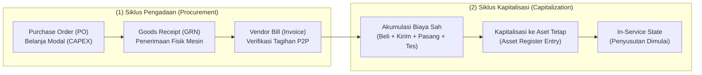
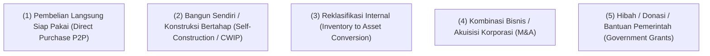
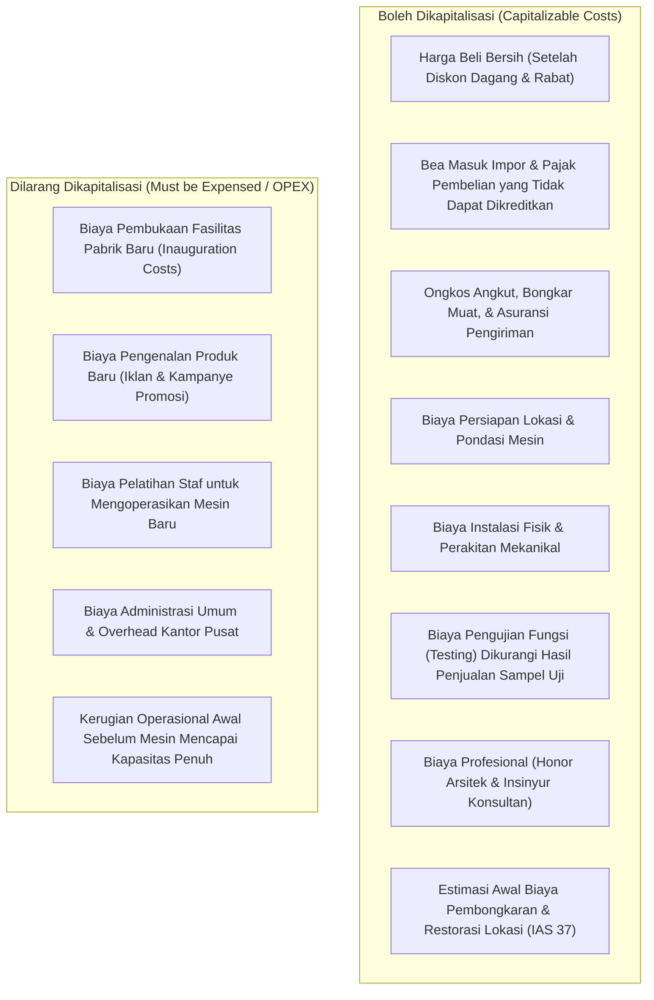
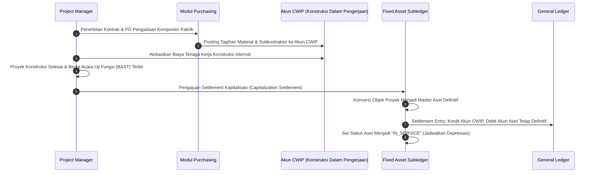

# Asset Acquisition & Capitalization

## Definition

Dalam tata kelola ERP, **Asset Acquisition (Perolehan Aset)** dan **Asset Capitalization (Kapitalisasi Aset)** adalah dua peristiwa bisnis yang saling terkait namun memiliki batas tanggung jawab operasional dan akuntansi yang tegas:

- **Asset Acquisition (Perolehan Aset)** adalah proses pengadaan fisik, perikatan kontrak, dan serah terima barang modal dari pemasok atau melalui penyelesaian proyek internal.
- **Asset Capitalization (Kapitalisasi Aset)** adalah pengakuan formal atas seluruh akumulasi biaya perolehan yang sah ke dalam neraca (*Balance Sheet*) sebagai aset tetap aktif dalam daftar aktiva (*Fixed Asset Register*), yang menandai titik awal pencatatan nilai buku dan penjadwalan penyusutan.

Perbedaan kedua konsep ini tercermin dalam pemisahan antara tanggal kedatangan fisik barang, tanggal penagihan faktur pemasok, tanggal pengakuan di neraca, dan tanggal aset siap dioperasikan (*In-Service Date*).

---

## Purpose

1. **Pemisahan Pengeluaran Modal dari Beban Operasional**: Memastikan pengeluaran bernilai besar yang memberikan manfaat jangka panjang tidak langsung membebani laba rugi tahun berjalan, melainkan dialokasikan secara tertib melalui neraca.
2. **Kepatuhan Penentuan Komponen Biaya Perolehan (*Cost Boundary Compliance*)**: Menegakkan aturan standar akuntansi (**IAS 16 / PSAK 16**) mengenai biaya apa saja yang wajib dimasukkan ke dalam nilai kapitalisasi dan biaya apa yang harus dibebankan seketika.
3. **Pengelolaan Aset Bangun Sendiri (*Capital Work in Progress / CWIP*)**: Menyediakan mekanisme penampungan biaya bertahap untuk proyek konstruksi atau instalasi mesin berskala multi-bulan sebelum diaktifkan menjadi aset final.
4. **Sinkronisasi Rantai Pasok dan Pembukuan Aktiva**: Mengintegrasikan modul pengadaan [[04-purchasing/three-way-match|Procure-to-Pay (P2P)]] dengan modul aktiva tetap melalui akun penyeimbang perolehan (*Asset Clearing Account*).
5. **Mitigasi Pembayaran Tanpa Aset Nyata (*Ghost Asset Prevention*)**: Mencegah kapitalisasi tagihan vendor fiktif dengan mewajibkan verifikasi penerimaan fisik dan penempelan nomor tag aktiva di lokasi kerja.

---

## Sumber Perolehan Aset Tetap (Acquisition Channels)

ERP enterprise memfasilitasi lima saluran perolehan aset tetap:

1. **Pembelian Eksternal Langsung (Direct Commercial Purchase)**: Pengadaan aset jadi melalui alur standar PO $\rightarrow$ Penerimaan Barang $\rightarrow$ Tagihan Vendor $\rightarrow$ Kapitalisasi seketika.
2. **Konstruksi Mandiri / Proyek Investasi (Self-Construction / CIP)**: Properti, pabrik, atau lini mesin yang dirakit sendiri secara bertahap dengan mengakumulasikan biaya material, jasa subkontraktor, upah teknisi internal, dan biaya pinjaman yang memenuhi syarat (**IAS 23**).
3. **Konversi Persediaan Menjadi Aset (Inventory-to-Asset Conversion)**: Pemindahan barang dagangan dari gudang persediaan untuk digunakan sendiri oleh perusahaan (misal: mengambil 5 unit Laptop Pro dari gudang barang jadi untuk dijadikan laptop dinas staf HR).
4. **Akuisisi Melalui Kombinasi Bisnis (Business Combination - IFRS 3)**: Pengalihan aset tetap dari perusahaan lain yang diakuisisi pada nilai wajar per tanggal transaksi.
5. **Hibah atau Bantuan Modal (Government Grants - IAS 20)**: Aset yang diperoleh secara cuma-cuma atau disubsidi oleh otoritas pemerintah.

---

## Hierarki Penanggalan Kritis (The Critical Date Hierarchy)

Di dalam ERP, terdapat lima tanggal berbeda yang wajib dibedakan secara tegas:

| Jenis Tanggal | Makna Operasional | Peran dalam Sistem ERP |
| :--- | :--- | :--- |
| **Purchase Order Date** | Tanggal pesanan pembelian resmi diterbitkan ke pemasok. | Mengunci komitmen anggaran (*Budget Encumbrance* di modul Finance). |
| **Goods Receipt Date** | Tanggal fisik aset tiba dan dibongkar di area pabrik/gudang. | Membukukan utang penerimaan belum ditagih (*GR/IR Clearing*). |
| **Vendor Invoice Date** | Tanggal faktur komersial diterbitkan oleh pemasok. | Menentukan tanggal jatuh tempo utang dagang (*AP Due Date*). |
| **Capitalization Date** | Tanggal nilai aset diakui secara resmi di neraca aktiva tetap. | Memindahkan saldo dari *Asset Clearing/CIP* ke akun aset definitif. |
| **In-Service Date** | Tanggal aset secara teknis siap dioperasikan untuk produksi. | **Titik awal dimulainya jadwal pembebanan penyusutan (*Depreciation Start*)**. |

> [!important]
> Tanggal Kapitalisasi tidak selalu identik dengan Tanggal Mulai Pakai (*In-Service Date*). Jika mesin dikapitalisasi pada tanggal 15 Maret namun proses kalibrasi dan perizinan membuat mesin baru dapat beroperasi pada tanggal 1 April, maka beban penyusutan baru boleh dihitung mulai tanggal 1 April.

---

## Komponen Biaya yang Boleh vs Dilarang Dikapitalisasi (IAS 16.16)

Sesuai standar **IAS 16 paragraf 16 s.d. 19**, komponen biaya perolehan diatur sebagai berikut:

---

## Business Process: Siklus Kapitalisasi Aset Bangun Sendiri (CWIP / CIP)

---

## Business Rules

1. **Mandatory In-Service Trigger for Depreciation**: Sistem ERP dilarang menghitung atau memposting beban penyusutan atas suatu aset selama statusnya masih berstatus *Under Construction* atau belum mencapai tanggal *In-Service Date*.
2. **Prohibition of Training Capitalization**: Biaya pelatihan karyawan (*staff training*) untuk mengoperasikan mesin baru dilarang keras dimasukkan ke dalam nilai perolehan kapitalisasi aset dan wajib dialokasikan ke akun beban pelatihan (*Training Expense*).
3. **Borrowing Cost Capitalization Boundary (IAS 23)**: Biaya bunga pinjaman bank hanya boleh dikapitalisasi ke dalam nilai aset selama periode konstruksi aktif atas aset yang memenuhi syarat (*Qualifying Asset*—aset yang membutuhkan waktu substansial untuk disiapkan). Kapitalisasi bunga wajib dihentikan seketika saat aset siap digunakan.
4. **Three-Way Match Verification**: Perolehan aset tetap melalui modul pembelian wajib memvalidasi kecocokan antara PO, Surat Jalan Penerimaan Barang, dan Faktur Vendor sebelum kapitalisasi final disetujui.
5. **No Retroactive Cost Addition Without Improvement Evidence**: Setelah aset dikapitalisasi dan periode fiskal ditutup, penambahan biaya susulan ke nilai perolehan aset hanya diizinkan jika pengeluaran tersebut terbukti memenuhi kriteria penambahan kapasitas atau perpanjangan masa manfaat (*Major Enhancement*).

---

## Accounting & Financial Impact

Integrasi perolehan aset menghubungkan modul hutang dagang, akun kliring aktiva, dan buku besar aset tetap.

### 1. Jurnal Pembelian dan Akumulasi Biaya Perolehan
Ketika PT Maju Bersama menerima faktur pembelian mesin (Rp110.000.000), ongkos angkut (Rp4.000.000), dan biaya instalasi teknisi (Rp6.000.000):

| Akun | Debit (IDR) | Kredit (IDR) | Keterangan |
| :--- | :--- | :--- | :--- |
| `159100 - Fixed Asset Clearing Account` | 110.000.000 | - | Nilai beli mesin pabrik |
| `159100 - Fixed Asset Clearing Account` | 4.000.000 | - | Ongkos angkut logistik |
| `159100 - Fixed Asset Clearing Account` | 6.000.000 | - | Jasa instalasi & kalibrasi teknisi |
| `211100 - Accounts Payable` | - | 120.000.000 | Total kewajiban ke vendor terkait |

### 2. Jurnal Kapitalisasi Aset Tetap (Capitalization Run)
Saat mesin dinyatakan terpasang lengkap dan siap digunakan (*In-Service*):

| Akun | Debit (IDR) | Kredit (IDR) | Keterangan |
| :--- | :--- | :--- | :--- |
| `153000 - Mesin & Peralatan Pabrik` | 120.000.000 | - | Pengakuan nilai historis aset di neraca |
| `159100 - Fixed Asset Clearing Account` | - | 120.000.000 | Kliring akun perantara menjadi saldo nol (0) |

*(Untuk rincian akuntansi perolehan bertahap dan pelaporan arus kas investasi, rujuk ke [[02-accounting/fixed-asset-accounting|Fixed Asset Accounting di Phase 3]]).*

---

## Example: Alur Perolehan Mesin Perakitan di PT Maju Bersama

PT Maju Bersama memproses pengadaan mesin otomatis untuk perakitan **Laptop Pro**:

1. **Kronologi Transaksi**:
   - **01 Maret 2026**: Penerbitan PO pengadaan mesin ke PT Sumber Teknologi senilai Rp110.000.000 (PO dikunci di modul CAPEX).
   - **10 Maret 2026**: Mesin tiba di Pabrik Cikarang. Dokumen penerimaan (*GRN*) ditandatangani. Ditempelkan nomor tag fisik `TAG-MB-88019`.
   - **12 Maret 2026**: Teknisi menyelesaikan instalasi mekanis dan pengujian jalur listrik (Biaya instalasi Rp6.000.000; biaya pengiriman Rp4.000.000).
   - **15 Maret 2026**: Eksekusi kapitalisasi sistem (*Capitalization Date*). Total nilai perolehan diakui: **Rp120.000.000**.
   - **01 April 2026**: Produksi massal Laptop Pro resmi dimulai (*In-Service Date*). Jadwal depresiasi bulanan pertama (Rp1.666.667) dieksekusi pada tanggal 30 April 2026.

2. **Pemisahan Beban Non-Kapitalisasi**:
   - Pelatihan operator mesin oleh instruktur vendor sebesar Rp5.000.000 dibukukan langsung ke akun `610700 - Employee Training Expense` pada laba rugi bulan Maret, tidak digabungkan ke harga mesin.

---

## ERP Implementation

Perbandingan kapabilitas alur perolehan dan kapitalisasi lintas platform ERP:

| Parameter Kapitalisasi | Odoo Enterprise | ERPNext | Microsoft Dynamics 365 | SAP S/4HANA Finance |
| :--- | :--- | :--- | :--- | :--- |
| **Mekanisme Perolehan** | Opsi *Create Asset* pada baris faktur vendor (*Vendor Bill*) | Opsi *Auto Create Asset* saat submit Purchase Receipt / Invoice | Jurnal *Fixed asset acquisition* atau integrasi modul PO | Transaksi *Asset Acquisition via PO (MIGO/MIRO)* atau *F-90* |
| **Pengelolaan CWIP / AuC** | Memerlukan model aset transit manual | Fitur *Capital Work in Progress* dengan tombol *Declare Completed* | Tipe aset *Construction in progress* dengan fitur *Elimination* | Modul *Investment Management (IM)* & fitur *Settlement to AuC/Asset* |
| **Pemisahan Biaya Kirim & Jasa** | Pengaturan manual akun analitik / clearing | Pengaturan alokasi biaya pengadaan kustom | Modul *Miscellaneous charges* dialokasikan ke aset | Integrasi *Landed Costs* dan alokasi *Service PO* ke akun kliring aset |
| **Pembedaan Tanggal In-Service** | Field tanggal mulai depresiasi manual | Field *Available-for-use Date* terpisah dari tanggal beli | Field *Date when asset is ready for operation* independen | Field *Capitalization Date* dan *Depreciation Start Date* terpisah |

---

## Naventra Consideration

Rancangan arsitektur perolehan dan kapitalisasi aset tetap pada Naventra ERP:

1. **Asset Clearing Reconciliation Engine**: Naventra mengunci seluruh perolehan aset melalui akun perantara `Fixed Asset Clearing` (`159100`). Modul menyediakan dasbor rekonsiliasi yang memvalidasi bahwa total invoice vendor pendukung sama persis dengan total nominal yang dikapitalisasi sebelum status aset dialihkan ke `CAPITALIZED`.
2. **Staged CWIP Settlement Pipeline**: Untuk proyek konstruksi atau perakitan mandiri, Naventra memelihara tabel `cwip_cost_allocations`. Biaya material gudang, jasa subkontraktor, dan upah internal dapat dialokasikan ke satu atau banyak nomor aset definitif (*Split Settlement*) dengan persentase atau nominal tetap.
3. **Automated Non-Capitalizable Cost Filter**: Formulir pengadaan barang modal Naventra menyertakan kotak centang (*Expense Allocation Rule*) yang secara otomatis memisahkan baris pelatihan (*training*) atau biaya pembukaan (*opening expenses*) ke akun beban operasional saat transaksi faktur vendor diproses.

---

## References

- International Accounting Standards Board (IASB). *IAS 16: Property, Plant and Equipment*. IFRS Foundation.
- International Accounting Standards Board (IASB). *IAS 23: Borrowing Costs*. IFRS Foundation.
- International Accounting Standards Board (IASB). *IAS 37: Provisions, Contingent Liabilities and Contingent Assets*. IFRS Foundation.
- SAP SE. *Asset Acquisition and Capital Work in Progress in SAP S/4HANA*. SAP Help Portal.
- Microsoft Corporation. *Acquire assets through purchasing in Dynamics 365 Finance*. Microsoft Learn.
