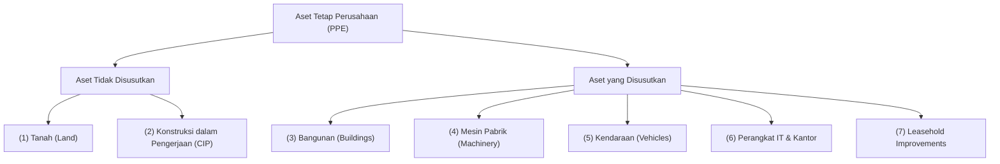
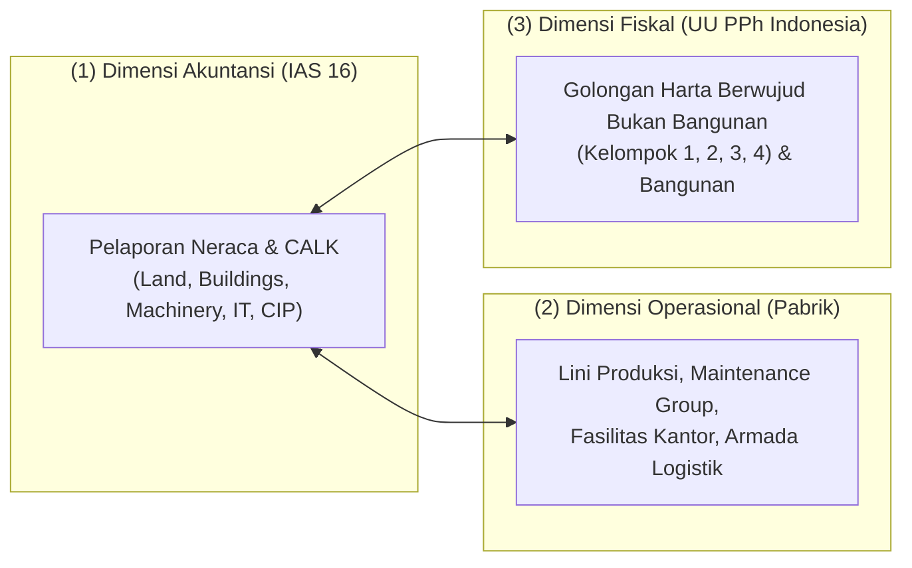

# Asset Classification & Hierarchy

## Definition

**Asset Classification** dalam sistem ERP adalah pengelompokan logis, struktural, dan hierarkis atas seluruh aset tetap perusahaan berdasarkan sifat fisik (*physical nature*), tujuan ekonomis, profil depresiasi, dan persyaratan pelaporan akuntansi maupun regulasi perpajakan.

Dalam arsitektur modul aktiva tetap, **Asset Class (Kelas Aset)** bertindak sebagai entitas konfigurasi paling mendasar yang mengontrol perilaku seluruh aset individual yang berada di bawahnya. Kelas aset menentukan aturan penomoran otomatis, akun buku besar penampung (*Account Determination*), masa manfaat default (*default useful life*), metode depresiasi, hingga layar formulir (*screen layout*) yang disajikan kepada pengguna.

---

## Purpose

1. **Otomatisasi Penentuan Akun Buku Besar (*GL Account Determination*)**: Menghilangkan risiko kesalahan penginputan jurnal manual dengan memetakan setiap transaksi aset (kapitalisasi, penyusutan, revaluasi, pelepasan) secara otomatis ke akun GL yang telah ditentukan di tingkat kelas aset.
2. **Standardisasi Kebijakan Penyusutan**: Menetapkan masa manfaat terencana, nilai sisa, dan metode depresiasi standar untuk aset sejenis secara korporat tanpa perlu dikonfigurasikan ulang per unit barang.
3. **Pemisahan Tiga Dimensi Klasifikasi**: Menyediakan pemetaan independen antara **Klasifikasi Akuntansi (Komersial)**, **Klasifikasi Operasional (Teknis/Pabrik)**, dan **Klasifikasi Fiskal (Pajak)**.
4. **Penyusunan Catatan Atas Laporan Keuangan (CALK)**: Menghasilkan tabel pengungkapan mutasi aktiva tetap (*PPE Disclosure Note*) yang diwajibkan oleh standar **IAS 16 / PSAK 16** secara otomatis per kelompok aset.
5. **Diferensiasi Rezim Kontrol & Verifikasi Fisik**: Menentukan interval audit fisik (misal: aset IT bernilai tinggi dan mudah dipindahkan diperiksa setiap 6 bulan, sedangkan gedung pabrik diperiksa setiap 3 tahun).

---

## Kategori Standar Kelas Aset (Standard Asset Classes)

Secara umum, ERP mengelompokkan aset tetap berwujud ke dalam kategori-kategori standar berikut:

| Kelas Aset | Karakteristik Fisik & Operasional | Masa Manfaat Tipikal | Perlakuan Penyusutan |
| :--- | :--- | :--- | :--- |
| **Land (Tanah)** | Properti tanah hak milik yang tidak mengalami keausan fisik. | Tak terbatas (*Indefinite*) | **Tidak Disusutkan** (Kecuali tanah pertambangan / amortisasi hak guna tertentu). |
| **Buildings & Structures** | Gedung pabrik, gudang penyimpanan, dan kantor administrasi. | 20 s.d. 40 Tahun | Disusutkan garis lurus; komponen gedung (atap, lift) dapat dipisahkan. |
| **Machinery & Equipment** | Mesin perakitan, konveyor, robotika, dan genset pabrik. | 5 s.d. 15 Tahun | Disusutkan garis lurus atau metode unit produksi (*Units of Production*). |
| **Vehicles & Transportation** | Truk logistik pengiriman, mobil dinas, dan forklift gudang. | 4 s.d. 8 Tahun | Mengalami keausan cepat; nilai residu diperhitungkan secara cermat. |
| **Office & IT Equipment** | Server, laptop staf, komputer workstation, dan perabot kantor. | 3 s.d. 5 Tahun | Mengalami keusangan teknologi (*technological obsolescence*) yang sangat cepat. |
| **Leasehold Improvements** | Renovasi interior atau penambahan fasilitas pada gedung yang disewa. | Lebih pendek antara masa manfaat fisik vs sisa masa sewa kontraktual. | Disusutkan selama masa manfaat renovasi atau sisa masa sewa (mana yang lebih singkat). |
| **Construction in Progress (CIP / CWIP)** | Properti atau mesin yang sedang dalam tahap perakitan/pembangunan bertahap. | Periode pengerjaan fisik | **Tidak Disusutkan** hingga proyek selesai dan siap digunakan (*In-Service*). |

---

## Tiga Dimensi Klasifikasi: Akuntansi vs Operasional vs Fiskal

Salah satu kekeliruan umum dalam implementasi ERP adalah menganggap bahwa klasifikasi akuntansi harus identik dengan pengelompokan operasional dan perpajakan. Ketiganya melayani fungsi yang berbeda:

### 1. Klasifikasi Akuntansi Komersial (Accounting / Statutory View)
Berfokus pada penyajian wajar posisi keuangan di Neraca dan Laporan Laba Rugi sesuai standar **IFRS / IAS 16**. Pengelompokan didasarkan pada substansi ekonomis dan materialitas.

### 2. Klasifikasi Operasional & Pemeliharaan (Plant & Maintenance View)
Berfokus pada lokasi penempatan, jadwal servis berkala (*Preventive Maintenance*), dan utilisasi kapasitas di lantai produksi (terintegrasi dengan modul Manufacturing dan Plant Maintenance).

### 3. Klasifikasi Perpajakan (Fiscal / Tax View)
Berfokus pada kepatuhan ketentuan perundang-undangan pajak yang berlaku di yurisdiksi entitas beroperasi. Di Indonesia, sesuai **Pasal 11 Undang-Undang Pajak Penghasilan (UU PPh)** dan peraturan turunannya, harta berwujud bukan bangunan dikelompokkan menjadi 4 golongan tarif penyusutan fiskal:
- **Kelompok 1 (Masa Manfaat 4 Tahun)**: Tarif Garis Lurus 25% (Komputer, printer, perkakas tangan).
- **Kelompok 2 (Masa Manfaat 8 Tahun)**: Tarif Garis Lurus 12,5% (Mesin perakitan elektronik umum, mobil angkutan, perabot logam).
- **Kelompok 3 (Masa Manfaat 16 Tahun)**: Tarif Garis Lurus 6,25% (Mesin pertambangan berat, kapal laut).
- **Kelompok 4 (Masa Manfaat 20 Tahun)**: Tarif Garis Lurus 5% (Alat berat khusus industri berat).
- **Bangunan Permanen (Masa Manfaat 20 Tahun)**: Tarif Garis Lurus 5%.
- **Bangunan Tidak Permanen (Masa Manfaat 10 Tahun)**: Tarif Garis Lurus 10%.

---

## Business Rules

1. **Non-Depreciation Rule for Land and CIP**: Kelas aset tanah (*Land*) dan konstruksi dalam pengerjaan (*CIP/CWIP*) wajib dikunci secara sistemik agar nilai penyusutan bulanannya selalu nol (0).
2. **Mandatory Class Assignment on Inception**: Tidak ada nomor master aset tetap yang dapat disimpan ke dalam sistem tanpa menetapkan kelas aset (*Asset Class*) induknya.
3. **Immutability of Capitalized Class**: Setelah aset tetap dikapitalisasi dan mulai disusutkan, kelas asetnya dilarang diubah secara langsung pada data master. Perubahan kelas wajib dieksekusi melalui transaksi transfer reklasifikasi aset (*Asset Reclassification Transaction*) untuk menjaga integritas saldo akun kontrol GL.
4. **Independent Useful Life Configuration**: Masa manfaat pada buku akuntansi komersial tidak wajib sama dengan masa manfaat pada buku fiskal/pajak. ERP wajib mengizinkan masa manfaat akuntansi diestimasi secara mandiri berdasarkan pertimbangan manajemen (misal 5 tahun), sementara buku pajak dipetakan ke golongan fiskal terdekat (misal Kelompok 2: 8 tahun).
5. **Account Determination Completeness**: Suatu kelas aset dilarang diaktifkan untuk pencatatan transaksi jika konfigurasi akun GL (Akun Aset, Akumulasi Penyusutan, Beban Penyusutan, dan Laba/Rugi Pelepasan) belum terisi lengkap.

---

## Accounting & Financial Impact

Kelas aset menjadi penentu konfigurasi tabel **Account Determination**:

| Kelas Aset | Akun Neraca Aset Tetap | Akun Akumulasi Penyusutan | Akun Beban Laba Rugi | Akun Kliring Perolehan |
| :--- | :--- | :--- | :--- | :--- |
| **Land** | `151000 - Tanah` | *(Tidak ada)* | *(Tidak ada)* | `159100 - Asset Clearing` |
| **Buildings** | `152000 - Bangunan Pabrik` | `152090 - Akum. Depr. Bangunan` | `610410 - Beban Depr. Bangunan` | `159100 - Asset Clearing` |
| **Machinery** | `153000 - Mesin & Peralatan` | `153090 - Akum. Depr. Mesin` | `610420 - Beban Depr. Mesin` | `159100 - Asset Clearing` |
| **Vehicles** | `154000 - Kendaraan Operasional` | `154090 - Akum. Depr. Kendaraan` | `610430 - Beban Depr. Kendaraan` | `159100 - Asset Clearing` |
| **IT Equipment** | `155000 - Peralatan Komputer` | `155090 - Akum. Depr. Komputer` | `610440 - Beban Depr. Komputer` | `159100 - Asset Clearing` |
| **CWIP** | `159000 - Konstruksi Dlm Pengerjaan` | *(Tidak ada)* | *(Tidak ada)* | `159100 - Asset Clearing` |

---

## Example: Pemetaan Tiga Dimensi di PT Maju Bersama

Untuk pengadaan **Mesin Perakitan Otomatis Laptop Pro** senilai Rp120.000.000:

1. **Dimensi Akuntansi Komersial (IAS 16)**:
   - Kelas Aset: `MACHINERY_PROD` (Mesin Pabrik).
   - Masa Manfaat Komersial: **5 Tahun (60 Bulan)** berdasarkan rekomendasi teknis pabrikan.
   - Nilai Residu: **Rp20.000.000**.
   - Penyusutan Garis Lurus: $(\text{Rp120.000.000} - \text{Rp20.000.000}) / 5 = \mathbf{Rp20.000.000 \text{ per tahun}}$.
2. **Dimensi Perpajakan Fiskal (UU PPh Indonesia)**:
   - Golongan Fiskal: **Kelompok 2 (Harta Berwujud Bukan Bangunan)**.
   - Masa Manfaat Fiskal: **8 Tahun**.
   - Nilai Residu Fiskal: **Rp0** (Ketentuan pajak Indonesia tidak mengakui nilai sisa dalam perhitungan penyusutan).
   - Penyusutan Garis Lurus Fiskal: $\text{Rp120.000.000} / 8 = \mathbf{Rp15.000.000 \text{ per tahun}}$.
3. **Dampak Rekonsiliasi Fiskal Akhir Tahun**:
   - Selisih Beban Penyusutan: $\text{Rp20.000.000 (Komersial)} - \text{Rp15.000.000 (Fiskal)} = \mathbf{Rp5.000.000}$.
   - PT Maju Bersama mencatat **Koreksi Fiskal Positif** sebesar Rp5.000.000 pada formulir SPT Tahunan Badan 1771-I.

---

## ERP Implementation

Perbandingan implementasi struktur klasifikasi aset pada berbagai sistem ERP:

| Parameter Klasifikasi | Odoo Enterprise | ERPNext | Microsoft Dynamics 365 | SAP S/4HANA Finance |
| :--- | :--- | :--- | :--- | :--- |
| **Objek Pengendali Kelas** | Model *Asset Model* (menampung durasi & akun GL) | Doctype *Asset Category* terhubung ke GL accounts | Master *Fixed asset groups* terhubung ke *Posting profiles* | Entitas sentral *Asset Class (OAOA)* yang mengendalikan seluruh parameter modul |
| **Integrasi Multi-Buku (Tax/Corp)** | Pengaturan manual multi-jurnal | Mendukung *Finance Books* per kategori aset | *Books setup* pada masing-masing kelompok aset | *Depreciation Areas* terkonfigurasi otomatis per *Asset Class* |
| **Dukungan CIP / CWIP** | Pengaturan akun tipe WIP pada asset model | Opsi centang *Is Capital Work in Progress* | Tipe aset khusus *Construction in process* | Tipe kelas aset khusus *Investment Measure / Asset under Construction (AuC)* |
| **Validasi Nilai Residu Pajak** | Manual input per aset | Pengaturan persentase nilai sisa per kategori | Fleksibilitas aturan *Scrap value* per buku aset | Pengaturan *Cut-off value key* dan toleransi residu per area depresiasi |

---

## Naventra Consideration

Rancangan arsitektur modul Asset Classification pada Naventra ERP:

1. **Hierarchical Class Inheritance**: Naventra menyusun kelas aset dalam hierarki pohon (*tree structure*), misal: `TANGIBLE` $\rightarrow$ `MACHINERY` $\rightarrow$ `PROD_SMT_LINE`. Sub-kelas secara otomatis mewarisi pemetaan akun GL dan aturan validasi dari kelas induknya, namun dapat mengesampingkan (*override*) parameter masa manfaat default.
2. **Built-in Tri-Dimensional Mapping Matrix**: Setiap kelas aset di Naventra memiliki tabel relasi bawaan yang menghubungkan kode kelas komersial, kode golongan fiskal perpajakan, dan kategori peralatan pemeliharaan pabrik, mencegah redundansi pengisian data oleh staf operasional.
3. **Automated Fiscal Difference Calculation**: Naventra secara otomatis membandingkan akumulasi penyusutan komersial vs penyusutan fiskal dan menyediakan laporan *Tax Reconciliation Bridge* siap pakai untuk lampiran SPT Pajak Penghasilan Badan.

---

## References

- International Accounting Standards Board (IASB). *IAS 16: Property, Plant and Equipment*. IFRS Foundation.
- Republik Indonesia. *Undang-Undang Nomor 7 Tahun 1983 tentang Pajak Penghasilan sebagaimana telah beberapa kali diubah terakhir dengan Undang-Undang Nomor 7 Tahun 2021 tentang Harmonisasi Peraturan Perpajakan (UU HPP)*, Pasal 11.
- SAP SE. *Asset Classes in Asset Accounting (FI-AA)*. SAP Help Portal.
- Microsoft Corporation. *Set up fixed asset groups in Dynamics 365 Finance*. Microsoft Learn.
- Frappe Technologies. *Asset Category Management in ERPNext*. ERPNext Documentation.
