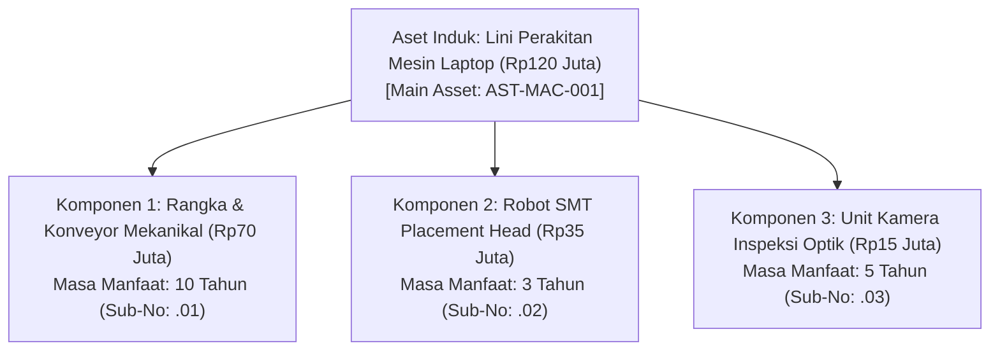
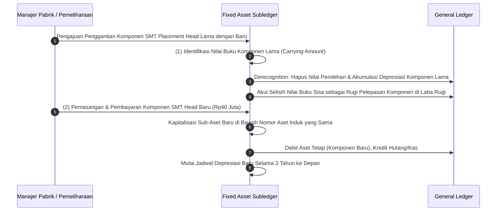

# Asset Componentization

## Definition

**Asset Componentization (Akuntansi Komponen Aset)** adalah praktik dan tata kelola akuntansi di mana suatu aset tetap berwujud dipecah menjadi beberapa bagian penyusun (*components*) yang diakui dan disusutkan secara terpisah di dalam daftar aktiva tetap (*Fixed Asset Register*).

Sesuai ketentuan **IAS 16 paragraf 43 s.d. 47**, setiap bagian dari aset tetap yang memiliki **biaya perolehan signifikan secara relatif terhadap total biaya aset** dan memiliki **masa manfaat atau pola konsumsi manfaat ekonomis yang berbeda**, **wajib disusutkan secara terpisah**. 

Dalam sistem ERP enterprise, componentization dimodelkan melalui hierarki hubungan induk-anak (*Parent-Child Hierarchy*), di mana aset utama (*Main Asset*) bertindak sebagai payung penampung, sedangkan masing-masing komponen bertindak sebagai sub-aset independen (*Sub-Assets*) dengan masa manfaat, akun penyusutan, dan riwayat mutasi tersendiri.

---

## Purpose

1. **Penyajian Laba Rugi yang Lebih Wajar (*Accurate Periodic Matching*)**: Mencegah distorsi pembebanan penyusutan akibat penggunaan satu masa manfaat seragam atas aset kompleks yang memiliki komponen yang cepat aus atau cepat usang secara teknologi.
2. **Tata Kelola Penggantian Komponen (*Component Replacement*)**: Memfasilitasi penghapusan buku (*derecognition*) atas nilai sisa komponen lama yang diganti dan mengkapitalisasi komponen baru tanpa perlu merombak seluruh master data aset induk.
3. **Pengakuan Inspeksi Berkala Berskala Besar (*Major Inspections & Overhauls*)**: Mengkapitalisasi biaya pemeriksaan berkala utama (misal: *docking* kapal atau turun mesin pabrik besar) sebagai komponen terpisah yang disusutkan selama interval hingga inspeksi berikutnya (**IAS 16.14**).
4. **Visibilitas Pemeliharaan Tingkat Modul**: Menghubungkan riwayat kerusakan dan suku cadang pada modul pemeliharaan (*Plant Maintenance*) ke nomor sub-aset spesifik yang bersangkutan.
5. **Kepatuhan Audit IFRS / Standar Pelaporan**: Memenuhi mandat standar akuntansi internasional yang secara eksplisit melarang penyusutan gelondongan atas aset bernilai material.

---

## Kapan Componentization Wajib vs Opsional?

**Tidak semua aset tetap perusahaan harus dipecah menjadi komponen.** Pemecahan aset ke tingkat yang terlalu rinci akan menimbulkan beban administrasi dan biaya pencatatan (*recordkeeping costs*) yang tidak sebanding dengan manfaatnya.

Komponen wajib dipisahkan jika memenuhi dua kriteria utama:
1. **Materialitas Biaya (*Significant Cost*)**: Nilai perolehan komponen tersebut signifikan terhadap total nilai aset (misal: $\ge 15 - 20\%$ dari total harga paket aset).
2. **Perbedaan Pola Manfaat (*Differing Useful Life / Consumption Pattern*)**: Masa manfaat komponen berbeda secara substansial dari masa manfaat aset induknya.

### Contoh Klasik Penerapan Componentization:

| Aset Utama | Komponen 1 (Masa Pakai Panjang) | Komponen 2 (Masa Pakai Menengah) | Komponen 3 (Masa Pakai Pendek) |
| :--- | :--- | :--- | :--- |
| **Gedung Pabrik Komersial** | Struktur Beton & Pondasi (40-50 tahun) | Sistem HVAC & Lift (15-20 tahun) | Atap Eksterior & Interior (10-15 tahun) |
| **Pesawat Komersial** | Badan Pesawat / Airframe (20-25 tahun) | Mesin Jet Turbin (7-10 tahun / jam terbang) | Interior Kabin Penumpang (4-5 tahun) |
| **Lini Perakitan Elektronik** | Konveyor & Sasis Utama (10-15 tahun) | Sensor & Kamera Optik (5 tahun) | Kepala Penempatan SMT (2-3 tahun) |
| **Truk Pengiriman Logistik** | Sasis & Rangka Truk (8-10 tahun) | Mesin Penggerak Utama (5-6 tahun) | Unit Pendingin / Karoseri Khusus (3-4 tahun) |

---

## Siklus Penggantian Komponen (Component Replacement Lifecycle)

Ketika suatu komponen aset utama mengalami kerusakan total atau mencapai akhir masa pakainya dan digantikan dengan unit baru, ERP mengeksekusi dua langkah akuntansi terkoordinasi:

---

## Business Rules

1. **Mandatory Derecognition Rule on Replacement**: Jika suatu komponen lama diganti dengan komponen baru, sisa nilai buku tercatat (*carrying amount*) dari komponen lama **wajib dihapusbukukan (*derecognized*)** dari neraca ke laporan laba rugi. Sistem dilarang membiarkan nilai komponen lama dan komponen baru tercatat bersamaan di neraca (*anti-double capitalization rule*).
2. **Estimation of Replaced Component Cost**: Jika biaya historis perolehan awal dari komponen lama tidak tercatat secara terpisah saat pembelian awal, entitas diizinkan menggunakan biaya komponen pengganti saat ini sebagai indikasi perkiraan biaya awal saat aset diperoleh, dikurangi taksiran akumulasi penyusutan (**IAS 16.70**).
3. **Hierarchy Total Sum Consistency**: Total biaya perolehan dan total akumulasi penyusutan dari seluruh sub-komponen anak (*children*) wajib sama persis dengan angka konsolidasi pada tingkat aset induk (*parent asset*).
4. **Independent Depreciation Key Constraint**: Setiap sub-aset wajib diizinkan memiliki metode depresiasi dan masa manfaat yang berbeda dari aset induknya (misal: induk menggunakan garis lurus tahunan, sedangkan mesin komponen menggunakan metode unit jam produksi).
5. **Physical Tagging Linkage**: Komponen berukuran besar yang dapat dilepas-pasang (*swappable*) wajib memiliki nomor barcode fisik individual yang terhubung ke nomor identitas sub-aset di ERP.

---

## Accounting & Financial Impact

Mekanisme akuntansi penggantian komponen mencegah terjadinya penumpukan nilai buku semu (*inflated carrying amount*):

### 1. Penghapusan Buku Komponen Lama (Derecognition)
Komponen SMT Head lama (biaya perolehan Rp35.000.000, akumulasi depresiasi Rp28.000.000, sisa nilai buku Rp7.000.000) diganti sebelum habis masa manfaatnya:

| Akun | Debit (IDR) | Kredit (IDR) | Keterangan |
| :--- | :--- | :--- | :--- |
| `153090 - Akumulasi Penyusutan Mesin` | 28.000.000 | - | Menghapus akumulasi penyusutan komponen lama |
| `710200 - Rugi Penghapusan Komponen Aset` | 7.000.000 | - | Pengakuan rugi nilai sisa di laba rugi |
| `153000 - Mesin & Peralatan Pabrik` | - | 35.000.000 | Menghapus harga perolehan historis lama |

### 2. Kapitalisasi Komponen Baru
Pemasangan unit SMT Head baru berkecepatan tinggi seharga Rp40.000.000:

| Akun | Debit (IDR) | Kredit (IDR) | Keterangan |
| :--- | :--- | :--- | :--- |
| `153000 - Mesin & Peralatan Pabrik` | 40.000.000 | - | Kapitalisasi komponen pengganti baru |
| `211100 - Accounts Payable / Kas Bank` | - | 40.000.000 | Pembayaran ke vendor penyedia suku cadang |

---

## Example: Dekomposisi Mesin Perakitan di PT Maju Bersama

Pada saat pengadaan mesin perakitan Laptop Pro senilai total **Rp120.000.000**, Finance Controller PT Maju Bersama memutuskan membagi aset menjadi 3 komponen utama berdasarkan rekomendasi teknis:

### 1. Struktur Komponen Awal (Tahun 0)

| Sub-Nomor Aset | Nama Komponen Mesin | Nilai Perolehan (IDR) | Masa Manfaat | Metode Depresiasi | Beban Depresiasi Tahunan (IDR) |
| :--- | :--- | :--- | :--- | :--- | :--- |
| `AST-MAC-001.01` | Rangka Utama & Konveyor Mekanis | 70.000.000 | 10 Tahun (120 bln) | Garis Lurus (Residu Rp10M) | 6.000.000 |
| `AST-MAC-001.02` | SMT Precision Robotic Head | 35.000.000 | 3 Tahun (36 bln) | Garis Lurus (Residu Rp5M) | 10.000.000 |
| `AST-MAC-001.03` | Unit Kamera Inspeksi Optik (AOI) | 15.000.000 | 5 Tahun (60 bln) | Garis Lurus (Residu Rp5M) | 2.000.000 |
| **Total Aset Induk** | **Mesin Perakitan Laptop Pro** | **120.000.000** | — | — | **18.000.000 / tahun** |

### 2. Peristiwa Bisnis di Akhir Tahun ke-3
- Komponen `AST-MAC-001.02` (SMT Head) telah disusutkan penuh selama 3 tahun hingga mencapai nilai residunya (Rp5.000.000).
- Tim teknik mengganti kepala robot tersebut dengan model generasi baru senilai **Rp42.000.000** dengan masa manfaat 4 tahun.
- Unit lama dijual sebagai besi tua khusus seharga Rp4.000.000.
- Hasil Akuntansi di ERP:
  - Komponen lama dihapusbukukan: Mengakui kas Rp4.000.000, menghapus nilai buku Rp5.000.000, mencatat Rugi Pelepasan Rp1.000.000.
  - Komponen baru didaftarkan sebagai sub-nomor `AST-MAC-001.04` senilai Rp42.000.000 dengan masa manfaat 4 tahun (beban depresiasi baru Rp10.500.000 per tahun).
  - Rangka utama (`.01`) dan kamera (`.03`) terus berjalan dengan jadwal depresiasinya masing-masing tanpa terganggu.

---

## ERP Implementation

Perbandingan dukungan arsitektur komponen aset tetap lintas platform ERP:

| Fitur Componentization | Odoo Enterprise | ERPNext | Microsoft Dynamics 365 | SAP S/4HANA Finance |
| :--- | :--- | :--- | :--- | :--- |
| **Model Hierarki Komponen** | Menggunakan relasi parent asset custom | Fitur *Composite Asset* bawaan | Relasi *Parent / Child Fixed Assets* native | Struktur *Main Asset Number* & *Asset Sub-number* (`0001-9999`) |
| **Penyusutan Independen per Sub-Aset** | Memerlukan pembuatan asset record terpisah | Setiap child asset memiliki schedule depresiasi mandiri | Masing-masing child asset memiliki *Asset book* mandiri | Masing-masing sub-number memiliki *Depreciation Key* independen |
| **Wizard Penggantian Komponen** | Proses manual buat dan tutup aset | Manual scrap child asset dan buat baru | Fitur *Reclassification / Replacement transaction* | Fitur standar *Sub-number retirement and acquisition* |
| **Pelaporan Konsolidasi Induk** | Agregasi manual via tag analitik | Tampilan pohon pada doctype Asset | Laporan *Fixed asset roll forward by parent* | Tampilan hierarki aset komprehensif pada aplikasi *Manage Fixed Assets (Fiori)* |

---

## Naventra Consideration

Rancangan arsitektur Asset Componentization pada Naventra ERP:

1. **Asset Tree-Node Data Model**: Naventra menyusun aset dalam struktur pohon berindeks (`parent_asset_id`, `node_level`, `is_composite`). Pengguna dapat melihat total nilai buku bersih aset induk yang dihitung secara dinamis (*aggregated rollup*) dari penjumlahan seluruh node sub-komponen di bawahnya.
2. **Automated Component Replacement Wizard**: Naventra menyediakan antarmuka khusus *Replace Component*. Operator cukup memilih sub-aset yang diganti, menginput dokumen pembelian suku cadang pengganti, dan sistem secara atomik mengeksekusi penghapusan buku komponen lama serta pendaftaran komponen baru dalam satu kesatuan transaksi data.
3. **Synchronized Inspection Overhaul Allocation**: Untuk pemeliharaan berkala besar (*Major Overhauls*), Naventra mengizinkan pembentukan sub-aset bertipe `INSPECTION_COMPONENT` yang secara otomatis disusutkan hingga tanggal target inspeksi besar berikutnya tiba.

---

## References

- International Accounting Standards Board (IASB). *IAS 16: Property, Plant and Equipment (Paragraphs 43–47: Component Depreciation)*. IFRS Foundation.
- International Accounting Standards Board (IASB). *IAS 16: Paragraphs 13–14 (Major Overhauls & Inspections)*.
- SAP SE. *Asset Sub-Numbers and Component Maintenance in SAP S/4HANA*. SAP Help Portal.
- Microsoft Corporation. *Parent and child fixed assets in Dynamics 365 Finance*. Microsoft Learn.
- Ernst & Young (EY). *Applying IFRS: A Closer Look at Component Depreciation under IAS 16*.
