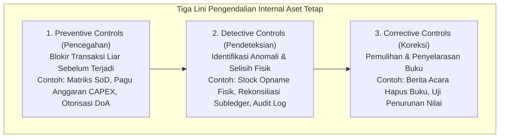
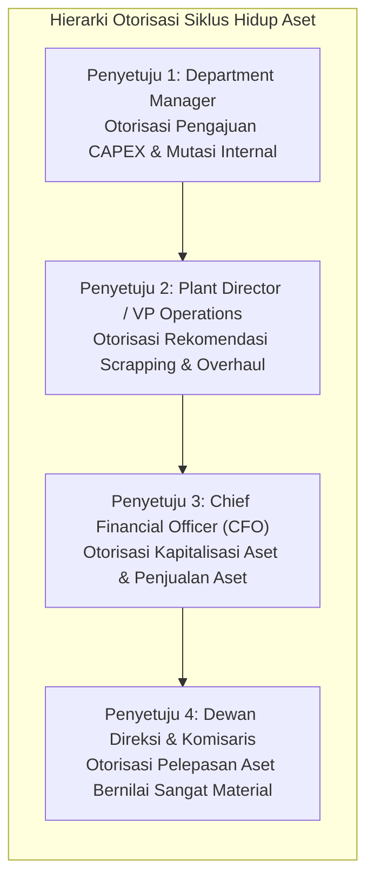

# Asset Controls & Governance

## Definition

**Asset Controls & Governance** dalam arsitektur ERP adalah kerangka kerja sistemik yang terdiri dari kebijakan otorisasi, kontrol akses berbasis peran (*Role-Based Access Control*), pemisahan fungsi (*Segregation of Duties - SoD*), aturan validasi otomatis, dan jejak audit digital (*audit trails*) yang **dirancang untuk mengurangi risiko pencurian, penyalahgunaan aset, pencatatan fiktif, serta manipulasi nilai buku aktiva tetap**.

Pengendalian internal aktiva tetap berpedoman pada kerangka kerja **COSO Internal Control — Integrated Framework**, yang membagi mekanisme perlindungan ke dalam tiga lini pertahanan operasional: Kontrol Pencegahan (*Preventive*), Kontrol Pendeteksian (*Detective*), dan Kontrol Koreksi (*Corrective*).

---

## Purpose

1. **Pengamanan Fisik dan Finansial Aset Jangka Panjang**: Melindungi kekayaan modal perusahaan dari risiko penggelapan (*misappropriation*), pencurian tersembunyi, atau pemusnahan aset tanpa sepengetahuan manajemen.
2. **Jaminan Integritas Pelaporan Keuangan (*ICFR / SOX Compliance*)**: Memberikan kepastian memadai (*reasonable assurance*) kepada dewan komisaris dan auditor eksternal bahwa nilai aset tetap di neraca benar-benar ada secara fisik (*existence*) dan dinilai secara tepat (*valuation*).
3. **Pencegahan Kolusi melalui Pemisahan Fungsi (SoD)**: Memutus rantai konflik kepentingan dengan memastikan bahwa pihak yang menguasai fisik aset dilarang merangkap sebagai pihak yang membukukan atau menyetujui penghapusan aset.
4. **Pencegahan Pendaftaran Aset Duplikat (*Duplicate Asset Prevention*)**: Mencegah terjadinya pembayaran ganda atau kapitalisasi ganda atas satu unit mesin fisik yang sama melalui validasi nomor seri unik.
5. **Keterlacakan Forensik Perubahan Parameter (*Auditability*)**: Merekam jejak digital atas setiap penyesuaian masa manfaat, nilai sisa, atau metode penyusutan guna mencegah perataan laba (*income smoothing*).

---

## Matriks Pemisahan Tugas (Segregation of Duties - SoD Conflict Matrix)

Untuk memitigasi risiko kecurangan (*fraud*), sistem ERP menerapkan pembatasan benturan peran (*Toxic SoD Combinations*) pada domain aktiva tetap:

| Fungsi A (Pemrakarsa) | Fungsi B (Pengeksekusi / Penyetuju) | Risiko Bisnis jika Dilakukan 1 Orang | Kebijakan Sistem ERP |
| :--- | :--- | :--- | :--- |
| **Pengadaan Aset (Purchaser)** | **Penerimaan Fisik & Tagging Aset** | Pengadaan aset fiktif atau penerimaan barang tidak sesuai spek | **Hard Stop**: User pembelian dilarang memvalidasi penerimaan fisik |
| **Penanggung Jawab Aset (Custodian)** | **Petugas Audit Verifikasi Fisik** | Menyembunyikan aset yang hilang, rusak, atau dijual ilegal | **Hard Stop**: Custodian dilarang menjadi auditor penghitungan fisik |
| **Staf Administrasi Aset (FA Clerk)** | **Persetujuan Pelepasan Aset (Disposal)** | Menjual aset perusahaan di bawah tangan dan menghapusnya dari buku | **Hard Stop**: Pelepasan aset wajib disetujui pejabat level Finance Manager / CFO |
| **Staf Pembukuan Aset** | **Penyetuju Perubahan Nilai Buku / Residu** | Memanipulasi laba rugi melalui pengurangan beban depresiasi | **Hard Stop**: Perubahan parameter wajib disahkan Financial Controller |
| **Pemeliharaan Mesin (Maintenance)** | **Persetujuan Hapus Buku (Write-Off)** | Mengklaim mesin rusak total padahal masih dapat diperbaiki | **Hard Stop**: Rekomendasi teknis harus diuji independen sebelum write-off |

---

## Matriks Pendelegasian Wewenang (Delegation of Authority - DoA)

Setiap tahapan kritis dalam siklus hidup aset dikendalikan oleh batas wewenang persetujuan berjenjang:

---

## Mekanisme Pengendalian Kunci dalam ERP

### 1. Pencegahan Aset Duplikat (Duplicate Asset Prevention)
Saat master aset baru diinput, mesin validasi ERP secara otomatis memindai field identitas unik:
- Pengecekan kombinasi: `Manufacturer` $+$ `Model` $+$ `Serial Number`.
- Jika nomor seri pabrikan telah terdaftar pada aset aktif lain, sistem secara otomatis menolak penyimpanan (*Blocking Error*) untuk mencegah kapitalisasi ganda atas satu faktur pembelian.

### 2. Pencegahan Pelepasan Tidak Sah (Unauthorized Disposal Prevention)
Proses pelepasan aset tidak dapat dieksekusi secara sepihak:
- Sistem mewajibkan penerbitan dokumen digital *Disposal Request* yang memuat alasan teknis, estimasi harga pasar, dan foto kondisi fisik terkini.
- Transaksi pelepasan hanya dapat di-posting ke General Ledger setelah seluruh tanda tangan digital berwenang (*digital approval signatures*) terpenuhi.

### 3. Jejak Audit Tak Terbantahkan (Immutable Audit Trail)
Setiap mutasi master data atau penyesuaian nilai buku secara otomatis mencatat 6 dimensi forensik:
- `USER_ID`: Identitas akun pengguna pengeksekusi.
- `TIMESTAMP`: Waktu server jaringan terverifikasi (*NTP time*).
- `ACTION`: Jenis operasi (*Create, Update, Depreciate, Transfer, Revalue, Dispose*).
- `FIELD_NAME`: Atribut yang diubah (misal: `useful_life_months`).
- `OLD_VALUE`: Nilai sebelum perubahan (misal: `60`).
- `NEW_VALUE`: Nilai setelah perubahan (misal: `84`).
- `JUSTIFICATION`: Alasan bisnis yang wajib diinput oleh pengguna.

---

## Business Rules

1. **Zero Tolerance for Toxic SoD Combinations**: Pengguna sistem yang memiliki hak akses sebagai penanggung jawab fisik (*Asset Custodian*) dilarang keras diberikan hak otorisasi untuk menyetujui penghapusan buku (*write-off*) atau pelepasan (*disposal*) aset yang berada di bawah pengawasannya.
2. **Dual-Signoff Mandate on Asset Disposals**: Seluruh transaksi pelepasan, penjualan, pemusnahan, atau penghapusan buku aset tetap wajib disahkan oleh minimal dua pejabat berwenang (*Maker-Checker Principle*).
3. **Immutability of Audit Trails**: Tabel catatan riwayat mutasi aset dan log audit sistem wajib disimpan dalam mode hanya-baca yang terproteksi (*append-only storage*), di mana operasi penghapusan (*DELETE*) dinonaktifkan secara permanen.
4. **Mandatory Tag Scanning on Delivery**: Aset baru dilarang dialihkan ke status *In-Service* sebelum nomor barcode atau tag fisik terverifikasi telah dipindai dan dipetakan ke nomor master aset di ERP.
5. **No Negative Book Value Allowance**: Aturan bisnis sistem wajib secara mutlak mencegah nilai buku bersih (*Net Book Value*) aset tetap bernilai negatif pada buku komersial maupun buku perpajakan.

---

## Accounting & Financial Impact

Penerapan tata kelola kontrol aktiva tetap dirancang untuk memastikan kepatuhan terhadap standar pengendalian internal atas pelaporan keuangan (*Internal Control over Financial Reporting - ICFR*). Ketiadaan kontrol yang memadai dapat memicu temuan kelemahan material (*Material Weakness*) oleh auditor eksternal yang memengaruhi opini audit laporan keuangan.

---

## Example: Penanganan Upaya Pelepasan Aset Tidak Sah di PT Maju Bersama

Pada tanggal 18 Oktober 2029, seorang staf operasional pabrik berinisial "WS" mencoba menghapusbukukan unit **Mesin Pemotong Presisi** bernilai buku Rp15.000.000 yang sebenarnya masih berfungsi normal, dengan maksud untuk menjualnya secara ilegal ke penampung besi tua:

1. **Upaya Transaksi**:
   - Staf "WS" membuat transaksi *Asset Scrapping Request* di sistem dengan alasan "Mesin Rusak Total Terbakar".
   - "WS" mencoba mengeksekusi penutupan master aset secara langsung.

2. **Reaksi Sistem Pengendalian ERP**:
   - **Pencegahan 1 (DoA Gatekeeping)**: Sistem menolak eksekusi seketika: *"Access Denied: Scrapping transactions require Level-2 Approval (Plant Director) and Level-3 Approval (CFO)"*.
   - **Pencegahan 2 (Mandatory Evidence Hook)**: Formulir pengajuan mewajibkan unggahan Berita Acara Pemeriksaan Teknis dari Tim Engineering dan foto kerusakan fisik mesin.
   - **Pendeteksian (Audit Logging & Notification)**: Pengajuan tiket pelepasan bernilai di atas Rp10.000.000 secara otomatis memicu notifikasi peringatan (*Alert*) ke email Internal Auditor.
   - **Tindakan Auditor**: Internal Auditor melakukan inspeksi fisik mendadak ke Hall B Pabrik Cikarang dan menemukan bahwa mesin pemotong tersebut masih berada di posisinya dan beroperasi normal. Upaya penipuan internal berhasil digagalkan sebelum aset fisik keluar dari gerbang pabrik.

---

## ERP Implementation

Perbandingan kapabilitas tata kelola dan kontrol aktiva tetap lintas platform ERP:

| Fitur Tata Kelola Kontrol | Odoo Enterprise | ERPNext | Microsoft Dynamics 365 | SAP S/4HANA Finance |
| :--- | :--- | :--- | :--- | :--- |
| **Pemisahan Fungsi (SoD)** | Memerlukan kustom grup akses (*Security Groups*) | Konfigurasi *Role Permissions* dan *User Permissions* | Fitur native *Segregation of duties rules & conflict resolution* | Modul enterprise terdepan *SAP Access Control (GRC)* |
| **Alur Persetujuan Pelepasan** | Fitur alur kerja *Approval module* berjenjang | Fitur *Workflow* berbasis transisi dokumen dan nilai | *Workflow infrastructure* terhubung ke *Signing limits* | *Flexible Workflow for Asset Accounting* & *Release Procedures* |
| **Pencegahan Nomor Seri Duplikat** | Memerlukan validasi Python kustom pada serial | Validasi unik bawaan pada field *Serial Number* | Validasi bawaan nomor seri pada master aset | Validasi ketat nomor seri dan nomor tag inventaris (*Inven. No.*) |
| **Jejak Audit Master Aset** | *Chatter log tracking* pada setiap field model | Dokumen *Version Log* dan *Activity Log* bawaan | *Database log setup* pada tabel *AssetTable* | Pencatatan otomatis via *Change Documents (CDHDR / CDPOS)* |

---

## Naventra Consideration

Rancangan arsitektur modul Asset Controls & Governance pada Naventra ERP:

1. **Native Asset SoD Matrix Engine**: Naventra memelihara tabel matriks benturan peran `asset_sod_rules`. Setiap kali administrator menetapkan hak akses baru kepada staf, sistem mengevaluasi potensi konflik secara *real-time* dan menolak kombinasi beracun (misal: merangkap sebagai *Asset Custodian* sekaligus *Asset Write-Off Approver*).
2. **Cryptographic Append-Only Custody Log**: Riwayat penyerahan aset, pemindahan ruangan, dan pergantian penanggung jawab dicatat ke dalam tabel log partisi yang diamankan dengan *SHA-256 Hash Chaining*, dirancang untuk mengurangi risiko manipulasi atau penghapusan jejak histori tanpa terdeteksi.
3. **Dual-Key Break-Glass Disposal Protocol**: Untuk transaksi penghapusan buku (*write-off*) atas aset bernilai material, Naventra mewajibkan otentikasi ganda (*Two-Factor Dual Signoff*) dari Manajer Pabrik dan Direktur Keuangan secara bersamaan sebelum jurnal penghapusan diposting ke General Ledger.

---

## References

- Committee of Sponsoring Organizations of the Treadway Commission (COSO). *Internal Control — Integrated Framework (2013)*.
- Information Systems Audit and Control Association (ISACA). *IT Control Objectives for Sarbanes-Oxley: Fixed Asset Governance*.
- SAP SE. *Governance, Risk, and Compliance (GRC) and Audit Logging in SAP S/4HANA Asset Accounting*. SAP Help Portal.
- Microsoft Corporation. *Security and segregation of duties in Dynamics 365 Finance*. Microsoft Learn.
- The Institute of Internal Auditors (IIA). *Internal Auditing Practices for Property, Plant, and Equipment*.
