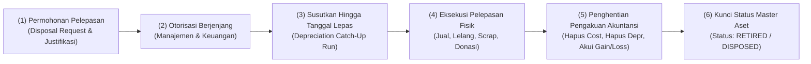
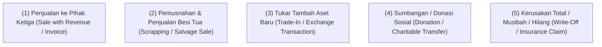
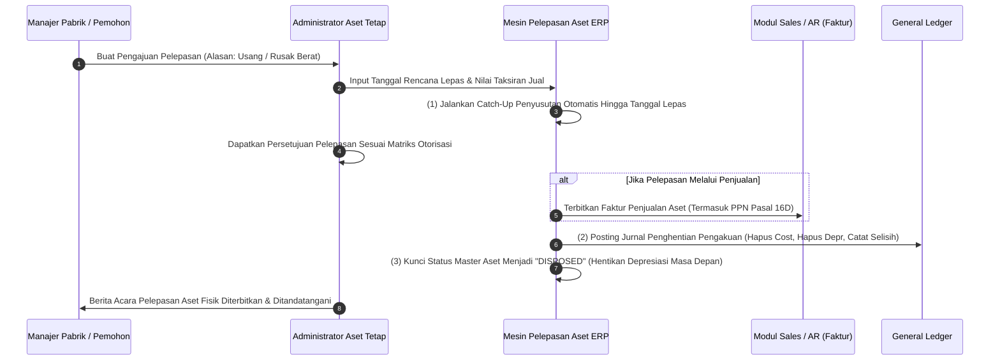

# Asset Disposal & Retirement

## Definition

**Asset Disposal & Retirement (Pelepasan & Penghentian Pengakuan Aset Tetap)** dalam sistem ERP adalah proses bisnis, operasional, dan akuntansi akhir yang menandai berakhirnya siklus hidup suatu aset tetap di dalam perusahaan. Proses ini mencakup penarikan fisik aset dari operasional produktif, pembaruan status pada daftar aktiva tetap (*Fixed Asset Register*), dan penghapusan seluruh nilai tercatatnya dari neraca keuangan (*Accounting Derecognition*).

Sesuai standar **IAS 16 paragraf 67 s.d. 72**, nilai tercatat suatu aset tetap **wajib dihentikan pengakuannya (*derecognized*)**:
1. Pada saat aset dilepaskan (melalui penjualan, sewa pembiayaan, atau donasi); atau
2. Ketika tidak ada lagi manfaat ekonomis masa depan yang diharapkan dari penggunaan atau pelepasannya (melalui pemusnahan, pembongkaran, atau *scrapping*).

---

## Purpose

1. **Penyelarasan Tiga Dimensi Pelepasan**: Menjaga koordinasi sempurna antara **Pelepasan Fisik** (barang keluar pabrik), **Penghentian Akuntansi** (penghapusan akun di neraca), dan **Status Master Aset** (status terkunci dari penyusutan).
2. **Penghentian Beban Penyusutan Masa Depan**: Menghentikan perhitungan penyusutan otomatis pada periode-periode berikutnya sejak tanggal efektif pelepasan aset.
3. **Pengakuan Keuntungan atau Kerugian yang Akurat (*Gain/Loss on Disposal*)**: Menghitung secara presisi selisih antara nilai hasil penjualan bersih (*Net Disposal Proceeds*) dengan sisa nilai tercatat (*Carrying Amount*) aset.
4. **Pencegahan Penyalahgunaan Aset Bekas (*Fraud Prevention*)**: Memastikan pelepasan aset berharga murah atau penjualan besi tua (*scrap*) tidak diselewengkan oleh pihak internal tanpa otorisasi formal dan penerbitan kuitansi resmi.
5. **Kepatuhan Pajak Pelepasan Aset (*Statutory Tax Compliance*)**: Memastikan pemenuhan kewajiban penerbitan Faktur Pajak PPN atas penyerahan aktiva yang menurut tujuan semula tidak untuk diperjualbelikan (sesuai **Pasal 16D UU PPN** di Indonesia).

---

## Saluran Pelepasan Aset Tetap (Disposal Channels)

ERP enterprise memfasilitasi berbagai skenario pelepasan aset tetap:

1. **Penjualan Komersial (Sale to Customer/Third Party)**: Menjual aset yang masih berfungsi kepada pihak luar. Menghasilkan tagihan penjualan (*Customer Invoice*), penerimaan kas, dan pengakuan laba/rugi pelepasan.
2. **Pemusnahan Menjadi Besi Tua (Scrapping)**: Aset dibongkar atau dihancurkan karena sudah rusak total atau kadaluwarsa teknis. Nilai sisa dijual sebagai limbah (*salvage scrap*) atau dihapusbukukan penuh ke beban kerugian.
3. **Tukar Tambah (Trade-In / Non-Monetary Exchange)**: Aset lama diserahkan kepada vendor mesin sebagai pengurang uang muka pembelian aset baru yang lebih canggih.
4. **Hibah / Sumbangan (Donation)**: Aset diserahkan kepada yayasan atau masyarakat tanpa imbalan uang (seluruh sisa nilai buku diakui sebagai beban sumbangan).
5. **Hapus Buku Akibat Musibah / Hilang (Write-Off / Loss Event)**: Aset musnah akibat kebakaran, banjir, atau pencurian. Nilai buku dihapusbukukan seketika, dan klaim ganti rugi asuransi dicatat sebagai piutang klaim terpisah.

---

## Rumus Perhitungan Laba atau Rugi Pelepasan

Keuntungan atau kerugian yang timbul dari penghentian pengakuan aset tetap dihitung sebagai selisih bersih antara:

$$\text{Carrying Amount (Nilai Buku)} = \text{Acquisition Cost} - \text{Accumulated Depreciation} - \text{Accumulated Impairment}$$

$$\text{Gain / (Loss) on Disposal} = \text{Net Disposal Proceeds} - \text{Carrying Amount}$$

- **Jika Hasil Pelepasan Bersih $>$ Nilai Buku**: Diakui sebagai **Keuntungan Pelepasan Aset Tetap (*Gain on Sale of Fixed Assets*)** pada pendapatan lain-lain di Laporan Laba Rugi.
- **Jika Hasil Pelepasan Bersih $<$ Nilai Buku**: Diakui sebagai **Kerugian Pelepasan Aset Tetap (*Loss on Sale of Fixed Assets*)** pada beban lain-lain di Laporan Laba Rugi.

---

## Business Process

Alur pelepasan aset terkoordinasi dalam ERP:

---

## Business Rules

1. **Mandatory Depreciation Catch-Up Rule**: Sebelum jurnal penghentian pengakuan (*derecognition entry*) diposting, sistem ERP wajib secara otomatis menghitung dan memposting beban penyusutan berjalan dari awal bulan fiskal hingga tanggal efektif pelepasan (*effective disposal date*), agar nilai buku aset yang dihapusbukukan akurat.
2. **Prohibition of Negative Book Value**: Suatu aset dilarang dihapusbukukan dengan meninggalkan saldo nilai buku negatif di neraca. Seluruh harga perolehan historis dan akumulasi penyusutan wajib dihabiskan (*cleared to zero*).
3. **Dual Authorization for Scrapping and Sales**: Setiap transaksi pelepasan aset wajib disetujui bersama oleh kepala departemen pengguna dan Financial Controller/CFO guna mencegah penjualan aset perusahaan di bawah tangan.
4. **Mandatory Tax Invoice Issuance (PPN Pasal 16D)**: Di Indonesia, penjualan aset tetap berwujud (selain sedan dan station wagon yang tidak digunakan langsung untuk kegiatan operasional tertentu) terutang PPN 11%. Sistem wajib memicu pembuatan Faktur Pajak Keluaran secara otomatis saat transaksi penjualan aset tetap diproses.
5. **Permanent Asset Status Lockout**: Setelah transaksi pelepasan disahkan, nomor master aset tersebut dikunci secara permanen pada status `DISPOSED` atau `RETIRED`. Sistem dilarang mengizinkan mutasi lokasi, penambahan biaya susulan, atau perhitungan penyusutan baru pada nomor aset yang telah dilepas.

---

## Accounting & Financial Impact

Mekanisme akuntansi pelepasan aset menghapus akun aktiva dan akumulasi depresiasinya dari neraca:

### 1. Pelepasan Melalui Penjualan Untung (Gain on Sale)
PT Maju Bersama menjual mesin yang memiliki Harga Perolehan Rp120.000.000 dan Akumulasi Penyusutan Rp100.000.000 (Nilai Buku Bersih Rp20.000.000) dengan harga jual Rp25.000.000 (belum termasuk PPN 11% = Rp2.750.000):

| Akun | Debit (IDR) | Kredit (IDR) | Keterangan |
| :--- | :--- | :--- | :--- |
| `112100 - Piutang Penjualan Aset Tetap` | 27.750.000 | - | Tagihan ke pembeli pihak ketiga |
| `153090 - Akumulasi Penyusutan Mesin` | 100.000.000 | - | Menghapus seluruh akumulasi penyusutan |
| `153000 - Mesin & Peralatan Pabrik` | - | 120.000.000 | Menghapus harga perolehan historis aset |
| `213100 - PPN Keluaran (PPN Pasal 16D - 11%)` | - | 2.750.000 | Pajak pertambahan nilai atas penjualan aset |
| `710100 - Keuntungan Penjualan Aset Tetap` | - | 5.000.000 | Laba pelepasan di Laporan Laba Rugi |

### 2. Pelepasan Melalui Pemusnahan / Scrap (Loss on Scrapping)
Jika mesin yang sama (Nilai Buku Rp20.000.000) rusak parah dan hanya laku dijual sebagai besi tua rongsokan senilai Rp12.000.000 (terjadi rugi Rp8.000.000):

| Akun | Debit (IDR) | Kredit (IDR) | Keterangan |
| :--- | :--- | :--- | :--- |
| `111200 - Kas Bank Operasional` | 12.000.000 | - | Penerimaan uang tunai dari pedagang besi tua |
| `153090 - Akumulasi Penyusutan Mesin` | 100.000.000 | - | Menghapus akumulasi penyusutan |
| `710200 - Kerugian Pelepasan Aset Tetap` | 8.000.000 | - | Pengakuan rugi pelepasan di Laba Rugi |
| `153000 - Mesin & Peralatan Pabrik` | - | 120.000.000 | Menghapus harga perolehan historis aset |

---

## Example: Pelepasan Mesin Perakitan di PT Maju Bersama

Pada tanggal 31 Maret 2031 (Tepat pada akhir Tahun ke-5 operasional), PT Maju Bersama mempensiunkan **Mesin Perakitan Laptop Pro** (`AST-MAC-2026-0001`):

1. **Posisi Buku Menjelang Pelepasan**:
   - Biaya Perolehan Historis: Rp120.000.000.
   - Akumulasi Penyusutan (5 Tahun Penuh @ Rp20.000.000/tahun): Rp100.000.000.
   - Sisa Nilai Buku Bersih (*Carrying Amount*): **Rp20.000.000** (Persis sama dengan estimasi nilai residu awal).

2. **Eksekusi Penjualan ke Perusahaan Rekondisi**:
   - Manajemen menjual mesin tersebut kepada PT Rekondisi Presisi seharga **Rp25.000.000** tunai (ditambah PPN 11% Rp2.750.000).
   - **Kalkulasi Laba Pelepasan**:
     $$\text{Keuntungan Pelepasan} = \text{Rp25.000.000 (Harga Jual)} - \text{Rp20.000.000 (Nilai Buku)} = \mathbf{Rp5.000.000}$$
   - Sistem menerbitkan Faktur Pajak Standar PPN Pasal 16D, memposting jurnal laba penjualan aset Rp5.000.000, dan mencabut nomor seri mesin dari daftar fasilitas pabrik aktif.

---

## ERP Implementation

Perbandingan fungsional modul pelepasan aset tetap lintas software ERP terkemuka:

| Fitur Pelepasan | Odoo Enterprise | ERPNext | Microsoft Dynamics 365 | SAP S/4HANA Finance |
| :--- | :--- | :--- | :--- | :--- |
| **Transaksi Pelepasan Penjualan** | Opsi *Sell Asset* terhubung ke modul Customer Invoice | Opsi *Sell Asset* otomatis membentuk *Sales Invoice* | Jurnal *Fixed asset disposal - sale* terhubung ke AR | Transaksi terdedikasi *Asset Retirement with Revenue (F-92 / ABAON)* |
| **Transaksi Scrapping / Pemusnahan** | Tombol aksi *Modify Depreciation / Pause / Close* | Tombol aksi *Scrap Asset* langsung membentuk jurnal | Transaksi *Fixed asset disposal - scrap* otomatis | Transaksi terdedikasi *Asset Retirement by Scrapping (ABAVN)* |
| **Penyusutan Otomatis Catch-Up** | Prorata otomatis hingga tanggal penutupan | Opsi *Calculate Depreciation to Disposal Date* | Fitur *Depreciation catch-up calculation before disposal* | Otomatis dihitung via *Depreciation Engine* saat simulasi pelepasan |
| **Pelepasan Sebagian (Partial Retirement)** | Memerlukan pemisahan aset manual | Pengurangan kuantitas/persentase manual | Fitur *Partial disposal* berbasis persentase atau nominal | Sangat kuat: *Partial Retirement by Percentage / Amount / Quantity* |

---

## Naventra Consideration

Rancangan arsitektur modul Asset Disposal & Retirement pada Naventra ERP:

1. **Guided Disposal Wizard**: Naventra memandu pengguna melalui wizard pelepasan multi-langkah: (1) Verifikasi tanggal efektif pelepasan $\rightarrow$ (2) Pemilihan saluran pelepasan (*Sale*, *Scrap*, *Donation*, *Loss*) $\rightarrow$ (3) Input pembeli dan harga jual $\rightarrow$ (4) Pratinjau simulasi jurnal dan laba/rugi pelepasan secara seketika.
2. **Automated Tax Compliance Integration**: Saat tipe pelepasan *Sale to Customer* dipilih, Naventra secara otomatis memicu pembuatan dokumen *Tax Invoice* (Faktur Pajak PPN 16D) dan mengalokasikan nilai PPN ke akun kewajiban pajak yang tepat.
3. **Atomic Derecognition Engine**: Seluruh rangkaian transaksi—penyusutan periode terakhir, penghapusan nilai aset di neraca, pengakuan kas/piutang, dan penguncian status master aset menjadi `DISPOSED`—dieksekusi dalam satu transaksi basis data atomik (*single ACID transaction*).

---

## References

- International Accounting Standards Board (IASB). *IAS 16: Property, Plant and Equipment (Paragraphs 67–72: Derecognition)*. IFRS Foundation.
- Republik Indonesia. *Undang-Undang Nomor 8 Tahun 1983 tentang Pajak Pertambahan Nilai Barang dan Jasa dan Pajak Penjualan atas Barang Mewah sebagaimana telah beberapa kali diubah terakhir dengan UU Harmonisasi Peraturan Perpajakan (UU HPP)*, Pasal 16D.
- SAP SE. *Asset Retirement in SAP S/4HANA Asset Accounting*. SAP Help Portal.
- Microsoft Corporation. *Dispose of fixed assets in Dynamics 365 Finance*. Microsoft Learn.
- Frappe Technologies. *Asset Disposal and Scrapping in ERPNext*. ERPNext Documentation.
