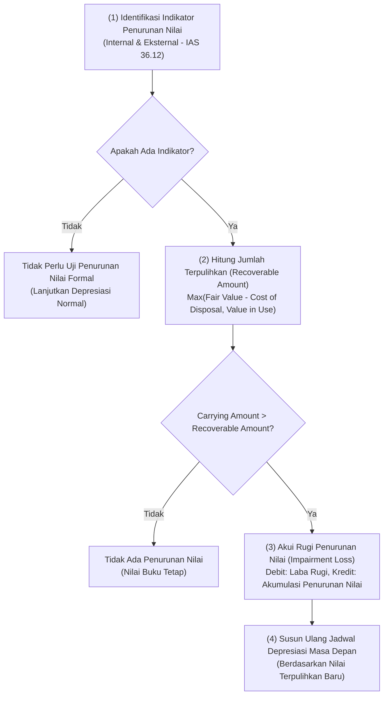
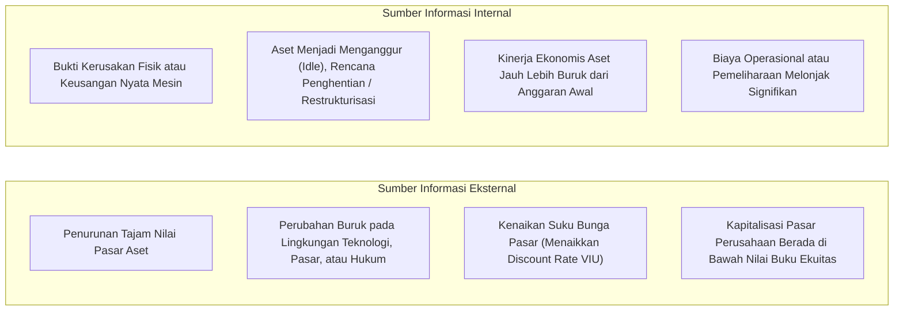

# Asset Impairment Management

## Definition

**Asset Impairment (Penurunan Nilai Aset Tetap)** dalam sistem ERP adalah proses evaluasi, pengujian, dan pembukuan atas kondisi di mana **Nilai Tercatat (*Carrying Amount / Net Book Value*)** suatu aset tetap atau Unit Penghasil Kas (*Cash-Generating Unit - CGU*) melebihi **Jumlah Terpulihkan (*Recoverable Amount*)**-nya.

Sesuai standar akuntansi internasional **IAS 36 Impairment of Assets**, jika nilai tercatat aset lebih tinggi dari nilai yang dapat dipulihkan melalui penggunaan atau penjualannya, aset tersebut mengalami penurunan nilai (*impaired*). Entitas wajib mencatat **Rugi Penurunan Nilai (*Impairment Loss*)** pada Laporan Laba Rugi untuk menurunkan nilai buku aset ke jumlah terpulihkannya.

---

## Purpose

1. **Pencegahan Penyajian Aset Berlebih (*Overstatement Prevention*)**: Memastikan neraca perusahaan menyajikan aset tetap pada nilai yang realistis dan tidak dicatat melebihi kapasitas pemulihan ekonomisnya.
2. **Kepatuhan Terhadap Standar Pelaporan Keuangan (*IAS 36 / PSAK 48*)**: Menegakkan prosedur formal pengujian penurunan nilai saat terjadi guncangan pasar, bencana fisik, atau perubahan teknologi mendadak.
3. **Penyelarasan Beban Depresiasi Masa Depan**: Mengurangi dasar tersusutkan (*depreciable base*) masa depan sehingga beban penyusutan periode mendatang mencerminkan kapasitas produktif aset yang baru.
4. **Pengelolaan Unit Penghasil Kas (*Cash-Generating Units - CGU*)**: Menguji penurunan nilai atas sekelompok aset yang bekerja bersama-sama ketika satu aset individual tidak menghasilkan arus kas masuk yang independen (misal: satu lini pabrik perakitan utuh).
5. **Transparansi Transaksi Pemulihan (*Reversal of Impairment*)**: Memfasilitasi pembalikan rugi penurunan nilai di masa depan jika kondisi ekonomi atau kinerja aset terbukti membaik kembali.

---

## Perbedaan Mendasar: Depresiasi vs Penurunan Nilai (Impairment)

Meskipun keduanya sama-sama mengurangi nilai buku aset tetap di neraca, sifat dan penyebabnya sangat berbeda:

| Dimensi | Depresiasi (Penyusutan) | Penurunan Nilai (Impairment) |
| :--- | :--- | :--- |
| **Sifat Proses** | Alokasi biaya terencana, teratur, dan sistematis sepanjang waktu. | Peristiwa mendadak, tidak terencana, dan dipicu oleh kejadian luar biasa (*event-driven*). |
| **Penyebab Utama** | Keausan fisik normal akibat pemakaian rutin dan berlalunya waktu. | Kerusakan fisik parah, keusangan teknologi drastis, atau runtuhnya permintaan pasar. |
| **Frekuensi Eksekusi** | Bulanan secara otomatis melalui jadwal depresiasi. | Pengujian berkala (minimal akhir tahun buku) jika terdeteksi indikator penurunan nilai. |
| **Dasar Perhitungan** | $\frac{\text{Harga Perolehan} - \text{Nilai Residu}}{\text{Masa Manfaat}}$ | $\text{Nilai Tercatat (NBV)} - \text{Jumlah Terpulihkan (Recoverable Amount)}$ |

---

## Indikator Penurunan Nilai (Impairment Indicators)

Sesuai **IAS 36 paragraf 12**, perusahaan wajib mengevaluasi indikator-indikator berikut sebelum menjalankan uji penurunan nilai:

---

## Penentuan Jumlah Terpulihkan (Recoverable Amount)

Jumlah Terpulihkan didefinisikan sebagai **nilai tertinggi antara Nilai Wajar Dikurangi Biaya Pelepasan dengan Nilai Pakai**:

$$\text{Recoverable Amount} = \max(\text{Fair Value Less Costs of Disposal}, \text{Value in Use})$$

### 1. Nilai Wajar Dikurangi Biaya Pelepasan (Fair Value Less Costs of Disposal - FVLCOD)
Harga yang akan diterima dari penjualan aset dalam transaksi teratur antara pelaku pasar, dikurangi biaya langsung pelepasan (seperti biaya hukum, pajak transaksi, dan ongkos bongkar/angkut).

### 2. Nilai Pakai (Value in Use - VIU)
Nilai sekarang (*Present Value*) dari estimasi arus kas masa depan yang diharapkan akan dihasilkan dari penggunaan aset secara terus-menerus dan dari pelepasannya pada akhir masa manfaat, didiskontokan menggunakan tingkat diskonto sebelum pajak (*pre-tax discount rate / WACC*).

$$\text{Value in Use} = \sum_{t=1}^{n} \frac{\text{Cash Flow}_t}{(1 + r)^t} + \frac{\text{Terminal Value}}{(1 + r)^n}$$

---

## Pembalikan Rugi Penurunan Nilai (Reversal of Impairment)

Sesuai **IAS 36 paragraf 114**, jika pada periode berikutnya kondisi yang mendasari penurunan nilai membaik:
- Rugi penurunan nilai yang diakui pada tahun-tahun sebelumnya untuk aset tetap (selain *Goodwill*) **dapat dibalikkan (*reversed*)** ke Laporan Laba Rugi.
- **Batas Maksimum Pembalikan (*Reversal Ceiling*)**: Kenaikan nilai buku tercatat setelah pembalikan **tidak boleh melebihi** nilai buku yang seharusnya tercatat jika aset tersebut tidak pernah mengalami penurunan nilai di masa lalu (memperhitungkan depresiasi normal).

---

## Business Rules

1. **Indicator-Triggered Testing Mandate**: Uji penurunan nilai formal atas aset tetap individual tidak wajib dilakukan setiap tahun kecuali teridentifikasi minimal satu indikator internal atau eksternal yang valid (**IAS 36.9**).
2. **Immediate P&L Recognition**: Beban kerugian penurunan nilai (*Impairment Loss*) wajib diakui seketika di Laporan Laba Rugi tahun berjalan, kecuali aset tersebut sebelumnya dicatat menggunakan model revaluasi di mana kerugian didebitkan ke saldo *Revaluation Surplus* di ekuitas terlebih dahulu.
3. **Depreciation Schedule Recalculation**: Setelah rugi penurunan nilai dibukukan, ERP wajib secara otomatis menghitung ulang jadwal penyusutan bulanan masa depan berdasarkan nilai tercatat yang baru dan sisa masa manfaat yang direvisi.
4. **Reversal Ceiling Enforcement**: Sistem wajib memblokir upaya pembalikan rugi penurunan nilai jika nilai buku hasil pembalikan melampaui nilai buku amortisasi historis aset tersebut (*historical depreciated carrying amount ceiling*).
5. **CGU Level Allocation Hierarchy**: Jika penurunan nilai diuji pada tingkat Unit Penghasil Kas (*CGU*), kerugian wajib dialokasikan terlebih dahulu untuk menghapus *Goodwill* (jika ada), sebelum sisanya dialokasikan secara proporsional (*pro-rata*) ke seluruh aset tetap dalam CGU tersebut.

---

## Accounting & Financial Impact

Mekanisme akuntansi penurunan nilai mencatat akun kontra aset terpisah:

### Jurnal Pengakuan Rugi Penurunan Nilai (Impairment Loss)
Mencatat penurunan nilai mesin pabrik sebesar Rp18.000.000 akibat keusangan teknologi:

| Akun | Debit (IDR) | Kredit (IDR) | Keterangan |
| :--- | :--- | :--- | :--- |
| `610490 - Rugi Penurunan Nilai Aset Tetap` | 18.000.000 | - | Beban operasional luar biasa di Laba Rugi |
| `153095 - Akumulasi Rugi Penurunan Nilai Mesin` | - | 18.000.000 | Akun kontra aset tetap di Neraca |

*(Untuk rincian entri pembalikan penurunan nilai dan pengungkapan CALK, rujuk ke [[02-accounting/fixed-asset-accounting|Fixed Asset Accounting di Phase 3]]).*

---

## Example: Uji Penurunan Nilai Mesin Perakitan di PT Maju Bersama

Pada akhir Tahun ke-3 (31 Desember 2028), industri perakitan mengalami disrupsi teknologi di mana komponen chip baru membutuhkan metode penempatan berkecepatan mikro yang tidak didukung penuh oleh **Mesin Perakitan Laptop Pro** (`AST-MAC-2026-0001`):

### 1. Data Nilai Buku Tercatat Sebelum Pengujian
- Harga Perolehan Historis: Rp120.000.000.
- Akumulasi Penyusutan (3 tahun): Rp60.000.000.
- **Nilai Tercatat (*Carrying Amount*)**: **Rp60.000.000**.
- Sisa Masa Manfaat: **2 Tahun (24 Bulan)**; Nilai Residu: **Rp0**.

### 2. Evaluasi Jumlah Terpulihkan (Recoverable Amount)
- **Estimasi Nilai Wajar Dikurangi Biaya Jual (FVLCOD)**: Berdasarkan penawaran pasar sekunder mesin bekas sejenis, harga jual adalah Rp40.000.000 dengan biaya pembongkaran dan angkut Rp2.000.000.
  $$\text{FVLCOD} = \text{Rp40.000.000} - \text{Rp2.000.000} = \mathbf{Rp38.000.000}$$
- **Estimasi Nilai Pakai (Value in Use - VIU)**: Berdasarkan proyeksi arus kas operasional produksi sisa 2 tahun dengan tingkat diskonto 10%:
  $$\text{Value in Use} = \mathbf{Rp42.000.000}$$
- **Jumlah Terpulihkan (*Recoverable Amount*)**:
  $$\text{Recoverable Amount} = \max(\text{Rp38.000.000}, \text{Rp42.000.000}) = \mathbf{Rp42.000.000}$$

### 3. Perhitungan dan Pembukuan Rugi Penurunan Nilai
Karena Nilai Tercatat (Rp60.000.000) $>$ Jumlah Terpulihkan (Rp42.000.000):
$$\text{Rugi Penurunan Nilai} = \text{Rp60.000.000} - \text{Rp42.000.000} = \mathbf{Rp18.000.000}$$
ERP memposting debit Beban Penurunan Nilai Rp18.000.000 dan kredit Akumulasi Penurunan Nilai Rp18.000.000.

### 4. Dampak Terhadap Jadwal Depresiasi Masa Depan
- Nilai Buku Bersih Baru: **Rp42.000.000**.
- Sisa Masa Manfaat: 2 Tahun (24 Bulan).
- **Beban Depresiasi Baru Tahun ke-4 dan ke-5**:
  $$\text{Beban Tahunan Baru} = \frac{\text{Rp42.000.000}}{2 \text{ tahun}} = \mathbf{Rp21.000.000 \text{ per tahun}} \quad (\text{Rp1.750.000 per bulan})$$

---

## ERP Implementation

Perbandingan fungsional modul penurunan nilai aset tetap pada software ERP terkemuka:

| Fitur Impairment | Odoo Enterprise | ERPNext | Microsoft Dynamics 365 | SAP S/4HANA Finance |
| :--- | :--- | :--- | :--- | :--- |
| **Transaksi Penurunan Nilai** | Penyesuaian manual nilai aset (*Modify Depreciation*) | Dokumen transaksi terdedikasi *Asset Value Adjustment* | Transaksi *Fixed asset write-down / Impairment* | Transaksi terdedikasi *Impairment / Unplanned Depreciation (ABAA)* |
| **Pemisahan Akun Akumulasi Impairment** | Digabung ke akumulasi penyusutan biasa | Digabung ke akumulasi depresiasi atau akun kustom | Mendukung akun buku penampung penurunan nilai tersendiri | Area depresiasi khusus atau sub-akun *Accumulated Impairment* terpisah |
| **Pengujian Tingkat CGU** | Tidak didukung secara native | Memerlukan kustomisasi pengelompokan aset | Didukung via *Fixed asset groups & cash-generating units* | Modul *Asset Accounting CGU Impairment Testing (FI-AA)* bawaan |
| **Pembalikan Penurunan Nilai (Reversal)** | Manual ubah nilai kembali naik | Manual buat *Asset Value Adjustment* positif | Fitur *Write-up adjustment* dengan validasi batas | Transaksi *Write-Up (ABZU)* dengan penegakan otomatis plafon biaya historis |

---

## Naventra Consideration

Rancangan arsitektur modul Asset Impairment pada Naventra ERP:

1. **Impairment Test Workbench**: Naventra menyediakan antarmuka kerja analitik yang memandu Controller: memilih aset/CGU, menginput nilai FVLCOD dan estimasi arus kas DCF untuk menghitung VIU secara otomatis, serta menampilkan rekomendasi nilai penurunan nilai.
2. **Ceiling-Enforced Reversal Engine**: Saat pembalikan penurunan nilai diinisiasi, sistem Naventra menghitung secara dinamis batas atas nilai buku historis tanpa penurunan nilai (*Theoretical Unimpaired Carrying Amount*). Sistem secara otomatis menolak nilai pembalikan yang melampaui batas tersebut.
3. **Automated Subledger-to-Schedule Hook**: Pengesahan dokumen penurunan nilai secara seketika memperbarui field `current_carrying_amount` pada tabel master aset dan secara otomatis meregenerasi sisa baris jadwal penyusutan di masa depan.

---

## References

- International Accounting Standards Board (IASB). *IAS 36: Impairment of Assets*. IFRS Foundation.
- SAP SE. *Unplanned Depreciation and Impairment in SAP S/4HANA Asset Accounting*. SAP Help Portal.
- Microsoft Corporation. *Propose and post write-down adjustments in Dynamics 365 Finance*. Microsoft Learn.
- KPMG International. *Insights into IFRS: Impairment of Non-Financial Assets (IAS 36)*.
- Ikatan Akuntan Indonesia (IAI). *PSAK 48: Penurunan Nilai Aset*.
