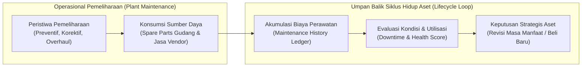
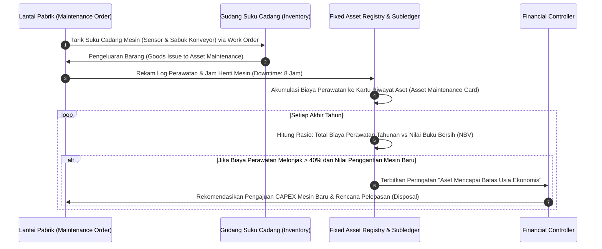

# Asset Maintenance Integration

## Definition

**Asset Maintenance Integration** dalam arsitektur ERP adalah jembatan fungsional dan finansial yang menghubungkan operasional pemeliharaan fisik (*Plant Maintenance / Equipment Servicing*) dengan siklus hidup dan buku besar aktiva tetap (*Fixed Asset Management & Accounting*).

Fokus modul ini **bukan menjadi modul pemeliharaan teknis (*EAM/Plant Maintenance*) secara penuh**, melainkan mengatur bagaimana peristiwa pemeliharaan (*maintenance events*), konsumsi suku cadang, jam henti mesin (*downtime*), dan akumulasi biaya pemeliharaan berinteraksi dengan **estimasi masa manfaat, pengujian penurunan nilai (*impairment*), klasifikasi beban vs kapitalisasi, dan keputusan penggantian aset (*Asset Replacement Decision*)**.

---

## Purpose

1. **Visibilitas Total Biaya Kepemilikan (*Total Cost of Ownership - TCO*)**: Merekam seluruh pengeluaran kas yang terserap oleh suatu unit mesin sejak pertama kali beroperasi hingga akhir masa pakainya (Biaya Perolehan + Akumulasi Biaya Perawatan).
2. **Landasan Keputusan Penggantian Mesin (*Economic Life Assessment*)**: Mengidentifikasi titik kritis (*economic sweet spot*) di mana biaya perawatan mesin tua telah melampaui biaya depresiasi mesin baru, yang menandakan bahwa aset harus segera dipensiunkan (*replacement curve analysis*).
3. **Penyelarasan Beban Operasional Rantai Pasok**: Mengintegrasikan pengeluaran suku cadang dari modul [[05-inventory/inventory-fundamentals|Inventory (Phase 6)]] dan jasa teknisi eksternal dari modul [[04-purchasing/procure-to-pay-integration|Purchasing (Phase 5)]] langsung ke pusat biaya (*Cost Center*) aset terkait.
4. **Koordinasi Kapasitas Produksi Pabrik**: Menghubungkan jadwal perawatan preventif dengan kalender kapasitas pusat kerja (*Work Center*) pada modul [[06-manufacturing/routing-and-work-center|Manufacturing (Phase 7)]] guna mencegah jadwal produksi terganggu oleh pemadaman mesin mendadak.
5. **Kepatuhan Penanganan Turun Mesin Besar (*Capitalizable Overhaul*)**: Mengidentifikasi secara otomatis pengeluaran perawatan berkala berskala besar yang memenuhi kriteria kapitalisasi komponen sesuai **IAS 16.14**.

---

## Jenis Peristiwa Pemeliharaan dan Perlakuan Keuangannya

ERP mengelompokkan aktivitas perawatan ke dalam empat kategori dengan konsekuensi finansial yang berbeda:

| Jenis Pemeliharaan | Karakteristik Operasional | Sumber Daya Terpakai | Perlakuan Akuntansi ERP |
| :--- | :--- | :--- | :--- |
| **Preventive Maintenance (Perawatan Berkala)** | Servis terjadwal berbasis waktu kalender (bulanan) atau jam operasional (setiap 500 jam mesin) untuk mencegah kerusakan. | Pelumas, filter, segel karet, dan jam kerja teknisi internal pabrik. | **OPEX**: Dibebankan seketika ke akun `Repairs & Maintenance Expense` di Cost Center pabrik. |
| **Corrective Maintenance (Perbaikan Kerusakan)** | Tindakan darurat saat mesin mogok (*breakdown*) untuk mengembalikan fungsi operasional normal secepatnya. | Komponen cadangan darurat (*spot parts*) dan jasa perbaikan vendor eksternal. | **OPEX**: Dibebankan langsung pada periode terjadinya insiden kerusakan. |
| **Predictive Maintenance (Berbasis Kondisi/IoT)** | Pemantauan sensor vibrasi dan suhu secara *real-time* untuk memprediksi kegagalan komponen sebelum terjadi. | Perangkat lunak diagnostik dan inspeksi terarah teknisi spesialis. | **OPEX**: Biaya monitoring rutin diakui sebagai beban operasional. |
| **Major Overhaul / Turnaround (Turun Mesin Total)** | Pembongkaran total mesin setiap 3 s.d. 5 tahun untuk penggantian komponen inti demi menjamin keandalan jangka panjang. | Blok silinder baru, modul kontrol utama, kontrak pemborong teknis besar. | **CAPEX (IAS 16.14)**: Dikapitalisasi sebagai komponen inspeksi baru; sisa nilai inspeksi lama dihapusbukukan. |

---

## Siklus Umpan Balik Finansial (The Financial Feedback Loop)

Hubungan antara operasional pemeliharaan dan masa manfaat aset di dalam ERP bekerja melalui siklus berikut:

---

## Metrik Operasional Penentu Kesehatan Aset

Modul integrasi pemeliharaan ERP memantau tiga metrik operasional yang menjadi pemicu (*triggers*) evaluasi penurunan nilai (*impairment indicator*) atau revisi masa manfaat:
1. **MTBF (Mean Time Between Failures)**: Rata-rata jam operasional mesin antar-insiden kerusakan. Jika kurva MTBF menurun drastis, aset mengalami degradasi struktural.
2. **MTTR (Mean Time To Repair)**: Rata-rata waktu yang dibutuhkan teknisi untuk memperbaiki mesin hingga kembali beroperasi.
3. **Asset Availability / OEE (Overall Equipment Effectiveness)**: Persentase waktu mesin siap berproduksi penuh. Penurunan OEE kronis menandakan mesin tidak lagi efisien secara ekonomis.

---

## Business Rules

1. **Strict Cost-Center Tagging on Spare Parts Issue**: Setiap pengeluaran suku cadang dari gudang persediaan untuk keperluan perbaikan mesin wajib mencantumkan nomor aset tetap (*Asset ID*) dan kode *Cost Center* pengguna agar biaya tercatat akurat pada kartu riwayat aset.
2. **Automatic Work Center Shutdown Scheduling**: Rilis perintah kerja pemeliharaan preventif (*Maintenance Work Order*) pada aset mesin produksi wajib secara otomatis memblokir kapasitas pusat kerja (*Work Center*) terkait di modul Manufacturing untuk mencegah benturan jadwal produksi.
3. **Capitalization Gate on Overhauls**: Biaya pemeliharaan hanya diizinkan untuk dikapitalisasi sebagai belanja modal (*CAPEX*) jika memenuhi kriteria pengeluaran penggantian komponen signifikan atau inspeksi berkala besar sesuai **IAS 16.14**, dan wajib menyertakan persetujuan tertulis Financial Controller.
4. **Maintenance History Immutability**: Riwayat catatan log kerusakan, penggantian suku cadang, dan biaya perbaikan pada suatu nomor aset dilarang dihapus atau diubah secara retrospektif demi integritas audit keselamatan kerja dan audit keuangan.
5. **Economic Life Breaching Alert**: Sistem ERP wajib mengirimkan peringatan otomatis kepada komite investasi jika akumulasi biaya pemeliharaan tahunan suatu aset telah melampaui 30% dari taksiran biaya pembelian mesin baru sejenis.

---

## Accounting & Financial Impact

### 1. Pengeluaran Suku Cadang Gudang untuk Perawatan Rutin (OPEX)
Pengambilan sensor pengganti senilai Rp1.200.000 dari gudang persediaan bahan penolong untuk disematkan pada mesin perakitan:

| Akun | Debit (IDR) | Kredit (IDR) | Keterangan |
| :--- | :--- | :--- | :--- |
| `610450 - Beban Pemeliharaan Mesin` | 1.200.000 | - | Beban operasional Laba Rugi pada `CC-PROD-01` |
| `142000 - Persediaan Suku Cadang & Bahan Penolong` | - | 1.200.000 | Pengurangan nilai persediaan gudang (Phase 6) |

### 2. Pelaksanaan Overhaul Besar yang Dikapitalisasi (CAPEX)
Pelaksanaan turun mesin total 4-tahunan senilai Rp30.000.000 (jasa kontraktor spesialis):

| Akun | Debit (IDR) | Kredit (IDR) | Keterangan |
| :--- | :--- | :--- | :--- |
| `153000 - Mesin & Peralatan Pabrik (Sub-Overhaul)` | 30.000.000 | - | Kapitalisasi komponen inspeksi baru di Neraca |
| `211100 - Accounts Payable` | - | 30.000.000 | Kewajiban ke kontraktor overhaul |

---

## Example: Siklus Pemeliharaan Mesin Perakitan di PT Maju Bersama

PT Maju Bersama memantau riwayat pemeliharaan **Mesin Perakitan Laptop Pro** (`AST-MAC-2026-0001`, Nilai Perolehan Awal Rp120.000.000):

### 1. Riwayat Perawatan Tahun ke-1 s.d. Tahun ke-3 (Kondisi Normal)
- **Tahun 2026 (Th 1)**: Servis berkala dan oli = Rp3.500.000 (OPEX). Ketersediaan mesin: 98%.
- **Tahun 2027 (Th 2)**: Penggantian sabuk konveyor aus = Rp4.500.000 (OPEX). Ketersediaan mesin: 96%.
- **Tahun 2028 (Th 3)**: Kalibrasi sensor dan motor servo = Rp4.000.000 (OPEX). Ketersediaan mesin: 95%.
- **Akumulasi Biaya Perawatan 3 Tahun**: Rp12.000.000 (Rata-rata Rp4.000.000/tahun, dalam batas wajar anggaran).

### 2. Anomali di Tahun ke-4 (Tahun 2029) — Sinyal Batas Usia Ekonomis
- Mesin mengalami 6 kali mogok mendadak (*unplanned downtime*) dengan total waktu henti 120 jam kerja pabrik.
- Perbaikan darurat, pergantian kartu pengendali elektronik, dan jasa teknisi panggilan vendor menghabiskan biaya sebesar **Rp18.500.000** dalam satu tahun saja.
- **Analisis Sistem ERP**:
  $$\frac{\text{Biaya Perawatan Tahun 2029 (Rp18.500.000)}}{\text{Sisa Nilai Buku Bersih (Rp20.000.000)}} = 92,5\%$$
- Sistem secara otomatis menandai mesin dengan status peringatan merah (*High Maintenance Drag Alert*).
- Manajer Produksi dan CFO memutuskan untuk **tidak memperpanjang masa manfaat mesin** dan memasukkannya ke dalam proposal anggaran belanja modal (*CAPEX Plan*) Tahun 2030 untuk digantikan dengan mesin generasi terbaru.

---

## ERP Implementation

Perbandingan kapabilitas integrasi modul pemeliharaan dan aset tetap lintas platform ERP:

| Parameter Integrasi | Odoo Enterprise | ERPNext | Microsoft Dynamics 365 | SAP S/4HANA Finance |
| :--- | :--- | :--- | :--- | :--- |
| **Konektivitas Aset & Pemeliharaan** | Modul *Maintenance* terhubung ke record *Equipment / Asset* | Dokumen *Asset Repair* & *Asset Maintenance* terhubung ke master *Asset* | Modul terpadu *Asset Management* terhubung ke *Fixed Assets* | Integrasi mendalam antara *Plant Maintenance (PM/EAM)* dan *FI-AA* |
| **Konsumsi Spare Parts Gudang** | Pengambilan stok via transfer internal analitik | Konsumsi stok otomatis via *Asset Repair Stock Consumption* | Pengambilan suku cadang via *Maintenance work order journal* | Pengeluaran barang gudang (*Goods Issue MIGO 261*) ke *Maintenance Order* |
| **Kapitalisasi Biaya Perbaikan** | Manual ubah nilai aset pada accounting | Opsi centang *Capitalize Repair Cost* pada dokumen perbaikan | Opsi alokasi biaya *Work order settlement to fixed asset* | Transaksi *Order Settlement (KO88)* langsung mengkapitalisasi ke nomor aset |
| **Pelacakan Downtime & OEE** | Metrik downtime pada modul *Maintenance Requests* | Pelacakan status mesin pada modul *Manufacturing Workstation* | Pelacakan utilisasi dan downtime pada *Asset maintenance KPIs* | Pelacakan komprehensif *Equipment History, MTBF, & MTTR* di PM |

---

## Naventra Consideration

Rancangan arsitektur integrasi pemeliharaan dan aset tetap pada Naventra ERP:

1. **Bi-Directional Maintenance Ledger**: Setiap nomor aset pada Naventra memiliki tab riwayat pemeliharaan terpadu yang merangkum seluruh tiket perintah kerja (*Work Orders*), daftar suku cadang yang pernah diganti, teknisi penanggung jawab, dan total akumulasi biaya perawatan (*lifetime maintenance cost*).
2. **Automated Replacement Sweet-Spot Detector**: Naventra menyertakan algoritma analitik yang membandingkan kurva depresiasi aset dengan kurva eskalasi biaya pemeliharaan. Jika laju kenaikan biaya perawatan melampaui ambang toleransi, sistem memicu notifikasi rekomendasi penggantian aset kepada Head of Operations.
3. **Production Schedule Synchronization**: Penjadwalan perawatan pada modul pemeliharaan secara otomatis mengirimkan sinyal pemblokiran kapasitas ke modul *Shop Floor Scheduling* untuk mencegah penugasan *Manufacturing Order* pada mesin yang sedang dalam masa servis.

---

## References

- International Accounting Standards Board (IASB). *IAS 16: Property, Plant and Equipment (Paragraphs 12–14: Day-to-Day Servicing vs Major Inspections)*. IFRS Foundation.
- International Organization for Standardization. *ISO 55000: Asset Management — Overview, Principles and Terminology*.
- SAP SE. *Integration between Plant Maintenance (PM) and Asset Accounting (FI-AA)*. SAP Help Portal.
- Microsoft Corporation. *Asset management and fixed assets integration in Dynamics 365 Supply Chain Management & Finance*. Microsoft Learn.
- Wireman, Terry. *Developing Performance Indicators for Managing Maintenance*, 2nd Edition. Industrial Press.
