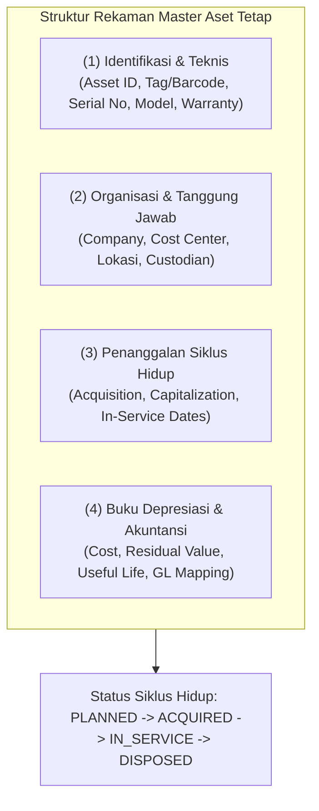
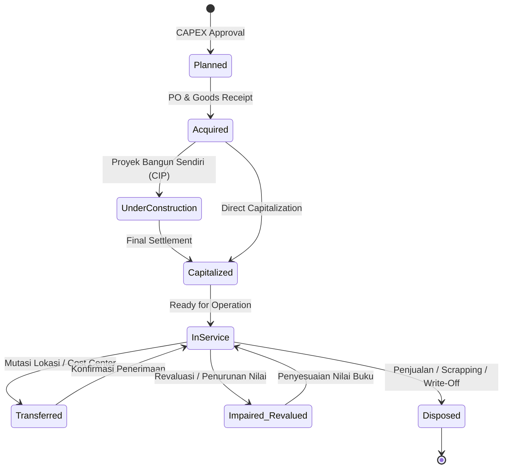
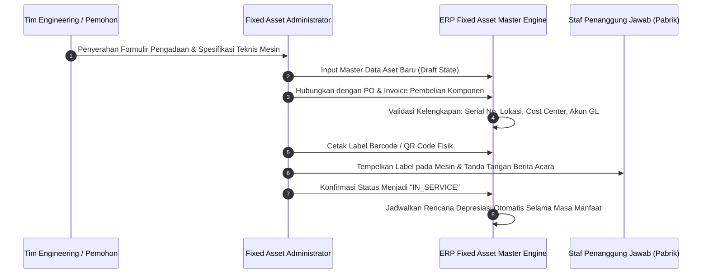

# Asset Master Data

## Definition

**Asset Master Data** dalam ERP adalah entitas data inti terpusat (*Single Source of Truth*) yang memuat seluruh atribut fisik, teknis, organisasional, finansial, dan pemeliharaan dari setiap aset tetap yang dimiliki atau dikuasai oleh perusahaan.

Master data aset bertindak sebagai jembatan yang menghubungkan keberadaan fisik suatu barang di lantai pabrik atau kantor dengan representasi nilainya di buku besar akuntansi (*General Ledger*). Setiap aset tetap individual diidentifikasi melalui nomor identitas unik (*Asset Number / Barcode Tag*) yang menyatukan seluruh riwayat transaksi perolehan, pergerakan lokasi, jadwal depresiasi, penugasan penanggung jawab (*custodian*), hingga pelepasan aset.

---

## Purpose

1. **Visibilitas Fisik dan Akuntabilitas Hukum**: Mengidentifikasi secara presisi lokasi fisik aset, departemen pengguna, dan staf penanggung jawab (*custodian*) yang ditugaskan mengoperasikan aset.
2. **Standardisasi Parameter Perhitungan Depresiasi**: Memastikan masa manfaat (*useful life*), nilai residu, dan metode penyusutan diterapkan secara konsisten sesuai kebijakan kelas aset (*Asset Class*).
3. **Pemisahan Dimensi Data Finansial dan Operasional**: Mengizinkan tim operasional memperbarui informasi teknis dan lokasi tanpa mengubah parameter pembukuan akuntansi yang terkunci.
4. **Pondasi Manajemen Komponen (*Componentization*)**: Memungkinkan hubungan induk-anak (*Parent-Child Hierarchy*) di mana aset induk (misal: Gedung atau Lini Produksi) memiliki beberapa sub-aset dengan jadwal depresiasi independen.
5. **Jejak Audit Forensik (*Asset Traceability*)**: Merekam seluruh riwayat perubahan spesifikasi, pemindahan ruangan, dan pergantian penanggung jawab sepanjang masa hidup aset.

---

## Dimensi Struktur Data Master Aset

Dalam ERP enterprise, data master aset dikelompokkan ke dalam empat segmen data yang saling terkoordinasi:

### 1. Segmen Identifikasi & Teknis (Physical & Technical Data)
- **Asset Number & Sub-Number**: Kode identifikasi numerik unik (misal: `400120-0` untuk aset utama, `400120-1` untuk sub-komponen).
- **Physical Tag / Barcode / RFID Code**: Nomor label fisik yang ditempel pada bodi aset untuk verifikasi *stock opname* aktiva.
- **Deskripsi & Spesifikasi Mesin**: Nama resmi aset, merek pabrikan (*manufacturer*), tipe/model, dan nomor seri pabrik (*serial number*).
- **Garansi & Pemeliharaan**: Tanggal kedaluwarsa garansi, vendor penyedia servis, dan nomor kontak teknis darurat.

### 2. Segmen Organisasi & Tanggung Jawab (Organizational & Custody Data)
- **Legal Entity / Company Code**: Badan hukum pemilik sah aset.
- **Plant / Branch / Fasilitas**: Pabrik atau kantor cabang tempat aset ditempatkan.
- **Physical Location**: Lokasi spesifik hingga tingkat gedung, lantai, dan nomor ruangan (misal: `Gedung-A / Lantai-2 / Ruang-Perakitan-01`).
- **Cost Center (Pusat Biaya)**: Unit kerja yang menanggung beban penyusutan bulanan aset tersebut (misal: `CC-PROD-01`).
- **Asset Custodian / Responsible Employee**: Karyawan yang secara formal menandatangani berita acara serah terima aset (*custody agreement*).

### 3. Segmen Penanggalan Siklus Hidup (Lifecycle Dates)
Pembedaan tanggal merupakan aspek tata kelola krusial dalam ERP:
- **Acquisition Date**: Tanggal fisik barang diterima di gudang atau tanggal penerbitan PO.
- **Capitalization Date**: Tanggal pengakuan nilai aset secara resmi ke dalam neraca aktiva tetap.
- **In-Service Date**: Tanggal aset mulai siap digunakan secara operasional (titik awal dimulainya pembebanan penyusutan).
- **De-recognition / Disposal Date**: Tanggal aset resmi dijual, dihapusbukukan, atau dimusnahkan.

### 4. Segmen Akuntansi & Buku Depresiasi (Financial & Valuation Books)
- **Asset Class / Category**: Kelompok aset yang menentukan pemetaan akun GL otomatis.
- **Acquisition Value**: Biaya historis perolehan aset yang dikapitalisasi.
- **Depreciation Books**: Konfigurasi parameter depresiasi per buku:
  - *Commercial Book*: Garis lurus, 5 tahun, nilai residu Rp20.000.000.
  - *Tax Book*: Saldo menurun / garis lurus golongan 2 pajak, 8 tahun, nilai residu Rp0.

---

## Siklus Hidup Status Aset (Asset Lifecycle States)

ERP mengendalikan status aset melalui mesin status terprogram:

---

## Business Process

---

## Business Rules

1. **Unique Tagging Rule**: Setiap aset tetap berwujud wajib memiliki nomor tag fisik unik (*Barcode/RFID*) yang tidak boleh digunakan ulang (*reused*), bahkan setelah aset tersebut dihapusbukukan (*retired*).
2. **Mandatory Custodian & Cost Center Assignment**: Master aset dilarang diubah statusnya menjadi *In-Service* jika kolom *Asset Custodian* (penanggung jawab karyawan) dan *Cost Center* (pusat biaya beban penyusutan) masih kosong.
3. **Immutability of Historical Master Logs**: Perubahan pada data master kritis (seperti masa manfaat, nilai residu, metode depresiasi, atau nomor seri mesin) wajib menghasilkan rekaman riwayat audit (*audit log snapshot*) yang mencatat identitas pengubah, stempel waktu, alasan perubahan, dan nilai sebelum perubahan.
4. **Independent Physical vs Accounting Updates**: Pembaruan lokasi fisik atau nama staf penanggung jawab di master data aset dilarang memicu mutasi jurnal buku besar akuntansi, kecuali pemindahan tersebut melibatkan perubahan unit bisnis atau *Cost Center*.
5. **Parent-Child Hierarchy Constraint**: Sebuah sub-aset (*child asset*) tidak dapat diaktifkan atau dihapusbukukan secara terpisah jika kebijakan kelas aset menetapkan bahwa aset tersebut merupakan komponen integral yang terikat penuh pada aset induk (*parent asset*).

---

## Accounting & Financial Impact

Master data aset mengatur pemetaan otomatis ke akun buku besar umum (*General Ledger*) melalui mekanisme **Account Determination**:

| Field Master Aset | Akun GL yang Dipengaruhi | Fungsi Pembukuan Akuntansi |
| :--- | :--- | :--- |
| **Asset Balance Account** | `151100 - Machinery & Equipment` | Menampung harga perolehan historis aset di neraca |
| **Accumulated Depreciation Account** | `151190 - Accumulated Depr - Machinery` | Menampung akumulasi kontra penyusutan di neraca |
| **Depreciation Expense Account** | `610400 - Depreciation Expense - Machinery` | Menampung beban penyusutan bulanan di laporan laba rugi |
| **CIP / Clearing Account** | `159100 - Construction in Progress / Clearing` | Menampung biaya sementara sebelum kapitalisasi final |
| **Disposal Gain/Loss Account** | `710100 - Gain/Loss on Sale of Fixed Assets` | Menampung selisih laba/rugi saat aset dilepas |

*(Untuk rincian entri jurnal penyesuaian dan aturan penyajian neraca, rujuk ke [[02-accounting/fixed-asset-accounting|Fixed Asset Accounting di Phase 3]]).*

---

## Example: Rekaman Master Data Mesin Perakitan di PT Maju Bersama

Berikut adalah rincian rekaman master data untuk mesin perakitan yang baru dioperasikan oleh PT Maju Bersama:

| Parameter Master Data | Nilai Data di ERP | Deskripsi & Validasi Bisnis |
| :--- | :--- | :--- |
| **Nomor Aset Utama** | `AST-MAC-2026-0001` | Identifikasi unik aset dalam subledger aktiva tetap |
| **Nomor Tag Fisik** | `TAG-MB-88019` | Barcode label tahan panas yang ditempel di rangka mesin |
| **Nama Aset** | Mesin Perakitan Otomatis Laptop Pro | Nama deskriptif untuk pelaporan manajerial |
| **Kelas Aset (*Asset Class*)** | `MACHINERY_PROD` | Kategori mesin pabrik (Penyusutan garis lurus 5 tahun) |
| **Merek & Model** | TechAuto SMT-Pro 400 | Spesifikasi pabrikan untuk kebutuhan suku cadang |
| **Nomor Seri Pabrikan** | `SN-TA-998231-ID` | Nomor seri sasis pabrik untuk klaim garansi vendor |
| **Perusahaan Pemilik** | PT Maju Bersama (IDR) | Entitas hukum pemilik sah aset |
| **Pusat Biaya (*Cost Center*)** | `CC-PROD-01` (Divisi Perakitan) | Departemen yang menanggung beban penyusutan bulanan |
| **Lokasi Fisik** | Cikarang Plant / Hall B / Line 2 | Lokasi fisik presisi untuk tim verifikasi aset |
| **Penanggung Jawab (*Custodian*)** | Budi Santoso (NIP: `EMP-0412`) | Kepala Lini Perakitan yang bertanggung jawab atas fisik mesin |
| **Tanggal Perolehan** | 10 Maret 2026 | Tanggal kedatangan fisik mesin di area pabrik |
| **Tanggal Kapitalisasi** | 15 Maret 2026 | Tanggal penyelesaian kalibrasi & pengakuan di neraca |
| **Tanggal Mulai Pakai (*In-Service*)** | 01 April 2026 | Titik awal dimulainya beban penyusutan operasional |
| **Biaya Perolehan (*Cost*)** | Rp120.000.000 | Biaya beli + ongkos kirim + biaya instalasi spesialis |
| **Nilai Residu (*Residual Value*)** | Rp20.000.000 | Taksiran harga jual sisa besi tua di akhir tahun ke-5 |
| **Masa Manfaat (*Useful Life*)** | 5 Tahun (60 Bulan) | Masa pakai ekonomis terencana sesuai rekomendasi teknis |
| **Status Siklus Hidup** | `IN_SERVICE` | Mesin beroperasi normal dan disusutkan rutin |

---

## ERP Implementation

Perbandingan struktur dan pengelolaan master data aset tetap lintas software ERP terkemuka:

| Parameter Master Data | Odoo Enterprise | ERPNext | Microsoft Dynamics 365 | SAP S/4HANA Finance |
| :--- | :--- | :--- | :--- | :--- |
| **Struktur Nomor Aset** | Record tunggal model `account.asset` | Doctype terpusat `Asset` dengan penomoran otomatis | *Fixed asset number* dengan dukungan *Asset book* ganda | Struktur *Main Asset Number* (12 digit) + *Asset Sub-number* (4 digit) |
| **Pemisahan Data Fisik & Finansial** | Menyatu dalam satu form tampilan accounting | Menyatu dalam tab dokumen master aset | Terpisah antara *Asset record* dan *Value models / Books* | Terpisah antara *General Data*, *Time-dependent Data*, dan *Depreciation Areas* |
| **Dukungan Barcode / QR Tag** | Memerlukan modul custom atau field teks manual | Field bawaan *Barcode* terintegrasi ke scanner | Fitur native *Barcode field* pada aset tetap | Terintegrasi dengan modul *PM (Plant Maintenance)* & barcode scanner |
| **Hierarki Induk-Anak (Component)** | Memerlukan kustom parent field | Didukung via field *Composite Asset* | Fitur native *Parent/Child assets relationship* | Sangat kuat via sistem *Asset Sub-number* (`0000` s.d. `9999`) |

---

## Naventra Consideration

Rancangan arsitektur data master aset tetap pada Naventra ERP:

1. **Entity-Component-Value Architecture**: Naventra membagi data aset menjadi tiga tabel relasional normal:
   - `asset_core`: Menyimpan identitas legal, nama, kelas aset, dan status siklus hidup.
   - `asset_physical`: Menyimpan lokasi fisik, geolokasi, penanggung jawab (*custodian*), nomor seri sasis, dan tanggal garansi.
   - `asset_valuation_book`: Menyimpan parameter buku komersial dan fiskal, harga perolehan, estimasi residu, dan masa manfaat secara multi-baris.
2. **Strict Change Control with Approval Workflow**: Modifikasi pada atribut finansial (seperti perubahan masa manfaat atau nilai sisa) memerlukan tiket persetujuan (*Change Request*) yang disahkan oleh Financial Controller sebelum diterapkan pada jadwal penyusutan aktif.
3. **Immutable Audit Trail on Custody Movement**: Setiap kali field *Custodian* atau *Location* diperbarui, Naventra secara otomatis menyisipkan rekaman ke tabel `asset_custody_history` lengkap dengan stempel waktu dan ID dokumen mutasi pendukung.

---

## References

- International Accounting Standards Board (IASB). *IAS 16: Property, Plant and Equipment*. IFRS Foundation.
- SAP SE. *Master Data in Asset Accounting (FI-AA)*. SAP Help Portal.
- Microsoft Corporation. *Set up fixed asset master data in Dynamics 365 Finance*. Microsoft Learn.
- Frappe Technologies. *Managing Asset Master Data in ERPNext*. ERPNext Documentation.
- Odoo S.A. *Asset Models and Master Records*. Odoo Documentation.
