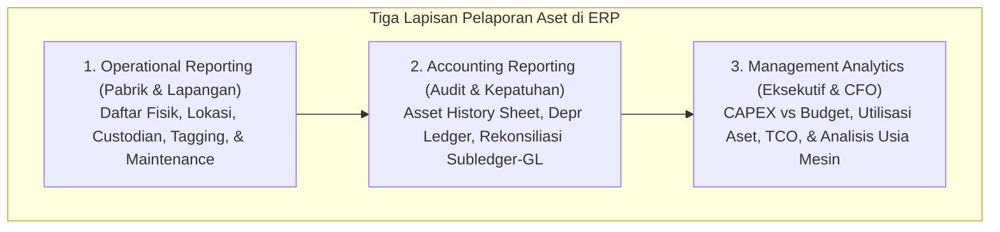
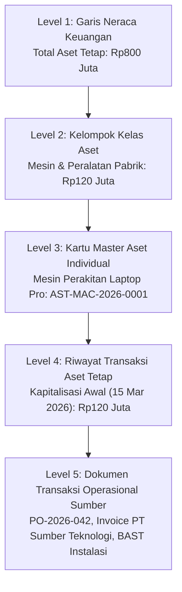

# Asset Reporting & Analytics

## Definition

**Asset Reporting & Analytics** dalam sistem ERP adalah subsistem pelaporan, visualisasi dasbor, dan intelijen bisnis yang mengolah data dari buku pembantu aktiva tetap (*Fixed Asset Subledger*), riwayat mutasi fisik, dan log pemeliharaan menjadi laporan operasional, laporan kepatuhan akuntansi (*statutory compliance*), serta analisis strategis bagi manajemen eksekutif.

Di bawah standar akuntansi **IAS 16 paragraf 73**, perusahaan diwajibkan menyajikan rekonsiliasi nilai tercatat aktiva tetap pada awal dan akhir periode fiskal—yang dikenal sebagai **Tabel Mutasi Aset Tetap (*Asset History Sheet / PPE Roll-Forward Schedule*)**. ERP mengotomatisasi penyusunan laporan ini sekaligus menyediakan kemampuan penelusuran mendalam (*drill-down*) dari saldo ringkasan di neraca langsung ke dokumen sumber perolehan atau pelepasan fisik di lapangan.



---

## Purpose

1. **Pemenuhan Kewajiban Pengungkapan Statutori (*IAS 16 Disclosure*)**: Menghasilkan tabel mutasi aktiva tetap resmi untuk Catatan Atas Laporan Keuangan (CALK) yang mencakup saldo awal, penambahan, revaluasi, pelepasan, penurunan nilai, penyusutan, dan saldo akhir.
2. **Jaminan Rekonsiliasi Subledger dengan General Ledger**: Membuktikan secara matematis bahwa total saldo seluruh aset individual di buku pembantu aktiva sama persis ($100\%$ rekonsiliasi) dengan saldo akun kontrol aktiva tetap di neraca buku besar umum.
3. **Pengawasan Penyerapan Anggaran Modal (*CAPEX Budget Tracking*)**: Memantau realisasi belanja modal dibandingkan pagu anggaran yang telah disetujui pada modul [[07-finance/budget-management|Finance (Phase 8)]].
4. **Optimalisasi Produktivitas Aset (*Asset Utilization & Idle Asset Detection*)**: Mengidentifikasi mesin atau kendaraan yang tidak produktif (*underutilized/idle*) agar dapat direalokasi atau dijual.
5. **Dukungan Perencanaan Penggantian (*Asset Replacement Planning*)**: Memberikan analisis penuaan aset (*Asset Aging*) guna mengantisipasi kebutuhan pendanaan belanja modal di masa depan.

---

## Tiga Sudut Pandang Pelaporan Aset Tetap

### 1. Pelaporan Operasional & Lapangan (Operational View)
Digunakan oleh manajer pabrik, kepala gudang, dan tim fasilitas kantor:
- **Master Asset Register Listing**: Daftar seluruh aset terdaftar lengkap dengan nomor tag barcode, nomor seri pabrik, lokasi ruangan, dan nama karyawan penanggung jawab (*custodian*).
- **Physical Verification Discrepancy Report**: Laporan selisih hasil *stock opname* aktiva yang menyoroti aset hilang (*ghost assets*), aset salah lokasi, dan aset temuan belum tercatat.
- **Warranty & Insurance Expiry Report**: Laporan masa berlaku garansi vendor dan polis asuransi mesin yang mendekati tanggal jatuh tempo.

### 2. Pelaporan Akuntansi & Audit (Accounting & Statutory View)
Digunakan oleh Financial Controller dan auditor eksternal:
- **Asset History Sheet (Tabel Mutasi PPE)**: Matriks mutasi formal per kelas aset sepanjang tahun buku.
- **Depreciation Journal & Schedule Report**: Rincian beban penyusutan historis dan proyeksi penyusutan bulanan per pusat biaya (*Cost Center*).
- **Tax vs Commercial Depreciation Bridge**: Kertas kerja rekonsiliasi selisih penyusutan komersial vs penyusutan fiskal untuk lampiran SPT Tahunan Badan.

### 3. Pelaporan Manajerial & Analisis Strategis (Executive View)
Digunakan oleh Direktur Operasional dan Chief Financial Officer (CFO):
- **CAPEX Realization vs Budget Dashboard**: Analisis varian komitmen dan realisasi belanja modal per direktorat.
- **Return on Assets (ROA) by Business Unit**: Mengukur seberapa efisien laba operasional dihasilkan dari modal aset tetap yang ditempatkan di masing-masing pabrik.
- **Total Cost of Ownership (TCO) & Maintenance Drag**: Mengidentifikasi mesin tua yang beban perawatannya sudah tidak efisien secara ekonomis.

---

## Struktur Tabel Mutasi Aset Tetap (Asset History Sheet / Roll-Forward)

Sesuai standar **IAS 16.73**, tabel mutasi aset tetap membedakan mutasi nilai perolehan kotor dan akumulasi penyusutan secara horizontal:

```text
+ Saldo Awal Biaya Perolehan (Gross Cost at Beginning)
+ Penambahan Belanja Modal Baru (Additions / CAPEX)
+ Kenaikan / Penurunan Revaluasi (Revaluation Adjustments)
- Pengurangan Akibat Pelepasan / Penjualan (Disposals / Retirements)
- Penghapusan Buku Aset Hilang (Write-Offs)
= Saldo Akhir Biaya Perolehan (Gross Cost at Ending)
-------------------------------------------------------------
- Saldo Awal Akumulasi Penyusutan (Acc. Depr at Beginning)
- Beban Penyusutan Tahun Berjalan (Depreciation Expense)
+ Akumulasi Penyusutan Aset yang Dilepas (Derecognized Depr)
- Akumulasi Rugi Penurunan Nilai (Impairment Losses)
= Saldo Akhir Akumulasi Penyusutan (Acc. Depr at Ending)
=============================================================
= NILAI BUKU BERSIH AKHIR PERIODE (NET BOOK VALUE AT ENDING)
```

---

## Kemampuan Penelusuran Bertingkat (Drill-Down Hierarchy)

Arsitektur analitik ERP modern memungkinkan penelusuran balik dari angka ringkas di neraca hingga ke dokumen fisik transaksi asal:



---

## Business Rules

1. **Zero Discrepancy Mandate**: Laporan rekonsiliasi antara total nilai buku bersih pada *Fixed Asset Subledger* dengan saldo akun kontrol di *General Ledger* wajib bernilai selisih nol (Rp0) pada saat penutupan periode fiskal.
2. **Multi-Book Independent Generation**: Sistem wajib mampu mengekstrak laporan mutasi aset secara terpisah untuk Buku Komersial (*IFRS/PSAK*) dan Buku Perpajakan (*Tax Book*) tanpa saling mencampuradukkan angka penyusutan dan nilai residu.
3. **Role-Based Financial Redaction**: Staf operasional pabrik yang mengakses laporan aset register fisik dilarang melihat angka harga perolehan, margin laba pelepasan, atau nilai buku komersial yang bersifat rahasia manajerial (*field-level security*).
4. **Immutability of Closed Period Snapshots**: Laporan mutasi aset resmi yang telah diaudit dan disahkan untuk penutupan akhir tahun fiskal wajib dibekukan (*frozen snapshot*) sehingga tidak dapat terpengaruh oleh transaksi koreksi di tahun buku baru.
5. **Traceability to Source Documents**: Setiap baris mutasi pada laporan aset tetap wajib memiliki tautan digital langsung (*hyperlink / lineage pointer*) ke nomor dokumen transaksi sumber yang mendasarinya.

---

## Accounting & Financial Impact

Laporan mutasi aset tetap merupakan dasar penyusunan **Catatan atas Laporan Keuangan (CALK)** bagian Aset Tetap. Ketidakakuratan dalam laporan ini dapat memicu temuan audit material dari auditor eksternal.

---

## Example: Tabel Mutasi Aset Tetap PT Maju Bersama (Tahun Fiskal 2026)

Berikut adalah ringkasan Laporan Mutasi Aset Tetap (*Asset History Sheet*) PT Maju Bersama untuk periode yang berakhir pada 31 Desember 2026 (dalam Rupiah):

| Elemen Mutasi Aset Tetap | Tanah (Land) | Bangunan (Buildings) | Mesin Pabrik (Machinery) | Peralatan IT & Kantor | Total PPE (IDR) |
| :--- | :--- | :--- | :--- | :--- | :--- |
| **Harga Perolehan Awal (01 Jan 2026)** | 300.000.000 | 250.000.000 | 180.000.000 | 50.000.000 | **780.000.000** |
| Penambahan Baru Tahun 2026 (CAPEX) | 0 | 0 | 120.000.000 | 30.000.000 | **150.000.000** |
| Pengurangan / Pelepasan Aset (Disposal) | 0 | 0 | 0 | (10.000.000) | **(10.000.000)** |
| **Harga Perolehan Akhir (31 Des 2026)** | **300.000.000** | **250.000.000** | **300.000.000** | **70.000.000** | **920.000.000** |
| | | | | | |
| **Akumulasi Penyusutan Awal** | 0 | (50.000.000) | (72.000.000) | (30.000.000) | **(152.000.000)** |
| Beban Penyusutan Tahun Berjalan | 0 | (12.500.000) | (39.000.000) | (16.000.000) | **(67.500.000)** |
| Akumulasi Depresiasi Aset Dilepas | 0 | 0 | 0 | 8.000.000 | **8.000.000** |
| **Akumulasi Penyusutan Akhir** | **0** | **(62.500.000)** | **(111.000.000)** | **(38.000.000)** | **(211.500.000)** |
| | | | | | |
| **NILAI BUKU BERSIH (31 Des 2026)** | **300.000.000** | **187.500.000** | **189.000.000** | **32.000.000** | **708.500.000** |

*(Catatan: Penambahan Mesin Pabrik mencakup Mesin Perakitan Laptop Pro Rp120.000.000 dengan penyusutan 9 bulan berjalan di tahun 2026 sebesar Rp15.000.000).*

---

## ERP Implementation

Perbandingan kapabilitas pelaporan dan analitik aset tetap lintas sistem ERP:

| Fitur Pelaporan Aset | Odoo Enterprise | ERPNext | Microsoft Dynamics 365 | SAP S/4HANA Finance |
| :--- | :--- | :--- | :--- | :--- |
| **Laporan Mutasi Aset (Roll-Forward)** | Modul *Spreadsheet Asset Report* kustom | Laporan bawaan *Asset Depreciations & Balances* | Laporan resmi *Fixed asset roll forward / Roll forward by parent* | Laporan legendaris *Asset History Sheet (Anlagengitter / S_ALR_87011990)* |
| **Rekonsiliasi Subledger ke GL** | Filter akun neraca vs total nilai tercatat | Laporan *Asset Ledger* dicocokkan ke *General Ledger* | Laporan rekonsiliasi *Fixed asset ledger reconciliation* | Transaksi terdedikasi *Reconciliation of Asset Accounting with GL (ABST2)* |
| **Proyeksi Depresiasi Masa Depan** | Tampilan grafis jadwal depresiasi analitik | Laporan *Asset Depreciation Forecast* | Laporan *Depreciation forecast report* per buku | Transaksi analitik *Depreciation Forecast (S_ALR_87011974 / Fiori)* |
| **Pelaporan Pajak vs Komersial** | Filter manual jurnal fiskal | Laporan multi *Finance Book* berdampingan | Pelaporan perbandingan antar *Depreciation books* | Laporan perbandingan *Comparison of Depreciation Areas (S_ALR_87011979)* |

---

## Naventra Consideration

Rancangan arsitektur modul Asset Reporting & Analytics pada Naventra ERP:

1. **Real-Time Materialized Roll-Forward Cube**: Naventra memelihara tabel agregasi terindeks `asset_rollforward_summary` yang diperbarui secara otomatis saat transaksi perolehan, penyusutan bulanan, revaluasi, atau pelepasan terjadi. Hal ini memungkinkan Laporan Mutasi Aset (Asset History Sheet) dibuka seketika tanpa perlu memindai jutaan baris jurnal historis.
2. **Automated Subledger-to-GL Health Checker**: Sistem menjalankan daemon validasi harian yang membandingkan saldo subledger aset dengan saldo akun neraca GL. Jika terdeteksi selisih sekecil apa pun, sistem memicu peringatan kritis (*Integrity Breached Alert*) ke dashboard CFO.
3. **Interactive Executive Asset Cockpit**: Naventra menyediakan dasbor visual interaktif yang menyajikan metrik TCO, rasio utilisasi mesin, persentase penyerapan anggaran CAPEX, dan grafik penuaan aset (*Asset Aging Pyramid*) dengan kemampuan *drill-down* langsung hingga ke foto fisik aset di lantai pabrik.

---

## References

- International Accounting Standards Board (IASB). *IAS 16: Property, Plant and Equipment (Paragraph 73: Disclosures)*. IFRS Foundation.
- SAP SE. *Asset History Sheet and Asset Reporting in SAP S/4HANA Finance*. SAP Help Portal.
- Microsoft Corporation. *Fixed asset inquiry and reporting options in Dynamics 365 Finance*. Microsoft Learn.
- Frappe Technologies. *Asset Reports in ERPNext*. ERPNext Documentation.
- Ikatan Akuntan Indonesia (IAI). *PSAK 16: Pengungkapan Aset Tetap dalam Catatan Atas Laporan Keuangan*.
