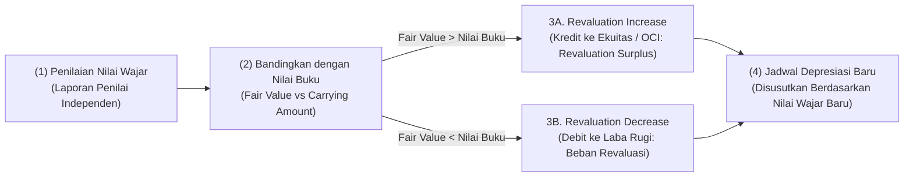
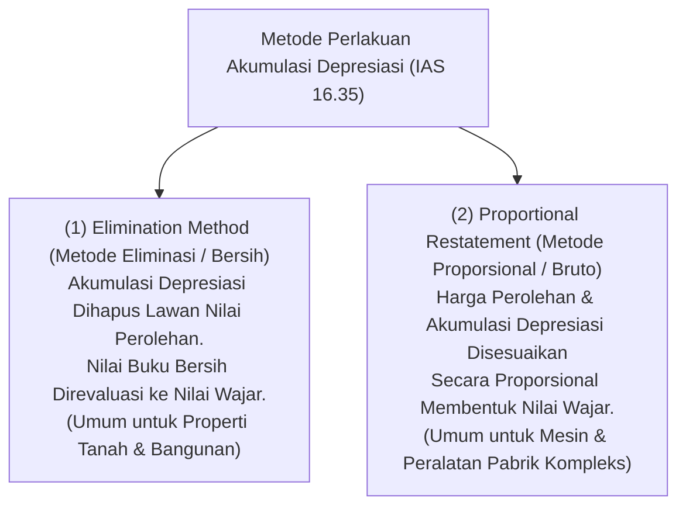

# Asset Revaluation

## Definition

**Asset Revaluation (Revaluasi / Penilaian Kembali Aset Tetap)** dalam sistem ERP adalah pembaruan nilai tercatat (*carrying amount*) suatu aset tetap ke **Nilai Wajar (*Fair Value*)** terkininya pada tanggal penilaian, dikurangi akumulasi penyusutan dan akumulasi rugi penurunan nilai yang terjadi setelah tanggal revaluasi.

Di bawah standar akuntansi internasional **IAS 16 paragraf 31 s.d. 42**, entitas diberikan pilihan kebijakan akuntansi (*accounting policy choice*) untuk mengukur aset tetap setelah pengakuan awal menggunakan salah satu dari dua model:
1. **Model Biaya Historis (Cost Model)**: Aset dicatat sebesar harga perolehan dikurangi akumulasi penyusutan dan akumulasi rugi penurunan nilai. (Model default yang paling umum diterapkan).
2. **Model Revaluasi (Revaluation Model)**: Aset dicatat sebesar nilai wajar pada tanggal revaluasi dikurangi penyusutan dan penurunan nilai berikutnya.

> [!important]
> **Revaluasi aset bukanlah prosedur rutin tahunan yang wajib dilakukan oleh seluruh perusahaan.** Revaluasi adalah kebijakan akuntansi formal yang memerlukan pengawasan ketat, jasa penilai independen (*certified independent appraiser*), serta memiliki implikasi pajak dan ekuitas yang sangat spesifik.

---

## Purpose

1. **Penyajian Nilai Riil di Neraca (*True Balance Sheet Representation*)**: Mengoreksi distorsi nilai historis aset jangka panjang (terutama tanah dan bangunan pabrik) yang nilainya telah meningkat secara signifikan akibat inflasi atau perkembangan wilayah.
2. **Penguatan Struktur Permodalan (*Equity Enhancement*)**: Meningkatkan nilai ekuitas perusahaan melalui pembentukan pos *Surplus Revaluasi*, yang dapat memperkuat rasio solvabilitas (*Debt-to-Equity Ratio*) untuk kebutuhan negosiasi fasilitas kredit bank.
3. **Penyelarasan Beban Depresiasi dengan Biaya Penggantian (*Replacement Cost Matching*)**: Membebankan biaya penyusutan masa depan yang mencerminkan nilai ekonomis aset saat ini.
4. **Kepatuhan Pajak Revaluasi Khusus**: Memfasilitasi penghitungan dasar penyusutan fiskal baru jika perusahaan mengikuti program revaluasi aktiva tetap sesuai regulasi Kementerian Keuangan.
5. **Pencegahan Cherry-Picking**: Menerapkan aturan konsistensi kelas aset agar manajemen tidak hanya merevaluasi aset yang nilainya naik sambil menyembunyikan aset yang nilainya turun.

---

## Aturan Konsistensi Kelas Aset (Class Consistency Rule)

Sesuai **IAS 16 paragraf 36**, jika suatu aset tetap dalam suatu kelompok direvaluasi, maka **seluruh aset tetap dalam kelas yang sama wajib direvaluasi secara simultan**:

$$\text{Jika 1 Mesin Pabrik Direvaluasi} \implies \text{Seluruh Mesin Pabrik dalam Kelas Tersebut Wajib Direvaluasi}$$

Aturan ini ditegakkan di dalam ERP untuk mencegah praktik manipulasi pelaporan keuangan (*cherry-picking*), yaitu tindakan sengaja hanya menilai kembali aset-aset yang nilainya melonjak demi mempercantik neraca, sementara aset sejenis yang nilainya jatuh tetap dibiarkan pada biaya historis.

---

## Dua Metode Teknis Pencatatan Depresiasi Saat Revaluasi

Standar **IAS 16 paragraf 35** menyediakan dua metode teknis perlakuan akumulasi penyusutan saat revaluasi dieksekusi di dalam ERP:

---

## Alur Akuntansi Kenaikan dan Penurunan Revaluasi

Perlakuan akuntansi revaluasi mengikuti prinsip asimetris:

### 1. Kenaikan Revaluasi (Revaluation Surplus)
- Dikreditkan ke **Penghasilan Komprehensif Lain (*Other Comprehensive Income - OCI*)** dan diakumulasikan dalam ekuitas di bawah judul **Surplus Revaluasi (*Revaluation Surplus*)**.
- **Pengecualian**: Jika kenaikan tersebut membalikkan (*reverses*) rugi penurunan revaluasi atas aset yang sama yang sebelumnya pernah diakui di Laporan Laba Rugi, maka kenaikan tersebut diakui di **Laba Rugi** sebesar batas nilai kerugian masa lalu tersebut.

### 2. Penurunan Revaluasi (Revaluation Deficit)
- Diakui secara langsung sebagai beban di **Laporan Laba Rugi**.
- **Pengecualian**: Jika sebelumnya aset tersebut memiliki saldo Surplus Revaluasi di ekuitas, maka penurunan didebitkan terlebih dahulu ke **OCI** untuk menghabiskan saldo surplus yang ada sebelum sisanya dibebankan ke Laba Rugi.

### 3. Pemindahan Surplus Revaluasi ke Saldo Laba (Retained Earnings)
Surplus revaluasi di ekuitas dapat dipindahkan secara bertahap langsung ke **Saldo Laba (*Retained Earnings*)** tanpa melalui Laba Rugi seiring aset digunakan:

$$\text{Transfer Bulanan} = \text{Beban Depresiasi Nilai Revaluasi} - \text{Beban Depresiasi Biaya Historis}$$

---

## Business Rules

1. **Entire Class Revaluation Mandate**: Modul ERP wajib memvalidasi bahwa eksekusi revaluasi diterapkan pada seluruh anggota kelas aset terkait dalam periode yang sama untuk mematuhi IAS 16.36.
2. **Certified Appraisal Report Requirement**: Transaksi revaluasi dilarang di-posting tanpa menyertakan nomor dokumen rujukan laporan penilai publik independen (*Certified Appraisal Report Number*) dan tanggal efektif penilaian.
3. **No Dividend Distribution from Revaluation Surplus**: Saldo akun *Revaluation Surplus* di ekuitas dikunci secara sistemik sehingga tidak dapat ditarik atau dialokasikan sebagai dividen kas bagi pemegang saham, karena merupakan keuntungan yang belum terealisasi (*unrealized gain*).
4. **Independent Accounting vs Fiscal Revaluation**: Revaluasi akuntansi komersial tidak otomatis mengubah nilai perolehan fiskal (buku pajak), kecuali perusahaan secara formal memperoleh persetujuan revaluasi aktiva tetap dari Direktorat Jenderal Pajak (DJP) dan membayar Pajak Penghasilan Final terkait.
5. **Post-Revaluation Depreciation Schedule Regeneration**: Setelah revaluasi disahkan, ERP wajib secara otomatis membatalkan seluruh jadwal penyusutan masa depan yang lama dan menyusun ulang jadwal penyusutan baru berdasarkan nilai tercatat yang baru (*new carrying amount*) dan sisa masa manfaat.

---

## Accounting & Financial Impact

### 1. Kenaikan Revaluasi dengan Metode Eliminasi (Net Method)
Aset Mesin Pabrik memiliki Harga Perolehan Rp120.000.000 dan Akumulasi Penyusutan Rp40.000.000 (Nilai Buku Rp80.000.000). Nilai wajar hasil penilaian independen adalah Rp105.000.000 (Terjadi kenaikan surplus Rp25.000.000):

**Langkah A — Mengeliminasi Akumulasi Penyusutan:**
| Akun | Debit (IDR) | Kredit (IDR) | Keterangan |
| :--- | :--- | :--- | :--- |
| `153090 - Akumulasi Penyusutan Mesin` | 40.000.000 | - | Menghapus saldo akumulasi penyusutan |
| `153000 - Mesin & Peralatan Pabrik` | - | 40.000.000 | Menyesuaikan harga perolehan ke nilai buku |

**Langkah B — Menyesuaikan Nilai Buku ke Nilai Wajar:**
| Akun | Debit (IDR) | Kredit (IDR) | Keterangan |
| :--- | :--- | :--- | :--- |
| `153000 - Mesin & Peralatan Pabrik` | 25.000.000 | - | Menambah nilai mesin menjadi Rp105.000.000 |
| `310400 - Ekuitas: Surplus Revaluasi Aset` | - | 25.000.000 | Diakui di OCI / Ekuitas |

*(Untuk rincian akuntansi perpajakan revaluasi dan penyesuaian pajak tangguhan IAS 12, rujuk ke [[02-accounting/fixed-asset-accounting|Fixed Asset Accounting di Phase 3]]).*

---

## Example: Revaluasi Mesin Perakitan di PT Maju Bersama

Pada 31 Desember 2028 (akhir Tahun ke-3 operasional), PT Maju Bersama merevaluasi kelompok Mesin Pabrik untuk memperkuat struktur ekuitas perusahaan:

1. **Posisi Buku Sebelum Revaluasi**:
   - Biaya Perolehan Historis: Rp120.000.000.
   - Akumulasi Penyusutan (3 tahun @ Rp20.000.000): Rp60.000.000.
   - Nilai Buku Bersih (*Carrying Amount*): **Rp60.000.000**.
   - Sisa Masa Manfaat: **2 Tahun (24 Bulan)**; Nilai Residu: **Rp0** (disesuaikan).

2. **Hasil Penilaian Penilai Publik Independen**:
   - Nilai Wajar Mesin (*Fair Value*): **Rp80.000.000**.
   - Terjadi kenaikan nilai wajar di atas nilai buku tercatat sebesar:
     $$\text{Surplus Revaluasi} = \text{Rp80.000.000} - \text{Rp60.000.000} = \mathbf{Rp20.000.000}$$

3. **Pembaruan Depresiasi Masa Depan di ERP**:
   - Nilai dasar baru yang disusutkan untuk Tahun ke-4 dan ke-5: Rp80.000.000.
   - Beban Penyusutan Baru: $\text{Rp80.000.000} / 2 = \mathbf{Rp40.000.000 \text{ per tahun}}$ ($\text{Rp3.333.333 per bulan}$).
   - Peningkatan beban tahunan: Rp40.000.000 - Rp20.000.000 (lama) = Rp20.000.000.
   - Transfer tahunan dari Surplus Revaluasi ke Saldo Laba: **Rp20.000.000 per tahun** (menyeimbangkan dampak penurunan laba bersih akibat kenaikan beban depresiasi).

---

## ERP Implementation

Perbandingan fungsional modul revaluasi aset tetap pada berbagai platform ERP:

| Fitur Revaluasi | Odoo Enterprise | ERPNext | Microsoft Dynamics 365 | SAP S/4HANA Finance |
| :--- | :--- | :--- | :--- | :--- |
| **Model Kebijakan Revaluasi** | Opsi manual modify asset value pada form | Dokumen transaksi terdedikasi *Asset Value Adjustment* | Transaksi *Fixed asset revaluation / Write-up adjustment* | Transaksi terdedikasi *Revaluation and New Valuation (AR01 / AR29N)* |
| **Pemisahan Surplus ke Ekuitas (OCI)** | Memerlukan pemilihan akun ekuitas manual | Akun penampung dapat diarahkan ke *Revaluation Surplus* | Konfigurasi *Posting profile revaluation reserve* | Mendukung otomatisasi area depresiasi khusus revaluasi (*Area 01 vs Area 80*) |
| **Dukungan Metode Eliminasi & Proporsional** | Default penyesuaian bersih (*Net*) | Default penyesuaian nilai buku bersih | Konfigurasi fleksibel pada *Depreciation books* | Mendukung penuh kedua metode (*Net vs Gross proportional*) |
| **Transfer Berkala Surplus ke Saldo Laba** | Jurnal manual penutupan tahunan | Memerlukan entri jurnal manual berkala | Fitur otomatis *Transfer revaluation reserve to retained earnings* | Otomatisasi transfer via modul *Controlling (CO)* & *Group Reporting* |

---

## Naventra Consideration

Rancangan arsitektur modul Asset Revaluation pada Naventra ERP:

1. **Revaluation Batch Transaction**: Naventra mengeksekusi revaluasi melalui dokumen `asset_revaluation_batch` yang mewajibkan penentuan kode kelas aset dan unggahan berkas audit penilai independen. Seluruh aset aktif dalam kelas tersebut dievaluasi serentak.
2. **Dual-Method Calculation Engine**: Pengguna dapat memilih metode pencatatan (*Elimination Method* vs *Proportional Restatement*). Sistem secara otomatis menghitung faktor pengali proporsional dan menghasilkan baris jurnal balancing ke akun `Revaluation Surplus (OCI)`.
3. **Automated Equity Amortization Hook**: Naventra menyediakan fitur otomatisasi bulanan (*Surplus Amortization Hook*) yang bersamaan dengan eksekusi *Depreciation Run* mendebit akun *Revaluation Surplus* dan mengkredit akun *Retained Earnings* sebesar selisih penyusutan revaluasi vs historis.

---

## References

- International Accounting Standards Board (IASB). *IAS 16: Property, Plant and Equipment (Paragraphs 31–42: Revaluation Model)*. IFRS Foundation.
- International Accounting Standards Board (IASB). *IFRS 13: Fair Value Measurement*. IFRS Foundation.
- SAP SE. *Revaluation and New Valuation of Fixed Assets in SAP S/4HANA*. SAP Help Portal.
- Microsoft Corporation. *Revalue fixed assets in Dynamics 365 Finance*. Microsoft Learn.
- Peraturan Menteri Keuangan (PMK) Republik Indonesia mengenai Penilaian Kembali Aktiva Tetap Perusahaan untuk Tujuan Perpajakan.
