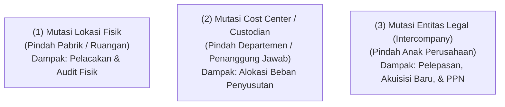
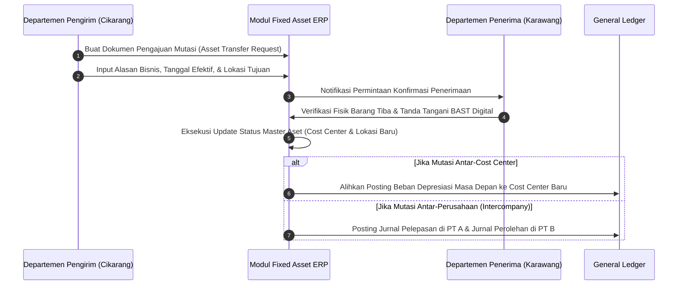

# Asset Transfer & Location Tracking

## Definition

**Asset Transfer (Mutasi / Pengalihan Aset)** dalam arsitektur ERP adalah proses terdokumentasi, terotorisasi, dan terlacak untuk memindahkan atau mengalihkan kepemilikan operasional, penanggung jawab (*custodian*), penempatan fisik (*physical location*), atau entitas legal suatu aset tetap di dalam sistem organisasi.

Aset tetap bukan merupakan entitas statis; sepanjang masa manfaatnya, aset dapat dipindahkan antar-ruangan, dialihkan ke departemen lain, diserahkan ke penanggung jawab baru, atau bahkan dijual/dipindahkan ke anak perusahaan lain dalam grup yang sama. 

ERP memisahkan secara tegas tiga dimensi pengalihan:

1. **Physical Location (Lokasi Fisik)**: Tempat geografis di mana aset secara fisik berada (Gedung, Lantai, Ruang, Koordinat GPS).
2. **Responsible Department / Cost Center (Pusat Biaya)**: Unit organisasi yang memanfaatkan aset dan menanggung beban penyusutan bulanannya.
3. **Legal / Accounting Ownership (Entitas Hukum)**: Perusahaan (*Legal Entity*) yang mencatat aset tersebut di dalam neraca komersial dan buku pajaknya.

---

## Purpose

1. **Integritas Penatausahaan Fisik (*Physical Auditability*)**: Memastikan tim audit internal dapat menemukan keberadaan fisik setiap unit aset secara instan pada saat pelaksanaan *stock opname* aktiva.
2. **Akurasi Pembebanan Biaya Departemen (*Cost Allocation Accuracy*)**: Memastikan beban penyusutan dialokasikan ke pusat biaya (*Cost Center*) yang benar-benar menikmati output aset tersebut pada periode berjalan.
3. **Penegakan Akuntabilitas Personel (*Custody Governance*)**: Menjaga kejelasan tanggung jawab pribadi atas perawatan dan pengamanan aset melalui Berita Acara Serah Terima (BAST).
4. **Tata Kelola Transfer Antar-Perusahaan (*Intercompany Compliance*)**: Mengatur aspek perpajakan (faktur pajak PPN, bea balik nama) dan penentuan harga transfer wajar (*arm's length transfer price*) saat aset dipindahkan antar-anak entitas legal.
5. **Manajemen Status Transit (*In-Transit Tracking*)**: Melacak posisi aset bernilai tinggi yang sedang dalam perjalanan ekspedisi antar-pulau atau antar-cabang guna mencegah kehilangan di jalan.

---

## Jenis-Jenis Mutasi Aset Tetap

### 1. Mutasi Lokasi Fisik Murni (Internal Location Transfer)
Pemindahan fisik aset dari satu lokasi ke lokasi lain di dalam pabrik atau gedung yang sama tanpa mengubah penanggung jawab atau pusat biaya.
- **Dampak Akuntansi**: **Nol (Tidak ada entri jurnal)**. Hanya memperbarui field lokasi pada master data aset fisik.

### 2. Mutasi Departemen / Pusat Biaya (Cost Center Transfer)
Pengalihan wewenang operasional aset dari satu departemen ke departemen lain di dalam entitas hukum yang sama (misal: mesin dipindahkan dari Departemen R&D ke Departemen Perakitan Pabrik).
- **Dampak Akuntansi**: Nilai perolehan dan akumulasi penyusutan di Neraca tidak berubah. Perubahan hanya terjadi pada **alokasi akun beban penyusutan di Laporan Laba Rugi** untuk periode-periode masa depan.

### 3. Mutasi Penanggung Jawab (Custodian Transfer)
Pengalihan tanggung jawab fisik dari satu karyawan ke karyawan lain (misal: karyawan lama mengundurkan diri atau rotasi jabatan).
- **Dampak Akuntansi**: Nol. Sistem mewajibkan penerbitan dokumen digital Berita Acara Serah Terima (BAST).

### 4. Mutasi Antar-Entitas Hukum (Intercompany Asset Transfer)
Pengalihan aset dari Perusahaan A ke Perusahaan B yang berada di bawah satu grup konglomerasi.
- **Dampak Akuntansi & Pajak Sangat Signifikan**: Transaksi ini bukan sekadar ubah data, melainkan diperlakukan sebagai **Pelepasan Aset (*Disposal*) di Perusahaan Pengirim** dan **Perolehan Aset Baru (*Acquisition*) di Perusahaan Penerima**, disertai kewajiban penerbitan Faktur Pajak PPN dan penyesuaian laba/rugi pelepasan.

---

## Business Process

Alur kerja mutasi aset terkoordinasi dalam ERP:

---

## Business Rules

1. **Dual Approval Mandate**: Setiap mutasi aset yang melibatkan perubahan *Cost Center* atau lokasi antar-pabrik wajib disetujui bersama oleh kepala departemen pengirim (*releasing manager*) dan kepala departemen penerima (*receiving manager*).
2. **Depreciation Cut-Off Rule in Transfer Month**: Sistem wajib menerapkan aturan batas penanggalan yang jelas (*prorata rule*) untuk menentukan departemen mana yang menanggung beban penyusutan pada bulan terjadinya mutasi:
   - Jika mutasi terjadi sebelum atau pada tanggal 15, departemen penerima menanggung beban penyusutan bulan tersebut penuh.
   - Jika mutasi terjadi setelah tanggal 15, departemen pengirim menanggung beban penyusutan bulan tersebut, dan departemen penerima baru menanggung mulai bulan berikutnya.
3. **In-Transit Lockout**: Aset yang sedang dalam status pengiriman fisik antar-kota (*IN_TRANSIT*) wajib dibekukan dari transaksi pelepasan (*disposal*) atau perubahan master data hingga dokumen konfirmasi penerimaan (*Receipt Confirmation*) diunggah oleh pihak penerima.
4. **Arm's Length Principle for Intercompany Transfer**: Pengalihan aset tetap antar-entitas legal terafiliasi wajib menggunakan nilai transfer yang wajar (*Fair Market Value*) atau nilai buku bersih (*Net Book Value*) yang disepakati sesuai regulasi *Transfer Pricing* perpajakan yang berlaku.
5. **History Immutability**: Sistem dilarang menghapus riwayat penempatan masa lalu; daftar riwayat mutasi (*Transfer Audit Trail*) wajib bersifat permanen dan memuat histori lengkap seluruh lokasi dan *custodian* terdahulu.

---

## Accounting & Financial Impact

### 1. Mutasi Antar-Pusat Biaya (Intra-Company Cost Center Transfer)
Tidak ada perubahan pada nilai aset di neraca. Pada jadwal penyusutan berikutnya, ERP membelokkan baris akun beban:

| Periode | Akun Beban (Laba Rugi) | Cost Center | Akun Kredit (Neraca) | Nominal (IDR) |
| :--- | :--- | :--- | :--- | :--- |
| **Bulan Lalu** | `610420 - Beban Depr. Mesin` | `CC-PROD-01 (Cikarang)` | `153090 - Akum. Depr. Mesin` | 1.666.667 |
| **Bulan Baru** | `610420 - Beban Depr. Mesin` | `CC-PROD-02 (Karawang)` | `153090 - Akum. Depr. Mesin` | 1.666.667 |

### 2. Mutasi Antar-Entitas Hukum (Intercompany Asset Transfer at NBV)
PT Maju Bersama mengalihkan mesin ke anak perusahaannya (PT Maju Distribusi) pada Nilai Buku Bersih (NBV) Rp80.000.000 (Harga Perolehan Rp120.000.000, Akumulasi Penyusutan Rp40.000.000) ditambah PPN 11%:

**Buku PT Maju Bersama (Pengirim - Derecognition):**
| Akun | Debit (IDR) | Kredit (IDR) | Keterangan |
| :--- | :--- | :--- | :--- |
| `113100 - Piutang Antar-Perusahaan (Intercompany AR)` | 88.800.000 | - | Tagihan ke PT Maju Distribusi |
| `153090 - Akumulasi Penyusutan Mesin` | 40.000.000 | - | Menghapus akumulasi penyusutan lama |
| `153000 - Mesin & Peralatan Pabrik` | - | 120.000.000 | Menghapus nilai historis aset |
| `213100 - PPN Keluaran (Output VAT 11%)` | - | 8.800.000 | Kewajiban faktur pajak transfer aset |

**Buku PT Maju Distribusi (Penerima - New Acquisition):**
| Akun | Debit (IDR) | Kredit (IDR) | Keterangan |
| :--- | :--- | :--- | :--- |
| `153000 - Mesin & Peralatan Pabrik` | 80.000.000 | - | Nilai perolehan baru di neraca |
| `114100 - PPN Masukan (Input VAT 11%)` | 8.800.000 | - | Pajak masukan yang dapat dikreditkan |
| `211800 - Utang Antar-Perusahaan (Intercompany AP)` | - | 88.800.000 | Kewajiban ke entitas induk |

---

## Example: Mutasi Mesin Perakitan di PT Maju Bersama

Pada tanggal 15 Juli 2027 (Tahun ke-2 operasional), manajemen PT Maju Bersama memutuskan merelokasi **Mesin Perakitan Laptop Pro** (`AST-MAC-2026-0001`):

1. **Kondisi Sebelum Mutasi**:
   - Lokasi: Pabrik Cikarang / Hall B / Line 2.
   - Pusat Biaya: `CC-PROD-01` (Lini Perakitan Cikarang).
   - Penanggung Jawab: Budi Santoso (NIP: `EMP-0412`).
   - Nilai Perolehan: Rp120.000.000; Akumulasi Penyusutan: Rp30.000.000; Nilai Buku: Rp90.000.000.

2. **Pengajuan & Eksekusi Mutasi**:
   - Manajer Produksi membuat tiket `TRF-AST-2027-042` memindahkan mesin ke **Pabrik Karawang / Gedung C**.
   - Pusat Biaya Baru: `CC-PROD-02` (Lini Perakitan Karawang).
   - Penanggung Jawab Baru: Agus Hermawan (NIP: `EMP-0588`).
   - Mesin diangkut pada 16 Juli dan tiba di Karawang pada 17 Juli 2027.
   - Agus Hermawan memindai barcode mesin via aplikasi mobile ERP dan menandatangani BAST digital.

3. **Penerapan Aturan Penyusutan**:
   - Sesuai aturan batas tanggal 15 (*Cut-off Rule*), mutasi disetujui pada tanggal 15 Juli. Beban penyusutan bulan Juli 2027 sebesar Rp1.666.667 dibebankan penuh ke pusat biaya baru `CC-PROD-02 (Karawang)`.

---

## ERP Implementation

Perbandingan kapabilitas pengelolaan mutasi dan pelacakan lokasi aset lintas platform ERP:

| Parameter Mutasi | Odoo Enterprise | ERPNext | Microsoft Dynamics 365 | SAP S/4HANA Finance |
| :--- | :--- | :--- | :--- | :--- |
| **Pembaruan Lokasi Fisik** | Update field teks lokasi pada record aset | Dokumen *Asset Movement* (pindah lokasi/custodian) | Update field *Location* pada master aset tetap | Update segmen *Time-dependent data* (historis terjaga otomatis) |
| **Mutasi Antar-Cost Center** | Ubah analytic distribution pada baris depresiasi | Dokumen *Asset Movement* dengan ubah Cost Center | Jurnal *Fixed asset reclassification* atau ganti dimension | Perubahan langsung *Cost Center* dengan interval waktu validitas |
| **Transfer Antar-Perusahaan (Intercompany)** | Jurnal manual antar-database perusahaan | Memerlukan pembatalan dan pembuatan manual | Fitur native *Intercompany fixed asset transfer* | Transaksi terdedikasi *Intercompany Asset Transfer (ABT1N)* |
| **Status Barang Dalam Perjalanan (In-Transit)** | Memerlukan modul inventaris kustom | Status transit pada dokumen *Asset Movement* | Integrasi dengan modul *Inventory transfer orders* | Integrasi modul *Materials Management (MM)* dengan status transit |

---

## Naventra Consideration

Rancangan arsitektur Asset Transfer pada Naventra ERP:

1. **Transactional Asset Movement Document**: Naventra tidak mengizinkan pengubahan langsung field lokasi atau penanggung jawab pada layar master data. Seluruh mutasi wajib melalui dokumen transaksi `asset_transfer_order` yang mencatat alasan bisnis, pengirim, penerima, dan tanda tangan digital BAST.
2. **Time-Slice Interval Engine**: Tabel master aset Naventra memelihara tabel relasional berdimensi waktu `asset_assignments` (`cost_center_id`, `custodian_id`, `valid_from`, `valid_to`). Saat mutasi terjadi, sistem otomatis menutup tanggal interval lama (*closes the time slice*) dan membuka interval baru tanpa menghapus jejak histori.
3. **Automated Intercompany Mirroring**: Saat transfer antar-perusahaan disahkan, modul Naventra mengeksekusi *Dual-Ledger Posting Engine* yang secara atomik memposting jurnal pelepasan di entitas pengirim dan jurnal perolehan di entitas penerima secara tersinkronisasi.

---

## References

- International Accounting Standards Board (IASB). *IAS 16: Property, Plant and Equipment*. IFRS Foundation.
- International Accounting Standards Board (IASB). *IFRS 10: Consolidated Financial Statements*. IFRS Foundation.
- SAP SE. *Asset Transfers (Intercompany and Intracompany) in SAP S/4HANA*. SAP Help Portal.
- Microsoft Corporation. *Transfer fixed assets in Dynamics 365 Finance*. Microsoft Learn.
- Frappe Technologies. *Asset Movement in ERPNext*. ERPNext Documentation.
