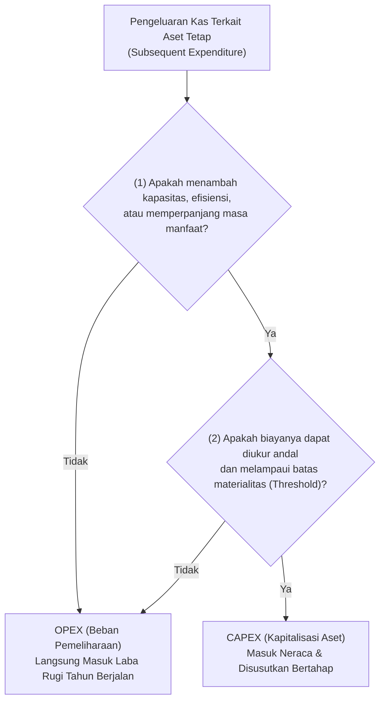
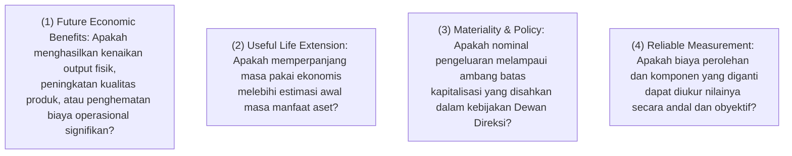
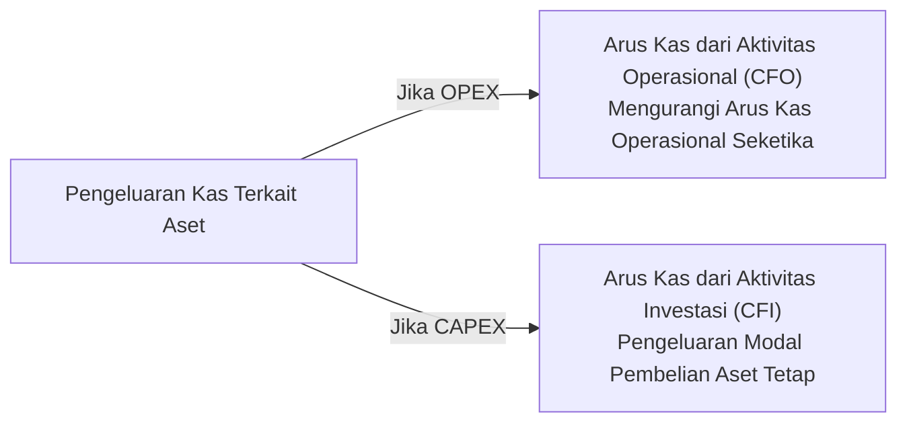

# CAPEX vs OPEX in Asset Lifecycle

## Definition

Dalam tata kelola aset ERP, pembedaan antara **Capital Expenditure (CAPEX / Belanja Modal)** dan **Operating Expenditure (OPEX / Beban Operasional)** adalah salah satu keputusan bisnis dan akuntansi paling mendasar yang menentukan apakah suatu pengeluaran kas dicatat sebagai **Aset di Neraca (*Balance Sheet*)** atau diakui seketika sebagai **Beban di Laporan Laba Rugi (*Profit & Loss*)**.

Pembedaan ini tidak hanya krusial pada saat perolehan awal (*initial recognition*), melainkan menjadi tantangan tata kelola harian sepanjang masa pakai aset ketika terjadi pengeluaran-pengeluaran lanjutan (*subsequent expenditures*)—seperti perbaikan kerusakan, penggantian suku cadang, servis berkala, modifikasi mesin, atau perombakan besar-besaran (*overhaul*).

---

## Purpose

1. **Integritas Pelaporan Laba Bersih (*Earnings Integrity*)**: Mencegah manipulasi pelaporan keuangan—seperti mengkapitalisasi biaya operasional rutin demi memperbesar laba jangka pendek (*aggressive capitalization*) atau membebankan belanja modal besar seketika demi mengecilkan laba kena pajak.
2. **Kepatuhan Standar Akuntansi Internasional (*IAS 16 Compliance*)**: Menerapkan kriteria pengakuan yang ketat sesuai **IAS 16 paragraf 12 s.d. 14** mengenai pengeluaran pemeliharaan harian vs penggantian komponen utama.
3. **Penyelarasan Penganggaran Korporat**: Memisahkan alokasi pagu anggaran belanja modal (*CAPEX Budget*) yang diawasi oleh komite investasi dari anggaran operasional departemen (*OPEX Budget*) yang dibahas pada [[07-finance/budget-management|Budget Management]].
4. **Optimalisasi Arus Kas Pajak (*Tax Cash Flow Planning*)**: Memaksimalkan pengurang penghasilan bruto yang sah sesuai undang-undang perpajakan tanpa melanggar regulasi amortisasi fiskal.
5. **Keteraturan Rantai Pasok Pengadaan**: Mengarahkan staf pembelian untuk memilih jenis formulir pemesanan yang tepat sejak inisiasi *Purchase Requisition* di modul [[04-purchasing/purchase-requisition|Purchasing (P2P)]].

---

## Kerangka Keputusan Konseptual (Conceptual Decision Framework)

Tidak ada satu angka nominal baku universal di dunia yang secara mutlak memisahkan CAPEX dan OPEX. Klasifikasi ditentukan oleh evaluasi atas empat pertanyaan kunci:

Jika seluruh uji di atas terpenuhi, pengeluaran **dapat dikapitalisasi sebagai CAPEX**. Jika salah satu kriteria gagal (misalnya sekadar mengembalikan mesin ke kondisi kerja normalnya), pengeluaran **wajib diakui sebagai beban pemeliharaan rutin (OPEX)**.

---

## Klasifikasi Pengeluaran Lanjutan Sepanjang Masa Pakai Aset

| Kategori Pengeluaran | Karakteristik Operasional | Contoh Kasus Nyata | Perlakuan ERP |
| :--- | :--- | :--- | :--- |
| **Pemeliharaan & Servis Rutin (*Routine Maintenance*)** | Pengeluaran berulang untuk menjaga aset tetap berfungsi normal; tidak menambah kapasitas atau masa manfaat. | Penggantian pelumas oli mesin, pembersihan filter udara, kalibrasi sensor bulanan. | **OPEX**: Dibukukan ke akun beban `Repairs & Maintenance Expense` di Cost Center terkait. |
| **Perbaikan Kerusakan (*Repairs*)** | Mengembalikan fungsi aset yang rusak akibat kecelakaan atau aus normal ke standar kinerja semula. | Memperbaiki kabel motor yang terbakar atau mengganti sabuk konveyor yang putus. | **OPEX**: Langsung dibebankan pada periode terjadinya kerusakan. |
| **Peningkatan & Modifikasi (*Betterment / Enhancement*)** | Modifikasi fisik atau penambahan teknologi yang meningkatkan kapasitas produksi atau efisiensi secara nyata. | Memasang unit lengan robot ganda berkecepatan tinggi yang menaikkan kapasitas perakitan sebesar 40%. | **CAPEX**: Ditambahkan ke nilai buku aset induk (*Asset Addition*) atau dicatat sebagai sub-komponen baru. |
| **Penggantian Komponen Utama (*Major Replacement*)** | Mengganti bagian penting aset yang memiliki masa pakai independen (**IAS 16.13**). | Mengganti mesin turbin utama atau unit *SMT placement head* perakitan laptop. | **CAPEX & Derecognition**: Komponen baru dikapitalisasi; sisa nilai buku komponen lama dihapusbukukan. |
| **Inspeksi Besar Berkala (*Major Overhauls / Turnaround*)** | Pemeriksaan keselamatan wajib berkala berskala masif yang menjadi syarat legal operasi (**IAS 16.14**). | Uji kelayakan bejana tekan industri, *overhaul* turbin pembangkit listrik setiap 4 tahun. | **CAPEX**: Dikapitalisasi sebagai komponen inspeksi dan disusutkan hingga jadwal inspeksi besar berikutnya. |

---

## Dampak Terhadap Laporan Arus Kas (Cash Flow Impact)

Pembedaan CAPEX dan OPEX memiliki dampak langsung pada penyajian Laporan Arus Kas (**IAS 7**):

- **CAPEX**: Dicatat pada **Aktivitas Investasi (*Cash Flow from Investing Activities*)**. Arus kas operasional tetap tinggi, dan beban diakui bertahap di masa depan melalui penyusutan non-kas.
- **OPEX**: Dicatat pada **Aktivitas Operasional (*Cash Flow from Operating Activities*)**. Secara langsung menekan kas bersih operasional dan laba bersih periode berjalan.

---

## Business Rules

1. **Prohibition of Routine Maintenance Capitalization**: Biaya bahan habis pakai (*consumables*), pelumas, dan tenaga kerja untuk servis pemeliharaan preventif harian/bulanan dilarang keras dikapitalisasi ke dalam nilai aset tetap, berapapun akumulasi nilainya.
2. **Mandatory Derecognition of Replaced Carrying Amount**: Ketika suatu pengeluaran penggantian komponen dikapitalisasi sebagai CAPEX, sistem wajib memastikan bahwa sisa nilai buku tercatat dari komponen lama yang digantikan telah dihapusbukukan (*derecognized*) dari neraca.
3. **Threshold Gatekeeping at Requisition**: Sistem pengadaan (*Procurement Engine*) wajib menerapkan validasi otomatis: jika formulir *Purchase Requisition* diajukan sebagai CAPEX namun nominalnya di bawah batas *Capitalization Threshold* kebijakan perusahaan, sistem wajib menolak atau mengalihkan jenis dokumen secara otomatis ke PO Beban Operasional (*Expense PO*).
4. **Account Assignment Category Separation**: Baris pesanan pembelian (PO) untuk CAPEX wajib menggunakan kategori penetapan akun khusus aset (misal: *Account Assignment A* pada SAP atau kategori aset tetap pada Odoo/ERPNext) yang mewajibkan input nomor master aset atau nomor proyek investasi (*WBS/Internal Order*).
5. **No Retroactive Classification Shifting**: Perubahan status transaksi dari OPEX menjadi CAPEX (atau sebaliknya) setelah periode penutupan buku bulanan selesai dilarang dilakukan tanpa persetujuan formal Financial Controller dan bukti berita acara peninjauan teknis.

---

## Accounting & Financial Impact

### 1. Pembukuan Pemeliharaan Rutin (OPEX)
Biaya servis dan penggantian pelumas mesin perakitan sebesar Rp3.500.000:

| Akun | Debit (IDR) | Kredit (IDR) | Keterangan |
| :--- | :--- | :--- | :--- |
| `610450 - Beban Pemeliharaan & Perbaikan Mesin` | 3.500.000 | - | Beban operasional Laba Rugi pada Cost Center `CC-PROD-01` |
| `211100 - Accounts Payable / Kas Bank` | - | 3.500.000 | Pembayaran jasa servis ke vendor pemeliharaan |

### 2. Pembukuan Peningkatan Kapasitas Mesin (CAPEX)
Pemasangan modul *Dual-Feeder Feeder Upgrade* seharga Rp25.000.000 yang meningkatkan kapasitas harian mesin sebesar 40%:

| Akun | Debit (IDR) | Kredit (IDR) | Keterangan |
| :--- | :--- | :--- | :--- |
| `153000 - Mesin & Peralatan Pabrik` | 25.000.000 | - | Menambah nilai tercatat mesin di Neraca |
| `211100 - Accounts Payable` | - | 25.000.000 | Kewajiban ke vendor upgrade mesin |

---

## Example: Penanganan Dua Peristiwa Pemeliharaan di PT Maju Bersama

Pada Tahun ke-2 pengoperasian **Mesin Perakitan Laptop Pro** (`AST-MAC-2026-0001`), PT Maju Bersama menghadapi dua transaksi pengeluaran teknis:

### Peristiwa 1 (Bulan Mei 2027) — Servis Sensor & Kalibrasi Presisi
- **Uraian**: Teknisi vendor PT Sumber Teknologi melakukan pembersihan lensa sensor, penggantian oli hidrolik, dan kalibrasi akurasi lengan robot.
- **Biaya**: Rp3.500.000.
- **Evaluasi Sistem**:
  - Apakah menambah kapasitas produksi? Tidak (hanya menjaga akurasi standar).
  - Apakah memperpanjang umur ekonomis? Tidak.
  - Apakah memenuhi threshold CAPEX (Rp10.000.000)? Tidak.
- **Keputusan ERP**: Diklasifikasikan sebagai **OPEX**. Sistem menerbitkan Expense PO yang dibebankan langsung ke akun `610450` pada Cost Center `CC-PROD-01`.

### Peristiwa 2 (Bulan September 2027) — Pemasangan Unit Feeder Berkecepatan Tinggi
- **Uraian**: Pembelian dan pemasangan unit *Dual-Arm High-Speed Feeder* baru untuk mempercepat pemasangan memori dan prosesor pada motherboard laptop.
- **Biaya**: Rp25.000.000.
- **Evaluasi Sistem**:
  - Apakah menambah kapasitas produksi? Ya (kapasitas perakitan naik dari 100 unit/hari menjadi 140 unit/hari).
  - Apakah melampaui threshold CAPEX (Rp10.000.000)? Ya (Rp25.000.000 $>$ Rp10.000.000).
- **Keputusan ERP**: Diklasifikasikan sebagai **CAPEX**. Sistem membuat sub-aset baru `AST-MAC-2026-0001.02` senilai Rp25.000.000 dengan masa manfaat 3 tahun, yang disusutkan secara independen sebesar Rp8.333.333 per tahun.

---

## ERP Implementation

Perbandingan tata kelola pemisahan CAPEX dan OPEX lintas sistem ERP:

| Fitur Tata Kelola | Odoo Enterprise | ERPNext | Microsoft Dynamics 365 | SAP S/4HANA Finance |
| :--- | :--- | :--- | :--- | :--- |
| **Pembedaan di Tingkat PO** | Pengaturan tipe produk (*Consumable/Service* vs terhubung ke *Asset Model*) | Pilihan centang *Is Fixed Asset* pada baris item PO | Kategori pengadaan (*Procurement Category*) terhubung ke *Asset rule* | Kategori penentuan akun (*Account Assignment Category A vs K*) |
| **Penegakan Threshold Otomatis** | Memerlukan kustom alur kerja validasi nilai | Memerlukan script validasi *DocPerm / Server Script* | Fitur *Capitalization threshold rules* per kelompok aset | Fitur *Capitalization Limit Rules* pada master kelas aset |
| **Penambahan Nilai Buku Aset (Subsequent)** | Tombol *Modify Depreciation / Re-evaluate* | Dokumen *Asset Repair* dengan opsi *Capitalize Repair Cost* | Jurnal *Fixed asset acquisition / Write-up* pada aset eksisting | Transaksi *Subsequent Acquisition (ABZON / F-90)* ke nomor aset yang sama |
| **Integrasi Anggaran CAPEX vs OPEX** | Modul budget analitik dengan pemisahan akun | Dokumen master *Budget* dengan filter tipe akun biaya/aset | *Budget control framework* membedakan budget register CAPEX vs OPEX | Modul *Investment Management (IM)* terpisah dari *Cost Center Accounting (CO-OM)* |

---

## Naventra Consideration

Rancangan arsitektur pemisahan CAPEX dan OPEX pada Naventra ERP:

1. **Intelligent Requisition Routing Wizard**: Saat staf teknis membuat permintaan pengadaan (*Purchase Requisition*) terkait aset, Naventra menyajikan *Decision Tree Wizard* interaktif yang menanyakan tujuan teknis pengeluaran (apakah servis berkala atau peningkatan kapasitas). Sistem secara otomatis merekomendasikan kode akun dan rute alur persetujuan yang sesuai.
2. **Automated Threshold Validation Hook**: Naventra memeriksa nilai pengeluaran terhadap batas `capitalization_threshold` pada kelas aset terkait secara *real-time*. Pengajuan CAPEX di bawah batas ambang akan ditandai dengan peringatan (*Warning Flag*) dan memerlukan dispensasi tertulis Financial Controller.
3. **Seamless Asset Addition Ledger**: Ketika tagihan peningkatan aset disetujui, Naventra memposting penambahan nilai ke tabel `asset_value_adjustments` yang secara atomik merevisi dasar penyusutan aset induk tanpa perlu membuat ulang data master dari awal.

---

## References

- International Accounting Standards Board (IASB). *IAS 16: Property, Plant and Equipment (Paragraphs 12–14: Subsequent Costs)*. IFRS Foundation.
- International Accounting Standards Board (IASB). *IAS 7: Statement of Cash Flows*. IFRS Foundation.
- SAP SE. *Subsequent Costs and Maintenance in SAP S/4HANA Asset Accounting*. SAP Help Portal.
- Microsoft Corporation. *Capitalize fixed asset acquisitions and subsequent costs in Dynamics 365*. Microsoft Learn.
- Chartered Institute of Management Accountants (CIMA). *CAPEX vs OPEX Management and Governance*.
