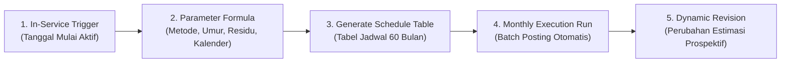
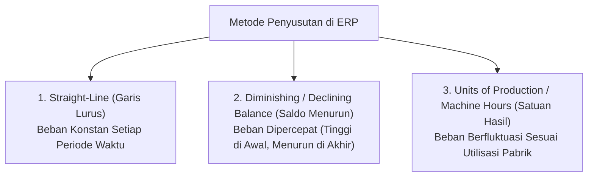

# Depreciation Schedule & Management

## Definition

**Depreciation Management** dalam sistem ERP adalah mesin komputasi dan tata kelola operasional yang mengatur alokasi sistematis atas jumlah tersusutkan (*depreciable amount*) dari suatu aset tetap sepanjang estimasi masa manfaatnya (*useful life*).

Berbeda dengan perspektif akuntansi murni yang telah dibahas pada [[02-accounting/depreciation-and-amortization|Depreciation & Amortization di Phase 3]] (yang berfokus pada konsep dasar debit/kredit beban penyusutan dan penyajian di laporan keuangan), **Depreciation Management di Phase 9 berfokus pada arsitektur jadwal penyusutan (*Depreciation Schedules*), konvensi periode parsial (*Depreciation Conventions*), tata kelola multi-buku (*Multi-Book Depreciation*), eksekusi proses berkala (*Depreciation Run*), serta penyesuaian prospektif saat terjadi perubahan estimasi (*Change in Accounting Estimate*)**.

---

## Purpose

1. **Otomatisasi Beban Periodik Skala Besar**: Menghitung dan memposting beban penyusutan ribuan aset tetap secara massal setiap akhir bulan (*Depreciation Run*) tanpa intervensi manual.
2. **Kepatuhan Multi-Yurisdiksi (*Multi-Book Support*)**: Menghasilkan jadwal penyusutan paralel antara buku komersial (*IFRS/PSAK*) dan buku perpajakan (*Tax Book UU PPh*) yang memiliki masa manfaat dan metode berbeda.
3. **Presisi Alokasi Waktu Parsial (*Prorated Convention*)**: Menghitung penyusutan secara proporsional untuk aset yang diperoleh atau dilepas di pertengahan bulan atau pertengahan tahun fiskal.
4. **Penanganan Perubahan Estimasi Sesuai Standar (*IAS 8 Compliance*)**: Mengakomodasi perpanjangan masa manfaat atau revisi nilai sisa secara prospektif tanpa mengubah angka historis masa lalu.
5. **Simulasi Dampak Arus Biaya Masa Depan**: Menyediakan laporan peramalan penyusutan (*Depreciation Forecast*) untuk kebutuhan penganggaran beban operasional (*OPEX Budgeting*) pada modul Finance.

---

## Parameter Utama Mesin Depresiasi ERP

Mesin komputasi depresiasi ERP digerakkan oleh kombinasi parameter berikut:

1. **Depreciation Start Date (Tanggal Mulai Penyusutan)**: Tanggal aset mulai beroperasi secara efektif (*In-Service Date*), bukan tanggal penerbitan PO atau kedatangan barang di gudang.
2. **Depreciable Base (Dasar Penyusutan)**: Nilai perolehan yang dapat disusutkan, dihitung sebagai:
   $$\text{Depreciable Base} = \text{Acquisition Cost} - \text{Residual Value}$$
3. **Residual / Scrap Value (Nilai Residu)**: Taksiran nilai realisasi bersih aset pada akhir masa manfaatnya. Jika aset ditargetkan habis terpakai tanpa nilai jual kembali, nilai residu bernilai nol (0).
4. **Useful Life (Masa Manfaat)**: Dinyatakan dalam satuan waktu (Tahun atau Bulan) atau satuan operasional non-waktu (Jumlah Jam Kerja Mesin atau Kapasitas Unit Output yang Dihasilkan).
5. **Depreciation Book (Buku Penyusutan)**: Wadah pembukuan terpisah:
   - **Buku Komersial (Corporate Book)**: Menghasilkan jurnal riil ke General Ledger.
   - **Buku Fiskal (Tax Book)**: Menghasilkan nilai penyusutan pajak untuk kertas kerja rekonsiliasi SPT Tahunan (tidak memposting jurnal ke neraca komersial).
   - **Buku Biaya Internal (Cost Accounting Book)**: Digunakan untuk alokasi biaya internal pabrik berbasis biaya penggantian (*replacement cost*).

---

## Metode Penyusutan Standar dalam ERP

ERP enterprise mendukung tiga metode komputasi utama:

### 1. Metode Garis Lurus (Straight-Line Method)
Metode paling umum di mana beban penyusutan dibagi rata secara konstan sepanjang masa manfaat aset:

$$\text{Annual Depreciation} = \frac{\text{Acquisition Cost} - \text{Residual Value}}{\text{Useful Life (Years)}}$$

### 2. Metode Saldo Menurun Ganda (Double Declining Balance Method)
Metode penyusutan dipercepat (*accelerated depreciation*) di mana persentase tarif tetap (umumnya dua kali lipat tarif garis lurus) diterapkan pada **Nilai Buku Bersih (Net Book Value)** awal periode, tanpa mengurangkan nilai residu pada perhitungan awal:

$$\text{Depreciation Rate} = \frac{2}{\text{Useful Life (Years)}}$$

$$\text{Period Depreciation} = \text{Net Book Value}_{\text{start}} \times \text{Depreciation Rate}$$

*(Catatan: Penyusutan dihentikan seketika saat nilai buku mencapai estimasi nilai residu).*

### 3. Metode Satuan Hasil Produksi (Units of Production / Usage-Based)
Metode di mana beban penyusutan dihubungkan langsung dengan tingkat output fisik atau jam kerja mesin yang ditarik dari modul [[06-manufacturing/shop-floor-execution|Manufacturing (Phase 7)]]:

$$\text{Depreciation per Unit} = \frac{\text{Acquisition Cost} - \text{Residual Value}}{\text{Total Estimated Production Capacity}}$$

$$\text{Period Depreciation} = \text{Actual Units Produced in Month} \times \text{Depreciation per Unit}$$

---

## Konvensi Periode Parsial (Depreciation Conventions)

Ketika aset diperoleh pada tanggal berjalan (bukan tanggal 1 Januari atau tanggal 1 awal bulan), ERP menerapkan konvensi perhitungan prorata:

| Konvensi Penyusutan | Logika Aturan Sistem | Contoh Kasus (Beli Tanggal 18 Maret) |
| :--- | :--- | :--- |
| **Actual Days (Prorata Harian)** | Menghitung jumlah hari kalender aset aktif dibagi total hari dalam bulan tersebut. | Mesin aktif 14 hari di bulan Maret; menyusutkan $\frac{14}{31}$ dari beban bulanan. |
| **Full Month (Bulan Penuh)** | Jika aset aktif pada hari apa pun dalam bulan tersebut, disusutkan penuh satu bulan. | Mesin disusutkan penuh 1 bulan di bulan Maret. |
| **Mid-Month (Tengah Bulan)** | Jika aktif tanggal 1 s.d. 15, disusutkan penuh; jika tanggal 16 ke atas, penyusutan dimulai bulan berikutnya. | Mesin aktif 18 Maret $\rightarrow$ penyusutan baru dihitung mulai 1 April. |
| **Half-Year Convention** | Menganggap seluruh perolehan tahun berjalan terjadi di pertengahan tahun (penyusutan 6 bulan di tahun pertama). | Umum digunakan pada pembukuan pajak yurisdiksi tertentu (misal: US GAAP/IRS). |

---

## Penyesuaian Perubahan Estimasi Akuntansi (IAS 8 / Prospective Treatment)

Sesuai **IAS 16 paragraf 51** dan **IAS 8**, masa manfaat dan nilai residu aset wajib ditinjau minimal setiap akhir tahun buku. Jika ekspektasi berbeda dari estimasi sebelumnya, perubahan tersebut diperlakukan sebagai **Perubahan Estimasi Akuntansi secara Prospektif**:
- Angka penyusutan periode masa lalu **dilarang diubah secara retrospektif**.
- Sisa Nilai Buku Bersih (*Net Book Value*) pada tanggal perubahan dikurangi nilai residu baru, kemudian dibagi dengan **sisa masa manfaat baru**:

$$\text{New Periodic Depreciation} = \frac{\text{Carrying Amount on Revision Date} - \text{New Residual Value}}{\text{Remaining Useful Life}}$$

---

## Business Rules

1. **Residual Value Floor Constraint**: Perhitungan beban penyusutan wajib dihentikan secara otomatis oleh sistem ketika Nilai Buku Bersih (*Net Book Value*) telah sama dengan Nilai Residu (*Residual Value*). Aset tidak boleh disusutkan hingga bernilai di bawah nilai residu.
2. **Prospective-Only Adjustment Rule**: Setiap perubahan pada masa manfaat, nilai residu, atau metode depresiasi wajib diterapkan secara prospektif ke masa depan; sistem dilarang membuka atau memposting jurnal koreksi ke periode fiskal yang telah ditutup (*Closed Periods*).
3. **Depreciation Suspension on Disposed / Retired Assets**: Status aset yang dialihkan menjadi *Disposed*, *Scrapped*, atau *Held for Sale (IFRS 5)* wajib secara seketika menghentikan pembentukan beban penyusutan di masa depan.
4. **Idempotent Monthly Batch Run**: Program eksekusi penyusutan bulanan (*Depreciation Run*) wajib bersifat idempoten; jika dijalankan ulang pada periode yang sama, sistem tidak boleh menduplikasi entri jurnal akuntansi.
5. **Mandatory Account Determination**: Eksekusi penyusutan massal akan menolak (*error termination*) jika terdapat satu aset yang akun beban penyusutan atau akumulasi penyusutannya tidak terkonfigurasi pada kelas aset terkait.

---

## Accounting & Financial Impact

Mekanisme jurnal penyusutan bulanan menghubungkan buku pembantu aktiva tetap dengan neraca dan laba rugi. Rincian akuntansi lengkap dibahas pada [[02-accounting/depreciation-and-amortization|Phase 3]].

### Jurnal Penyusutan Bulanan (Monthly Depreciation Run)
Membukukan alokasi beban penyusutan mesin pabrik ke akun pusat biaya produksi:

| Akun | Debit (IDR) | Kredit (IDR) | Keterangan |
| :--- | :--- | :--- | :--- |
| `610420 - Beban Penyusutan Mesin Pabrik` | 1.666.667 | - | Diakui di Laba Rugi pada Cost Center `CC-PROD-01` |
| `153090 - Akumulasi Penyusutan Mesin` | - | 1.666.667 | Akun kontra aset tetap di Neraca |

---

## Example: Siklus Depresiasi Mesin Perakitan di PT Maju Bersama

PT Maju Bersama mengoperasikan **Mesin Perakitan Laptop Pro** dengan data awal:
- **Biaya Perolehan**: Rp120.000.000.
- **Tanggal Mulai Pakai (*In-Service*)**: 01 April 2026.
- **Masa Manfaat Awal**: 5 Tahun (60 Bulan).
- **Nilai Residu**: Rp20.000.000.
- **Dasar Penyusutan**: Rp120.000.000 - Rp20.000.000 = Rp100.000.000.
- **Beban Bulanan Normal**: $\text{Rp100.000.000} / 60 = \mathbf{Rp1.666.667 \text{ per bulan}}$.

### 1. Perhitungan Periode Parsial Tahun Pertama (Tahun 2026)
Karena mesin baru mulai beroperasi pada 01 April 2026 (berjalan 9 bulan di tahun 2026):
- Beban Penyusutan Tahun 2026: $9 \times \text{Rp1.666.667} = \mathbf{Rp15.000.000}$.
- Akumulasi Penyusutan per 31 Desember 2026: **Rp15.000.000**.
- Nilai Buku Bersih (*Net Book Value*) per 31 Desember 2026: Rp120.000.000 - Rp15.000.000 = **Rp105.000.000**.

### 2. Skenario Perubahan Estimasi di Awal Tahun ke-3 (01 Januari 2028)
Setelah beroperasi selama 21 bulan (9 bulan tahun 2026 + 12 bulan tahun 2027):
- Total Akumulasi Penyusutan yang telah dibukukan: $21 \times \text{Rp1.666.667} = \mathbf{Rp35.000.000}$.
- Nilai Buku Bersih per 01 Januari 2028: Rp120.000.000 - Rp35.000.000 = **Rp85.000.000**.
- **Peristiwa**: Berdasarkan evaluasi teknis, mesin dirawat sangat baik sehingga sisa masa manfaat yang semula tersisa 39 bulan diperpanjang menjadi **51 bulan (diperpanjang 12 bulan)**, dan nilai residu diturunkan menjadi **Rp10.000.000**.
- **Kalkulasi Ulang Prospektif di ERP**:
  $$\text{Dasar Tersusutkan Baru} = \text{Rp85.000.000 (NBV)} - \text{Rp10.000.000 (Residu Baru)} = \mathbf{Rp75.000.000}$$
  $$\text{Beban Bulanan Baru} = \frac{\text{Rp75.000.000}}{51 \text{ bulan}} = \mathbf{Rp1.470.588 \text{ per bulan}}$$
- Sistem ERP secara otomatis memperbarui tabel jadwal masa depan tanpa mengubah jurnal masa lalu.

---

## ERP Implementation

Perbandingan kapabilitas mesin penyusutan aset tetap lintas software ERP:

| Parameter Depresiasi | Odoo Enterprise | ERPNext | Microsoft Dynamics 365 | SAP S/4HANA Finance |
| :--- | :--- | :--- | :--- | :--- |
| **Metode Penyusutan Bawaan** | Straight-line, Declining, kombinasi Declining then Straight-line | Straight-line, Double Declining, Manual distribution | Straight line, Reducing balance, Manual, Factor, Consumption | Sangat luas: *Depreciation Keys (SL, DB, Units, Multi-phase)* |
| **Eksekusi Batch Depresiasi** | Tombol *Compute Depreciation* per aset atau cron otomatis | Background job harian otomatis posting *Depreciation Entry* | Fitur *Depreciation proposal* dan *Batch journal posting* | Transaksi terdedikasi *Depreciation Run (AFAB / FAA_DEPRECIATION_POST)* |
| **Konvensi Periode Parsial** | Pengaturan prorata harian berbasis tanggal | Opsi *Prorated Depreciation* berbasis tanggal aktivasi | Pilihan konvensi: *Half year, Full month, Mid quarter, Mid month* | Pengaturan *Period Control Methods* yang sangat terperinci |
| **Perubahan Estimasi Prospektif** | Modifikasi manual baris jadwal depresiasi yang belum terposting | Tombol *Adjust Depreciation* dengan perhitungan ulang otomatis | Fitur *Change depreciation profile* dengan penyesuaian prospektif | Transaksi *Change Asset Master / Recalculate Values (AFAR)* |

---

## Naventra Consideration

Rancangan arsitektur mesin Depreciation Management pada Naventra ERP:

1. **Pre-Computed Schedule Table**: Naventra membentuk tabel terindeks `asset_depreciation_schedules` berisi baris rencana penyusutan untuk setiap bulan sejak hari pertama aset dikapitalisasi. Baris memiliki status `SCHEDULED`, `POSTED`, atau `CANCELLED`.
2. **Idempotent Background Worker**: Eksekusi penyusutan bulanan massal dijalankan oleh pekerja latar belakang (*worker job*). Pekerja mengevaluasi jadwal berstatus `SCHEDULED` yang jatuh tempo pada periode tersebut dan memposting jurnal GL secara atomik. Jika proses gagal di tengah jalan, sistem dapat dilanjutkan kembali tanpa menduplikasi baris yang telah berstatus `POSTED`.
3. **Prospective Recalculation Engine**: Ketika pengguna berwenang menyimpan perubahan masa manfaat atau nilai sisa, mesin Naventra menghapus baris jadwal masa depan yang masih berstatus `SCHEDULED`, menghitung ulang dasar tersusutkan baru dari NBV saat ini, dan menghasilkan baris jadwal baru dalam satu transaksi basis data.

---

## References

- International Accounting Standards Board (IASB). *IAS 16: Property, Plant and Equipment (Depreciation)*. IFRS Foundation.
- International Accounting Standards Board (IASB). *IAS 8: Accounting Policies, Changes in Accounting Estimates and Errors*. IFRS Foundation.
- SAP SE. *Depreciation Execution and Period Control in SAP S/4HANA Asset Accounting*. SAP Help Portal.
- Microsoft Corporation. *Fixed asset depreciation methods and conventions in Dynamics 365 Finance*. Microsoft Learn.
- Frappe Technologies. *Managing Asset Depreciation in ERPNext*. ERPNext Documentation.
