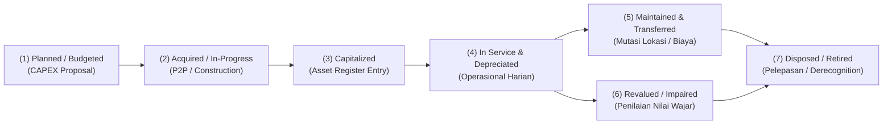
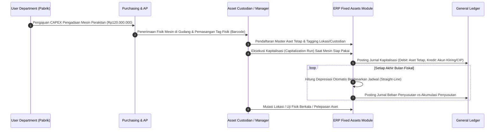

# Fixed Assets Fundamentals

## Definition

**Fixed Assets (Aset Tetap)**—yang dalam standar akuntansi internasional didefinisikan sebagai *Property, Plant, and Equipment (PPE)* di bawah **IAS 16**—adalah aset berwujud (*tangible assets*) yang dimiliki oleh entitas untuk digunakan dalam proses produksi atau penyediaan barang dan jasa, untuk disewakan kepada pihak lain, atau untuk tujuan administratif internal, dan diharapkan untuk digunakan selama **lebih dari satu periode akuntansi (lebih dari 1 tahun)**.

Dalam arsitektur ERP, Fixed Assets Management mengelola **siklus hidup aset fisik secara end-to-end**—mulai dari perencanaan belanja modal (*CAPEX Planning*), penerimaan fisik dan instalasi, aktivasi pembukuan (*Capitalization*), pemeliharaan dan pelacakan lokasi, alokasi penyusutan (*Depreciation Schedule*), evaluasi nilai berkala (*Revaluation & Impairment*), verifikasi fisik (*Physical Count/Tagging*), hingga pelepasan atau pemusnahan (*Disposal/Retirement*).

---

## Purpose

1. **Pengawasan Fisik dan Operasional Aset Jangka Panjang**: Memastikan aset berwujud perusahaan dapat dilacak keberadaan fisiknya, penanggung jawabnya (*custodian*), kondisi operasionalnya, dan riwayat pemeliharaannya sepanjang masa pakai.
2. **Kepatuhan Pencatatan dan Regulasi Multi-Buku (*Multi-Book Compliance*)**: Menyediakan pembukuan terpisah antara buku komersial (*Corporate/Commercial Book* untuk IFRS/PSAK) dan buku fiskal (*Tax/Fiscal Book* untuk kepatuhan perpajakan) yang sering kali memiliki aturan penyusutan dan masa manfaat berbeda.
3. **Penyelarasan Beban dengan Manfaat Ekonomis (*Matching Principle*)**: Mengalokasikan biaya perolehan aset secara sistematis dan rasional ke periode-periode akuntansi yang menikmati manfaat operasional aset tersebut melalui amortisasi penyusutan.
4. **Perencanaan dan Pengendalian Belanja Modal (*CAPEX Discipline*)**: Mengendalikan pengadaan aset bernilai tinggi agar selaras dengan pagu anggaran investasi korporat yang dibahas pada [[07-finance/budget-management|Budget Management]].
5. **Mitigasi Risiko Kehilangan dan Idle Asset**: Mendeteksi aset yang hilang, rusak, atau terbengkalai melalui rekonsiliasi berkala antara data register digital dan audit fisik di lapangan.

---

## Perbedaan Klasifikasi Ekonomi: Inventory vs Fixed Asset vs Expense vs Intangible Asset

Dalam praktiknya di dalam ERP, sering timbul ambiguitas dalam mengklasifikasikan pembelian barang. Klasifikasi ditentukan oleh **tujuan penggunaan (*intended use*)**, **masa manfaat (*useful life*)**, dan **ambang batas kapitalisasi (*capitalization policy*)**:

| Kategori | Definisi & Sifat | Contoh Kasus | Perlakuan ERP |
| :--- | :--- | :--- | :--- |
| **Inventory (Persediaan)** | Aset yang diadakan untuk dijual kembali dalam kegiatan usaha normal atau bahan baku yang dikonsumsi dalam produksi ([[05-inventory/inventory-fundamentals|Phase 6]]). | Unit laptop yang dirakit oleh PT Maju Bersama untuk dijual ke PT Mitra Niaga. | Dicatat di modul Inventory; diakui sebagai COGS saat barang dikirim (*Delivery Order*). |
| **Fixed Asset (Aset Tetap)** | Aset berwujud yang digunakan untuk menunjang kegiatan operasional dan memiliki masa manfaat $> 1$ tahun serta melampaui batas materialitas. | Mesin perakitan komponen laptop atau laptop yang diberikan kepada staf teknik untuk bekerja. | Dikelola di modul Fixed Assets; dikapitalisasi ke neraca dan disusutkan bertahap. |
| **Operating Expense (Beban)** | Pengeluaran barang/jasa yang manfaat ekonomisnya habis seketika atau berada di bawah ambang batas kapitalisasi (*low-value asset*). | Langganan perangkat lunak cloud bulanan (SaaS), pembelian mouse/keyboard, atau ATK kantor. | Langsung dibebankan ke Laporan Laba Rugi pada periode berjalan via modul Purchasing/AP. |
| **Intangible Asset (Aset Tak Berwujud)** | Aset non-moneter yang dapat diidentifikasi tanpa wujud fisik (diatur di bawah **IAS 38**). | Paten desain mesin, lisensi perangkat lunak *perpetual* proprietary, atau hak cipta merek. | Dicatat dalam modul Fixed Assets / Intangibles; diamortisasi (bukan disusutkan). |

### Kasus Khusus Suku Cadang Mesin (Spare Parts & Standby Equipment)
Sesuai **IAS 16 paragraf 8**, suku cadang dan peralatan siap siaga (*standby equipment*) umumnya diklasifikasikan sebagai persediaan (*Inventory*) dan dibebankan saat dikonsumsi. Namun, **suku cadang utama (*major spare parts*)** dan peralatan cadangan yang diperkirakan akan digunakan lebih dari satu periode atau hanya dapat digunakan sehubungan dengan suatu aset tetap tertentu, wajib dikapitalisasi sebagai bagian dari Aset Tetap.

---

## Kebijakan Ambang Batas Kapitalisasi (Capitalization Policy)

Tidak ada nilai nominal baku universal di dunia untuk batas kapitalisasi. Suatu pengeluaran dikapitalisasi sebagai aset tetap jika memenuhi kriteria:
1. Kemungkinan besar (*probable*) bahwa manfaat ekonomis masa depan yang berkaitan dengan aset tersebut akan mengalir ke entitas.
2. Biaya perolehannya dapat diukur secara andal (*reliably measured*).
3. Melampaui **Ambang Batas Materialitas Finansial (*Capitalization Threshold*)** yang ditetapkan dalam kebijakan internal perusahaan.

Faktor-faktor yang menentukan batas kapitalisasi:
- **Skala dan Ukuran Perusahaan**: Perusahaan konglomerasi multinasional dapat menetapkan batas kapitalisasi Rp50.000.000 (barang di bawah angka tersebut langsung dibebankan), sedangkan UMKM dapat menetapkan batas Rp2.000.000.
- **Regulasi Perpajakan Lokal**: Beberapa yurisdiksi mengatur batas pengakuan aset untuk kemudahan administrasi fiskal.
- **Biaya Administrasi Pelacakan vs Manfaat Kontrol**: Mengkapitalisasi kalkulator seharga Rp200.000 akan menimbulkan beban administrasi pelacakan dan depresiasi bulanan yang melampaui nilai ekonomis kontrolnya.

---

## Konsep Kunci dalam Siklus Hidup Aset Tetap

1. **Asset Register (Daftar Aktiva Tetap)**: Basis data induk komprehensif yang memuat seluruh aset individual perusahaan, mencakup nomor tag fisik, spesifikasi teknis, lokasi, penanggung jawab, harga perolehan, dan riwayat penyusutan.
2. **Asset Book (Buku Aset)**: Wadah pencatatan perhitungan penyusutan independen. ERP mendukung *Multi-Book Accounting*:
   - *Corporate Book*: Mengikuti standar pelaporan keuangan komersial (IFRS / PSAK).
   - *Tax Book*: Mengikuti ketentuan undang-undang perpajakan yurisdiksi terkait (misal UU PPh di Indonesia).
3. **Acquisition Cost (Biaya Perolehan)**: Seluruh kas atau setara kas yang dibayarkan untuk memperoleh aset dan membawanya ke lokasi dan kondisi yang siap beroperasi (mencakup harga beli, bea masuk impor, ongkos angkut, dan biaya instalasi/pengetesan).
4. **Useful Life (Masa Manfaat)**: Periode waktu di mana aset diperkirakan dapat digunakan oleh entitas, atau jumlah produksi/unit serupa yang diperkirakan akan dihasilkan oleh aset tersebut.
5. **Residual Value (Nilai Residu/Sisa)**: Estimasi nilai bersih yang akan diperoleh entitas saat ini dari pelepasan aset, setelah dikurangi taksiran biaya pelepasan, jika aset tersebut telah mencapai umur dan kondisi pada akhir masa manfaatnya.
6. **Depreciable Amount (Jumlah Tersusutkan)**: Biaya perolehan aset dikurangi nilai residunya ($\text{Biaya Perolehan} - \text{Nilai Residu}$).
7. **Carrying Amount / Net Book Value (Nilai Buku Bersih)**: Nilai aset yang diakui setelah dikurangi akumulasi penyusutan dan akumulasi rugi penurunan nilai ($\text{Biaya Perolehan} - \text{Akumulasi Penyusutan} - \text{Akumulasi Penurunan Nilai}$).

---

## Business Process

---

## Business Rules

1. **Physical In-Service Mandate for Capitalization**: Aset dilarang mulai disusutkan sebelum berstatus *In Service* (siap digunakan secara operasional sesuai intensi manajemen), meskipun faktur pembelian vendor telah lunas dibayar.
2. **Threshold Compliance**: Pengeluaran pembelian barang fisik yang tidak memenuhi ambang batas materialitas kapitalisasi wajib langsung dibukukan sebagai beban operasional (*OPEX*) pada saat penerimaan tagihan vendor.
3. **No Direct Manual Balancing on Asset Subledger**: Saldo akun aset tetap dan akumulasi penyusutan di buku besar umum (*General Ledger*) wajib dikendalikan secara mutlak oleh buku pembantu aktiva (*Fixed Asset Subledger*); posting jurnal manual langsung ke akun kontrol GL dilarang.
4. **Mandatory Custodian & Location Assignment**: Setiap nomor aset tetap yang didaftarkan ke dalam sistem wajib memiliki penanggung jawab fisik (*Asset Custodian*) dan lokasi spesifik yang terverifikasi.
5. **Independent Multi-Book Execution**: Perhitungan penyusutan pada buku komersial tidak boleh menghentikan atau mengubah jadwal perhitungan penyusutan pada buku fiskal/pajak.

---

## Accounting & Financial Impact

Secara ringkas, siklus aset tetap berdampak pada neraca dan laporan laba rugi. Penjelasan detail mekanika jurnal dan perlakuan akuntansi statutori dibahas pada [[02-accounting/fixed-asset-accounting|Fixed Asset Accounting di Phase 3]].

- **Saat Kapitalisasi**: Memindahkan saldo dari akun perantara pengadaan atau konstruksi dalam pengerjaan (*CIP*) ke akun Aset Tetap di neraca.
- **Penyusutan Bulanan**: Mengakui Beban Penyusutan (*Depreciation Expense*) di Laporan Laba Rugi dan menambah Akumulasi Penyusutan (*Accumulated Depreciation*) sebagai akun kontra di Neraca.
- **Pelepasan Aset**: Menghapus nilai perolehan dan akumulasi penyusutan dari neraca, mengakui penerimaan kas/piutang penjualan, dan mencatat selisihnya sebagai Laba atau Rugi Pelepasan Aset (*Gain/Loss on Asset Disposal*).

---

## Example: Pengadaan Mesin Perakitan di PT Maju Bersama

PT Maju Bersama membeli 1 unit mesin perakitan otomatis (*Laptop Assembly Machine*) untuk memproduksi lini **Laptop Pro**:

- **Harga Beli Mesin dari Vendor PT Sumber Teknologi**: Rp110.000.000.
- **Ongkos Angkut & Asuransi Pengiriman**: Rp4.000.000.
- **Biaya Instalasi & Pengujian Awal oleh Teknisi Spesialis**: Rp6.000.000.
- **Total Biaya Perolehan (*Acquisition Cost*)**: Rp110.000.000 + Rp4.000.000 + Rp6.000.000 = **Rp120.000.000**.
- **Ambang Batas Kapitalisasi Internal PT Maju Bersama**: Rp10.000.000 per unit (Pengadaan ini memenuhi syarat kapitalisasi).
- **Nilai Residu (*Residual Value*)**: Ditetapkan sebesar **Rp20.000.000** pada akhir tahun ke-5.
- **Masa Manfaat (*Useful Life*)**: **5 tahun (60 bulan)**.
- **Dasar Penyusutan (*Depreciable Base*)**: Rp120.000.000 - Rp20.000.000 = **Rp100.000.000**.
- **Beban Penyusutan Tahunan (Garis Lurus)**: $\text{Rp100.000.000} / 5 = \mathbf{Rp20.000.000 \text{ per tahun}}$ ($\text{Rp1.666.667 per bulan}$).

---

## ERP Implementation

Perbandingan kapabilitas pengelolaan dasar aset tetap lintas platform ERP:

| Fitur Fondasi | Odoo Enterprise | ERPNext | Microsoft Dynamics 365 | SAP S/4HANA Finance |
| :--- | :--- | :--- | :--- | :--- |
| **Struktur Modul** | Modul *Assets* terintegrasi dalam Accounting | Doctype *Asset* & *Asset Category* terintegrasi penuh | Modul terdedikasi *Fixed Assets* dengan integrasi GL | Sub-modul terdepan *Asset Accounting (FI-AA)* pada Universal Journal |
| **Multi-Book Depreciation** | Pengaturan multi-journal atau buku analitik | Fitur *Finance Books* independen per aset | *Depreciation books* dan *Asset books* tak terbatas | *Depreciation Areas* (01 Commercial, 15 Tax, 30 Group) |
| **Pemisahan Aset & Inventory** | Field kategori produk membedakan inventaris vs aset | Field *Is Fixed Asset* pada master item produk | Master produk terhubung ke *Fixed asset acquisition rule* | Kategori akun materi (*Account Assignment Category A*) pada PO |
| **Asset Register & Status** | Status *Draft, Running, Paused, Closed* | Status *Draft, Submitted, In Location, Scrapped, Sold* | Status *Not yet acquired, Open, Suspended, Closed* | Status *In-Service, Active, Locked, Retired* |

---

## Naventra Consideration

Rancangan arsitektur modul Fixed Assets pada Naventra ERP:

1. **Clean Domain Separation**: Naventra memisahkan entitas aset menjadi dua lapis yang terkoordinasi: `AssetRegistry` (mengelola atribut fisik, lokasi, serial number, spesifikasi, dan *custodian*) dan `AssetBookLedger` (mengelola nilai buku, riwayat kapitalisasi, metode penyusutan, dan integrasi jurnal GL).
2. **Deterministic Lifecycle States**: Status siklus hidup aset diatur melalui mesin status (*State Machine*) yang ketat: `PLANNED` $\rightarrow$ `ACQUIRED` $\rightarrow$ `CAPITALIZED` $\rightarrow$ `IN_SERVICE` $\rightarrow$ `DISPOSED`. Transisi status hanya dapat dipicu oleh dokumen transaksi bisnis yang valid.
3. **Automated Split for Multi-Book Rules**: Naventra secara native mendukung konfigurasi *Commercial Book* (basis IFRS) dan *Tax Book* (basis UU Pajak Penghasilan Indonesia) sejak master aset pertama kali dibuat, memastikan perhitungan beban penyusutan komersial dan koreksi fiskal dapat diekstraksi tanpa duplikasi input data.

---

## References

- International Accounting Standards Board (IASB). *IAS 16: Property, Plant and Equipment*. IFRS Foundation.
- International Accounting Standards Board (IASB). *IAS 38: Intangible Assets*. IFRS Foundation.
- SAP SE. *Asset Accounting (FI-AA) Overview in SAP S/4HANA*. SAP Help Portal.
- Microsoft Corporation. *Fixed assets overview in Dynamics 365 Finance*. Microsoft Learn.
- Ikatan Akuntan Indonesia (IAI). *Pernyataan Standar Akuntansi Keuangan (PSAK 16): Aset Tetap*.
