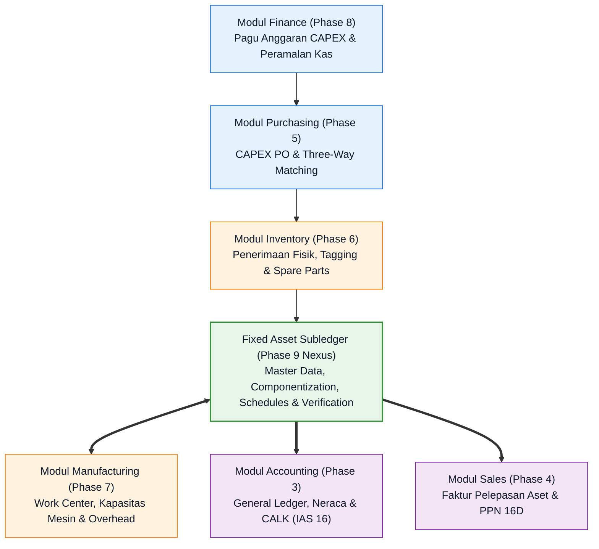
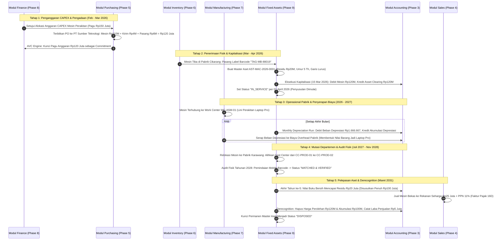

# Cross-Module Fixed Assets Integration

## Definition

**Cross-Module Fixed Assets Integration** adalah arsitektur keterhubungan fungsional dan aliran data di mana domain Fixed Assets Management bertindak sebagai pengelola siklus hidup barang modal yang mengintegrasikan akuntansi, pengadaan, pergudangan, manufaktur, dan keuangan korporat ke dalam satu kesatuan sistem ERP.

Aset tetap tidak beroperasi secara terisolasi. Pengadaannya berakar dari perencanaan anggaran modal di modul [[07-finance/budget-management|Finance]] dan eksekusi pengadaan di modul [[04-purchasing/procure-to-pay-integration|Purchasing]]; kedatangan fisiknya diterima oleh staf [[05-inventory/inventory-receiving|Gudang]]; penggunaannya menggerakkan lini perakitan di modul [[06-manufacturing/routing-and-work-center|Manufacturing]]; seluruh depresiasi dan mutasi nilainya mengalir ke buku besar [[02-accounting/general-ledger-and-subledger|Accounting]]; serta pelepasannya dapat melibatkan penagihan faktur di modul [[03-sales/sales-order|Sales]].

---

## Purpose

1. **Eliminasi Silo Data Barang Modal**: Menghilangkan ketidaksesuaian data antara mesin yang dibeli oleh bagian procurement, mesin yang dioperasikan di lantai pabrik, dan saldo aktiva yang tercatat di neraca akuntansi.
2. **Pengendalian Terpadu Sejak Titik Awal Pengadaan (*Shift-Left Governance*)**: Menegakkan batas pagu anggaran modal (*CAPEX Availability Control*) pada saat Purchase Requisition diajukan, mencegah komitmen pembelian tanpa plafon dana yang sah.
3. **Penyerapan Biaya Penyusutan ke Harga Pokok Produksi (*Overhead Absorption*)**: Memastikan beban penyusutan mesin pabrik dialokasikan secara akurat ke dalam tarif biaya mesin per jam (*Machine Hour Rate*) yang membentuk harga pokok persediaan barang jadi (*COGS*).
4. **Otomatisasi Penatausahaan Fisik dan Finansial**: Memastikan setiap peristiwa operasional (seperti pemindahan mesin ke pabrik cabang) secara otomatis memicu pembaruan pusat biaya akuntansi tanpa penginputan ganda.
5. **Keterlacakan Siklus Hidup Penuh (*End-to-End Asset Lineage*)**: Menyediakan jejak audit digital yang memungkinkan penelusuran dari angka saldo aktiva di laporan keuangan audit hingga ke dokumen surat jalan pengiriman dan nomor tag barcode fisik di lantai produksi.

---

## Matriks Integrasi Lintas Modul (Master Integration Matrix)

Tabel berikut merangkum titik interaksi, aliran dokumen, dan dampak sistemik antara modul Fixed Assets dengan modul-modul ERP lainnya:

| Modul Terintegrasi | Titik Interaksi Utama | Dampak pada Fixed Assets | Dampak pada Modul Terkait | Dokumen Bisnis Terkait |
| :--- | :--- | :--- | :--- | :--- |
| **Finance (Phase 8)** | Alokasi Anggaran CAPEX, Pembayaran Kas Vendor, Analisis TCO | Memberikan hak pagu pengadaan aset baru; dasar penilaian usia ekonomis mesin | Menggerakkan proyeksi kas keluar investasi (*CFI*) dan analisis modal kerja | `CAPEX Budget Proposal` $\rightarrow$ `Disbursement Batch` |
| **Purchasing (Phase 5)** | Penerbitan CAPEX PO, Verifikasi Tiga Arah (*Three-Way Match*) | Membentuk nilai perolehan awal aset via akun perantara *Asset Clearing* | Mengunci komitmen anggaran (*Encumbrance*); mencatat utang dagang vendor | `Purchase Requisition` $\rightarrow$ `CAPEX PO` $\rightarrow$ `Vendor Bill` |
| **Inventory (Phase 6)** | Penerimaan Fisik di Gudang, Konsumsi Suku Cadang Perawatan | Pemicu penempelan tag barcode fisik; pencatatan riwayat biaya perawatan aset | Pengurangan saldo stok gudang suku cadang (*Goods Issue to Maintenance*) | `Goods Receipt (GRN)` $\rightarrow$ `Material Issue Slip` |
| **Manufacturing (Phase 7)** | Penentuan Kapasitas Work Center, Jam Henti Mesin (*Downtime*) | Jam kerja mesin menjadi dasar penyusutan *Units of Production*; sinyal penurunan nilai | Biaya depresiasi diserap ke tarif overhead pusat kerja (*Work Center Costing*) | `Work Order` $\rightarrow$ `Machine Routing Card` $\rightarrow$ `WIP Entry` |
| **Accounting (Phase 3)** | Kapitalisasi Neraca, Eksekusi Penyusutan Bulanan, Pelaporan CALK | Mengontrol saldo buku besar aktiva tetap melalui buku pembantu (*Subledger*) | Pembaruan akun neraca PPE, akumulasi penyusutan, dan beban depresiasi GL | `Capitalization Run` $\rightarrow$ `Depreciation Journal (AFAB)` |
| **Sales (Phase 4)** | Penjualan Aset Bekas ke Pihak Ketiga saat Pelepasan | Memicu penghentian pengakuan (*Derecognition*) dan penguncian nomor master aset | Penerbitan faktur penjualan komersial (*Customer Invoice*) & Faktur Pajak PPN 16D | `Disposal Order` $\rightarrow$ `Customer Invoice` $\rightarrow$ `Faktur Pajak` |

---

## Master Canonical Scenario: Siklus Penuh Mesin Perakitan di PT Maju Bersama

Untuk mendemonstrasikan integrasi lintas modul secara komprehensif, skenario kanonikal berikut menggambarkan siklus hidup penuh selama 5 tahun atas **Mesin Perakitan Otomatis Laptop Pro** (`AST-MAC-2026-0001`):

### Penelusuran Siklus Hidup Kanonikal:

1. **Perencanaan Anggaran & Pengadaan (Bulan ke-0 / Feb–Mar 2026)**:
   - Modul Finance menyetujui pagu anggaran belanja modal (*CAPEX Budget*) sebesar Rp150.000.000 untuk ekspansi kapasitas lini perakitan Laptop Pro.
   - Modul Purchasing menerbitkan PO pengadaan mesin otomatis ke vendor terverifikasi **PT Sumber Teknologi** senilai Rp110.000.000, ditambah biaya logistik pengiriman Rp4.000.000 dan jasa instalasi mekanikal Rp6.000.000 (Total biaya perolehan sah: Rp120.000.000).
   - Mesin AVC (*Availability Control*) mengunci komitmen dana sebesar Rp120.000.000.

2. **Penerimaan Fisik & Kapitalisasi (Bulan ke-1 / Maret 2026)**:
   - Mesin tiba di Pabrik Cikarang. Petugas gudang memvalidasi fisik barang dan menempelkan nomor barcode fisik `TAG-MB-88019`.
   - Administrator aset mendaftarkan master data aset tetap `AST-MAC-2026-0001` dengan kelas `MACHINERY_PROD`.
   - Pada 15 Maret 2026, sistem mengeksekusi kapitalisasi: mendebit akun `153000 Mesin Pabrik` dan mengkredit akun perantara `159100 Fixed Asset Clearing` sebesar Rp120.000.000.
   - Mesin resmi beroperasi penuh (*In-Service Date*) pada 01 April 2026.

3. **Manufaktur & Penyerapan Beban Depresiasi (Tahun 2026–2027)**:
   - Mesin didaftarkan sebagai mesin utama pada pusat kerja `WC-ASM-01` di modul Manufacturing.
   - Setiap akhir bulan, modul Fixed Assets memposting beban penyusutan garis lurus sebesar Rp1.666.667 (Dasar tersusutkan Rp100.000.000 / 60 bulan).
   - Beban penyusutan ini diserap (*absorbed*) ke dalam biaya overhead pabrik, yang kemudian membentuk nilai pokok persediaan barang jadi 100 unit Laptop Pro yang dijual kepada **PT Mitra Niaga**.

4. **Mutasi Antar-Pabrik & Audit Fisik Berkala (Tahun 2027–2028)**:
   - Pada 15 Juli 2027, mesin dipindahkan dari Pabrik Cikarang ke Pabrik Karawang. Sistem memproses mutasi pusat biaya dari `CC-PROD-01` ke `CC-PROD-02`, sehingga beban penyusutan bulan-bulan berikutnya otomatis ditanggung oleh pabrik Karawang.
   - Pada audit fisik tahunan November 2028, auditor memindai barcode mesin menggunakan aplikasi mobile: status terkonfirmasi cocok (*Matched & Verified*).

5. **Pelepasan Aset Komersial & Penghentian Pengakuan (Maret 2031 / Akhir Tahun ke-5)**:
   - Setelah 5 tahun beroperasi penuh (60 bulan), akumulasi penyusutan mencapai Rp100.000.000, menyisakan nilai buku bersih tepat sebesar estimasi nilai residu awal: **Rp20.000.000**.
   - Manajemen menjual mesin tersebut kepada pihak ketiga seharga **Rp25.000.000** (ditambah PPN 11% Rp2.750.000).
   - Modul Sales menerbitkan faktur komersial dan Faktur Pajak Keluaran PPN Pasal 16D.
   - Modul Fixed Assets mengeksekusi penghentian pengakuan (*Derecognition*): menghapus harga perolehan Rp120.000.000, menghapus akumulasi penyusutan Rp100.000.000, mengakui kas/piutang Rp27.750.000, dan membukukan **Keuntungan Pelepasan Aset Tetap sebesar Rp5.000.000** di Laporan Laba Rugi.
   - Nomor master aset `AST-MAC-2026-0001` dikunci secara permanen pada status `DISPOSED`.

---

## Pola Arsitektur Integrasi ERP

Dalam mengintegrasikan aktiva tetap dengan modul-modul lain, sistem ERP menerapkan beberapa paradigma arsitektur utama:

| Pola Arsitektur | Karakteristik Integrasi Data | Keunggulan Sistemik | Software Penerap |
| :--- | :--- | :--- | :--- |
| **Universal Journal Architecture (Single-Table)** | Modul aktiva tetap berbagi tabel jurnal yang sama persis dengan modul buku besar umum dan akuntansi biaya | Tidak ada lagi redundansi data; rekonsiliasi subledger-ke-GL selesai seketika (*Zero Reconciliation Lag*) | SAP S/4HANA (Tabel `ACDOCA` & `FAAV_ANLP`) |
| **Dual-Ledger Subledger Posting** | Modul aktiva tetap memelihara buku pembantu independen dan memposting ringkasan jurnal (*batch vouchers*) ke GL | Pemisahan beban kerja basis data; ukuran tabel buku besar utama tetap ramping | Microsoft Dynamics 365, Oracle Cloud ERP |
| **Document-Linked Relational Engine** | Dokumen master aset, faktur pembelian, dan surat jalan dihubungkan via relasi Foreign Keys langsung | Sangat mudah ditelusuri (*transparent lineage*); fleksibel untuk entitas skala menengah | Odoo Enterprise, ERPNext |

---

## Naventra Consideration

Rancangan arsitektur integrasi lintas modul pada Naventra ERP:

1. **Transactional Event-Bus Architecture**: Setiap kali terjadi transaksi fisik di modul rantai pasok (misal konfirmasi penerimaan barang modal atau pengeluaran suku cadang perawatan), sistem mempublikasikan peristiwa (*Domain Event*: `AssetDeliveredEvent`, `MaintenanceCompletedEvent`). Modul aktiva tetap mendengarkan (*listens*) dan mengeksekusi pembaruan status atau pencatatan biaya secara asinkron tanpa memperlambat antarmuka pengguna di gudang.
2. **Atomic Asset Clearing Guarantee**: Naventra mewajibkan seluruh pengadaan barang modal melewati akun perantara `Fixed Asset Clearing`. Transaksi penerimaan barang dan pencatatan komitmen aset diikat dalam transaksi basis data atomik (*ACID guarantee*), mencegah kemungkinan terbentuknya master aset aktif tanpa adanya dokumen pengadaan resmi yang mendasarinya.
3. **Cross-Module Integrity Daemon**: Naventra menyertakan daemon latar belakang yang secara berkala memvalidasi integritas relasional: memastikan bahwa setiap mesin produksi yang terdaftar pada *Work Center* manufaktur memiliki nomor aset aktif yang valid di subledger aktiva tetap, dan total saldo subledger aktiva cocok 100% dengan akun kontrol neraca GL.

---

## References

- International Accounting Standards Board (IASB). *IAS 16: Property, Plant and Equipment*. IFRS Foundation.
- International Accounting Standards Board (IASB). *IAS 23: Borrowing Costs*. IFRS Foundation.
- SAP SE. *Asset Accounting (FI-AA) Integration with Purchasing, Plant Maintenance, and General Ledger in SAP S/4HANA*. SAP Help Portal.
- Microsoft Corporation. *Integrate fixed assets with accounts payable, general ledger, and production in Dynamics 365*. Microsoft Learn.
- Fowler, Martin. *Patterns of Enterprise Application Architecture: Event-Driven Enterprise Systems*. Addison-Wesley.
