# Fixed Assets Management

Selamat datang di modul pembelajaran **Fixed Assets Management (Manajemen Aset Tetap / Aktiva Tetap)** dalam knowledge base `erp-notes`.

Modul ini membahas arsitektur domain tata kelola aset berwujud jangka panjang (*Property, Plant, and Equipment - PPE*) dalam sistem ERP secara menyeluruh, universal, dan *vendor-agnostic*. 

Jika [[02-accounting/fixed-asset-accounting|Phase 3 (Fixed Asset Accounting)]] berfokus pada mekanika pencatatan jurnal buku besar (*General Ledger*), aturan standar statutori (IAS 16 / PSAK 16), dan penyajian angka neraca, maka **Phase 9 berfokus pada siklus hidup operasional (*Asset Lifecycle Management*) secara end-to-end—mulai dari perencanaan belanja modal (CAPEX), pengadaan dan perakitan fisik, kapitalisasi, pengelolaan komponen (*componentization*), eksekusi jadwal depresiasi berkala, mutasi lokasi dan penanggung jawab, revaluasi, pengujian penurunan nilai (*impairment*), integrasi pemeliharaan pabrik, verifikasi fisik (*stock opname* aktiva), hingga pelepasan komersial (*disposal/retirement*)**.

---

## Arsitektur Siklus Hidup Aset Tetap (Asset Lifecycle)

Siklus hidup aset tetap di dalam ERP dikelola melalui delapan tahapan transisi status terpadu:

```mermaid
flowchart TD
    subgraph S1["Tahap 1: Inisiasi & Pengadaan"]
        N1["(1) [[08-assets/fixed-assets-fundamentals|Fixed Assets Fundamentals]]"]
        N2["(2) [[08-assets/asset-master-data|Asset Master Data]]"]
        N3["(3) [[08-assets/asset-classification|Asset Classification & Hierarchy]]"]
    end

    subgraph S2["Tahap 2: Kapitalisasi & Komponen"]
        N4["(4) [[08-assets/asset-acquisition-and-capitalization|Asset Acquisition & Capitalization]]"]
        N5["(5) [[08-assets/asset-componentization|Asset Componentization]]"]
    end

    subgraph S3["Tahap 3: Operasional, Nilai & Biaya"]
        N6["(6) [[08-assets/depreciation-management|Depreciation Schedule & Management]]"]
        N7["(7) [[08-assets/asset-transfer-and-location|Asset Transfer & Location Tracking]]"]
        N8["(8) [[08-assets/asset-revaluation|Asset Revaluation]]"]
        N9["(9) [[08-assets/asset-impairment|Asset Impairment Management]]"]
        N10["(10) [[08-assets/capex-vs-opex|CAPEX vs OPEX in Asset Lifecycle]]"]
        N11["(11) [[08-assets/asset-maintenance-integration|Asset Maintenance Integration]]"]
    end

    subgraph S4["Tahap 4: Verifikasi & Pelepasan"]
        N12["(12) [[08-assets/physical-asset-verification|Physical Asset Verification & Tagging]]"]
        N13["(13) [[08-assets/asset-disposal-and-retirement|Asset Disposal & Retirement]]"]
    end

    subgraph S5["Tahap 5: Pelaporan, Kontrol & Integrasi"]
        N14["(14) [[08-assets/asset-reporting-and-analytics|Asset Reporting & Analytics]]"]
        N15["(15) [[08-assets/asset-controls-and-governance|Asset Controls & Governance]]"]
        N16["(16) [[08-assets/fixed-assets-integration|Cross-Module Fixed Assets Integration]]"]
    end

    S1 --> S2 --> S3 --> S4 --> S5
```

---

## Daftar Materi Pembelajaran Lengkap

### Fondasi & Struktur Data
1. **[[08-assets/fixed-assets-fundamentals|Fixed Assets Fundamentals]]**  
   Definisi aset tetap berwujud (*tangible PPE*); perbedaan fundamental antara Persediaan (*Inventory*), Aset Tetap (*Fixed Asset*), Beban Operasional (*Expense*), dan Aset Tak Berwujud (*Intangible Asset*); kebijakan ambang batas materialitas (*Capitalization Policy*); serta konsep multi-buku (*Corporate vs Tax Book*).
2. **[[08-assets/asset-master-data|Asset Master Data]]**  
   Struktur rekaman master data aset tetap: segmen identifikasi teknis, penugasan organisasi (*Cost Center* dan *Custodian*), hierarki penanggalan siklus hidup (*Acquisition, Capitalization, In-Service Dates*), parameter buku valuasi, dan mesin status siklus hidup aset.
3. **[[08-assets/asset-classification|Asset Classification & Hierarchy]]**  
   Pengelompokan logis aset (Tanah, Gedung, Mesin, Kendaraan, Komputer, CIP); otomatisasi penentuan akun buku besar (*GL Account Determination*); serta pemisahan tiga dimensi klasifikasi: Akuntansi Komersial (IAS 16), Operasional Pabrik, dan Perpajakan Fiskal (UU PPh Kelompok 1 s.d. 4).

### Kapitalisasi & Dekomposisi Aset
4. **[[08-assets/asset-acquisition-and-capitalization|Asset Acquisition & Capitalization]]**  
   Saluran perolehan aset (pembelian komersial, bangun sendiri/CWIP, transfer internal); hierarki penanggalan kritis; batasan biaya yang boleh dikapitalisasi vs wajib dibebankan (IAS 16.16); dan siklus kapitalisasi proyek konstruksi bertahap.
5. **[[08-assets/asset-componentization|Asset Componentization]]**  
   Penerapan akuntansi komponen (IAS 16.43-47); kriteria pemisahan bagian material dengan masa manfaat berbeda; hierarki induk-anak (*Parent-Child Assets*); serta tata kelola penggantian komponen lama dan kapitalisasi komponen baru tanpa duplikasi buku (*derecognition of replaced parts*).

### Penyusutan, Valuasi & Pemeliharaan
6. **[[08-assets/depreciation-management|Depreciation Schedule & Management]]**  
   Arsitektur mesin komputasi depresiasi; metode Garis Lurus, Saldo Menurun, dan Satuan Hasil Produksi (*Units of Production*); konvensi periode parsial (*prorata*); serta penanganan perubahan estimasi akuntansi secara prospektif (IAS 8).
7. **[[08-assets/asset-transfer-and-location|Asset Transfer & Location Tracking]]**  
   Pemisahan tiga dimensi mutasi: Lokasi Fisik, Pusat Biaya (*Cost Center*), dan Entitas Legal (*Intercompany*); alur persetujuan Berita Acara Serah Terima (BAST); aturan batas tanggal penanggalan depresiasi mutasi (*Cut-off Rule*); dan pelacakan status barang dalam perjalanan (*In-Transit*).
8. **[[08-assets/asset-revaluation|Asset Revaluation]]**  
   Penerapan model revaluasi (IAS 16.31-42) vs model biaya historis; aturan revaluasi seluruh anggota kelas aset (*Class Consistency Rule*); metode eliminasi akumulasi penyusutan (*Net Method*) vs metode proporsional (*Gross Method*); pembentukan Surplus Revaluasi di ekuitas (OCI); dan transfer berkala ke saldo laba.
9. **[[08-assets/asset-impairment|Asset Impairment Management]]**  
   Evaluasi penurunan nilai aset di bawah IAS 36; perbedaan mendasar depresiasi berkala vs penurunan nilai mendadak; evaluasi indikator internal dan eksternal; penentuan Jumlah Terpulihkan ($\max(\text{FVLCOD}, \text{VIU})$); Unit Penghasil Kas (CGU); dan batas plafon pembalikan rugi penurunan nilai.
10. **[[08-assets/capex-vs-opex|CAPEX vs OPEX in Asset Lifecycle]]**  
    Pembedaan perlakuan pengeluaran lanjutan (*subsequent expenditures*); kerangka uji keputusan kapitalisasi 4 tahap; pemisahan belanja modal (*CFI*) dari beban operasional (*CFO*) pada laporan arus kas; dan integrasi kategori penetapan akun pada modul pengadaan.
11. **[[08-assets/asset-maintenance-integration|Asset Maintenance Integration]]**  
    Konektivitas pemeliharaan pabrik (*Plant Maintenance*) dengan siklus hidup aktiva tetap; pencatatan jam henti mesin (*downtime*), MTBF, dan MTTR; akumulasi Total Biaya Kepemilikan (*TCO*); kapitalisasi turun mesin besar (*Major Overhaul* - IAS 16.14); dan kurva penentuan batas usia ekonomis mesin.

### Verifikasi, Pelepasan & Tata Kelola
12. **[[08-assets/physical-asset-verification|Physical Asset Verification & Tagging]]**  
    Prosedur *stock opname* aktiva tetap fisik; perbedaan mendasar dengan penghitungan persediaan gudang; opsi teknologi pelabelan (Barcode, QR Code, RFID); penanganan lima kategori eksepsi (*Matched, Missing/Ghost, Unrecorded, Mislocated, Damaged*); dan pemisahan tugas tim audit fisik independen.
13. **[[08-assets/asset-disposal-and-retirement|Asset Disposal & Retirement]]**  
    Siklus akhir penghentian pengakuan aset (IAS 16.67-72); saluran pelepasan (penjualan komersial, pemusnahan/scrap, tukar tambah, donasi, hapus buku kehilangan); perhitungan laba/rugi pelepasan; eksekusi *depreciation catch-up*; dan pemenuhan Faktur Pajak PPN Pasal 16D.
14. **[[08-assets/asset-reporting-and-analytics|Asset Reporting & Analytics]]**  
    Tiga sudut pandang pelaporan: Operasional Lapangan, Kepatuhan Akuntansi & CALK, dan Analisis Strategis Manajemen; penyusunan Tabel Mutasi Aset Tetap (*Asset History Sheet / Roll-Forward* - IAS 16.73); rekonsiliasi subledger ke akun kontrol GL; dan kemampuan penelusuran bertingkat (*drill-down*).
15. **[[08-assets/asset-controls-and-governance|Asset Controls & Governance]]**  
    Kerangka kerja pengendalian internal COSO pada aktiva tetap; penegakan matriks benturan peran beracun (*Toxic Segregation of Duties*); hierarki batas otorisasi persetujuan (*Delegation of Authority*); pencegahan aset duplikat; dan jejak audit digital tak terbantahkan (*Immutable Audit Trail*).
16. **[[08-assets/fixed-assets-integration|Cross-Module Fixed Assets Integration]]**  
    Sintesis arsitektur integrasi komprehensif antara Fixed Assets dengan Finance (CAPEX Budgeting), Purchasing (P2P), Inventory (Receiving & Spares), Manufacturing (Work Center Capacity & Overhead Absorption), Accounting (GL Posting & CALK), dan Sales (Pelepasan Komersial), disertai penelusuran skenario kanonikal 5 tahun Mesin Perakitan Laptop Pro di PT Maju Bersama.

---

## Hubungan dengan Domain Lain dalam `erp-notes`

Modul Fixed Assets Management merupakan simpul penghubung penting dalam ekosistem ERP:
- **[[00-fundamentals/index|Phase 1 (Fundamentals)]]**: Mengimplementasikan hierarki master data, penomoran dokumen, dan struktur organisasi perusahaan.
- **[[01-business-processes/index|Phase 2 (Business Processes)]]**: Menghubungkan proses P2P barang modal dan siklus R2R aktiva tetap.
- **[[02-accounting/index|Phase 3 (Accounting)]]**: Memanfaatkan akun buku besar umum (*General Ledger*), neraca saldo, dan mekanisme penutupan periode fiskal.
- **[[03-sales/index|Phase 4 (Sales)]]**: Menerbitkan faktur penjualan komersial dan faktur pajak saat aset dilepas ke pihak ketiga.
- **[[04-purchasing/index|Phase 5 (Purchasing)]]**: Mengelola pengadaan barang modal (CAPEX PO), verifikasi penerimaan tiga arah (*Three-Way Match*), dan akun kliring perolehan.
- **[[05-inventory/index|Phase 6 (Inventory)]]**: Mengatur penerimaan fisik awal barang, pergudangan suku cadang perawatan, dan konversi barang persediaan menjadi aset kantor.
- **[[06-manufacturing/index|Phase 7 (Manufacturing)]]**: Menghubungkan mesin aset tetap ke pusat kerja (*Work Center*), menyerap beban depresiasi ke biaya overhead pabrik, dan mengoordinasikan jam henti perawatan.
- **[[07-finance/index|Phase 8 (Finance)]]**: Menyelaraskan pengadaan dengan plafon anggaran belanja modal (*CAPEX Budget*), memproyeksikan arus kas keluar investasi (*CFI*), dan menganalisis total biaya kepemilikan.
