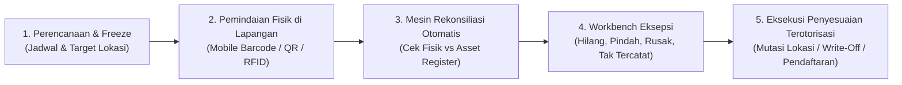
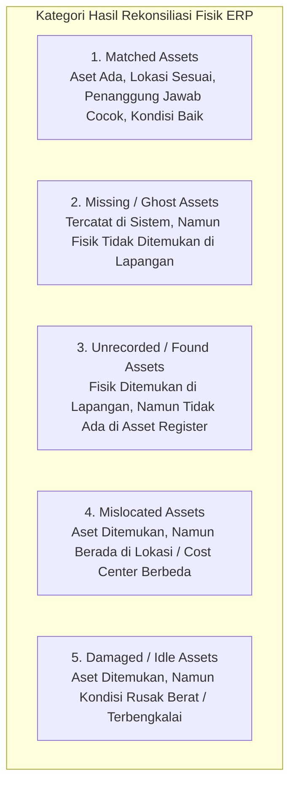
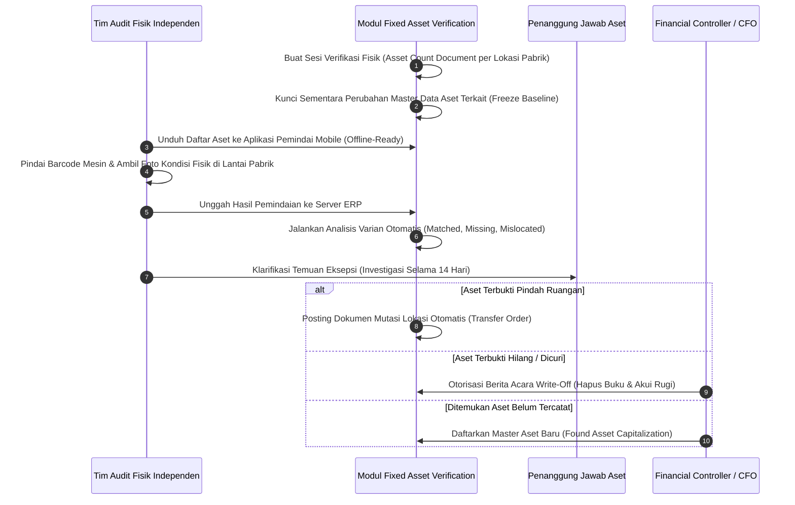

# Physical Asset Verification & Tagging

## Definition

**Physical Asset Verification (Verifikasi Fisik / Stock Opname Aktiva Tetap)** dalam sistem ERP adalah proses sistematis, terencana, dan berkala untuk memeriksa keberadaan fisik, lokasi penempatan, kondisi operasional, nomor identitas tag, dan penanggung jawab (*custodian*) dari setiap unit aset tetap berwujud, serta mencocokkannya (*reconciling*) dengan data yang tercatat dalam daftar aktiva tetap (*Fixed Asset Register*).

Verifikasi fisik adalah pilar pengendalian internal (*Internal Control*) terpenting dalam manajemen aktiva tetap. Tujuannya adalah mengeliminasi selisih antara realitas fisik di lapangan dengan pembukuan digital sistem, serta mendeteksi keberadaan **Aset Hantu (*Ghost Assets*—aset yang ada di buku tetapi fisiknya sudah hilang atau musnah)** maupun **Aset Tak Tercatat (*Zombie Assets*—aset fisik yang ada di pabrik/kantor tetapi tidak tercatat di buku besar)**.

---

## Purpose

1. **Pencegahan Penyajian Aset Fiktif (*Ghost Asset Elimination*)**: Mengidentifikasi dan menghapusbukukan aset yang telah rusak total, dicuri, atau dibuang tanpa laporan formal, sehingga perusahaan tidak terus-menerus membayar pajak dan premi asuransi atas aset yang sudah tidak ada.
2. **Kepatuhan Pengendalian Internal & Audit Eksternal**: Menyediakan bukti audit fisik (*physical audit evidence*) yang sah dan tak terbantahkan untuk memenuhi persyaratan audit laporan keuangan statutori.
3. **Pembaruan Akurasi Lokasi dan Penanggung Jawab**: Mendeteksi aset yang dipindahkan secara liar oleh staf operasional tanpa pengajuan dokumen mutasi resmi di ERP.
4. **Deteksi Dini Aset Rusak atau Menganggur (*Idle & Damaged Assets*)**: Mengidentifikasi mesin atau peralatan yang teronggok di sudut gudang dalam kondisi rusak untuk segera dievaluasi penurunan nilainya (*impairment*) atau dijual sebagai besi tua (*scrapped*).
5. **Penegakan Disiplin Pelabelan Fisik (*Tagging Governance*)**: Memastikan seluruh aset perusahaan memiliki label fisik tahan cuaca (*Barcode / QR Code / RFID*) yang terbaca jelas oleh pemindai digital.

---

## Perbedaan: Stock Opname Persediaan (Phase 6) vs Verifikasi Fisik Aset Tetap (Phase 9)

Meskipun secara sepintas terlihat mirip, konsep dasar penghitungan fisik pada kedua domain ini sangat berbeda:

| Parameter | Stock Opname Persediaan ([[05-inventory/physical-inventory-count|Phase 6]]) | Verifikasi Fisik Aset Tetap (Phase 9) |
| :--- | :--- | :--- |
| **Fokus Penghitungan** | **Kuantitas Agregat & Nilai Stok** (Berapa kilogram, berapa boks, berapa lusin). | **Identitas Unik Individual** (Serial Number, Tag Barcode unik per unit). |
| **Karakteristik Barang** | Barang cepat bergerak (*fast-moving*), homogen, dikonsumsi atau dijual. | Barang berumur panjang (*long-lived*), digunakan bertahun-tahun, heterogen. |
| **Informasi yang Dicari** | Selisih kuantitas fisik vs saldo kartu stok gudang. | Keberadaan fisik, nama penanggung jawab (*custodian*), kondisi fisik mesin, dan lokasi ruangan. |
| **Dampak Finansial Selisih** | Penyesuaian persediaan lawan akun selisih stok (*Inventory Adjustment / Shrinkage*). | Penghapusan buku aset hilang (*Write-off*), reklasifikasi mutasi lokasi, atau uji penurunan nilai (*Impairment*). |

---

## Teknologi Pelabelan Fisik (Tagging Options)

ERP mendukung berbagai opsi teknologi identifikasi fisik sesuai kebutuhan lingkungan operasional:
- **Label Barcode 1D / 2D (QR Code)**: Paling populer, ekonomis, dicetak pada stiker poliester atau aluminium tahan panas/minyak; dipindai menggunakan kamera smartphone atau pemindai genggam (*handheld scanner*).
- **Tag RFID Pasif (UHF RFID)**: Mengizinkan pemindaian jarak jauh (hingga 3 s.d. 5 meter) secara massal tanpa perlu kontak visual langsung; sangat efisien untuk memindai ratusan aset kantor dalam satu ruangan secara simultan.
- **Plat Logam Terukir (Metal Asset Plate)**: Digunakan khusus untuk mesin pabrik berat, bejana peleburan, atau kendaraan proyek luar ruang yang terpapar suhu ekstrem atau bahan kimia korosif.
- **Formulir Manual Berita Acara**: Opsi cadangan tradisional jika infrastruktur pemindai digital mengalami kendala di area terpencil.

---

## Kategori Temuan Eksepsi Verifikasi Fisik

Setelah pemindaian di lapangan selesai, mesin rekonsiliasi ERP mengelompokkan aset ke dalam lima kategori status:

---

## Business Process

Alur pelaksanaan verifikasi fisik aset tetap dalam ERP:

---

## Business Rules

1. **Independent Count Team (Segregation of Duties)**: Petugas yang melakukan pemindaian fisik di lapangan dilarang keras merangkap sebagai penanggung jawab aset (*Asset Custodian*) atau staf pembukuan aktiva tetap yang mengelola master data aset tersebut.
2. **Mandatory Annual Verification Cycle**: Seluruh aset tetap berwujud yang tercatat aktif wajib diverifikasi fisiknya minimal satu kali dalam satu tahun fiskal (atau siklus rotasi bertahap untuk fasilitas raksasa).
3. **Investigation Grace Period**: Selisih aset hilang (*Missing Assets*) tidak boleh langsung dihapusbukukan seketika; sistem wajib memberikan masa investigasi formal (maksimal 30 hari kalender) untuk penelusuran dokumen mutasi yang belum terinput sebelum usulan penghapusan buku diajukan ke Direksi.
4. **Approval Matrix on Asset Discrepancies**: Penghapusan buku atas aset yang hilang atau penambahan aset temuan wajib mengikuti matriks wewenang (*Delegation of Authority*) berjenjang berdasarkan nilai buku bersih aset.
5. **Physical Condition Rating Requirement**: Setiap kali pemindaian aset dilakukan, petugas lapangan wajib memilih status kondisi fisik (*Condition Rating*: Baik, Perlu Servis, Rusak Berat, Tidak Terpakai/Idle) sebagai pemicu evaluasi penurunan nilai (*Impairment Trigger*).

---

## Accounting & Financial Impact

Hasil verifikasi fisik memicu jurnal penyesuaian untuk menyelaraskan buku besar dengan kenyataan:

### 1. Penghapusan Buku Aset Hilang (Write-Off of Missing Asset)
Laptop staf yang hilang dan terkonfirmasi tidak dapat ditemukan setelah masa investigasi (Harga perolehan Rp20.000.000, Akumulasi penyusutan Rp15.000.000, Nilai buku Rp5.000.000):

| Akun | Debit (IDR) | Kredit (IDR) | Keterangan |
| :--- | :--- | :--- | :--- |
| `155090 - Akumulasi Penyusutan Komputer` | 15.000.000 | - | Menghapus akumulasi penyusutan aset hilang |
| `710300 - Rugi Penghapusan Aset Tetap Hilang` | 5.000.000 | - | Pengakuan rugi di Laporan Laba Rugi |
| `155000 - Peralatan Komputer` | - | 20.000.000 | Menghapus nilai perolehan historis di Neraca |

### 2. Pendaftaran Aset Fisik Ditemukan (Found Asset Capitalization)
Ditemukan mesin las cadangan di gudang yang belum pernah dicatat di sistem (ditaksir nilai wajar Rp10.000.000):

| Akun | Debit (IDR) | Kredit (IDR) | Keterangan |
| :--- | :--- | :--- | :--- |
| `153000 - Mesin & Peralatan Pabrik` | 10.000.000 | - | Pengakuan aset tetap baru di Neraca |
| `710400 - Pendapatan Lain-Lain (Aset Temuan)` | - | 10.000.000 | Diakui sebagai pendapatan lain-lain di Laba Rugi |

*(Untuk mekanisme akuntansi penghapusan dan audit forensik lengkap, rujuk ke [[02-accounting/fixed-asset-accounting|Phase 3]]).*

---

## Example: Hasil Audit Fisik Tahunan di PT Maju Bersama

Pada bulan November 2028, Komite Audit PT Maju Bersama melaksanakan verifikasi fisik atas 500 unit aset tetap di Pabrik Cikarang dan Pabrik Karawang:

### 1. Ringkasan Hasil Pemindaian Mobile Barcode Scanner
- **Aset Cocok Sempurna (*Matched*)**: 488 unit (97,6%) — Fisik ada, tag terbaca, lokasi dan penanggung jawab cocok.
- **Aset Salah Lokasi (*Mislocated*)**: 6 unit — Terdiri dari 4 unit komputer kantor dan 2 unit timbangan digital yang dipindahkan antar-ruangan tanpa tiket mutasi.
- **Aset Ditemukan Belum Tercatat (*Found Unrecorded*)**: 4 unit — Monitor tampilan status lini perakitan yang dibeli menggunakan kas operasional darurat dan belum didaftarkan di modul aset.
- **Aset Rusak Berat / Idle (*Damaged*)**: 1 unit — Mesin cetak label suku cadang yang terbakar motor penggeraknya.
- **Aset Hilang (*Missing / Ghost Assets*)**: 1 unit — Laptop operasional teknisi pemeliharaan bernilai buku Rp3.000.000.

### 2. Tindak Lanjut Sistem ERP
1. **6 Aset Salah Lokasi**: Sistem secara otomatis mengeksekusi dokumen *Asset Location Transfer* massal untuk memperbarui master data ke lokasi baru.
2. **4 Aset Temuan**: Tim administrasi menerbitkan formulir pendaftaran aset baru dengan taksiran nilai pasar Rp8.000.000 dan mulai disusutkan.
3. **1 Aset Rusak**: Dialihkan ke status `DAMAGED_PENDING_SCRAP` dan memicu evaluasi penurunan nilai (*Impairment Test*).
4. **1 Aset Hilang**: Diberikan waktu pencarian 14 hari. Karena staf penanggung jawab terbukti lalai, dibuatkan Berita Acara Kehilangan, nilai buku Rp3.000.000 dihapusbukukan ke akun rugi aset hilang, dan klaim asuransi diproses.

---

## ERP Implementation

Perbandingan kapabilitas modul verifikasi fisik aset tetap lintas platform ERP:

| Parameter Verifikasi Fisik | Odoo Enterprise | ERPNext | Microsoft Dynamics 365 | SAP S/4HANA Finance |
| :--- | :--- | :--- | :--- | :--- |
| **Dokumen Perhitungan Fisik** | Menggunakan modul inventaris atau kustom spreadsheet | Dokumen transaksi khusus *Asset Inventory / Stock Take* | Lembar kerja *Fixed asset physical inventory worksheet* | Transaksi khusus *Physical Inventory for Assets (ABST / AR01)* |
| **Dukungan Barcode Scanner Mobile** | Integrasi aplikasi *Odoo Barcode App* (kamera ponsel) | Dukungan scan barcode langsung via web browser mobile | Aplikasi mobile *Dynamics 365 Supply Chain / Asset Barcoding* | Aplikasi Fiori terdedikasi *Physical Inventory of Fixed Assets* |
| **Workbench Analisis Varian** | Rekonsiliasi manual via pivot table | Laporan *Asset Depreciation & Inventory Reconciliation* | Form rekonsiliasi *Physical inventory discrepancy resolution* | Laporan rekonsiliasi otomatis daftar fisik vs pembukuan aset |
| **Otomatisasi Penyesuaian Buku** | Pembuatan jurnal penyesuaian manual | Tombol *Adjust* otomatis untuk update lokasi aset | Fitur otomatisasi posting selisih fisik ke buku besar aset | Terintegrasi langsung dengan modul pelepasan dan *Write-off* otomatis |

---

## Naventra Consideration

Rancangan arsitektur modul Physical Asset Verification pada Naventra ERP:

1. **Native Mobile Asset Scanner**: Naventra menyediakan Progressive Web App (PWA) yang memungkinkan tim audit memindai barcode/QR tag aset secara luring (*offline-first*) di lorong pabrik tanpa sinyal Wi-Fi. Data hasil pemindaian disimpan di basis data lokal perangkat dan disinkronisasikan ke server saat kembali online.
2. **Interactive Discrepancy Resolution Workbench**: Hasil verifikasi fisik disajikan dalam dasbor interaktif yang membagi temuan ke dalam tab: *Matched*, *Mislocated*, *Damaged*, *Missing*, dan *Unrecorded*. Setiap tab memiliki tombol aksi satu-klik (*One-Click Action*) untuk memproses mutasi lokasi, pendaftaran aset baru, atau penerbitan memo penghapusan buku.
3. **Mandatory Photo & Geolocation Evidence**: Aplikasi mobile Naventra mewajibkan petugas lapangan mengambil foto fisik aset dan merekam koordinat GPS saat memindai aset-aset bernilai di atas ambang batas tertentu, memberikan integritas bukti fisik yang tak terbantahkan bagi auditor eksternal.

---

## References

- Committee of Sponsoring Organizations of the Treadway Commission (COSO). *Internal Control — Integrated Framework: Control Activities and Physical Verification*.
- International Organization for Standardization. *ISO 55001: Asset Management — Management Systems — Requirements*.
- SAP SE. *Physical Inventory of Fixed Assets in SAP S/4HANA*. SAP Help Portal.
- Microsoft Corporation. *Perform physical inventory counts for fixed assets in Dynamics 365 Finance*. Microsoft Learn.
- The Institute of Internal Auditors (IIA). *Auditing Fixed Assets and Physical Inventory Controls*.
