# Project Management

Selamat datang di modul pembelajaran **Project Management (Manajemen Proyek)** dalam knowledge base `erp-notes`.

Modul ini membahas arsitektur domain tata kelola proyek di dalam Enterprise Resource Planning (ERP) secara menyeluruh, mendalam, universal, dan *vendor-agnostic*.

Jika perangkat lunak manajemen proyek mandiri (*standalone project management tools* seperti Asana, Trello, atau Microsoft Project desktop) hanya berfokus pada visualisasi tugas, koordinasi tim, dan jadwal kalender, maka **Project Management dalam ERP beroperasi sebagai simpul koordinasi operasional dan jangkar finansial (*financial anchor / cost object*) yang mengintegrasikan eksekusi pekerjaan fisik dengan penganggaran (*budgeting*), pengadaan barang/jasa (*procurement*), logistik gudang (*inventory*), pencatatan waktu konsultan (*timesheet*), penagihan bertahap (*milestone billing*), pengakuan pendapatan standar internasional (*IFRS 15*), hingga akuntansi penutupan buku besar (*WIP settlement to COGS/Asset*)**.

---

## Arsitektur Siklus Hidup Proyek ERP (Project Lifecycle)

Siklus hidup manajemen proyek di dalam ERP dikelola melalui lima tahapan terpadu:

```mermaid
flowchart TD
    subgraph S1["Tahap 1: Inisiasi & Struktur Data"]
        N1["1. [[09-project/project-management-fundamentals|Project Management Fundamentals]]"]
        N2["2. [[09-project/project-master-data|Project Master Data]]"]
        N3["3. [[09-project/project-structure-and-work-breakdown|Project Structure & WBS]]"]
    end

    subgraph S2["Tahap 2: Perencanaan, Jadwal & Sumber Daya"]
        N4["4. [[09-project/project-planning-and-scheduling|Project Planning & Scheduling]]"]
        N5["5. [[09-project/project-task-and-milestone|Project Tasks & Milestones]]"]
        N6["6. [[09-project/project-resource-management|Project Resource Management]]"]
    end

    subgraph S3["Tahap 3: Eksekusi, Pelacakan Biaya & Logistik"]
        N7["7. [[09-project/timesheet-and-effort-tracking|Timesheet & Effort Tracking]]"]
        N8["8. [[09-project/project-cost-management|Project Cost Management]]"]
        N9["9. [[09-project/project-budget-and-cost-control|Project Budget & Cost Control]]"]
        N10["10. [[09-project/project-procurement|Project Procurement]]"]
        N11["11. [[09-project/project-material-and-inventory|Project Material & Inventory]]"]
    end

    subgraph S4["Tahap 4: Penagihan, Profitabilitas & Pengendalian Perubahan"]
        N12["12. [[09-project/project-billing-and-revenue|Project Billing & Revenue]]"]
        N13["13. [[09-project/project-profitability|Project Profitability]]"]
        N14["14. [[09-project/project-change-risk-and-issue-management|Change, Risk & Issue Management]]"]
    end

    subgraph S5["Tahap 5: Penutupan, Analitik & Integrasi"]
        N15["15. [[09-project/project-completion-and-closing|Project Completion & Closing]]"]
        N16["16. [[09-project/project-reporting-and-analytics|Project Reporting & Analytics]]"]
        N17["17. [[09-project/project-integration|Cross-Module Project Integration]]"]
    end

    S1 --> S2 --> S3 --> S4 --> S5
```

---

## Daftar Materi Pembelajaran Lengkap

### Inisiasi & Struktur Data
1. **[[09-project/project-management-fundamentals|Project Management Fundamentals]]**  
   Definisi proyek dalam ERP; perbedaan fundamental antara operasional berulang vs inisiatif proyek temporer; perbandingan ERP vs aplikasi PM mandiri; peran proyek sebagai objek biaya (*cost object*); tipologi proyek (Pelanggan, Internal R&D, Investasi Modal CAPEX); dan mesin transisi status siklus hidup proyek.
2. **[[09-project/project-master-data|Project Master Data]]**  
   Struktur rekaman master data proyek: segmen identifikasi, hubungan komersial pelanggan, parameter penanggalan (*planned vs baseline vs actual*), penugasan organisasi (*Company Code, Business Unit, Cost Center*), profil akuntansi & mata uang, template proyek, dan tata kelola pemisahan tugas.
3. **[[09-project/project-structure-and-work-breakdown|Project Structure and Work Breakdown]]**  
   Prinsip dekomposisi hierarkis WBS; kepatuhan aturan *100% Rule*; peran ganda WBS sebagai pengendali operasional dan wadah koleksi finansial (*Cost Element, Billing Element, Planning Element*); serta perincian 4 WBS skenario kanonik implementasi ERP Naventra.

### Perencanaan, Jadwal & Kapasitas
4. **[[09-project/project-planning-and-scheduling|Project Planning and Scheduling]]**  
   Pembedaan perencanaan kerja (*effort/duration planning*) dengan penjadwalan kalender; empat tipe dependensi tugas (*FS, SS, FF, SF*) dengan *lead/lag time*; analisis Jalur Kritis (*Critical Path Method* - CPM); perhitungan *Total Float* dan *Free Float*; pembekuan *Schedule Baseline*; serta perataan kapasitas sumber daya (*Resource Leveling*).
5. **[[09-project/project-task-and-milestone|Project Tasks and Milestones]]**  
   Pembedaan tugas operasional berdurasi (*Task*) dengan penanda pencapaian tanpa durasi (*Milestone*); tipologi tonggak prestasi (Teknis, Tata Kelola/Gate, dan Penagihan Finansial); mekanisme verifikasi formal serah terima (*BAST Sign-Off*); dan keterkaitannya dengan jadwal penagihan piutang.
6. **[[09-project/project-resource-management|Project Resource Management]]**  
   Pengelolaan kapasitas tenaga kerja konsultan; perbedaan alokasi tentatif (*soft booking*) vs definitif (*hard booking*); formula utilisasi sumber daya; arsitektur tarif ganda (*Cost Rate Matrix* vs *Billing Rate Matrix*); dan matriks penetapan staf proyek implementasi ERP.

### Eksekusi, Pelacakan Biaya & Logistik
7. **[[09-project/timesheet-and-effort-tracking|Timesheet and Effort Tracking]]**  
   Perekaman jam kerja riil konsultan; perbedaan fundamental *Timesheet* proyek dengan absensi penggajian umum (*Payroll Attendance*); mekanisme *dual-posting* (akrual biaya tenaga kerja langsung ke WBS dan pemenuhan kuantitas tagihan pelanggan); siklus hidup approval timesheet; serta realisasi 920 jam kerja kanonik.
8. **[[09-project/project-cost-management|Project Cost Management]]**  
   Struktur rincian biaya (*Cost Breakdown Structure* - CBS); kategorisasi biaya langsung (Tenaga Kerja, Pengadaan, Material, Biaya Perjalanan & *Expenses*); pengumpulan biaya riil ke WBS; perbandingan estimasi rencana (Rp200.000.000) vs realisasi riil (Rp181.000.000); serta analisis varians hemat (+Rp19.000.000).
9. **[[09-project/project-budget-and-cost-control|Project Budget and Cost Control]]**  
   Pembedaan pagu anggaran (*Approved Budget*) dengan estimasi biaya teknis (*Cost Plan*); mekanisme kontrol ketersediaan dana aktif (*Availability Control* - AVC); pemantauan komitmen pengadaan terbuka (*Commitment Tracking*); toleransi *soft warning* vs *hard stop*; serta analisis Earned Value Management (*PV, EV, AC, CV, SV, CPI, SPI*).
10. **[[09-project/project-procurement|Project Procurement]]**  
    Pengadaan khusus barang dan jasa pihak ketiga dengan atribusi langsung ke WBS (*Account Assignment Category P*); pemesanan subkontraktor dan tenaga ahli eksternal; pembentukan komitmen anggaran; konfirmasi jasa via *Service Entry Sheet* (SES) / BAST Subkon; dan pencocokan tiga arah (*Three-Way Matching*).
11. **[[09-project/project-material-and-inventory|Project Material and Inventory]]**  
    Logistik material proyek; daftar kebutuhan material proyek (*Project BOM*); reservasi stok gudang (*Soft vs Hard Reservation*); isolasi lokasi dan kepemilikan stok proyek (*Project Stock Valuation*); pengeluaran barang ke WBS (*Goods Issue to Project*); serta prosedur pengembalian sisa material (*Material Return*).

### Penagihan, Profitabilitas & Pengendalian Perubahan
12. **[[09-project/project-billing-and-revenue|Project Billing and Revenue]]**  
    Metode penagihan komersial (Fixed Price/Milestone, T&M, Cost Plus, Progress PoC); pembedaan tegas antara Penagihan Faktur (*Billing / Cash Schedule*) dengan Pengakuan Pendapatan Statutori (*IFRS 15 / PSAK 72 Revenue Recognition*); pengelolaan saldo *Contract Asset* (Unbilled Revenue) dan *Contract Liability* (Deferred Revenue); serta jadwal 4 termin kanonik senilai Rp300.000.000.
13. **[[09-project/project-profitability|Project Profitability]]**  
    Analisis laba rugi mini proyek (*Project Mini-P&L*); perbandingan margin rencana vs margin aktual; kalkulasi *Gross Project Margin* (Rp119.000.000 / 39,67%); analisis ekspansi margin (+6,34%); pembebanan alokasi *indirect overhead* korporat; dan evaluasi tingkat realisasi penagihan (*Billing Realization Rate*).
14. **[[09-project/project-change-risk-and-issue-management|Change, Risk, and Issue Management]]**  
    Pembedaan konseptual antara Risiko (*Risk* - masa depan/potensi), Kendala (*Issue* - masa kini/terjadi), dan Perubahan (*Change* - usulan revisi); alur persetujuan *Change Request* (CR) dan dewan pengendali perubahan (*Change Control Board* - CCB); evaluasi batasan segitiga (*Triple Constraint*); matriks penilaian risiko; serta pencegahan pembengkakan ruang lingkup (*Scope Creep*).

### Penutupan, Analitik & Integrasi
15. **[[09-project/project-completion-and-closing|Project Completion and Closing]]**  
    Dua dimensi penutupan: Serah Terima Teknis (*Technical Completion* / TECO / BAST Final) dan Penutupan Finansial (*Business Closing* / CLSD); *checklist* prasyarat penutupan sistem; kliring komitmen PO terbuka; penutupan lembar timesheet; eksekusi jurnal penyelesaian saldo perantara (*WIP Settlement*); dan transisi ke masa pemeliharaan (*Warranty/Hypercare*).
16. **[[09-project/project-reporting-and-analytics|Project Reporting and Analytics]]**  
    Tiga lapisan pelaporan: Operasional Lapangan, Pengendalian Finansial, dan Eksekutif Portofolio; visualisasi kurva-S EVM (*PV vs EV vs AC*); klasifikasi status kesehatan proyek (*RAG Status - Red, Amber, Green*); kemampuan penelusuran balik (*drill-down*) ke dokumen sumber transaksi; dan dashboard metrik final proyek kanonik.
17. **[[09-project/project-integration|Cross-Module Project Integration]]**  
    Sintesis arsitektur integrasi komprehensif antara Project Management dengan seluruh modul ERP (Sales, Purchasing, Inventory, Manufacturing, Finance, Fixed Assets, Accounting); diagram interaksi transaksi *end-to-end*; penelusuran lengkap skenario kanonik proyek `PRJ-ERP-2026-001` untuk pelanggan `PT Maju Bersama`; serta komparasi kapabilitas software ERP enterprise (Odoo, ERPNext, Microsoft Dynamics 365).

---

## Skenario Kanonikal Konsisten: Proyek Implementasi ERP Naventra

Seluruh 17 dokumen pembelajaran dalam modul ini mengacu pada satu skenario bisnis kanonikal yang konsisten:

- **ID Proyek**: `PRJ-ERP-2026-001`
- **Nama Proyek**: Implementasi ERP Naventra
- **Pelanggan**: `PT Maju Bersama`
- **Nilai Kontrak Komersial (Revenue)**: **Rp300.000.000**
- **Pagu Anggaran Disetujui (Approved Budget)**: **Rp250.000.000**
- **Estimasi Biaya Rencana (Planned Cost)**: **Rp200.000.000** (Labor Rp100M, Subkon Rp60M, Material Rp30M, Expenses Rp10M)
- **Realisasi Biaya Aktual (Actual Cost)**: **Rp181.000.000** (Labor Rp90M [920 jam], Subkon Rp55M, Material Rp28M, Expenses Rp8M)
- **Gross Project Margin Realisasi**: $\text{Rp300.000.000} - \text{Rp181.000.000} = \mathbf{Rp119.000.000}$ ($\mathbf{39,67\%}$)
- **Kinerja Biaya (Cost Variance)**: **+Rp19.000.000** (*Favorable / Under Budget*, ekspansi margin +6,34%)
- **Jadwal Penagihan Milestone**:
  - M1: Blueprint & Architecture Sign-Off (20% = Rp60.000.000)
  - M2: Core Configuration & CRP Sign-Off (30% = Rp90.000.000)
  - M3: UAT & Data Migration Sign-Off (30% = Rp90.000.000)
  - M4: Go-Live Cutover & Handover Sign-Off (20% = Rp60.000.000)
  - Total Difakturkan: Rp300.000.000 (100% Lunas)

---

## Hubungan dengan Domain Lain dalam `erp-notes`

Modul Project Management merupakan simpul orkestrasi operasional dan finansial dalam arsitektur ERP:
- **[[00-fundamentals/index|Phase 1 (Fundamentals)]]**: Mengadopsi prinsip master data, hierarki organisasi, dan penomoran dokumen bisnis.
- **[[01-business-processes/index|Phase 2 (Business Processes)]]**: Menghubungkan proses O2C proyek, P2P pengadaan jasa/subkontraktor, dan siklus R2R akuntansi biaya.
- **[[02-accounting/index|Phase 3 (Accounting)]]**: Memanfaatkan akun buku besar umum (*General Ledger*), akun perantara *Work-in-Progress* (WIP), pencatatan akuntansi manajemen analitik, dan standar pengakuan pendapatan IFRS 15.
- **[[03-sales/index|Phase 4 (Sales)]]**: Mengintegrasikan kontrak penjualan (*Sales Order*), pembentukan struktur WBS otomatis, dan penerbitan faktur piutang berdasarkan serah terima milestone BAST.
- **[[04-purchasing/index|Phase 5 (Purchasing)]]**: Mengatur pengadaan khusus proyek dengan penugasan akun WBS (`Account Assignment P`), pencadangan komitmen dana (*encumbrance*), dan verifikasi jasa subkontraktor via *Service Entry Sheet* (SES).
- **[[05-inventory/index|Phase 6 (Inventory)]]**: Mengelola reservasi material proyek, isolasi kepemilikan stok proyek (*Project Stock*), pengeluaran barang ke WBS, dan pengembalian sisa material ke gudang.
- **[[06-manufacturing/index|Phase 7 (Manufacturing)]]**: Mengintegrasikan pesanan produksi *Engineer-to-Order* (ETO) dengan elemen WBS dan penjadwalan kapasitas pusat kerja pabrik.
- **[[07-finance/index|Phase 8 (Finance)]]**: Menegakkan mekanisme kontrol ketersediaan anggaran (*Availability Control* - AVC), pemantauan komitmen terbuka, serta penjadwalan arus kas masuk dan keluar proyek.
- **[[08-assets/index|Phase 9 (Fixed Assets)]]**: Menghubungkan proyek investasi modal / konstruksi internal (CAPEX) dengan kapitalisasi aset tetap (*Construction-in-Progress / CWIP settlement into PPE*).
