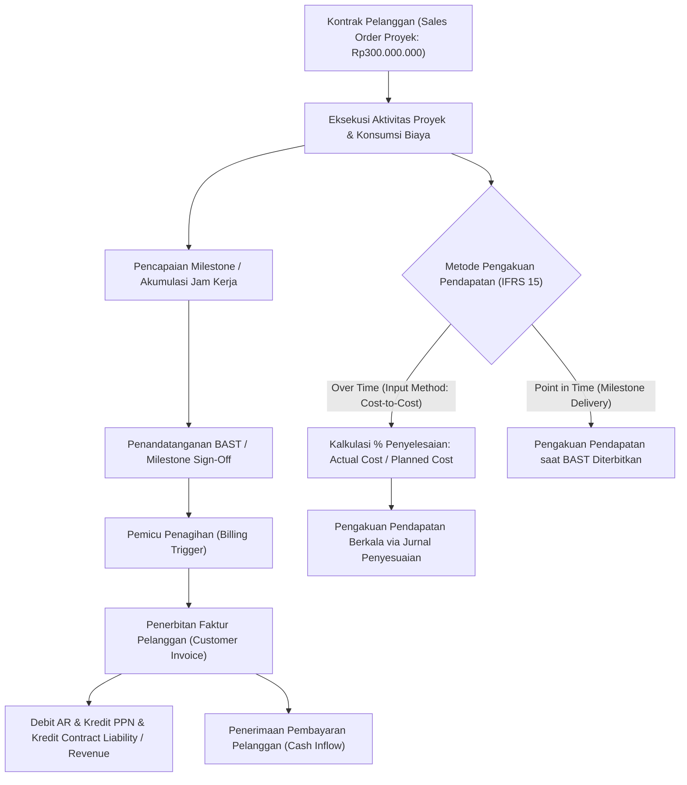

# Project Billing and Revenue

## Definition

**Project Billing and Revenue** adalah serangkaian mekanisme komersial dan akuntansi dalam Enterprise Resource Planning (ERP) yang mengatur penagihan piutang kepada pelanggan (*customer invoicing*) dan pengakuan pendapatan (*revenue recognition*) atas pekerjaan proyek yang telah diselesaikan.

Di dalam ERP modern, terdapat perbedaan mendasar antara **Billing (Penagihan)** dan **Revenue Recognition (Pengakuan Pendapatan)**:
- **Billing** adalah tindakan hukum dan finansial untuk menerbitkan faktur tagihan (*Sales Invoice*) kepada pelanggan yang menimbulkan Piutang Usaha (*Accounts Receivable*), didorong oleh syarat pembayaran kontraktual atau pencapaian tonggak prestasi (*milestones*).
- **Revenue Recognition** adalah proses akuntansi formal untuk mengakui pendapatan pada Laporan Laba Rugi (*Income Statement*) sesuai dengan standar akuntansi (khususnya **IFRS 15 / PSAK 72**), didorong oleh pemenuhan kewajiban pelaksanaan (*Performance Obligations*), yang dapat terjadi sebelum, bersamaan, atau sesudah penagihan dilakukan.

---

## Purpose

Pengelolaan Project Billing and Revenue dalam sistem ERP bertujuan untuk:

1. **Penyelarasan Hak Tagih Kontraktual**: Memastikan penerbitan faktur tagihan dilakukan tepat waktu dan sesuai bukti formal serah terima (*Milestone Sign-Off* / BAST).
2. **Kepatuhan Terhadap IFRS 15 / PSAK 72**: Memisahkan arus kas/piutang dari pengakuan pendapatan murni guna mencerminkan substansi ekonomi kinerja proyek secara objektif.
3. **Pencegahan Kebocoran Pendapatan (*Revenue Leakage*)**: Melacak jam kerja konsultan (*billable timesheet*) dan biaya operasional yang dapat dibebankan ulang (*reimbursable expenses*) agar tidak terlewat dari penagihan.
4. **Visibilitas Likuiditas dan Kas Masuk (*Cash Flow Inflows*)**: Memberikan kepastian jadwal penerimaan kas (*Billing Schedule*) yang terintegrasi dengan modul piutang (*Accounts Receivable*) dan perbendaharaan (*Treasury*).
5. **Mitigasi Risiko *Contract Asset* dan *Contract Liability***: Mengidentifikasi saldo pekerjaan yang belum ditagihkan (*Unbilled Revenue / Work in Progress*) atau tagihan yang belum menjadi hak pendapatan (*Deferred Revenue*).

---

## Business Process

Alur terintegrasi antara eksekusi proyek, penagihan pelanggan, dan pengakuan pendapatan digambarkan sebagai berikut:

### Metode Penagihan Proyek (*Project Billing Methods*)

1. **Milestone / Fixed-Price Billing**: Penagihan dilakukan berdasarkan persentase atau nominal tetap yang disepakati saat tonggak pencapaian tertentu disetujui secara tertulis melalui BAST.
2. **Time & Materials (T&M) Billing**: Penagihan didasarkan pada perkalian antara jam kerja riil konsultan yang disetujui (*Approved Billable Timesheet*) dengan tarif penagihan per jam (*Billing Rate*), ditambah penggantian biaya pengeluaran langsung (*Reimbursable Expenses*).
3. **Cost-Plus / Cost-Reimbursable Billing**: Penagihan sebesar total biaya aktual yang dikeluarkan proyek ditambah persentase margin keuntungan (*markup fee*) yang telah disepakati dalam kontrak.
4. **Progress / Percentage of Completion (PoC) Billing**: Penagihan diajukan secara periodik (misalnya bulanan) berdasarkan sertifikat kemajuan fisik pekerjaan di lapangan.

---

## Business Rules

### 1. Hubungan Kontrak dan Kewajiban Pelaksanaan (IFRS 15)
Pendapatan hanya dapat diakui apabila entitas memenuhi kewajiban pelaksanaan (*Performance Obligation*):
- **Over Time**: Pelanggan secara simultan menerima dan mengonsumsi manfaat dari kinerja entitas seiring berjalannya proyek (umum pada proyek konstruksi jangka panjang atau jasa kustomisasi ERP di lingkungan sistem pelanggan).
- **Point in Time**: Pengendalian atas aset/deliverable diserahkan sekaligus pada saat serah terima akhir (*final handover*).

### 2. Definisi Aset Kontrak dan Liabilitas Kontrak
ERP mengelola saldo perantara antara penagihan dan pendapatan:
- **Contract Asset (Unbilled Revenue / Pekerjaan Dalam Pelaksanaan Komersial)**: Hak entitas atas imbalan dari pekerjaan yang telah diselesaikan tetapi belum dapat difakturkan karena masih menunggu verifikasi formal atau syarat kontrak lain.
  $$\text{Cumulative Revenue Recognized} > \text{Cumulative Billed Amount} \implies \mathbf{Contract\ Asset}$$
- **Contract Liability (Deferred Revenue / Pendapatan Diterima di Muka)**: Kewajiban entitas untuk menyerahkan barang atau jasa kepada pelanggan yang tagihannya telah diterbitkan atau pembayarannya telah diterima lebih dahulu.
  $$\text{Cumulative Billed Amount} > \text{Cumulative Revenue Recognized} \implies \mathbf{Contract\ Liability}$$

### 3. Validasi Faktur Proyek
Faktur pelanggan untuk proyek bernilai tetap (*Fixed Price*) tidak dapat diposting tanpa adanya dokumen referensi serah terima (*Milestone Sign-Off Approval* / BAST resmi).

---

## Accounting Impact

Pencatatan akuntansi penagihan proyek melibatkan Piutang Usaha, Liabilitas Kontrak, Pajak Keluaran (PPN), dan Pendapatan Usaha.

### 1. Saat Penerbitan Faktur Milestone (Billing Event)

Ketika Milestone 1 disetujui dan faktur senilai 20% diterbitkan:
- Nilai Tagihan: Rp60.000.000
- PPN Keluaran 11%: Rp6.600.000
- Total Piutang: Rp66.600.000

$$\begin{array}{llrr}
\text{Debit:} & \text{Accounts Receivable (Piutang Usaha)} & \text{Rp66.600.000} & \\
\text{Kredit:} & \text{VAT Out (PPN Keluaran - 11\%)} & & \text{Rp6.600.000} \\
\text{Kredit:} & \text{Contract Liability / Deferred Revenue} & & \text{Rp60.000.000}
\end{array}$$

### 2. Saat Pengakuan Pendapatan Berkala (Revenue Recognition Entry)

Ketika pendapatan diakui berdasarkan pemenuhan kewajiban pelaksanaan (mengalihkan saldo dari *Contract Liability* ke *Project Revenue*):

$$\begin{array}{llrr}
\text{Debit:} & \text{Contract Liability / Deferred Revenue} & \text{Rp60.000.000} & \\
\text{Kredit:} & \text{Project Service Revenue (Pendapatan Jasa Proyek)} & & \text{Rp60.000.000}
\end{array}$$

### 3. Saat Penerimaan Kas dari Pelanggan

Ketika pelanggan melunasi tagihan milestone via transfer bank:

$$\begin{array}{llrr}
\text{Debit:} & \text{Cash / Bank} & \text{Rp66.600.000} & \\
\text{Kredit:} & \text{Accounts Receivable (Piutang Usaha)} & & \text{Rp66.600.000}
\end{array}$$

---

## Example: Implementasi ERP Naventra

Meneruskan skenario kanonik proyek `PRJ-ERP-2026-001` untuk pelanggan `PT Maju Bersama`:

- **Nilai Kontrak Total (Contract Value)**: **Rp300.000.000**
- **Skema Penagihan**: *Milestone Billing* (4 Tahapan Pembayaran)

### Jadwal Penagihan Milestone dan Status Eksekusi

| Milestone Code | Deskripsi Pencapaian | Bobot (%) | Nilai Tagihan Netto | PPN (11%) | Total Tagihan Piutang | Status BAST & Faktur |
| :--- | :--- | :--- | :--- | :--- | :--- | :--- |
| **M1** | Blueprint & Arsitektur Sign-Off | 20% | Rp60.000.000 | Rp6.600.000 | Rp66.600.000 | BAST Disetujui / Lunas |
| **M2** | Core Configuration & CRP Sign-Off | 30% | Rp90.000.000 | Rp9.900.000 | Rp99.900.000 | BAST Disetujui / Lunas |
| **M3** | UAT & Data Migration Sign-Off | 30% | Rp90.000.000 | Rp9.900.000 | Rp99.900.000 | BAST Disetujui / Lunas |
| **M4** | Go-Live Cutover & Handover Sign-Off | 20% | Rp60.000.000 | Rp6.600.000 | Rp66.600.000 | BAST Disetujui / Lunas |
| **Total** | | **100%** | **Rp300.000.000** | **Rp33.000.000** | **Rp333.000.000** | **100% Selesai & Ditagihkan** |

### Rekonsiliasi Finansial Akhir Proyek

- **Total Pendapatan Diakui**: **Rp300.000.000**
- **Total Faktur Diterbitkan (Netto)**: **Rp300.000.000**
- **Saldo Contract Asset pada Akhir Proyek**: **Rp0**
- **Saldo Contract Liability pada Akhir Proyek**: **Rp0**
- **Total Kas Diterima dari Pelanggan**: **Rp333.000.000** (Termasuk PPN)

> [!NOTE]
> **Konteks Perpajakan (PPN)**:
> Skenario ini menggunakan asumsi tarif PPN efektif 11% semata-mata untuk tujuan pembelajaran dan konsistensi permodelan numerik transaksi. Perlakuan dan tarif pajak aktual harus selalu mengikuti ketentuan perpajakan Indonesia yang berlaku pada periode terjadinya transaksi (misalnya UU No. 7 Tahun 2021 tentang Harmonisasi Peraturan Perpajakan / HPP beserta aturan pelaksanaannya).

---

## ERP Implementation

Penerapan Project Billing and Revenue pada platform ERP enterprise (disajikan sebagai contoh pola implementasi berdasarkan dokumentasi resmi produk yang dirujuk):

### Odoo Implementation
- **Invoicing Policy pada Sales Order**: Odoo mendukung kebijakan penagihan:
  - *Timesheets on tasks*: Membaca jam kerja terverifikasi dan menerbitkan faktur berbasis kuantitas jam.
  - *Milestones*: Menghubungkan baris Sales Order dengan Task yang ditandai sebagai milestone; faktur hanya dapat dibentuk setelah kuantitas milestone ditandai selesai (*delivered*).
- **Analytic Distribution**: Setiap faktur yang diterbitkan secara otomatis mengkredit *Analytic Account* proyek, mencatat *income* analitik untuk pelaporan profitabilitas internal.

### ERPNext Implementation
- **Project Billing Cycle**: ERPNext memungkinkan pembuatan `Sales Invoice` yang ditautkan ke dokumen `Project`.
- **Payment Schedule**: Mendukung pembuatan jadwal penagihan pada *Sales Order*, di mana tanggal jatuh tempo dan persentase pembayaran didefinisikan di awal.
- **Timesheet Billing**: Dokumen `Timesheet` dapat langsung dikonversi menjadi `Sales Invoice` dengan opsi menyertakan rincian aktivitas konsultasi kepada klien.

### Dynamics 365 Implementation
- **Project Invoicing & Billing Rules**: Dynamics 365 Project Operations mendukung *Billing Rules* yang sangat komprehensif (Milestone, Progress, Time and Material, Fee Retainers).
- **Invoice Proposals**: Sistem menghasilkan *Invoice Proposal* untuk ditinjau oleh Project Manager sebelum faktur resmi diposting ke modul buku besar umum.
- **Revenue Recognition Feature**: Memisahkan secara modular antara penerbitan faktur piutang dengan jadwal pengakuan pendapatan berbasis *Percentage of Completion* (Cost-to-Cost) atau metode garis lurus (*Straight-Line*).

---

## Naventra Consideration

Dalam perancangan modul penagihan proyek Naventra ERP:

1. **Digital BAST Sign-Off Workflow**: Tombol *Create Invoice* pada proyek terkunci secara sistemik hingga BAST digital yang ditandatangani oleh wakil pelanggan diunggah dan disetujui oleh *Account Executive*.
2. **Dual-Ledger Support for IFRS 15**: Naventra menyediakan mesin kalkulasi otomatis yang membandingkan realisasi biaya (*Cost-to-Cost Progress*) dengan nilai penagihan milestone, menghasilkan jurnal penyesuaian otomatis untuk *Contract Asset* atau *Contract Liability* pada setiap penutupan buku bulanan.
3. **Peringatan Jatuh Tempo Pembayaran**: Menyediakan *aging analysis* piutang proyek yang secara otomatis membekukan rilis pengerjaan milestone berikutnya jika pembayaran termin sebelumnya telah jatuh tempo melebihi ambang batas toleransi kredit (*Credit Limit / Payment Terms Grace Period*).

---

## References

- International Accounting Standards Board (IASB). (2014). *IFRS 15: Revenue from Contracts with Customers*. IFRS Foundation.
- Ikatan Akuntan Indonesia (IAI). *PSAK 72: Pendapatan dari Kontrak dengan Pelanggan*.
- SAP Help Portal. *Billing and Revenue Recognition in Project System (PS)*.
- Microsoft Learn. *Project Invoicing and Revenue Recognition in Dynamics 365 Project Operations*.
- ERPNext Documentation. *Project Invoicing*.
- Odoo 17.0 Documentation. *Invoicing based on Milestones and Timesheets*.
