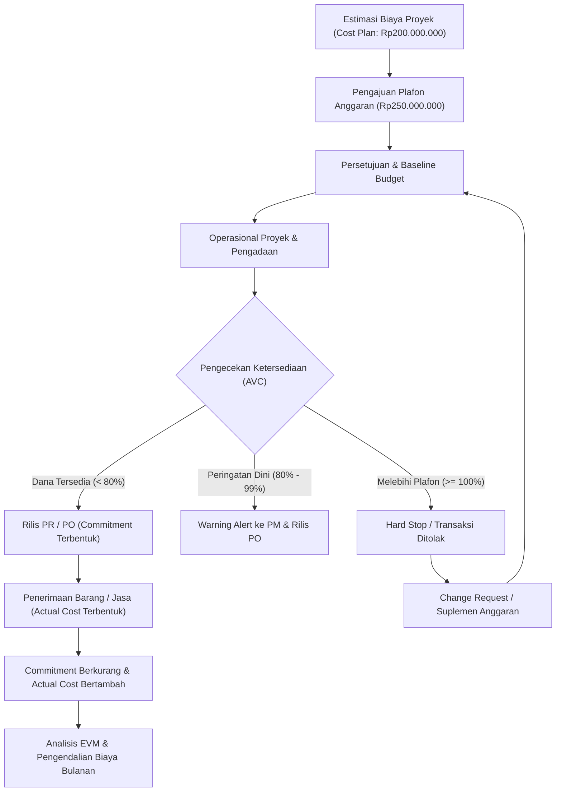

# Project Budget and Cost Control

## Definition

**Project Budget and Cost Control** adalah disiplin tata kelola keuangan proyek di dalam Enterprise Resource Planning (ERP) yang mengatur penetapan otorisasi pagu pengeluaran (*budget authorization*), pelacakan keterikatan dana (*commitments*), pencegahan pembengkakan biaya secara sistemik (*Availability Control* / AVC), serta evaluasi kinerja fisik dan finansial proyek secara berkelanjutan melalui metodologi *Earned Value Management* (EVM).

Berbeda dari *project cost planning* yang bersifat estimasi teknis operasional (berapa perkiraan biaya wajar untuk menyelesaikan pekerjaan), **project budget** adalah instrumen tata kelola finansial resmi yang disetujui oleh manajemen (*approved spending ceiling*) yang menetapkan batas legalitas komitmen pengeluaran modal atau operasional perusahaan.

---

## Purpose

Tujuan implementasi Project Budget and Cost Control di dalam ERP mencakup:

1. **Otorisasi dan Pembatasan Finansial**: Menetapkan plafon pengeluaran mengikat (*binding expenditure limit*) pada level proyek maupun level elemen rincian kerja (WBS).
2. **Pencegahan Pemborosan Dini (*Proactive Control*)**: Mengunci pembuatan transaksi pengadaan (*Purchase Requisition*, *Purchase Order*) sebelum biaya riil terbentuk melalui mekanisme pengecekan saldo anggaran secara otomatis (*Availability Control*).
3. **Visibilitas Komitmen Finansial (*Commitment Tracking*)**: Menyajikan posisi keterikatan dana perusahaan yang sudah diperjanjikan kepada pemasok atau subkontraktor sebelum barang atau tagihan diterima.
4. **Pengukuran Kinerja Objektif**: Membandingkan kemajuan fisik pekerjaan (*earned value*) terhadap biaya yang telah dihabiskan (*actual cost*) dan rencana awal (*planned value*) guna mendeteksi deviasi secara kuantitatif.
5. **Kepatuhan Tata Kelola Perusahaan**: Menyediakan jejak audit (*audit trail*) yang transparan atas setiap penambahan, pemindahan (*transfer*), atau revisi anggaran proyek.

---

## Business Process

Siklus hidup pengelolaan anggaran dan pengendalian biaya proyek terangkum dalam alur sistem berikut:

### Tahapan Proses Bisnis

1. **Budget Formulation & Allocation**:
   - Manajer proyek dan tim keuangan menyusun alokasi anggaran berdasarkan struktur WBS.
   - Pagu anggaran dapat mencakup margin kontinjensi (misalnya estimasi biaya Rp200.000.000 diajukan dengan plafon anggaran Rp250.000.000 sebagai cadangan risiko teknis).
2. **Budget Approval & Baselining**:
   - Anggaran disetujui oleh *Project Sponsor* / *Finance Director*.
   - Sistem membekukan data ini sebagai *Original Budget* / *Baseline Budget*. Setiap perubahan berikutnya dicatat sebagai *Budget Revision* atau *Budget Supplement*.
3. **Commitment Encumbrance**:
   - Saat dokumen *Purchase Requisition* (PR) atau *Purchase Order* (PO) dengan alokasi akun proyek disetujui, ERP langsung mencadangkan dana (*encumbrance*) pada WBS terkait.
4. **Availability Control (AVC) Check**:
   - Setiap transaksi pengeluaran (PR, PO, *Vendor Bill*, *Timesheet*, *Goods Issue*) diperiksa terhadap ketersediaan sisa anggaran sebelum dokumen dapat diposting.
5. **Cost Incurrence & Commitment Reduction**:
   - Saat barang/jasa diterima (*Goods Receipt* / *Service Entry Sheet*), status *Commitment* diubah menjadi *Actual Cost*. Sisa anggaran tetap terjaga secara konsisten.
6. **Performance Analysis (EVM)**:
   - Pada tanggal *closing* bulanan, data kemajuan fisik proyek dikorelasikan dengan realisasi biaya untuk menghitung indeks efisiensi biaya (*Cost Performance Index*) dan jadwal (*Schedule Performance Index*).

---

## Business Rules

Pengendalian anggaran dalam ERP tunduk pada seperangkat aturan bisnis ketat:

### 1. Formula Ketersediaan Anggaran (*Budget Availability Formula*)

$$
\text{Available Budget} = \text{Current Approved Budget} - \text{Actual Costs} - \text{Commitments}
$$

Dimana:
- **Current Approved Budget**: $\text{Original Baseline Budget} + \text{Supplements} - \text{Returns} \pm \text{Transfers}$.
- **Actual Costs**: Akumulasi biaya riil yang telah dibukukan ke buku besar (*General Ledger*) melalui *timesheet*, *goods issue*, dan *vendor bill*.
- **Commitments**: Nilai komitmen pengadaan terbuka (*Open Purchase Orders* dan *Open Purchase Requisitions*) yang belum berstatus tagihan riil.

### 2. Tingkat Toleransi Availability Control (AVC Tolerance Limits)

Sistem ERP menerapkan tingkatan reaksi (*system reaction triggers*) berdasarkan persentase konsumsi anggaran:

| Tingkat Konsumsi | Respon Sistem | Konsekuensi Bisnis |
| :--- | :--- | :--- |
| **0% – 79,9%** | Normal Processing | Transaksi disetujui otomatis tanpa notifikasi khusus. |
| **80% – 99,9%** | Soft Warning | Transaksi tetap diproses, namun sistem mengirimkan notifikasi peringatan (*budget warning alert*) ke PM dan Pengendali Finansial (*Cost Controller*). |
| **$\ge$ 100%** | Hard Stop (Error) | Transaksi diblokir total oleh sistem. PR/PO tidak dapat disetujui atau dirilis tanpa adanya suplemen anggaran (*Budget Supplement*) resmi via Change Request. |

### 3. Level Pengendalian Anggaran (*Control Granularity*)

- **WBS Level Control**: Pengendalian diberlakukan pada masing-masing sub-elemen WBS (misalnya budget *Hardware & Infrastructure* tidak boleh dikonsumsi oleh pekerjaan *Custom Development*).
- **Project Level Control**: Pengendalian diberlakukan pada level puncak proyek, memberikan keleluasaan fleksibilitas relokasi biaya antar WBS selama total pagu proyek belum terlampaui.

---

## Earned Value Management (EVM)

*Earned Value Management* adalah standar global industri untuk mengintegrasikan ruang lingkup, jadwal, dan biaya proyek.

### Parameter Kunci EVM

1. **Planned Value (PV)** / *Budgeted Cost of Work Scheduled* (BCWS):
   - Nilai anggaran yang direncanakan selesai pada titik waktu evaluasi tertentu sesuai *schedule baseline*.
2. **Earned Value (EV)** / *Budgeted Cost of Work Performed* (BCWP):
   - Nilai anggaran dari pekerjaan yang secara fisik benar-benar telah diselesaikan pada titik waktu evaluasi.
   - $\text{EV} = \% \text{ Physical Progress} \times \text{Baseline Budget / Planned Cost}$.
3. **Actual Cost (AC)** / *Actual Cost of Work Performed* (ACWP):
   - Total biaya aktual yang telah dikeluarkan untuk menyelesaikan pekerjaan pada titik waktu evaluasi.

### Indikator Kinerja dan Varians

| Metrik | Formula | Interpretasi |
| :--- | :--- | :--- |
| **Cost Variance (CV)** | $\text{CV} = \text{EV} - \text{AC}$ | **CV > 0**: Di bawah anggaran (*under budget* / hemat) **CV < 0**: Melebihi anggaran (*over budget* / boncos) |
| **Schedule Variance (SV)** | $\text{SV} = \text{EV} - \text{PV}$ | **SV > 0**: Lebih cepat dari jadwal (*ahead of schedule*) **SV < 0**: Terlambat dari jadwal (*behind schedule*) |
| **Cost Performance Index (CPI)** | $\text{CPI} = \frac{\text{EV}}{\text{AC}}$ | **CPI > 1,0**: Efisiensi biaya tinggi (biaya lebih rendah dari rencana) **CPI < 1,0**: Inefisiensi biaya |
| **Schedule Performance Index (SPI)** | $\text{SPI} = \frac{\text{EV}}{\text{PV}}$ | **SPI > 1,0**: Progres fisik mendahului jadwal rencana **SPI < 1,0**: Progres fisik tertinggal dari jadwal |

---

## Accounting Impact

Project Budgeting merupakan instrumen manajerial dan *Cost Accounting* (CO). Meskipun anggaran itu sendiri tidak membentuk entri debit/kredit pada laporan keuangan resmi eksternal (*Financial Accounting* / FI), mekanisme pengendaliannya berdampak langsung pada:

1. **Encumbrance Accounting**:
   - Pada entitas korporasi tertentu atau instansi publik, *commitments* dibukukan sebagai memo atau *commitment ledger* untuk menyajikan reservasi dana sebelum muncul liabilitas riil.
2. **Accrual Integrity**:
   - Memastikan tidak ada pengeluaran liar yang masuk ke akun *Work-in-Progress* (WIP) atau beban operasional (*Project Expense*) tanpa verifikasi anggaran sebelumnya.

---

## Example: Implementasi ERP Naventra

Meneruskan skenario kanonik proyek `PRJ-ERP-2026-001` untuk pelanggan `PT Maju Bersama`:

- **Nilai Kontrak Komersial**: Rp300.000.000
- **Total Approved Budget**: **Rp250.000.000**
- **Planned Cost Baseline**: **Rp200.000.000**

### 1. Struktur Alokasi Anggaran vs Realisasi Biaya

| WBS Code | Deskripsi Elemen | Baseline Cost Plan | Approved Budget | Realisasi Biaya (AC) | Komitmen Terbuka | Sisa Anggaran Tersedia |
| :--- | :--- | :--- | :--- | :--- | :--- | :--- |
| **PRJ-01** | Blueprint & Arsitektur | Rp30.000.000 | Rp35.000.000 | Rp27.000.000 | Rp0 | Rp8.000.000 |
| **PRJ-02** | Konfigurasi & Kustomisasi | Rp70.000.000 | Rp85.000.000 | Rp65.000.000 | Rp0 | Rp20.000.000 |
| **PRJ-03** | Infrastruktur & Integrasi | Rp60.000.000 | Rp75.000.000 | Rp55.000.000 | Rp0 | Rp20.000.000 |
| **PRJ-04** | Deployment & Go-Live | Rp40.000.000 | Rp55.000.000 | Rp34.000.000 | Rp0 | Rp21.000.000 |
| **Total** | | **Rp200.000.000** | **Rp250.000.000** | **Rp181.000.000** | **Rp0** | **Rp69.000.000** |

*Catatan*: Dari plafon anggaran Rp250.000.000, realisasi biaya aktual adalah Rp181.000.000, menghasilkan sisa ketersediaan anggaran sebesar Rp69.000.000.

### 2. Analisis EVM pada Titik Selesai Proyek (100% Completion)

- **Planned Value (PV)**: Rp200.000.000 (Target rencana pengeluaran untuk 100% progres)
- **Earned Value (EV)**: Rp200.000.000 (Pekerjaan selesai 100% dengan bobot anggaran rencana)
- **Actual Cost (AC)**: Rp181.000.000 (Biaya aktual yang dibukukan)

**Perhitungan Varians**:
- $\text{Cost Variance (CV)} = \text{EV} - \text{AC} = \text{Rp200.000.000} - \text{Rp181.000.000} = +\mathbf{Rp19.000.000}$ (*Favorable / Under Budget*).
- $\text{Schedule Variance (SV)} = \text{EV} - \text{PV} = \text{Rp200.000.000} - \text{Rp200.000.000} = \mathbf{Rp0}$ (*On Schedule*).
- $\text{Cost Performance Index (CPI)} = \frac{\text{Rp200.000.000}}{\text{Rp181.000.000}} = \mathbf{1,105}$ (Proyek berkinerja efisien, menghasilkan *value* Rp1,105 untuk setiap Rp1 biaya riil yang dikeluarkan).
- $\text{Schedule Performance Index (SPI)} = \frac{\text{Rp200.000.000}}{\text{Rp200.000.000}} = \mathbf{1,00}$ (Tepat waktu).

> [!NOTE]
> **Interpretasi Metrik SPI pada Penutupan Proyek**:
> Dalam metodologi *Earned Value Management* (EVM), nilai kumulatif *Earned Value* (EV) pada saat proyek selesai 100% secara matematis menyatu dengan nilai total *Planned Value* (PV / BAC = Rp200.000.000), sehingga menghasilkan rasio akhir kumulatif $SPI = 1,00$. Oleh karena itu, konfirmasi ketepatan waktu proyek secara substantif diverifikasi melalui kepatuhan kalender terhadap *Schedule Baseline* (selesai tepat waktu pada 31 Oktober 2026, 184 hari kalender pada jalur kritis tanpa penundaan aktivitas kritis).

---

## ERP Implementation

Tinjauan pola implementasi modul Budget and Cost Control pada software ERP enterprise (disajikan secara deskriptif berdasarkan versi dokumentasi yang dirujuk):

### Odoo Implementation
- **Analytic Accounting Budget**: Odoo menyediakan modul `Account Budget` di mana anggaran ditetapkan pada kombinasi *Analytic Account* (Proyek) dan periode fiskal.
- **Budget Lines**: Setiap baris memuat akun analitik, tanggal mulai/akhir, serta nilai *Planned Amount*.
- **Practical Amount vs Planned Amount**: Odoo menghitung *Practical Amount* secara otomatis dari baris jurnal *Analytic Items* (gabungan dari *Timesheets*, *Vendor Bills*, dan *Customer Invoices*).
- **Mekanisme Peringatan Default**: Secara standar, Odoo menampilkan deviasi anggaran secara visual pada baris analitik dan grafik tanpa memberlakukan pemblokiran mutlak (*hard stop*) transaksi pembuatan PO, kecuali dikombinasikan dengan modul kustom atau alur persetujuan tambahan.

### ERPNext Implementation
- **Project Budgeting & Cost Center**: Anggaran dapat ditetapkan langsung pada dokumen `Project` atau `Cost Center`.
- **Action on Exceed**: ERPNext menyediakan opsi bawaan:
  - *Warn*: Menampilkan pesan peringatan saat PO atau Invoice melampaui batas anggaran.
  - *Stop*: Memblokir transaksi sepenuhnya dan melempar *ValidationError*.
- **Budget Variance Report**: Menyajikan laporan komparatif *Budget vs Actual Expense* yang terhubung ke dokumen General Ledger.

### Dynamics 365 Implementation
- **Project Budget Management**: Dynamics 365 Project Operations mendukung hierarki anggaran proyek terstruktur (*Original Budget*, *Approved Revisions*, *Committed Costs*, *Actual Costs*).
- **Cost Control Tracking**: Menggunakan fasilitas *Cost Control* yang memantau *Cost Categories* (Hour, Expense, Item, Fee).
- **Real-time Commitment Tracking**: Menyimpan status *Pending Cost* untuk transaksi PR dan PO yang belum ditagihkan, serta memberikan pesan kesalahan otomatis (*AVC exception*) bila komitmen melampaui batas yang diotorisasi.

---

## Naventra Consideration

Dalam perancangan modul proyek Naventra ERP:

1. **Kombinasi Hard Stop dan Toleransi Fleksibel**: Menerapkan konfigurasi AVC yang dapat dipilih per jenis biaya (misalnya *Labor Expense* berstatus *Warn* dengan batas 10%, sedangkan *Procurement Subcontractor* berstatus *Hard Stop* 100%).
2. **Otomatisasi Commitment Ledger**: Setiap PO yang diterbitkan ke vendor otomatis mengunci pagu sisa anggaran WBS tanpa harus menunggu proses *Approval Hierarchy* tingkat korporat selesai.
3. **EVM Dashboard Real-Time**: Naventra menyediakan visualisasi kurva-S (*S-Curve*) otomatis yang mempertemukan kurva PV, EV, dan AC secara langsung dari sinkronisasi harian *timesheet* dan transaksi *procurement*.

---

## References

- Project Management Institute (PMI). (2019). *Practice Standard for Earned Value Management*. PMI.
- SAP Help Portal. *Availability Control in Project System (PS)*.
- Microsoft Learn. *Project Budget Management in Dynamics 365 Project Operations*.
- ERPNext Documentation. *Budgeting in ERPNext*.
- Odoo 17.0 Documentation. *Analytic Accounting and Budgeting*.
