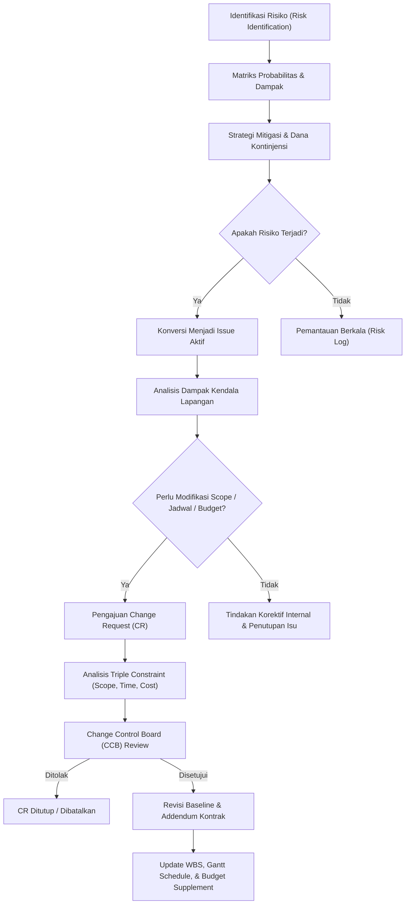

# Project Change, Risk, and Issue Management

## Definition

**Project Change, Risk, and Issue Management** adalah rangkaian proses dan instrumen tata kelola dalam Enterprise Resource Planning (ERP) yang mengidentifikasi, mengevaluasi, memitigasi, serta mengendalikan ketidakpastian (*risks*), masalah operasional yang telah terjadi (*issues*), dan usulan modifikasi terhadap batasan proyek yang telah disepakati (*changes*).

Ketiga elemen ini memiliki perbedaan konseptual mendasar dalam tata kelola ERP:
- **Risk (Risiko)**: Peristiwa atau kondisi tidak pasti di masa depan yang *belum terjadi*, namun jika terjadi akan berdampak positif (*opportunity*) atau negatif (*threat*) pada sasaran proyek. Dikelola melalui penilaian probabilitas dan dampak.
- **Issue (Isu / Kendala Masalah)**: Peristiwa negatif yang *sudah terjadi* di lapangan saat ini dan sedang mengganggu kinerja proyek. Memerlukan tindakan perbaikan langsung (*corrective action*).
- **Change Request (Usulan Perubahan)**: Permintaan formal untuk memodifikasi ruang lingkup (*scope*), jadwal (*schedule*), atau pagu anggaran (*budget*) proyek dari *baseline* yang telah disetujui sebelumnya.

---

## Purpose

Pengelolaan Perubahan, Risiko, dan Isu dalam ERP bertujuan untuk:

1. **Pencegahan *Scope Creep***: Mencegah penambahan pekerjaan tanpa kompensasi biaya atau perpanjangan waktu melalui prosedur persetujuan perubahan resmi.
2. **Perlindungan Terhadap Margin Keuntungan**: Memastikan setiap deviasi biaya atau penambahan spesifikasi teknis dikompensasikan dengan addendum kontrak komersial (*Change Order*).
3. **Peringatan Dini Proaktif (*Early Warning Mechanism*)**: Mengidentifikasi potensi keterlambatan jalur kritis (*critical path*) atau potensi *budget overrun* sebelum risiko menjadi masalah riil.
4. **Akuntabilitas dan Tata Kelola Keputusan**: Menyediakan jejak audit lengkap (*complete audit trail*) mengenai siapa yang mengajukan, menganalisis dampak, dan menyetujui perubahan parameter proyek.
5. **Resolusi Isu Sistemik**: Memetakan kendala lapangan langsung ke modul logistik, keuangan, atau pengadaan ERP guna mempercepat eskalasi dan penyelesaian masalah.

---

## Business Process

Alur terintegrasi pengelolaan perubahan, risiko, dan isu disajikan dalam bagan alur berikut:

### Tahapan Alur Change Management (Manajemen Perubahan)

1. **Change Identification & Request**:
   - Pihak klien (*PT Maju Bersama*) atau tim internal mengajukan formulir *Change Request* (CR) digital yang mendeskripsikan kebutuhan modifikasi fitur atau jadwal.
2. **Impact Assessment (Triple Constraint)**:
   - Manajer proyek bersama tim teknis menganalisis implikasi usulan perubahan terhadap:
     - **Scope**: Modifikasi WBS dan *deliverables*.
     - **Schedule**: Penambahan durasi kerja dan pergeseran *milestone*.
     - **Cost / Budget**: Tambahan jam kerja konsultan, biaya lisensi, atau pengadaan hardware tambahan.
3. **Change Control Board (CCB) Review**:
   - Komite pengendali perubahan (*Project Sponsor*, PM Klien, dan PM Pelaksana) mengevaluasi kelayakan bisnis usulan tersebut.
4. **Baseline Revision & Contract Addendum**:
   - Jika disetujui, ERP membuka otorisasi untuk merevisi *Schedule Baseline*, menerbitkan *Budget Supplement*, dan menghasilkan amandemen kontrak komersial (*Sales Contract Addendum*).

---

## Business Rules

### 1. The Triple Constraint Trade-Off Rule
Tidak ada perubahan pada salah satu dimensi batasan proyek (*Scope*, *Time*, *Cost*) yang dapat disetujui tanpa mengevaluasi dan menyesuaikan dua dimensi lainnya secara proporsional.

### 2. Matriks Prioritas Risiko (Risk Scoring Matrix)
Tingkat keparahan risiko dihitung melalui formula standar:
$$
\text{Risk Score} = \text{Probability (1–5)} \times \text{Impact (1–5)}
$$
- **Skor 1 – 6 (Low Risk)**: Strategi penerimaan (*Acceptance*) atau pemantauan berkala.
- **Skor 8 – 14 (Medium Risk)**: Strategi mitigasi (*Mitigation*) dengan alokasi tindakan preventif.
- **Skor 15 – 25 (High Risk)**: Wajib dialokasikan cadangan kontinjensi waktu (*time buffer*) dan anggaran kontinjensi (*management reserve*).

### 3. Otoritas Persetujuan Perubahan (Approval Matrix)
- **CR Dampak Rendah** (Biaya < Rp5.000.000, Jadwal < 3 hari): Cukup disetujui oleh Project Manager.
- **CR Dampak Tinggi** (Biaya $\ge$ Rp5.000.000 atau mengubah tanggal *Go-Live*): Wajib disetujui secara bersama oleh Direksi Pelaksana dan *Project Sponsor* Pelanggan melalui amandemen formal.

---

## Accounting Impact

Manajemen perubahan dan isu memiliki dampak finansial dan akuntansi langsung di dalam ERP:

1. **Revisi Anggaran dan Komitmen (*Budget Revision vs Supplement*)**:
   - *Budget Revision*: Pergeseran alokasi anggaran antar WBS tanpa mengubah total pagu proyek (netto perubahan = Rp0).
   - *Budget Supplement*: Penambahan plafon anggaran baru yang disetujui, yang meningkatkan batas pengecekan *Availability Control* (AVC).
2. **Amandemen Kontrak Penjualan (*Sales Contract Amendment*)**:
   - Menghasilkan kenaikan nilai piutang yang dapat ditagihkan dan memperbarui nilai total pengakuan pendapatan (*IFRS 15 Transaction Price Modification*).
3. **Pencatatan Biaya Perbaikan Isu (*Rework Costs*)**:
   - Biaya perbaikan *bug* atau instalasi ulang dicatat sebagai biaya aktual WBS, yang mengikis margin laba kotor proyek jika tidak dapat dibebankan ulang (*non-billable rework*).

---

## Example: Implementasi ERP Naventra

Meneruskan skenario kanonik proyek `PRJ-ERP-2026-001` untuk pelanggan `PT Maju Bersama`:

### 1. Manajemen Risiko Proyek (Risk Register)

| Risk ID | Deskripsi Risiko | Kategori | Probabilitas (1-5) | Dampak (1-5) | Skor Risiko | Rencana Mitigasi |
| :--- | :--- | :--- | :--- | :--- | :--- | :--- |
| **RSK-01** | Keterlambatan Pengiriman Server Staging dari Vendor | Pengadaan | 3 | 4 | **12 (Medium)** | Menerbitkan PO 4 minggu lebih awal dan menyewa cloud instance sementara jika terlambat. |
| **RSK-02** | Kualitas Data Master Warisan (*Legacy Data Cleansing*) Rendah | Teknis | 4 | 3 | **12 (Medium)** | Mengadakan workshop validasi data awal pada Fase Blueprint. |
| **RSK-03** | Penolakan Pengguna Akhir (*User Resistance*) saat Cutover | Organisasi | 2 | 4 | **8 (Medium)** | Menyelenggarakan program *Change Management* dan sesi *Train-the-Trainer* intensif. |

### 2. Manajemen Isu Lapangan (Issue Log)

- **Issue ID**: `ISS-01`
- **Deskripsi Masalah**: Terjadi ketidaksesuaian format file ekspor data pelanggan dari sistem warisan saat simulasi migrasi data pada Fase 3.
- **Tingkat Keparahan (*Severity*)**: Tinggi (*High*).
- **Tindakan Penyelesaian**: *Senior Consultant* menyusun skrip konversi format Python otomatis dalam 2 hari kerja.
- **Dampak Biaya/Jadwal**: Tertangani dalam batas alokasi waktu buffer tanpa memicu keterlambatan jadwal go-live.

### 3. Pengendalian Perubahan (Change Request Evaluation)

- **Kasus**: Klien sempat mengajukan usulan penambahan modul kustomisasi pelaporan pajak khusus di luar ruang lingkup blueprint awal.
- **Hasil Evaluasi CCB**: Usulan perubahan dinilai akan memundurkan jadwal *Go-Live* sebesar 2 minggu dan menambah biaya tenaga kerja Rp15.000.000.
- **Keputusan**: Klien dan pelaksana sepakat menunda perubahan tersebut ke Fase 2 pasca *Go-Live*, sehingga ruang lingkup awal proyek `PRJ-ERP-2026-001` tetap terkendali pada pagu anggaran awal (Rp250.000.000) dan berhasil diselesaikan dengan biaya aktual Rp181.000.000.

---

## ERP Implementation

Penerapan manajemen perubahan, risiko, dan isu pada platform ERP utama:

### Odoo Implementation
- **Project Issues & Chatter**: Odoo mengelola kendala operasional menggunakan modul `Helpdesk` atau tahap *Task/Issue tracking* terintegrasi.
- **Chatter Audit Trail**: Setiap perubahan status, lampiran dokumen BAST, atau komentar PM tercatat otomatis pada jejak komunikasi (*Chatter*).
- **Sub-tasks & Task Stage Transitions**: Perubahan ruang lingkup dikelola dengan menambahkan sub-task baru dan mengatur ulang tenggat waktu (*deadline*).

### ERPNext Implementation
- **Issue DocType**: ERPNext memiliki dokumen standar `Issue` yang dapat dikaitkan langsung dengan `Project` dan `Customer`.
- **Project Update Feature**: PM dapat memposting pembaruan status berkala (*Project Update*) yang merangkum isu terbuka, risiko tertangani, dan persentase penyelesaian.
- **Workflow & Role-based Approvals**: Mengonfigurasi alur kerja bertingkat untuk dokumen perubahan status proyek.

### Dynamics 365 Implementation
- **Project Risks and Issues Entities**: Dynamics 365 Project Operations menyediakan entitas khusus untuk *Risk Management* (kategori, probabilitas, dampak, rencana mitigasi) dan *Issue Management*.
- **Baseline Tracking & Revisions**: Mendukung penyimpanan versi *Baseline* ganda (Baseline 0, Baseline 1, dst.) sehingga deviasi akibat *Change Order* dapat dibandingkan secara visual pada bagan Gantt historis.
- **Contract Performance Changes**: Mengintegrasikan amandemen kontrak komersial (*Contract Performance Obligations*) langsung dengan perubahan nilai anggaran proyek di buku besar.

---

## Naventra Consideration

Dalam perancangan modul tata kelola proyek Naventra ERP:

1. **Terintegrasi ke Matriks RACI**: Setiap isu yang tercatat secara otomatis menugaskan penanggung jawab (*Action Item Owner*) dan mengirimkan eskalasi bertahap jika isu tidak terselesaikan dalam SLA yang ditetapkan.
2. **Impact Simulation Engine**: Antarmuka *Change Request* Naventra menyediakan simulator interaktif: memasukkan perubahan durasi aktivitas atau penambahan jam kerja langsung menampilkan prediksi dampak pada tanggal *Go-Live* dan margin laba kotor proyek.
3. **Audit Trail Amandemen Baseline**: Setiap revisi jadwal atau pagu anggaran wajib mencantumkan nomor persetujuan CCB digital dan menyimpan salinan *snapshot* baseline sebelumnya untuk keperluan audit kepatuhan internal.

---

## References

- Project Management Institute (PMI). (2021). *A Guide to the Project Management Body of Knowledge (PMBOK Guide)* (7th ed.). Project Management Institute.
- International Organization for Standardization. (2020). *ISO 21502: Project, programme and portfolio management — Guidance on project management*. ISO.
- SAP Help Portal. *Claim and Change Management in Project System (PS)*.
- Microsoft Learn. *Manage Project Risks and Issues in Dynamics 365*.
- ERPNext Documentation. *Issue Management in Projects*.
- Odoo 17.0 Documentation. *Project Collaboration and Issue Tracking*.
