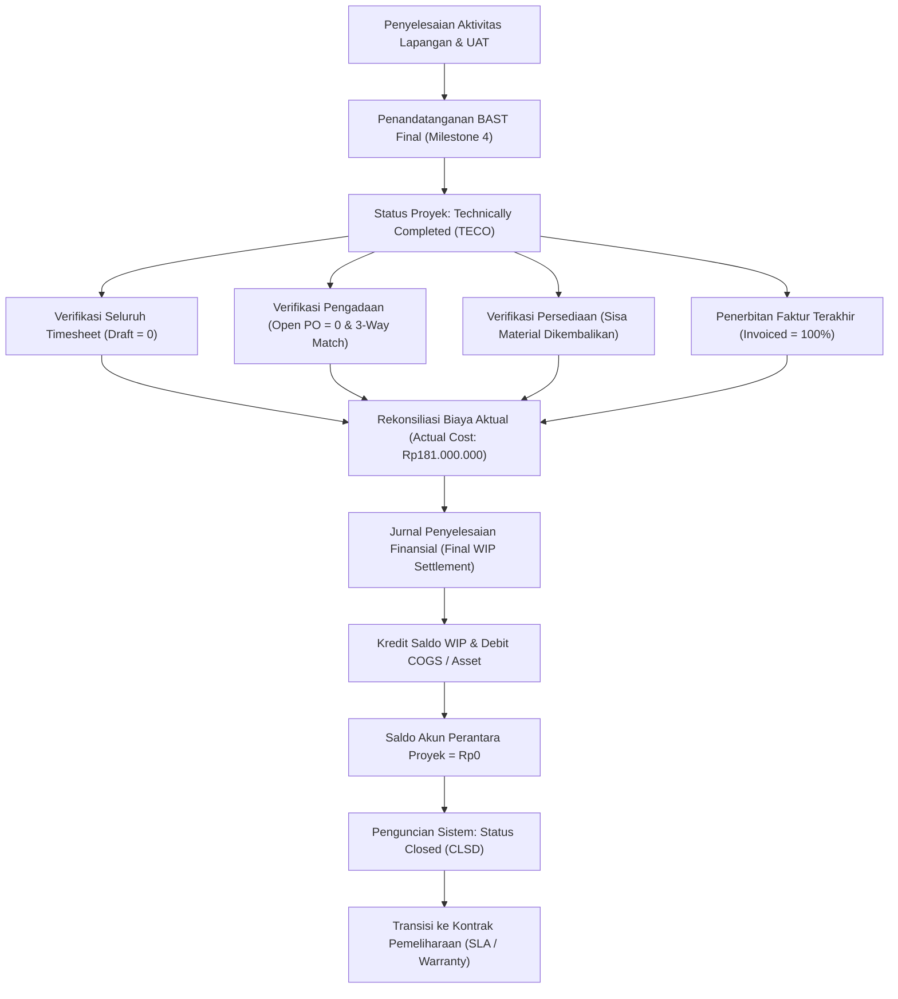

# Project Completion and Closing

## Definition

**Project Completion and Closing** adalah fase penutupan formal suatu proyek di dalam Enterprise Resource Planning (ERP) yang mengintegrasikan serah terima teknis operasional (*technical completion / handover*), penyelesaian administratif pengadaan dan persediaan, rekonsiliasi piutang-utang, penyelesaian akhir akuntansi (*final financial settlement*), serta penguncian sistem secara permanen (*system status closure*) untuk mencegah timbulnya transaksi susulan yang tidak terotorisasi.

Di dalam ERP enterprise, penutupan proyek dibedakan secara tegas antara dua tahapan utama:
1. **Technical Completion (TECO / Serah Terima Teknis)**: Seluruh pekerjaan operasional di lapangan telah selesai 100%, seluruh hasil kerja (*deliverables*) telah diterima oleh pelanggan via Berita Acara Serah Terima (BAST), namun kewajiban finansial (pembayaran tagihan vendor atau penyelesaian akuntansi akhir) masih dapat berjalan.
2. **Financial / Business Closing (CLSD / Penutupan Finansial)**: Seluruh saldo biaya dan pendapatan telah diselesaikan (*settled*), komitmen terbuka dinolkan, seluruh tagihan vendor dan pelanggan telah lunas/terekonsiliasi, dan objek biaya proyek dikunci secara total dari segala bentuk posting buku besar.

---

## Purpose

Tujuan dari proses Project Completion and Closing di dalam ERP adalah:

1. **Penguncian Obyek Biaya (*Cost Object Lockdown*)**: Mencegah kebocoran biaya di mana jam kerja konsultan (*timesheet*) atau biaya pengadaan lain diposting secara keliru ke proyek yang sudah selesai.
2. **Penyelesaian Saldo Akuntansi (WIP Clearing & Settlement)**: Menolkan akun perantara *Work-in-Progress* (WIP) dan memindahkannya secara definitif ke Beban Pokok Pendapatan (*Cost of Goods Sold* / COGS) untuk proyek pelanggan, atau dikapitalisasi ke Aset Tetap (*Fixed Assets*) untuk proyek internal CAPEX.
3. **Pelepasan Komitmen Anggaran (*De-commitment*)**: Menutup pesanan pembelian (*Purchase Orders*) terbuka yang tersisa agar sisa dana dapat dilepaskan kembali ke kas perbendaharaan perusahaan.
4. **Kepastian Hak Komersial dan Retensi**: Memastikan seluruh milestone telah difakturkan, pembayaran PPN telah dilaporkan, dan klaim retensi (*warranty retention*) dikelola sesuai kontrak.
5. **Transisi ke Fase Pemeliharaan (*Hypercare / SLA Handover*)**: Mengalihkan tanggung jawab operasional dari tim implementasi proyek ke tim pendukung layanan (*Customer Support / Maintenance Operations*).

---

## Business Process

Alur penutupan terintegrasi proyek disajikan dalam diagram berikut:

### Tahapan Penutupan Proyek (*Project Closing Steps*)

1. **Operational Deliverable Verification**:
   - Manajer proyek memastikan seluruh deliverable yang tercantum dalam kontrak telah diserahkan dan diverifikasi oleh pelanggan.
2. **BAST Sign-Off & Status TECO**:
   - Penandatanganan BAST penyelesaian akhir memicu pembaruan status sistem menjadi *Technically Completed* (TECO). Pada status ini, pembuatan PR/PO baru diblokir, namun penerimaan invoice vendor yang tertunda masih diperbolehkan.
3. **Commitment Clean-Up & PO Closure**:
   - Mengidentifikasi seluruh PO terbuka. Jika ada sisa kuantitas yang tidak akan dikirim, status baris PO diubah menjadi *Final Delivery* / *Closed*, melepaskan saldo komitmen menjadi Rp0.
4. **Timesheet Sweep & Approval**:
   - Memastikan tidak ada lembar waktu (*timesheet*) karyawan yang masih berstatus *Draft* atau *Submitted*. Seluruh jam kerja wajib disetujui (*Approved*) dan diposting ke buku besar analitik.
5. **Final Billing & AR Reconciliation**:
   - Memastikan faktur milestone penutup telah diterbitkan (total penagihan mencapai 100% nilai kontrak komersial).
6. **Financial Settlement (WIP Clearing)**:
   - Modul akuntansi proyek menjalankan prosedur penyelesaian akhir (*Project Settlement Execution*), memindahkan akumulasi saldo debit WIP ke akun Harga Pokok Penjualan (HPP).
7. **Business Closing (CLSD)**:
   - Setelah saldo WIP bernilai Rp0 dan seluruh rekonsiliasi selesai, status proyek diubah menjadi *Closed* (CLSD). Proyek terkunci permanen dari segala transaksi posting debit/kredit.

---

## Business Rules

### 1. Kriteria Wajib Penutupan Finansial (Closing Prerequisites)
Sistem ERP akan menolak perubahan status proyek ke *Closed* (CLSD) apabila salah satu dari kondisi berikut masih aktif:
- Masih terdapat dokumen *Purchase Order* atau *Purchase Requisition* yang berstatus terbuka (*Open Commitment* > 0).
- Masih terdapat reservasi material gudang yang belum dibatalkan atau belum dikeluarkan.
- Masih terdapat entri *Timesheet* berstatus *Draft* atau *Pending Approval*.
- Masih terdapat saldo sisa pada akun neraca *Work-in-Progress* (WIP) proyek yang belum diselesaikan (*settled*).

### 2. Penghentian Hak Posting (*Posting Authorization Revocation*)
Begitu proyek beralih status ke *Closed*, otorisasi posting untuk objek biaya tersebut dicabut secara otomatis. Upaya pembebanan biaya susulan akan melempar pesan kesalahan *Validation Error* pada GL.

### 3. Pengelolaan Masa Pemeliharaan / Garansi (*Warranty Period*)
Biaya perbaikan atau pendampingan yang timbul selama masa garansi (*hypercare period*) tidak boleh dibebankan ke objek biaya proyek yang sudah ditutup. Biaya tersebut dialokasikan ke objek biaya garansi terpisah (*Warranty Cost Center / Maintenance Contract*).

---

## Accounting Impact

Pencatatan akuntansi penutupan proyek berfokus pada penyelesaian akhir saldo akumulasi biaya (*Work-in-Progress Settlement*):

### 1. Sebelum Penutupan (Kondisi Akun Proyek Berjalan)
Selama proyek dieksekusi, seluruh biaya operasional (tenaga kerja Rp90M, pengadaan Rp55M, material Rp28M, biaya lain Rp8M) terakumulasi di akun neraca:
- **Saldo Debit Akun Work-in-Progress (WIP) Proyek**: Rp181.000.000

### 2. Jurnal Penyelesaian Finansial Akhir (Contoh Skenario: Final WIP Settlement to COGS)

Pada skenario pembelajaran proyek pelanggan ini, saldo akun perantara WIP dikreditkan menjadi Rp0 pada saat penutupan dan direklasifikasi secara definitif sebagai Harga Pokok Penjualan (COGS) pada Laporan Laba Rugi:

$$\begin{array}{llrr}
\text{Debit:} & \text{Cost of Goods Sold (HPP Proyek Pelanggan)} & \text{Rp181.000.000} & \\
\text{Kredit:} & \text{Work-in-Progress (WIP) Proyek} & & \text{Rp181.000.000}
\end{array}$$

*Kondisi Pasca Jurnal*:
- Saldo Akun WIP Proyek: **Rp0** (Bersih / *Zero Balance*).
- Saldo Beban HPP Proyek di Laba Rugi: **Rp181.000.000**.
- Pendapatan Proyek yang Diakui di Laba Rugi: **Rp300.000.000**.
- Laba Kotor Terealisasi: $\text{Rp300.000.000} - \text{Rp181.000.000} = \mathbf{Rp119.000.000}$.

> [!NOTE]
> **Caveat Kebijakan Akuntansi & IFRS 15 / PSAK 72**:
> Pemindahan saldo akumulasi biaya proyek dari akun neraca (WIP) ke COGS sekaligus pada penutupan akhir merupakan contoh perlakuan akuntansi berdasarkan kebijakan kontrak serah terima (*Point in Time*). Dalam praktik akuntansi riil, perlakuan ini bukan aturan mutlak dan dapat bervariasi bergantung pada:
> 1. **Metode Pengakuan Pendapatan**: Pada proyek dengan pengakuan pendapatan sepanjang waktu (*Over Time* - metode *Cost-to-Cost*), beban pokok proyek umumnya diakui secara proporsional setiap periode bulanan bersamaan dengan pengakuan pendapatan, bukan ditumpuk di neraca hingga penutupan.
> 2. **Kriteria Kapitalisasi Biaya Kontrak**: Biaya yang boleh ditangguhkan di neraca harus memenuhi kriteria biaya pemenuhan kontrak (*Costs to Fulfill a Contract* - IFRS 15.95). Biaya inefisiensi, biaya penawaran awal (*selling expenses*), atau beban administratif umum wajib langsung dibebankan (*expensed as incurred*).
> 3. **Proyek Investasi Modal (CAPEX)**: Untuk proyek aset internal, saldo WIP dikapitalisasi ke Aset Tetap (*CWIP to PPE*), seperti dibahas pada [[08-assets/asset-acquisition-and-capitalization|Phase 9]]. Rujuk ke [[02-accounting/revenue-and-expense|Phase 3]] untuk standar akuntansi pendapatan dan beban.

---

## Example: Implementasi ERP Naventra

Meneruskan skenario kanonik proyek `PRJ-ERP-2026-001` untuk pelanggan `PT Maju Bersama`:

- **Nilai Kontrak Proyek**: Rp300.000.000 (asumsi PPN 11% untuk permodelan pembelajaran)
- **Total Biaya Aktual**: Rp181.000.000
- **Tanggal Go-Live Sukses**: 31 Oktober 2026 (Sesuai target rencana *Baseline Schedule* 184 hari kalender; administrasi penutupan & serah terima formal diselesaikan awal November 2026)

### Checklist Penutupan Proyek pada ERP Naventra

| Kategori Checklist | Item Verifikasi | Status Audit Sistem | Keterangan Hasil |
| :--- | :--- | :--- | :--- |
| **Operasional Teknis** | Seluruh 4 Milestone Selesai 100% | **Lolos (Passed)** | M1, M2, M3, M4 selesai tepat waktu |
| **Legal / Komersial** | Penandatanganan BAST Final 100% | **Lolos (Passed)** | BAST No. 04/BAST-PRJ/XI/2026 ditandatangani klien |
| **Manajemen Waktu** | Verifikasi Timesheet Konsultan | **Lolos (Passed)** | 920 jam kerja disetujui & diposting (Draft = 0) |
| **Pengadaan & PO** | Kliring Komitmen Vendor & Subkon | **Lolos (Passed)** | Seluruh PO diselesaikan, Open Commitment = Rp0 |
| **Logistik & Gudang** | Rekonsiliasi Material Jaringan | **Lolos (Passed)** | Retur kabel Rp2M telah diposting, reservasi stok = 0 |
| **Penagihan Piutang** | Faktur Penjualan Termin Pelanggan | **Lolos (Passed)** | 100% difakturkan (Rp300M + PPN), piutang terekonsiliasi |
| **Akuntansi Finansial** | Final WIP Settlement to COGS | **Lolos (Passed)** | Jurnal penyelesaian Rp181M diposting, saldo WIP = Rp0 |
| **Status Sistem** | Pembaruan Status Proyek Akhir | **Selesai (Closed)** | Status sistem diubah ke `Closed` (CLSD) |

Dengan selesainya checklist ini, proyek `PRJ-ERP-2026-001` secara resmi ditutup dengan margin laba kotor sebesar **Rp119.000.000 (39,67%)**. Layanan pendampingan selanjutnya dipindahkan ke tiket kontrak SLA (*Service Level Agreement*).

---

## ERP Implementation

Prosedur penutupan proyek pada platform ERP enterprise:

### Odoo Implementation
- **Project Stage & Archived Status**: Odoo memindahkan proyek ke tahap (*stage*) *Done* atau mengubah status menjadi *Archived*.
- **Lock Analytic Lines**: Penguncian periode akuntansi analitik (*Analytic Lock Dates*) mencegah pengguna memasukkan jam kerja atau memposting tagihan vendor ke akun analitik proyek yang bersangkutan.
- **Milestone Delivery 100%**: Memastikan seluruh baris pesanan penjualan (*Sales Order Lines*) yang ditautkan ke milestone proyek telah berstatus *Fully Delivered* dan *Fully Invoiced*.

### ERPNext Implementation
- **Project Status "Completed"**: Pengguna mengubah status proyek menjadi *Completed*, yang secara otomatis memperbarui status seluruh *Tasks* di dalamnya.
- **Disable Transactions**: ERPNext menyediakan opsi validasi untuk menolak pembuatan `Purchase Order`, `Stock Entry`, atau `Timesheet` baru yang merujuk pada proyek yang telah berstatus *Completed* atau *Cancelled*.
- **Gross Profit Validation**: Meninjau laporan profitabilitas proyek untuk memastikan seluruh biaya perolehan telah terhubung ke modul akuntansi.

### Dynamics 365 Implementation
- **Project Stage Progression**: Dynamics 365 Project Operations mendukung transisi tahap formal: *Created* $\rightarrow$ *Estimated* $\rightarrow$ *Scheduled* $\rightarrow$ *In Progress* $\rightarrow$ *Completed* $\rightarrow$ *Closed*.
- **Elimination / Project Settlement**: Untuk proyek investasi, modul *Project Management and Accounting* menjalankan transaksi *Elimination* untuk mengkapitalisasi WIP ke Aset Tetap. Untuk proyek pelanggan, sistem menyelesaikan biaya ke akun COGS.
- **Business Status Lock**: Status *Closed* secara permanen mencabut hak posting pada seluruh jurnal proyek (*Project Journals*).

---

## Naventra Consideration

Dalam perancangan modul penutupan proyek Naventra ERP:

1. **Automated Closing Pre-Flight Check**: Naventra menyediakan *Closing Wizard* interaktif yang memindai sistem dalam 1 klik untuk mendeteksi apakah masih ada lembar timesheet belum disetujui, reservasi stok aktif, atau komitmen PO terbuka sebelum mengizinkan penutupan.
2. **One-Click WIP Settlement Execution**: Tombol *Execute Final Settlement* secara otomatis menyusun dan memvalidasi jurnal pemindahan WIP ke COGS dengan perhitungan varians biaya otomatis.
3. **Automated Warranty Ticket Routing**: Begitu status beralih ke *Closed*, Naventra secara otomatis membuat entitas *Maintenance Contract* baru dengan masa aktif 90 hari, memetakan tim helpdesk yang berhak menerima tiket garansi dari pelanggan *PT Maju Bersama*.

---

## References

- Project Management Institute (PMI). (2021). *A Guide to the Project Management Body of Knowledge (PMBOK Guide)* (7th ed.). Project Management Institute.
- SAP Help Portal. *Completion and Technical Closing in Project System (PS)*.
- Microsoft Learn. *Project Stages and Project Closure in Dynamics 365*.
- ERPNext Documentation. *Closing a Project in ERPNext*.
- Odoo 17.0 Documentation. *Project Completion and Archiving*.
