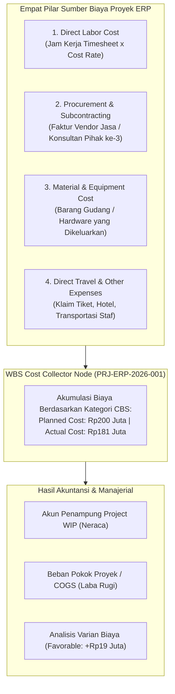
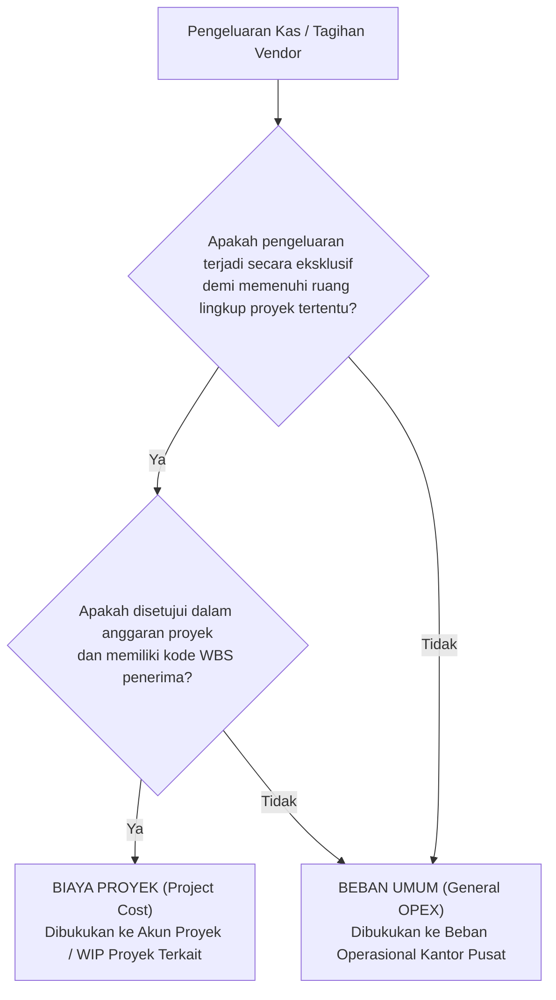

# Project Cost Management

## Definition

**Project Cost Management** dalam sistem ERP adalah proses sistematis yang mencakup estimasi, penganggaran (*budgeting*), pengalokasian, pengumpulan (*cost collection*), dan pengendalian atas seluruh pengeluaran moneter yang terjadi selama siklus pelaksanaan proyek.

Dalam arsitektur ERP enterprise, biaya proyek tidak dicatat sebagai angka agregat tunggal, melainkan diurai ke dalam **Cost Breakdown Structure (CBS)** yang dipetakan secara presisi ke simpul-simpul WBS. Setiap transaksi pengeluaran—apakah itu jam kerja konsultan, pembelian lisensi vendor pihak ketiga, pengeluaran kabel jaringan dari gudang, atau klaim tiket pesawat dinas—diberi penetapan akun (*Account Assignment*) ke kode proyek, membentuk **Biaya Aktual (*Actual Cost*)**, dan dibandingkan dengan **Biaya Rencana (*Planned Cost*)** untuk mengevaluasi efisiensi kinerja keuangan.

---

## Purpose

1. **Visibilitas Struktur Biaya Riil (*True Cost Transparency*)**: Mengetahui secara akurat rincian pengeluaran per kategori biaya (tenaga kerja, material, vendor luar) di setiap fase proyek WBS.
2. **Pengukuran Deviasi Biaya (*Cost Variance Tracking*)**: Membandingkan realisasi biaya aktual terhadap estimasi rencana awal (*Baseline Planned Cost*) guna mendeteksi pembengkakan biaya sedini mungkin.
3. **Penyelarasan Beban Pokok Proyek (*Matching Principle*)**: Menampung biaya proyek selama masa pengerjaan dalam akun aset sementara (*Project Work in Progress - WIP*) dan memindahkannya ke Beban Pokok Penjualan (*Cost of Services/Sales*) saat pendapatan diakui.
4. **Alokasi Biaya Tidak Langsung (*Overhead Allocation*)**: Mengalokasikan biaya fasilitas kantor, sewa server bersama, atau biaya manajemen proyek pusat (*PMO overhead*) secara adil ke proyek berdasarkan basis tarif terstandar.
5. **Pondasi Analisis Profitabilitas Kontrak**: Menyediakan data biaya aktual yang bersih dan tervalidasi untuk menghitung margin laba kotor (*Gross Project Margin*) terhadap nilai kontrak klien.

---

## Kategori Struktur Biaya Proyek (Cost Breakdown Structure - CBS)

ERP membagi seluruh pengeluaran proyek ke dalam lima kategori komponen biaya standar:

| Kategori Biaya (CBS) | Karakteristik Operasional | Dokumen Sumber Transaksi | Contoh Kasus (Proyek ERP Naventra) |
| :--- | :--- | :--- | :--- |
| **1. Direct Labor Cost (Tenaga Kerja Langsung)** | Biaya waktu kerja staf internal yang dicurahkan langsung untuk mengerjakan deliverable proyek. | Lembar kerja mingguan (*Approved Timesheet*). | 920 jam kerja tim konsultan & arsitek solusi = **Rp90.000.000**. |
| **2. Procurement & Subcontracting (Subkontrak)** | Pengadaan jasa tenaga ahli spesialis eksternal, lisensi proprietary, atau pihak ketiga. | Pesanan Pembelian Jasa (*Service PO*) & Faktur Vendor. | Jasa instalasi infrastruktur cloud & lisensi database = **Rp55.000.000**. |
| **3. Material & Equipment (Bahan & Perangkat)** | Barang berwujud fisik yang dibeli atau ditarik dari gudang persediaan untuk dipasang di lokasi proyek. | Surat Bukti Pengeluaran Barang (*Goods Issue*) & PO Material. | Pengadaan server mikro cadangan & kabel jaringan = **Rp28.000.000**. |
| **4. Direct Expenses / T&E (Perjalanan & Lapangan)** | Pengeluaran incidental staf untuk transportasi, hotel, perizinan lokasi, dan konsumsi rapat klien. | Formulir Klaim Beban (*Expense Claim Report*) & Bukti Kuitansi. | Biaya tiket pesawat dan hotel tim teknis ke pabrik klien = **Rp8.000.000**. |
| **5. Allocated Overhead (Biaya Tidak Langsung)** | Porsi biaya umum perusahaan yang dibebankan ke proyek berdasarkan tarif alokasi (misal: per jam kerja). | Siklus Alokasi Akuntansi Biaya (*Periodic Cost Allocation*). | Alokasi beban lisensi tool kolaborasi dan manajemen kantor. |

---

## Biaya Proyek vs Beban Operasional Umum (Expense Boundary)

Tidak semua pengeluaran uang di perusahaan dapat dimasukkan sebagai biaya proyek. Pengeluaran diklasifikasikan sebagai **Biaya Proyek (*Project Cost*)** jika memenuhi kriteria keterlacakan langsung (*Direct Traceability*):

---

## Analisis Varian Biaya (Planned vs Actual Cost Variance)

ERP mengevaluasi kesehatan finansial proyek melalui indikator varian biaya:

$$\text{Cost Variance (CV)} = \text{Planned Cost} - \text{Actual Cost}$$

- **Varian Positif ($\text{CV} > 0$ / Favorable)**: Biaya aktual lebih rendah daripada rencana awal (penghematan anggaran / efisiensi kerja).
- **Varian Negatif ($\text{CV} < 0$ / Unfavorable)**: Biaya aktual melampaui estimasi rencana (terjadi pembengkakan biaya yang mengancam margin laba).

---

## Business Rules

1. **Mandatory WBS Assignment for Project Cost Postings**: Setiap transaksi yang menimbulkan pengeluaran finansial proyek (apakah dari modul Purchasing, Inventory, HR Timesheet, atau Expense Claim) wajib mencantumkan kode elemen WBS yang berstatus terbuka (*open for posting*).
2. **Account Assignment Category Enforcement**: Pesanan pembelian (PO) yang membebankan biaya ke proyek wajib menggunakan kategori penetapan akun proyek (misal: *Account Assignment P* pada SAP atau *Analytic Account* pada Odoo/ERPNext) agar sistem memblokir biaya tersebut masuk ke pos operasional umum.
3. **Expense Claim Policy Compliance**: Seluruh klaim biaya perjalanan dan akomodasi dinas proyek (*T&E Claims*) wajib divalidasi terhadap kebijakan batas plafon harian (*Daily Per Diem Allowance*) sebelum disahkan sebagai biaya proyek.
4. **No Retroactive Cost Reclassification After Period Closing**: Transaksi biaya yang telah terposting dan berada pada periode fiskal akuntansi yang telah ditutup (*Closed Accounting Period*) dilarang direklasifikasi atau dipindahkan antar-proyek tanpa melalui penerbitan dokumen jurnal penyesuaian resmi (*Correction Voucher*).
5. **Overhead Allocation Basis Consistency**: Metode dan tarif pembebanan biaya tidak langsung (*overhead rate*) ke proyek wajib menggunakan formula basis alokasi yang konsisten sepanjang tahun fiskal berjalan.

---

## Accounting & Financial Impact

Mekanisme pencatatan biaya proyek menghubungkan modul operasional dengan neraca dan laba rugi:

### 1. Pembukuan Konsumsi Material Gudang ke Proyek
Pengeluaran kabel jaringan dan modul konektor senilai Rp28.000.000 dari gudang persediaan:

| Akun | Debit (IDR) | Kredit (IDR) | Keterangan |
| :--- | :--- | :--- | :--- |
| `510200 - Beban Pokok Proyek: Bahan & Material` | 28.000.000 | - | Dibukukan pada Proyek `PRJ-ERP-2026-001` (WBS `2.1`) |
| `141000 - Persediaan Barang Dagang / Material` | - | 28.000.000 | Pengurangan saldo persediaan gudang (Phase 6) |

### 2. Pembukuan Tagihan Vendor Subkontraktor
Penerimaan faktur jasa dari vendor PT Sumber Teknologi senilai Rp55.000.000 untuk pengadaan lisensi dan konfigurasi server cloud:

| Akun | Debit (IDR) | Kredit (IDR) | Keterangan |
| :--- | :--- | :--- | :--- |
| `510400 - Beban Pokok Proyek: Jasa Subkontraktor` | 55.000.000 | - | Dibukukan pada Proyek `PRJ-ERP-2026-001` (WBS `2.2`) |
| `211100 - Accounts Payable` | - | 55.000.000 | Kewajiban utang dagang ke vendor (Phase 5) |

---

## Canonical Scenario: Realisasi Struktur Biaya Proyek PT Maju Bersama

Pada penutupan proyek **Implementasi ERP Naventra** (`PRJ-ERP-2026-001`), rekonsiliasi perbandingan antara estimasi rencana (*Planned Cost*) dan realisasi biaya aktual (*Actual Cost*) tersaji sebagai berikut:

| Kategori Biaya Proyek (CBS) | Estimasi Rencana (Planned) | Realisasi Aktual (Actual) | Varian Biaya (IDR) | Status Varian |
| :--- | :--- | :--- | :--- | :--- |
| **1. Direct Labor (920 jam kerja tim)** | Rp100.000.000 | Rp90.000.000 | +Rp10.000.000 | Favorable (Hemat 10%) |
| **2. Procurement (Vendor Subkontrak)** | Rp60.000.000 | Rp55.000.000 | +Rp5.000.000 | Favorable (Hemat 8,3%) |
| **3. Material (Server & Hardware)** | Rp30.000.000 | Rp28.000.000 | +Rp2.000.000 | Favorable (Hemat 6,7%) |
| **4. Direct Other / Travel Expenses** | Rp10.000.000 | Rp8.000.000 | +Rp2.000.000 | Favorable (Hemat 20%) |
| **TOTAL BIAYA PROYEK** | **Rp200.000.000** | **Rp181.000.000** | **+Rp19.000.000** | **Favorable (Hemat 9,5%)** |

*Verifikasi Nilai: Total Biaya Rencana ($\mathbf{Rp200.000.000}$) dan Total Biaya Aktual ($\mathbf{Rp181.000.000}$) konsisten secara mutlak dengan baseline skenario kanonikal repositori.*

---

## ERP Implementation

Perbandingan kapabilitas manajemen biaya proyek lintas sistem ERP enterprise:

| Parameter Pengelolaan Biaya | Odoo Enterprise | ERPNext | Microsoft Dynamics 365 | SAP S/4HANA Finance |
| :--- | :--- | :--- | :--- | :--- |
| **Model Akumulasi Biaya** | Integrasi *Analytic Accounts* dan *Analytic Distribution* | Pengelompokan biaya via *Cost Center* terhubung ke Project | Integrasi *Project cost categories* & *Cost Breakdown Structure* | Akumulasi biaya sangat mendalam pada elemen WBS (*Controlling - CO*) |
| **Pemisahan Kategori Biaya (CBS)** | Tagging akun analitik berbasis grup biaya | Tabel *Project Costing* per tipe transaksi | *Cost categories (Labor, Expense, Material, Item)* bawaan | *Cost Elements (Biaya Primer & Sekunder)* terkonfigurasi ketat |
| **Alokasi Biaya Overhead** | Memerlukan model analitik distribusi berkala | Memerlukan entitas jurnal penyesuaian kustom | Fitur alokasi biaya tidak langsung (*Indirect cost components*) | Mesin alokasi canggih *Periodic Cost Allocation / Surcharge Rates* |
| **Analisis Varian Biaya (CV)** | Analisis komparasi spreadsheet atau pivot table | Laporan analitik *Project Profitability & Cost Variance* | Laporan varian *Cost tracking & Variance analysis workspace* | Laporan analitik standar *Plan/Actual/Variance Comparison (S_ALR)* |

---

## Naventra Consideration

Rancangan arsitektur modul Project Cost Management pada Naventra ERP:

1. **Multi-Source Cost Ingestion Pipeline**: Naventra memproses pengumpulan biaya proyek melalui *Event Ingestion Worker*. Setiap kali modul eksternal menerbitkan transaksi terikat proyek (misal `TimesheetApproved`, `InvoicePosted`, `MaterialIssued`), worker secara asinkron memperbarui saldo pada tabel `project_cost_ledger` tanpa membebani transaksi utama.
2. **Deterministic CBS Tagging Engine**: Sistem mewajibkan setiap item biaya dipetakan ke kode kategori biaya baku (`LABOR`, `SUBCONTRACT`, `MATERIAL`, `TRAVEL`, `OVERHEAD`). Hal ini memungkinkan ekstraksi laporan perbandingan varian biaya dilakukan secara terstandardisasi lintas proyek.
3. **Automated WIP Settlement Processor**: Pada akhir bulan fiskal, Naventra menyediakan modul kalkulasi *WIP Settlement* otomatis yang menghitung akumulasi biaya proyek yang belum ditagihkan dan memposting jurnal reklasifikasi neraca sesuai aturan akuntansi kontrak yang ditetapkan.

---

## References

- Project Management Institute (PMI). *Practice Standard for Project Estimating*, 2nd Edition.
- SAP SE. *Cost and Revenue Planning in SAP S/4HANA Project System*. SAP Help Portal.
- Microsoft Corporation. *Project cost tracking and categories in Dynamics 365 Project Operations*. Microsoft Learn.
- Chartered Institute of Management Accountants (CIMA). *Cost Accounting and Project Cost Management Guidelines*.
- Frappe Technologies. *Project Costing and Tracking in ERPNext*. ERPNext Documentation.
