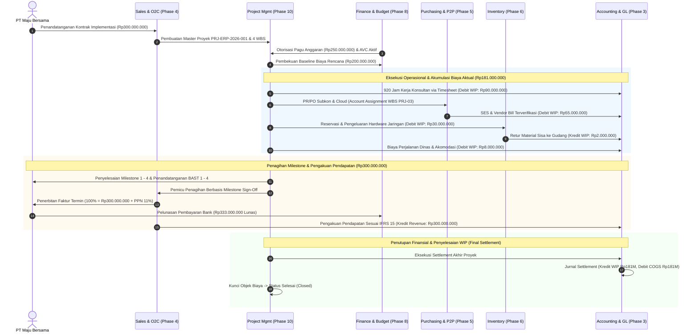

# Project Integration

## Definition

**Project Integration** adalah arsitektur integrasi lintas modul di dalam Enterprise Resource Planning (ERP) yang menempatkan manajemen proyek (*Project Management*) sebagai simpul koordinasi operasional dan objek biaya (*cost object / financial anchor*) yang menyatukan aliran data dari Penjualan (Sales), Pengadaan (Procurement), Persediaan (Inventory), Manufaktur (Production), Aset Tetap (Fixed Assets), Keuangan (Finance), dan Akuntansi (Financial & Management Accounting).

Di dalam arsitektur ERP enterprise, modul proyek bukan merupakan modul mandiri yang berdiri sendiri (*silo*), melainkan berfungsi sebagai *orchestrator* multidisiplin yang memastikan setiap keputusan teknis operasional langsung tercermin dalam komitmen pengadaan, mutasi fisik barang gudang, dan pencatatan buku besar akuntansi secara *real-time*.

---

## Purpose

Tujuan integrasi proyek lintas modul dalam ERP adalah:

1. **Penghapusan Fragmentasi Data (*Single Source of Truth*)**: Menghubungkan seluruh dokumen bisnis (kontrak penjualan, pesanan pengadaan, mutasi stok persediaan, kartu jam kerja, dan faktur tagihan) ke satu identitas proyek terpadu.
2. **Pengendalian Keuangan Tertutup (*Closed-Loop Financial Control*)**: Menjamin bahwa setiap pengeluaran atau komitmen yang terjadi di departemen mana pun dicek ketersediaan anggarannya (*Availability Control*) terhadap struktur rincian kerja (WBS).
3. **Penyelarasan Siklus Hidup Proyek dengan Siklus Finansial**: Memastikan transisi dari perencanaan kontrak komersial hingga serah terima teknis (*BAST*) beriringan dengan pengakuan pendapatan (*IFRS 15*) dan penyelesaian saldo akuntansi (*WIP Settlement*).
4. **Visibilitas Kinerja End-to-End**: Menyajikan transparansi menyeluruh dari proposal penjualan awal hingga margin laba kotor realisasi setelah proyek ditutup.

---

## Cross-Module Integration Matrix

Tabel berikut merangkum matriks integrasi mendalam antara Project Management dengan domain modul ERP lainnya (Fase 1 hingga Fase 9):

| Domain / Modul Terkait | Titik Integrasi Teknis (*Integration Touchpoint*) | Dokumen / Transaksi Terlibat | Arah Aliran Data | Dampak Operasional & Finansial |
| :--- | :--- | :--- | :--- | :--- |
| **Sales & O2C (Fase 4)** | Hubungan Kontrak Komersial & Milestone Billing | Sales Order $\longleftrightarrow$ Project WBS, Customer Invoice, BAST | Sales $\rightarrow$ Project $\rightarrow$ Sales | SO membuat Project; Milestone selesai memicu penerbitan Faktur Penjualan (AR). |
| **Purchasing & P2P (Fase 5)** | Pengadaan Khusus Proyek & Subkontraktor | Purchase Requisition (PR), PO (Account Assignment `P`), Service Entry Sheet (SES), Vendor Bill | Project $\rightarrow$ Purchasing $\rightarrow$ Accounting | PO mengunci komitmen anggaran WBS; SES/Vendor Bill membentuk biaya aktual dan hutang usaha (AP). |
| **Inventory (Fase 6)** | Material Khusus Proyek & Reservasi Gudang | Project BOM, Stock Reservation, Goods Issue to WBS (`Mvt 221`), Material Return | Project $\longleftrightarrow$ Warehouse | Pengeluaran barang mendebit biaya proyek (WIP) dan mengkredit nilai persediaan gudang. |
| **Manufacturing (Fase 7)** | Produksi ETO (*Engineer-to-Order*) & Komponen Khusus | Production Order tertaut WBS, Work Center Allocation | Project $\longleftrightarrow$ Production | Perintah produksi terjadwal pada Gantt proyek; hasil produksi diserap langsung ke WBS proyek. |
| **Finance (Fase 8)** | Pengendalian Anggaran & Arus Kas (*Treasury*) | Approved Budget, Availability Control (AVC), Project Cash Flow Schedule | Finance $\longleftrightarrow$ Project | Pengecekan saldo anggaran otomatis (AVC); penjadwalan kas masuk dari termin penagihan. |
| **Fixed Assets (Fase 9)** | Proyek Investasi Modal / Konstruksi (CAPEX) | Capital Project WBS, Construction-in-Progress (CWIP), Asset Capitalization | Project $\rightarrow$ Fixed Assets | Akumulasi biaya proyek diselesaikan (*settled*) menjadi aset tetap berwujud pada modul aktiva. |
| **Accounting (Fase 3)** | Akuntansi Biaya, Pengakuan Pendapatan, & Closing | Analytic Ledger, WIP Account, COGS, IFRS 15 Contract Asset/Liability | Project $\longleftrightarrow$ General Ledger | Pengakuan pendapatan berbasis kemajuan (*Over Time*); penyelesaian saldo WIP ke akun HPP saat penutupan. |

---

## Full End-to-End Trace: Skenario Kanonik PT Maju Bersama

Berikut adalah rekam jejak terpadu (*comprehensive trace*) eksekusi proyek `PRJ-ERP-2026-001` (*Implementasi ERP Naventra*) untuk pelanggan `PT Maju Bersama`:

### Rekonsiliasi Finansial Terpadu Skenario Kanonik:

1. **Dimensi Komersial (Pendapatan & Kas Masuk)**:
   - Nilai Kontrak Komersial: **Rp300.000.000**
   - Total Difakturkan: **Rp300.000.000** ($100\%$)
   - Pajak Pertambahan Nilai (PPN 11%): **Rp33.000.000**
   - Total Piutang Tertagih & Kas Masuk: **Rp333.000.000**
2. **Dimensi Tata Kelola Anggaran (Finance)**:
   - Pagu Anggaran Disetujui (*Approved Budget*): **Rp250.000.000**
   - Batas Ketersediaan Anggaran Terpakai: **Rp181.000.000** ($72,4\%$)
   - Sisa Anggaran Tidak Terpakai (*Unused Budget Reserve*): **Rp69.000.000**
3. **Dimensi Pengendalian Biaya Operasional (Cost Management)**:
   - Estimasi Rencana Biaya (*Baseline Planned Cost*): **Rp200.000.000**
   - Biaya Aktual Terealisasi (*Actual Cost Incurred*): **Rp181.000.000**
     - Biaya Tenaga Kerja (*Labor Cost* - 920 jam): Rp90.000.000
     - Biaya Pengadaan (*Procurement Cost* - Subkon & Cloud): Rp55.000.000
     - Biaya Material (*Material Cost* - Hardware & Kabel): Rp28.000.000
     - Biaya Perjalanan & Operasional (*Expenses*): Rp8.000.000
   - Varians Biaya Bersih (*Net Cost Variance*): **+Rp19.000.000** (*Favorable / Under Budget*)
4. **Dimensi Profitabilitas (P&L)**:
   - Pendapatan Diakui: **Rp300.000.000**
   - Beban Pokok Pendapatan (COGS setelah settlement WIP): **(Rp181.000.000)**
   - **Gross Project Margin Realisasi**: **Rp119.000.000** (**39,67%**)
   - Ekspansi Margin vs Target Awal: **+6,34 poin persentase** (dari target awal 33,33%)

> [!NOTE]
> **Catatan Asumsi & Kebijakan Akuntansi Skenario**:
> 1. **Pajak Pertambahan Nilai (PPN)**: Skenario menggunakan asumsi PPN efektif 11% semata-mata untuk tujuan permodelan dan konsistensi numerik pembelajaran. Perlakuan dan tarif pajak aktual harus selalu mengikuti ketentuan perpajakan Indonesia yang berlaku pada periode transaksi terkait.
> 2. **Penyelesaian Saldo WIP (Settlement)**: Pemindahan saldo WIP menjadi COGS pada akhir proyek merupakan contoh perlakuan akuntansi berdasarkan kebijakan akuntansi kontrak skenario ini. Pada praktik riil di bawah IFRS 15 / PSAK 72, perlakuan beban aktual bergantung pada metode pengakuan pendapatan (*Over Time* vs *Point in Time*) serta kualifikasi biaya pemenuhan kontrak (*Contract Fulfillment Costs* vs *Period Expenses*). Rujuk ke [[02-accounting/revenue-and-expense|Phase 3]] dan [[03-sales/revenue-recognition|Phase 4]].

---

## ERP Software Comparison Summary

Tabel berikut menyajikan ringkasan deskriptif pola implementasi pada software ERP enterprise berdasarkan dokumentasi resmi versi yang dirujuk (Odoo 17.0, ERPNext v14/v15, dan Microsoft Dynamics 365 Project Operations). Perbandingan ini bersifat ilustratif deskriptif dan bukan merupakan pemeringkatan keunggulan produk:

| Kriteria / Fitur | Odoo 17.0 | ERPNext (v14/v15) | Microsoft Dynamics 365 (Project Operations) |
| :--- | :--- | :--- | :--- |
| **Arsitektur Integrasi** | Didorong oleh *Analytic Distribution* pada baris transaksi. | Didorong oleh field referensi *Project* dan *Cost Center* terpusat. | Didorong oleh struktur multi-tier WBS dan *Project Financial Dimensions*. |
| **WBS Hierarchy** | Sederhana (Proyek $\rightarrow$ Tahapan $\rightarrow$ Tugas $\rightarrow$ Sub-tugas). | Hierarki standar (Project $\rightarrow$ Task tree). | Hierarki mendalam (*Enterprise WBS* dengan dependensi multi-level). |
| **Budget Availability Control** | Pelaporan analitik visual; mekanisme peringatan default tanpa *hard stop* otomatis bawaan. | Menyediakan aksi *Warn* atau *Stop* saat melebihi anggaran. | *Availability Control (AVC)* terintegrasi dan pelacakan komitmen *real-time*. |
| **Timesheet Costing** | Tarif biaya per karyawan atau peran analitik. | Tarif biaya dan tarif penagihan per aktivitas / karyawan. | Arsitektur tarif ganda (*Cost Rate Matrix* vs *Billing Rate Matrix*) berbasis dimensi. |
| **Revenue Recognition** | Ditautkan ke kebijakan Sales Order (Timesheets/Milestones). | Sales Invoice reguler dengan jadwal pembayaran termin. | Modul *IFRS 15 Revenue Recognition* terdedikasi (Cost-to-Cost & Straight-Line). |
| **Material Management** | Pemindahan persediaan ke akun analitik proyek. | Dokumen `Stock Entry` bertipe *Material Issue to Project*. | Dokumen *Item Requirements* khusus yang terintegrasi dengan modul Supply Chain & MRP. |

---

## Naventra Consideration

Dalam perancangan arsitektur inti modul manajemen proyek Naventra ERP:

1. **Unified Project Anchor Object**: Setiap entitas operasional dan finansial dalam database Naventra memiliki relasi kunci asing (*Foreign Key*) langsung ke `project_id` dan `wbs_id`, menjamin integritas data lintas modul tanpa memerlukan integrasi batch terpisah.
2. **Real-time Closed-Loop Control**: Mengintegrasikan mesin *Availability Control* (AVC) bertingkat untuk mengontrol konsumsi budget, komitmen (*commitment*), dan biaya aktual (*actual cost*) secara konsisten saat *Purchase Requisition*, *Purchase Order*, atau *Timesheet* diajukan oleh pengguna lapangan sesuai kebijakan organisasi.
3. **Automated End-to-End Orchestration**: Dari penandatanganan kontrak komersial hingga penutupan finansial (*WIP Settlement*), Naventra memandu pengguna melalui antarmuka *Project Lifecycle Wizard* terpandu yang meminimalkan entri manual dan mencegah salah saji akuntansi.

---

## References

- Project Management Institute (PMI). (2021). *A Guide to the Project Management Body of Knowledge (PMBOK Guide)* (7th ed.). Project Management Institute.
- International Accounting Standards Board (IASB). (2014). *IFRS 15: Revenue from Contracts with Customers*. IFRS Foundation.
- SAP Help Portal. *Cross-Application Project System (PS) Architecture*.
- Microsoft Learn. *Dynamics 365 Project Operations Architecture and Integration*.
- ERPNext Documentation. *Projects Module Integration*.
- Odoo 17.0 Documentation. *Project and Cross-App Integrations*.
