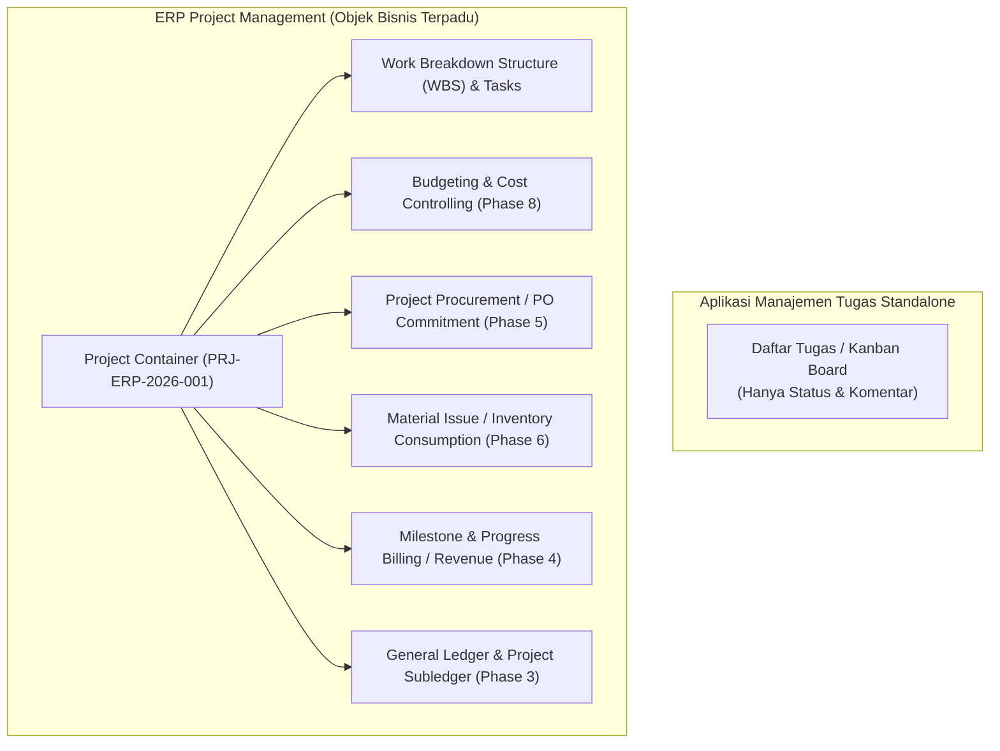
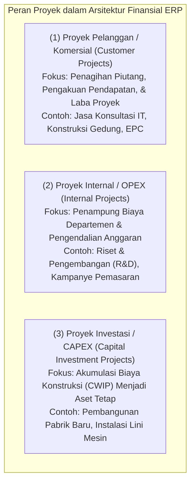
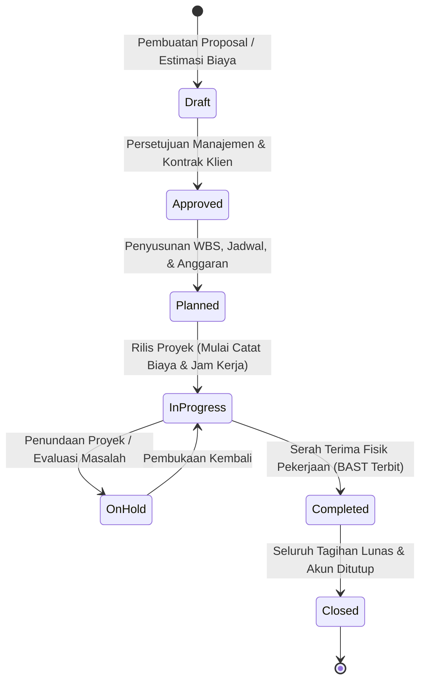
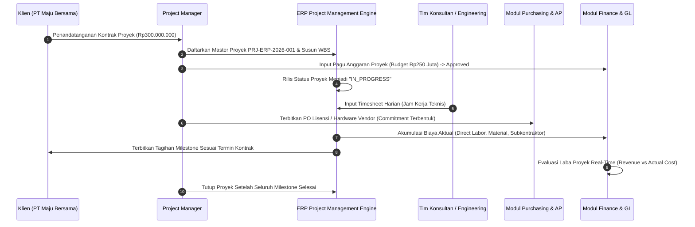
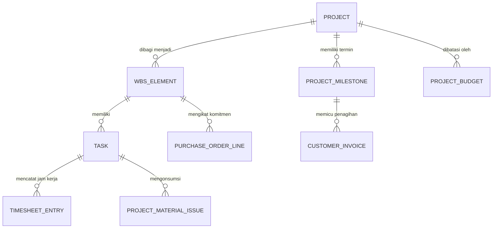
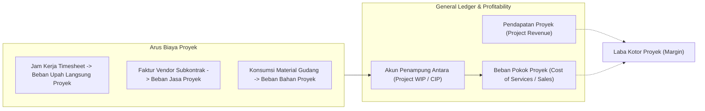

# Project Management Fundamentals

## Definition

**Project Management dalam sistem ERP** adalah tata kelola terpadu atas proyek sebagai **objek bisnis dan objek pengendali finansial (*Business & Financial Cost/Revenue Object*)** yang mengintegrasikan ruang lingkup kerja (*scope*), waktu (*time*), sumber daya (*resources*), pengadaan (*procurement*), persediaan (*inventory*), penagihan (*billing*), serta pencatatan akuntansi ke dalam satu kesatuan sistem informasi perusahaan.

Berbeda dengan aplikasi manajemen tugas umum (*standalone task management tools* seperti Trello, Asana, atau Jira) yang hanya berfokus pada kolaborasi kartu dan status penyelesaian tugas teknis, **Project Management dalam ERP menjembatani eksekusi operasional dengan buku besar akuntansi (*General Ledger*) dan arus kas perusahaan**. Setiap jam kerja yang dilaporkan pada *timesheet*, setiap barang yang diambil dari gudang, dan setiap pesanan pembelian (*Purchase Order*) yang diterbitkan ke vendor secara otomatis terikat (*account-assigned*) pada proyek, membentuk biaya aktual (*actual cost*), mengonsumsi anggaran (*budget commitment*), dan memicu penagihan piutang pelanggan (*customer billing*).

---

## Purpose

1. **Visibilitas Biaya dan Pendapatan Real-Time (*Project Profitability Visibility*)**: Mengetahui secara seketika apakah suatu proyek menghasilkan laba atau mengalami pembengkakan biaya (*cost overrun*) tanpa menunggu laporan keuangan akhir bulan.
2. **Pengendalian Komitmen dan Anggaran (*Budget & Commitment Control*)**: Mencegah staf proyek menerbitkan pesanan pembelian atau merekrut konsultan eksternal yang melebihi batas plafon pagu anggaran proyek yang telah disetujui.
3. **Penyelarasan Alur Kerja Operasional dan Penagihan (*Billing Synchronization*)**: Mengotomatisasi penagihan kepada klien berdasarkan pencapaian tonggak kerja (*milestones*), persentase penyelesaian fisik (*progress*), atau pemakaian waktu dan material (*Time & Material*).
4. **Alokasi Sumber Daya Manusia yang Akurat**: Mengonversi jam kerja personel pada *timesheet* menjadi beban pokok proyek (*direct labor cost*) sekaligus dasar penagihan jasa konsultasi.
5. **Kepatuhan Pengakuan Pendapatan Kontrak (*IFRS 15 Compliance*)**: Memfasilitasi pengakuan pendapatan berbasis waktu (*over time*) atau titik waktu (*point in time*) sesuai pemenuhan kewajiban pelaksanaan kontrak.

---

## Proyek sebagai Objek Bisnis Finansial (Financial Project Roles)

Dalam ERP, proyek diklasifikasikan ke dalam tiga peran ekonomi utama:

1. **Customer / Commercial Projects (Proyek Eksternal)**: Dibuat berdasarkan pesanan atau kontrak penjualan (*Sales Order / Contract*). Proyek ini menghasilkan arus kas masuk (*cash inflows*), mencatat biaya langsung, menerbitkan faktur ke pelanggan, dan dievaluasi margin laba kotornya (*Gross Project Margin*).
2. **Internal OPEX Projects (Proyek Operasional Internal)**: Dibuat untuk inisiatif internal perusahaan. Proyek ini tidak memiliki pendapatan eksternal; seluruh biaya yang terkumpul dialokasikan (*settled*) ke *Cost Center* departemen penanggung jawab pada akhir periode.
3. **Capital Investment Projects (Proyek CAPEX / Aset Tetap)**: Proyek pembangunan atau perakitan aset berumur panjang. Seluruh biaya pengadaan komponen, upah pekerja konstruksi, dan jasa kontraktor ditampung dalam akun *Construction in Progress (CIP/CWIP)* dan dikapitalisasi menjadi aset tetap aktif pada modul [[08-assets/asset-acquisition-and-capitalization|Fixed Assets (Phase 9)]] saat proyek selesai.

---

## Perbedaan Mendasar Konsep Kunci Proyek

Untuk mencegah kerancuan pemodelan sistem, ERP membedakan konsep-konsep berikut secara tegas:

| Pasangan Konsep | Objek A | Objek B | Pembeda Utama dalam ERP |
| :--- | :--- | :--- | :--- |
| **Project vs Task** | **Project**: Wadah (*container*) tingkat atas yang menampung kontrak, anggaran, dan laporan laba rugi. | **Task**: Aktivitas kerja individual di bawah proyek yang memiliki durasi, penanggung jawab, dan ketergantungan. | Biaya dan penagihan diagregasi di tingkat Project/WBS; eksekusi harian dilakukan di tingkat Task. |
| **Planning vs Scheduling** | **Planning**: Menentukan *apa* yang harus dikerjakan (WBS, ruang lingkup, estimasi anggaran biaya). | **Scheduling**: Menentukan *kapan* pekerjaan dilakukan dan *siapa* resource yang mengerjakannya (Gantt chart, dependensi). | Planning bersifat konseptual dan finansial; scheduling bersifat operasional dan temporal. |
| **Budget vs Commitment vs Actual** | **Budget**: Pagu dana disetujui. **Commitment**: Nilai PO/PR terbuka. | **Actual Cost**: Beban riil yang telah terposting via invoice/timesheet. | $\text{Available} = \text{Budget} - \text{Commitment} - \text{Actual}$. Mencegah pembengkakan biaya sedini mungkin. |
| **Timesheet vs Payroll** | **Timesheet**: Catatan jam kerja yang dialokasikan ke proyek spesifik. | **Payroll**: Perhitungan kompensasi gaji bulanan karyawan oleh HR. | Jam kerja timesheet menggerakkan biaya tenaga kerja proyek; payroll membayar uang gaji ke rekening karyawan. |
| **Billing vs Revenue Recognition** | **Project Billing**: Penerbitan faktur tagihan (*invoice*) ke pelanggan. | **Revenue Recognition**: Pengakuan pendapatan resmi di Laporan Laba Rugi sesuai IFRS 15. | Tagihan ke pelanggan belum tentu langsung diakui sebagai pendapatan jika kewajiban performa belum terpenuhi. |
| **Project Completion vs Financial Close** | **Project Completion**: Serah terima fisik pekerjaan secara operasional (BAST). | **Financial Closing**: Penyelesaian seluruh utang/piutang dan penutupan buku proyek di GL. | Proyek dapat berstatus selesai secara fisik namun tetap terbuka secara finansial untuk kliring invoice sisa. |

---

## Siklus Hidup Proyek (Project Lifecycle in ERP)

ERP mengendalikan siklus hidup proyek melalui mesin status (*State Machine*) terstandarisasi:

1. **Draft (Konsep / Penawaran)**: Tahap inisiasi awal saat tim penjualan atau operasional menyusun proposal penawaran (*Quotation*). Belum ada pencatatan akuntansi atau pemotongan anggaran.
2. **Approved (Disetujui)**: Kontrak kerja disahkan oleh pelanggan atau disetujui direksi untuk proyek internal. Nomor ID Proyek resmi diterbitkan.
3. **Planned (Terencana)**: Struktur WBS, pembagian tugas (*tasks*), jadwal *Gantt Chart*, penetapan tim (*resources*), dan batas pagu anggaran (*Budget Register*) dikunci menjadi *Baseline*.
4. **In Progress (Sedang Berjalan)**: Proyek dirilis (*Released*). Anggota tim dapat mengisi *timesheet*, tim pengadaan dapat menerbitkan PR/PO dengan referensi ID Proyek, dan material gudang dapat dikeluarkan.
5. **On Hold (Ditunda)**: Proyek dibekukan sementara akibat kendala perizinan, keterlambatan pembayaran klien, atau sengketa teknis. Pengeluaran biaya baru diblokir oleh sistem.
6. **Completed (Selesai Operasional)**: Seluruh tugas dan pengiriman deliverables fisik selesai dan diserahterimakan dengan Berita Acara Serah Terima (BAST). Tidak ada lagi pengisian *timesheet* baru.
7. **Closed (Ditutup Finansial)**: Seluruh faktur vendor telah diverifikasi (*Three-Way Matched*), seluruh tagihan klien telah lunas (*AR Cleared*), saldo penampung biaya proyek telah diselesaikan (*settled*), dan status proyek dikunci permanen.

---

## Business Process

Alur kerja fundamental integrasi proyek dalam sistem ERP:

---

## Business Rules

1. **Mandatory Project ID on Project-Related Transactions**: Setiap transaksi pembelian (PR/PO), pengeluaran material gudang (*Goods Issue*), klaim biaya dinas (*Expense Claim*), dan pencatatan jam kerja (*Timesheet*) yang ditujukan untuk proyek wajib mencantumkan kode Proyek (*Project ID*) atau kode elemen WBS yang valid.
2. **Budget Enforcement Gate (Availability Control - AVC)**: Transaksi operasional (seperti PO pengadaan jasa subkontraktor atau material khusus) wajib divalidasi terhadap sisa pagu anggaran proyek. Jika total $\text{Actual} + \text{Commitment} + \text{Transaksi Baru} > \text{Budget}$, sistem wajib memicu peringatan (*Soft Warning*) atau pemblokiran transaksi (*Hard Stop*) sesuai kebijakan toleransi anggaran.
3. **Timesheet Period Lockout**: Jam kerja *timesheet* dilarang diinput atau diubah secara retrospektif pada periode yang telah ditutup (*closed accounting period*) atau pada proyek yang telah berstatus *Completed/Closed*.
4. **Strict Separation of Operational Completion from Financial Close**: Status proyek dilarang diubah menjadi *Closed* jika masih terdapat dokumen terbuka (*open commitments*, pesanan pembelian yang belum terbit fakturnya, atau saldo penampung WIP yang belum dialokasikan ke akun beban pokok penjualan/aset tetap).
5. **No Billing Without Milestone / Deliverable Sign-Off**: Pada proyek berbasis kontrak termin (*Milestone Billing*), penerbitan faktur piutang ke pelanggan dilarang dieksekusi sebelum status milestone diverifikasi selesai (*Approved Milestone*) dengan bukti lampiran Berita Acara yang sah.

---

## Data & Entity Model (Konseptual)

Struktur entitas konseptual modul Project Management dalam ERP:

- **Project Master**: Entitas induk (ID Proyek, Nama, Klien, Manajer Proyek, Tanggal Mulai/Selesai, Tipe Proyek, Mata Uang, Nilai Kontrak).
- **WBS Element**: Node hierarki pembagian kerja yang bertindak sebagai pusat akumulasi biaya (*cost aggregation node*).
- **Task**: Unit aktivitas terkecil yang memuat durasi rencana, tanggal awal/akhir, dependensi (*predecessors*), dan penugasan staf.
- **Project Budget**: Alokasi pagu dana per kategori biaya (Tenaga Kerja, Pengadaan/Subkontrak, Material, Biaya Lainnya).
- **Timesheet Entry**: Rekaman jam kerja harian personel per tugas yang membawa tarif biaya (*Cost Rate*) dan tarif tagih (*Billing Rate*).

---

## Accounting & Financial Impact

Integrasi proyek dengan akuntansi berpusat pada penampungan biaya langsung dan pengakuan pendapatan:

- **Saat Biaya Terjadi**: Biaya tenaga kerja internal, suku cadang, dan vendor dicatat pada akun penampung proyek (*Project Cost Accounts* atau *WIP*).
- **Saat Penagihan & Pengakuan**: Faktur diterbitkan ke pelanggan (Debit Piutang Usaha / AR, Kredit Pendapatan Proyek), dan saldo biaya dialihkan ke Beban Pokok Proyek (*Cost of Sales/Services*).
- *(Untuk penjelasan komprehensif mengenai jurnal penagihan dan pengakuan pendapatan IFRS 15, rujuk ke [[03-sales/revenue-recognition|Phase 4]] dan [[02-accounting/revenue-and-expense|Phase 3]])*.

---

## Canonical Scenario: PT Maju Bersama

Dalam seluruh Phase 10 ini, skenario kanonikal pembelajaran yang digunakan adalah proyek implementasi sistem informasi pada pelanggan utama:

- **Project ID**: `PRJ-ERP-2026-001`
- **Nama Proyek**: Implementasi ERP Naventra
- **Pelanggan / Klien**: `PT Maju Bersama`
- **Nilai Kontrak (Contract Value / Revenue)**: **Rp300.000.000** (Belum termasuk PPN; skenario mengasumsikan tarif PPN 11% untuk permodelan pembelajaran, dengan ketentuan pajak aktual mengikuti regulasi Indonesia yang berlaku pada periode transaksi)
- **Pagu Anggaran Disetujui (*Project Budget*)**: **Rp250.000.000**
- **Estimasi Biaya Rencana (*Total Planned Cost*)**: **Rp200.000.000**
- **Target Margin Kotor Rencana**: Rp300.000.000 - Rp200.000.000 = **Rp100.000.000 (33,33%)**
- **Durasi Proyek**: 6 Bulan (01 Mei 2026 s.d. 31 Oktober 2026)
- **Struktur Pembayaran**: Milestone Billing 4 Termin (20% - 30% - 30% - 20%).

---

## ERP Implementation

Perbandingan kapabilitas dasar modul Project Management lintas sistem ERP enterprise:

| Fitur Fondasi | Odoo Enterprise | ERPNext | Microsoft Dynamics 365 | SAP S/4HANA Finance |
| :--- | :--- | :--- | :--- | :--- |
| **Model Objek Proyek** | Modul *Project* terhubung ke *Analytic Account* dan *Sales Order* | Doctype terpusat *Project* terintegrasi ke *Cost Center* | Solusi terdedikasi *Dynamics 365 Project Operations* | Modul enterprise terdepan *Project System (SAP PS)* |
| **Hierarki WBS** | Struktur bertingkat via *Parent Task / Subtasks* | Struktur hirarki bertingkat via *Parent Project* dan *Tasks* | Hirarki *Work Breakdown Structure (WBS)* komprehensif | Struktur dua pilar: *WBS Elements (Finansial)* dan *Networks/Activities (Logistik)* |
| **Kontrol Komitmen Anggaran** | Terbatas pada perbandingan akun analitik | Validasi budget via *Cost Center Budgeting* | *Project budget control & revision tracking* native | Fitur tangguh *Availability Control (AVC)* pada level WBS |
| **Integrasi Rantai Pasok** | Pemesanan PO dan material ditandai akun analitik | Pengadaan dan material ditandai field *Project* | Integrasi langsung dengan *Procurement & Sourcing* | *Account Assignment Category P (Project)* pada PR/PO/Material |

---

## Naventra Consideration

Rancangan arsitektur modul Project Management pada Naventra ERP:

1. **Project as a First-Class Financial Dimension**: Di dalam arsitektur Naventra, entitas `project_id` diperlakukan sebagai dimensi global (*Global Financial Dimension*). Setiap tabel transaksi—mulai dari baris jurnal akuntansi (`journal_item`), baris pemesanan pembelian (`purchase_order_line`), mutasi stok (`stock_move`), hingga baris faktur (`invoice_line`)—memiliki kolom referensi `project_id` terindeks.
2. **Strict Lifecycle State-Machine**: Naventra menerapkan transisi status proyek terprogram: `DRAFT` $\rightarrow$ `APPROVED` $\rightarrow$ `PLANNED` $\rightarrow$ `IN_PROGRESS` $\rightarrow$ `COMPLETED` $\rightarrow$ `CLOSED`. Transisi ke status berikutnya memvalidasi prasyarat dokumen (misal: transisi ke `IN_PROGRESS` memerlukan persetujuan pagu anggaran dan penunjukan Manajer Proyek).
3. **Unified Commitment & Cost Aggregation Engine**: Naventra memelihara tabel ringkasan kinerja proyek `project_cost_summaries` yang mengakumulasikan nilai *Budget*, *Committed Cost*, *Actual Cost*, dan *Invoiced Amount* secara asinkron setiap kali terjadi transaksi terikat, memungkinkan dasbor proyek memuat status varian dalam hitungan milidetik.

---

## References

- Project Management Institute (PMI). *A Guide to the Project Management Body of Knowledge (PMBOK Guide)*, 7th Edition.
- International Organization for Standardization. *ISO 21500: Project, Programme and Portfolio Management — Context and Concepts*.
- SAP SE. *Structures and Financial Integration in SAP Project System (SAP PS)*. SAP Help Portal.
- Microsoft Corporation. *Project Operations architecture and core entities overview*. Microsoft Learn.
- International Accounting Standards Board (IASB). *IFRS 15: Revenue from Contracts with Customers*. IFRS Foundation.
