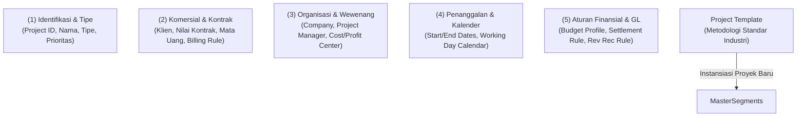
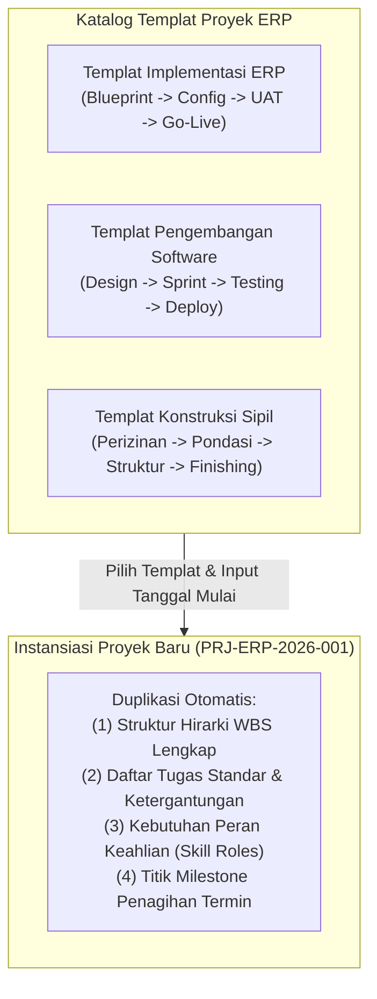
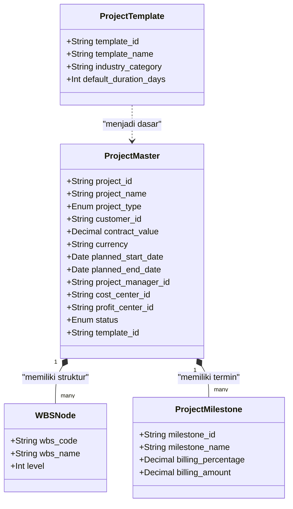

# Project Master Data & Templates

## Definition

**Project Master Data** dalam sistem ERP adalah entitas data induk terpusat (*Single Source of Truth*) yang mendefinisikan identitas legal, parameter komersial, struktur organisasi, kebijakan finansial, serta aturan operasional dari suatu proyek bisnis.

Master data proyek bertindak sebagai simpul kendali (*control hub*) yang mengikat seluruh dokumen operasional—mulai dari kontrak penjualan (*Sales Order*), pesanan pembelian (*Purchase Order*), jam kerja konsultan (*Timesheet*), pengeluaran gudang (*Material Issue*), hingga tagihan pelanggan (*Customer Invoice*). 

Untuk meningkatkan efisiensi dan standardisasi pelaksanaan, ERP enterprise menyediakan fitur **Project Templates (Templat Proyek)**, yaitu cetak biru terstandarisasi yang berisi struktur kerja (*WBS*), daftar tugas standar (*standard tasks*), estimasi jam kerja, peran sumber daya (*roles*), dan tonggak penagihan (*milestones*) yang dapat diduplikasi (*instantiated*) secara instan saat proyek baru dimulai.

---

## Purpose

1. **Standardisasi Pelaksanaan Inisiatif Bisnis**: Memastikan seluruh proyek serupa dieksekusi menggunakan metodologi dan struktur tahapan yang teruji melalui pemanfaatan templat proyek.
2. **Sentralisasi Kontrol Wewenang dan Akuntabilitas**: Menetapkan penanggung jawab utama proyek (*Project Manager*) dan komite pengarah (*Steering Committee*) yang memegang otoritas persetujuan anggaran dan perubahan jadwal.
3. **Penyelarasan Komersial dengan Pembukuan Akuntansi**: Menghubungkan nomor kontrak penjualan dengan profil penagihan dan metode pengakuan pendapatan yang sah.
4. **Otomatisasi Penetapan Biaya dan Tarif Tagih**: Menyimpan parameter tarif biaya per jam kerja (*Cost Rates*) dan tarif tagih ke klien (*Billing Rates*) berdasarkan peran atau jabatan personel.
5. **Pemisahan Entitas dan Dimensi Laporan**: Menjamin transaksi proyek dibukukan ke dalam entitas hukum (*Legal Entity*), unit bisnis, dan mata uang yang tepat tanpa risiko tercampur dengan operasional divisi lain.

---

## Segmen Struktur Data Master Proyek

Dalam ERP kelas enterprise, master data proyek dikelompokkan ke dalam lima segmen informasi utama:

### 1. Segmen Identifikasi & Klasifikasi (Identification & Classification)
- **Project ID / Code**: Nomor identifikasi alfanumerik unik (misal: `PRJ-ERP-2026-001`).
- **Project Name & Description**: Nama resmi proyek dan ringkasan ruang lingkup kerja (*Scope Statement*).
- **Project Type**: Klasifikasi fungsi ekonomi:
  - *Customer Commercial*: Proyek berbayar untuk klien eksternal.
  - *Internal OPEX*: Proyek peningkatan operasional internal.
  - *Capital Investment (CAPEX)*: Proyek pembangunan aset fisik/software berumur panjang.
- **Priority & Risk Category**: Tingkat urgensi bisnis (Rendah, Menengah, Kritis) dan profil risiko awal.

### 2. Segmen Komersial & Kontrak (Commercial & Contractual Data)
- **Customer / Client ID**: Akun pelanggan yang terdaftar di master data CRM/Sales ([[03-sales/customer-and-sales-master-data|Phase 4]]).
- **Sales Contract / Sales Order Reference**: Dokumen perikatan legal yang mendasari pembukaan proyek.
- **Contract Value (Nilai Kontrak)**: Nilai total komitmen pembayaran dari pelanggan (di luar PPN).
- **Billing Method (Metode Penagihan)**:
  - *Fixed Price (Harga Pasti)*.
  - *Milestone Billing (Berbasis Termin Tonggak Kerja)*.
  - *Time & Material (Berbasis Jam Kerja Riil & Pengeluaran Bahan)*.
  - *Progress Billing (Berbasis Persentase Penyelesaian Fisik)*.
- **Payment Terms**: Syarat pelunasan faktur (misal: *Net 30* hari setelah terbit invoice).

### 3. Segmen Organisasi & Tata Kelola (Organizational & Custody Data)
- **Legal Entity / Company Code**: Badan hukum pemilik sah proyek.
- **Project Manager (PM)**: Karyawan penanggung jawab operasional harian yang menandatangani persetujuan *timesheet* dan pengadaan.
- **Profit Center**: Unit bisnis yang mencatat laba atau rugi atas proyek tersebut.
- **Default Cost Center**: Pusat biaya penampung beban tidak langsung atau selisih biaya proyek.

### 4. Segmen Waktu & Kalender Kerja (Timeline & Working Calendar)
- **Planned Start Date & Planned Finish Date**: Rentang waktu komitmen rencana awal (*Baseline Schedule*).
- **Actual Start Date & Actual Finish Date**: Realisasi waktu operasional riil di lapangan.
- **Project Working Calendar**: Menentukan hari kerja efektif per minggu (misal: 5 hari kerja, 8 jam/hari) dan daftar hari libur nasional untuk kalkulasi durasi tugas.

### 5. Segmen Finansial & Penyelesaian Akhir (Financial & Settlement Rules)
- **Project Currency**: Mata uang dasar pencatatan biaya dan anggaran proyek (misal: IDR).
- **Billing Currency**: Mata uang faktur penagihan ke klien (dapat berbeda jika proyek bernilai valas/USD).
- **Budget Profile**: Aturan penegakan kontrol anggaran (*Availability Control - AVC*), apakah toleransi 0% (*Strict Hard Stop*) atau memperbolehkan deviasi 5% (*Soft Warning*).
- **Settlement Rule (Aturan Penyelesaian Akhir)**: Menentukan ke mana saldo biaya dan pendapatan proyek dialokasikan saat penutupan buku (apakah dialokasikan ke akun Laba Rugi Beban Pokok Penjualan, atau dikapitalisasi ke akun Aset Tetap Neraca).

---

## Peran dan Mekanisme Templat Proyek (Project Templates)

Menyusun struktur proyek kompleks dari nol membutuhkan waktu berhari-hari dan rawan kesalahan kelalaian tugas kritis. ERP mengatasi hal ini melalui **Project Templates**:

Manfaat utama templat proyek:
- **Konsistensi Metodologi**: Seluruh manajer proyek menerapkan fase dan penamaan tugas yang seragam.
- **Estimasi Akurat**: Memanfaatkan data durasi dan biaya historis dari proyek terdahulu.
- **Efisiensi Waktu Inisiasi**: Mengurangi waktu persiapan pembukaan proyek dari hitungan hari menjadi beberapa menit.

---

## Business Rules

1. **Unique Project Identifier Constraint**: Nomor identifikasi proyek (*Project ID*) wajib bersifat unik di seluruh sistem dan tidak boleh diubah setelah transaksi operasional atau entri jurnal pertama dibukukan.
2. **Mandatory Project Manager Assignment**: Master proyek dilarang dialihkan dari status *Draft* ke status *Approved* atau *Planned* tanpa penunjukan resmi seorang Manajer Proyek aktif.
3. **Mandatory Customer Linkage for Commercial Projects**: Jika tipe proyek didefinisikan sebagai *Customer Commercial*, sistem wajib memvalidasi ketersediaan data akun pelanggan aktif dan referensi kontrak/SO sebelum proyek dapat dirilis (*Released*).
4. **Currency and Legal Entity Immutability**: Mata uang proyek (*Project Currency*) dan entitas hukum (*Company Code*) dikunci secara permanen dan dilarang dimodifikasi begitu terdapat transaksi keuangan (*Timesheet*, PO, Material Issue, atau Invoice) yang tercatat.
5. **Contract Value vs Budget Alignment Rule**: Pada proyek berorientasi laba (*Customer Commercial*), sistem wajib memvalidasi bahwa total pagu anggaran biaya (*Project Budget*) tidak boleh melebihi nilai kontrak penjualan ($\text{Budget} \le \text{Contract Value}$), kecuali disertai dispensasi risiko tertulis dari Direksi.

---

## Data Model Konseptual: Master Data Proyek

---

## Accounting & Financial Impact

Master data proyek mengontrol pemetaan integrasi buku besar (*GL Account Assignment*):
- Proyek bertindak sebagai dimensi analitik (*Financial Cost/Revenue Object*) yang disematkan pada setiap baris jurnal buku besar umum (*General Ledger Line Item*).
- Mengatur akun penampung sementara (*Project WIP / Balance Sheet Clearing*) sebelum pendapatan atau beban dipindahkan ke laporan laba rugi saat penutupan proyek.

---

## Canonical Scenario: Master Data Proyek PT Maju Bersama

Berikut adalah rincian data master resmi untuk proyek kanonikal implementasi sistem ERP:

| Parameter Master Data | Nilai Data di ERP | Deskripsi & Validasi Bisnis |
| :--- | :--- | :--- |
| **Project ID / Code** | `PRJ-ERP-2026-001` | Identifikasi unik proyek implementasi di seluruh sistem |
| **Nama Proyek** | Implementasi ERP Naventra | Pelaksanaan implementasi solusi ERP enterprise terpadu |
| **Tipe Proyek** | `CUSTOMER_COMMERCIAL` | Proyek eksternal menghasilkan pendapatan dari klien |
| **Klien / Pelanggan** | `PT Maju Bersama` | Akun pelanggan utama (Terdaftar di modul CRM/Sales) |
| **Nomor Kontrak Acuan** | `CNT-2026-MB-001` | Dokumen kontrak perjanjian kerja bernotaris |
| **Nilai Kontrak (*Revenue*)** | **Rp300.000.000** | Nilai kontrak jasa & lisensi bersih (sebelum PPN; skenario mengasumsikan tarif PPN 11% untuk permodelan pembelajaran) |
| **Pagu Anggaran (*Budget*)** | **Rp250.000.000** | Batas maksimum biaya belanja proyek yang disahkan |
| **Estimasi Biaya (*Planned*)** | **Rp200.000.000** | Rencana biaya internal (Target laba kotor: Rp100 Juta) |
| **Mata Uang Proyek** | `IDR` (Rupiah) | Mata uang tunggal pencatatan biaya dan tagihan |
| **Manajer Proyek (PM)** | Hendra Wijaya (NIP: `EMP-0105`) | Pemegang wewenang operasional dan persetujuan biaya |
| **Pusat Laba (*Profit Center*)** | `PC-SERVICES` | Divisi Konsultasi & Layanan Profesional |
| **Pusat Biaya (*Cost Center*)** | `CC-TECH-01` | Departemen Teknologi Informasi & Implementasi |
| **Tanggal Rencana Mulai** | 01 Mei 2026 | Kick-off pertemuan perdana proyek |
| **Tanggal Rencana Selesai** | 31 Oktober 2026 | Target serah terima akhir pekerjaan (6 bulan kalender) |
| **Metode Penagihan** | `MILESTONE_BILLING` | Penagihan 4 termin berdasarkan pencapaian tonggak kerja |
| **Aturan Kontrol Anggaran** | `HARD_CONTROL_0%` | Pemblokiran mutlak transaksi jika pagu anggaran terlampaui |
| **Templat yang Digunakan** | `TPL-ERP-ENTERPRISE-V2` | Mewarisi 4 fase WBS, 16 tugas standar, dan 4 milestone |
| **Status Siklus Hidup** | `APPROVED` | Disetujui, siap dijadwalkan menjadi `PLANNED` |

---

## ERP Implementation

Perbandingan pengelolaan master data dan templat proyek lintas sistem ERP:

| Parameter Master Data | Odoo Enterprise | ERPNext | Microsoft Dynamics 365 | SAP S/4HANA Finance |
| :--- | :--- | :--- | :--- | :--- |
| **Entitas Master Proyek** | Model `project.project` terhubung ke partner & analytic | Doctype terpusat `Project` dengan tab komersial & costing | *Project contract* terhubung ke entitas *Project* | Struktur *Project Definition* pada modul *SAP Project System (PS)* |
| **Dukungan Project Templates** | Fitur duplikasi project atau modul template custom | Opsi centang *Is Template* pada doctype Project | Fitur *Project templates* dengan perkiraan WBS dan peran | Standar *Standard WBS & Standard Network* untuk replikasi proyek |
| **Integrasi Pelanggan & Kontrak** | Tautan langsung ke *Sales Order* dan *Customer* | Field *Customer* dan integrasi ke *Sales Order* | *Project Contracts* memisahkan kontrak legal dari eksekusi fisik | Integrasi modul *Sales & Distribution (SD)* via dokumen kontrak penjualan |
| **Profil Pengendalian Anggaran** | Melalui akun analitik dan batasan anggaran umum | Filter budget pada level *Cost Center / Project* | Fitur *Project budget allocation & cost tracking profile* | Parameter *Budget Profile & Availability Control (AVC)* per proyek |

---

## Naventra Consideration

Rancangan arsitektur Project Master Data pada Naventra ERP:

1. **Decoupled Commercial & Execution Entities**: Naventra memisahkan entitas komersial (`project_contracts`) dari entitas eksekusi operasional (`projects`). Satu kontrak induk klien dapat menaungi beberapa sub-proyek eksekusi dengan anggaran terpisah namun penagihan terkonsolidasi.
2. **Template Instantiation Engine**: Modul Naventra menyediakan generator instansiasi templat berbasis aturan (`project_template_builder`). Saat templat dipilih dan tanggal kick-off diinput, sistem secara otomatis mengkalkulasi seluruh tanggal mulai tugas, dependensi pendahulu (*predecessors*), dan mengonversi persentase termin kontrak menjadi nominal rupiah riil.
3. **Audit Trail on Master Amendments**: Setiap perubahan pada data kritis (seperti nilai kontrak, tanggal target selesai, penunjukan PM baru, atau perubahan margin) wajib menyertakan alasan penyesuaian dan disimpan dalam tabel log terenkripsi `project_master_audit_logs`.

---

## References

- Project Management Institute (PMI). *A Guide to the Project Management Body of Knowledge (PMBOK Guide)*, 7th Edition.
- SAP SE. *Project Definition and Work Breakdown Structures in SAP S/4HANA PS*. SAP Help Portal.
- Microsoft Corporation. *Create and manage project templates in Dynamics 365 Project Operations*. Microsoft Learn.
- Frappe Technologies. *Managing Project Master Data and Templates in ERPNext*. ERPNext Documentation.
- Odoo S.A. *Project Management and Task Organization*. Odoo Documentation.
