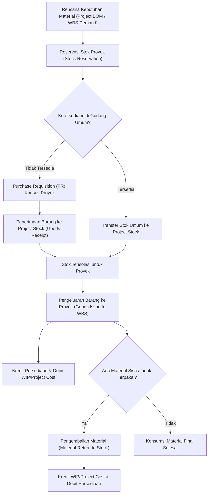

# Project Material and Inventory

## Definition

**Project Material and Inventory** adalah domain fungsional dalam Enterprise Resource Planning (ERP) yang mengatur perencanaan kebutuhan, reservasi, isolasi fisik dan logis, pengeluaran (*goods issue*), serta pengembalian barang persediaan yang dialokasikan khusus untuk eksekusi suatu proyek.

Berbeda dari manajemen persediaan ritel atau manufaktur massal yang berorientasi pada perputaran stok umum (*unrestricted stock turnover*), logistik material proyek difokuskan pada kepastian ketersediaan material yang tepat pada elemen WBS dan tanggal aktivitas yang tepat, dengan isolasi biaya agar tidak tercampur dengan persediaan operasional reguler perusahaan.

---

## Purpose

Pengelolaan material dan persediaan proyek dalam ERP bertujuan untuk:

1. **Kepastian Pasokan Aktivitas (*Supply Certainty*)**: Mengamankan ketersediaan perangkat keras, komponen, atau bahan mentah kritis agar aktivitas pada jalur kritis (*Critical Path*) tidak terhenti karena kelangkaan stok.
2. **Isolasi Kepemilikan dan Penilaian (*Project Stock Isolation*)**: Memisahkan stok khusus proyek dari stok bebas (*unrestricted general inventory*), baik secara lokasi fisik maupun kepemilikan nilai buku, mencegah material proyek terambil oleh pesanan penjualan (*Sales Orders*) lain.
3. **Atribusi Biaya Akurat (*Accurate Cost Absorption*)**: Membebankan biaya perolehan material (*actual material cost*) langsung ke akun rincian kerja (WBS) saat barang dikeluarkan dari gudang.
4. **Pengendalian Sisa Material (*Surplus and Return Control*)**: Menyediakan prosedur standar untuk pengembalian kelebihan material (*material return*) atau penghapusan barang rusak (*project scrap*) dengan penyesuaian nilai biaya proyek secara transparan.

---

## Business Process

Alur siklus hidup material proyek diilustrasikan dalam diagram berikut:

### Tahapan Proses Bisnis

1. **Project Material Planning (Project BOM)**:
   - Insinyur proyek menetapkan daftar kebutuhan material teknis (*Bill of Materials* khusus proyek) yang dirinci per aktivitas WBS.
2. **Stock Reservation**:
   - Sistem menerbitkan reservasi material terhadap gudang. Reservasi mengunci jumlah kuantitas sehingga tidak dapat dijanjikan (*ATP - Available to Promise*) untuk penjualan umum.
3. **Procurement or Stock Transfer**:
   - Jika material belum ada di gudang, sistem memicu pengadaan khusus (*Project Purchase Order*). Jika sudah ada, material dipindahkan ke area penampungan khusus proyek (*Project Storage Location / Bin*).
4. **Goods Issue to WBS (Pengeluaran Barang)**:
   - Saat pekerjaan instalasi dimulai, bagian logistik mengeluarkan barang dengan merujuk nomor reservasi dan kode WBS.
   - Dampak sistem: Kuantitas stok gudang berkurang, dan nilai perolehan material langsung didebit ke objek biaya proyek sebagai *Actual Cost*.
5. **Surplus Material Return**:
   - Setelah instalasi selesai, sisa kabel, komponen cadangan, atau perangkat yang tidak terpakai dikembalikan ke gudang operasional dengan dokumen *Material Return*. Biaya proyek dikreditkan kembali secara otomatis.

---

## Business Rules

### 1. Project Stock Segregation (Pemisahan Stok Proyek)
Material yang dibeli atas nama proyek memiliki valuasi dan penanda kepemilikan khusus (*Special Stock Indicator* = `Q` / Project Stock pada standar ERP enterprise). Material ini tidak dapat dikeluarkan untuk pesanan penjualan umum tanpa adanya proses reklasifikasi atau transfer kepemilikan resmi.

### 2. Aturan Reservasi Bertingkat (Soft vs Hard Reservation)
- **Soft Reservation**: Dibuat pada fase perencanaan; mencatat estimasi kebutuhan masa depan untuk kalkulasi MRP tanpa memblokir kuantitas fisik gudang saat ini.
- **Hard Reservation**: Dibuat ketika jadwal aktivitas proyek sudah dikonfirmasi (*Released*); memblokir kuantitas fisik di gudang sehingga status stok berubah menjadi *Reserved*.

### 3. Kebijakan Penilaian Material Proyek (Project Inventory Valuation)
Biaya material yang dibebankan ke proyek dihitung berdasarkan metode penilaian persediaan yang dikonfigurasi pada sistem:
- **Moving Average Cost (MAC)**: Menggunakan harga rata-rata tertimbang persediaan saat pengeluaran barang.
- **FIFO (First In, First Out)**: Menggunakan lapisan biaya perolehan terawal.
- **Specific Identification / Standard Cost**: Khusus untuk material berlisensi atau peralatan bernomor seri (*serial-tracked equipment*).

---

## Accounting Impact

Pengeluaran dan pengembalian material proyek memiliki konsekuensi akuntansi persediaan dan biaya proyek secara *real-time*:

### 1. Saat Pengeluaran Material ke Proyek (Goods Issue to WBS)

Pada saat barang dikeluarkan dari gudang ke lokasi proyek, nilai persediaan berkurang dan berpindah menjadi biaya proyek / *Work-in-Progress*:

$$\begin{array}{llrr}
\text{Debit:} & \text{Work-in-Progress (WIP) / Project Material Cost} & \text{Rp30.000.000} & \\
\text{Kredit:} & \text{Raw Materials / Network Hardware Inventory} & & \text{Rp30.000.000}
\end{array}$$

### 2. Saat Pengembalian Kelebihan Material (Material Return to Warehouse)

Jika terdapat material sisa yang masih dalam kondisi prima dan dikembalikan ke stok umum (misalnya kabel jaringan dan adaptor cadangan senilai Rp2.000.000):

$$\begin{array}{llrr}
\text{Debit:} & \text{Raw Materials / Network Hardware Inventory} & \text{Rp2.000.000} & \\
\text{Kredit:} & \text{Work-in-Progress (WIP) / Project Material Cost} & & \text{Rp2.000.000}
\end{array}$$

*Hasil Bersih*: Beban material riil yang ditanggung oleh proyek adalah:
$$\text{Rp30.000.000} - \text{Rp2.000.000} = \mathbf{Rp28.000.000}$$

---

## Example: Implementasi ERP Naventra

Meneruskan skenario kanonik proyek `PRJ-ERP-2026-001` untuk pelanggan `PT Maju Bersama`:

- **Komponen Biaya Material Rencana (*Planned Material Cost*)**: **Rp30.000.000**
- **Alokasi WBS**: `PRJ-03` (Infrastruktur & Integrasi)
- **Daftar Kebutuhan Material (Project BOM)**:
  1. Unit Server Staging & Rackmount Hardware (1 Unit) = Rp18.000.000
  2. Switch Jaringan Managed 24-Port (2 Unit @ Rp4.000.000) = Rp8.000.000
  3. Kabel UTP Cat6, Patch Panel, & Konektor RJ45 (Roll & Aksesoris) = Rp4.000.000

### Pelaksanaan & Realisasi:

1. **Goods Issue Awal**:
   - Seluruh daftar material senilai Rp30.000.000 dikeluarkan dari gudang IT Naventra ke lokasi implementasi klien (*PT Maju Bersama*).
   - Biaya aktual sementara WBS `PRJ-03` tercatat Rp30.000.000.
2. **Pengembalian Material Sisa (*Material Return*)**:
   - Setelah penarikan kabel selesai, sisa 1 roll kabel Cat6 dan konektor senilai Rp2.000.000 tidak digunakan dan dikembalikan ke gudang utama dengan dokumen retur material.
3. **Realisasi Akhir (*Actual Material Cost*)**:
   - Total Biaya Aktual Material: $\text{Rp30.000.000} - \text{Rp2.000.000} = \mathbf{Rp28.000.000}$.
   - **Cost Variance Material**: $\text{Rp30.000.000} - \text{Rp28.000.000} = +\mathbf{Rp2.000.000}$ (*Favorable Variance*).

---

## ERP Implementation

Penerapan logistik material proyek pada platform ERP enterprise:

### Odoo Implementation
- **Project Analytic on Stock Picking**: Odoo memungkinkan penetapan *Analytic Account* langsung pada transfer persediaan (*Internal Transfer* atau *Delivery Order*).
- **Locations per Project**: Pengguna dapat mengonfigurasi lokasi gudang virtual khusus proyek (misalnya `Physical Locations/Projects/PRJ-ERP-2026-001`) untuk menampung barang yang telah disiapkan sebelum dikonsumsi.
- **Stock Valuation Layers**: Pengeluaran stok ke akun analitik secara otomatis membentuk jurnal akuntansi yang mendebit akun beban biaya proyek dan mengkredit akun aset persediaan.

### ERPNext Implementation
- **Stock Entry (Material Issue to Project)**: ERPNext menggunakan dokumen `Stock Entry` dengan tipe tujuan *Material Issue*, di mana field `Project` dicantumkan pada header atau baris item.
- **Project Stock Ledger**: Setiap mutasi barang tercatat dalam buku pembantu stok (*Stock Ledger*) dengan atribut ID Proyek, memungkinkan audit jejak fisik per proyek.
- **Material Return**: Dokumen `Stock Entry` bertipe *Material Receipt* digunakan untuk mencatat pengembalian barang sisa proyek ke gudang asal, yang secara otomatis mengurangi akumulasi biaya proyek pada dokumen `Project`.

### Dynamics 365 Implementation
- **Project Item Requirements**: Dynamics 365 Supply Chain & Project Operations menyediakan fitur *Item Requirements* pada WBS.
- **Special Project Stock Allocation**: Mendukung alokasi persediaan dengan kode kepemilikan khusus (*Project Tracking Dimensions*).
- **Project Item Journals**: Pengeluaran barang dilakukan via *Project Item Journal* yang memvalidasi ketersediaan stok fisik di gudang dan ketersediaan anggaran WBS sebelum posting persediaan diselesaikan.

---

## Naventra Consideration

Dalam arsitektur modul logistik proyek Naventra ERP:

1. **Otomatisasi Reservasi dari Jadwal WBS**: Jadwal aktivitas instalasi pada diagram Gantt secara otomatis menghasilkan *Material Reservation* dengan tanggal pemenuhan (*Requirement Date*) yang disinkronkan dengan lead time pengadaan gudang.
2. **Mobile Warehouse Scanning untuk BAST Fisik**: Tim lapangan melakukan konfirmasi serah terima fisik perangkat di lokasi klien menggunakan aplikasi mobile barcode scanner, yang secara instan memicu dokumen *Goods Issue to Project* dan memperbarui status aktivitas proyek menjadi *Installed*.
3. **Workflow Rekonsiliasi Material Sisa**: Pada saat milestone instalasi selesai, sistem mewajibkan verifikasi status material sisa sebelum tahapan proyek dapat ditutup (*Technical Completion*). Kelebihan material wajib diproses melalui antarmuka *Return to Warehouse* atau *Scrap Confirmation*.

---

## References

- Project Management Institute (PMI). (2021). *A Guide to the Project Management Body of Knowledge (PMBOK Guide)* (7th ed.). Project Management Institute.
- SAP Help Portal. *Material Management in Project System (PS)*.
- Microsoft Learn. *Manage Item Requirements and Project Inventory in Dynamics 365*.
- ERPNext Documentation. *Stock Management for Projects*.
- Odoo 17.0 Documentation. *Inventory Valuation and Analytic Accounts*.
