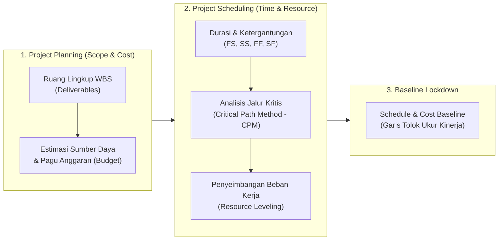
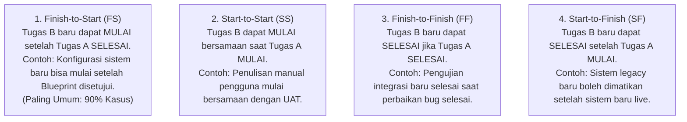
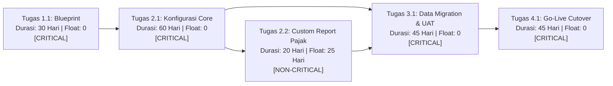
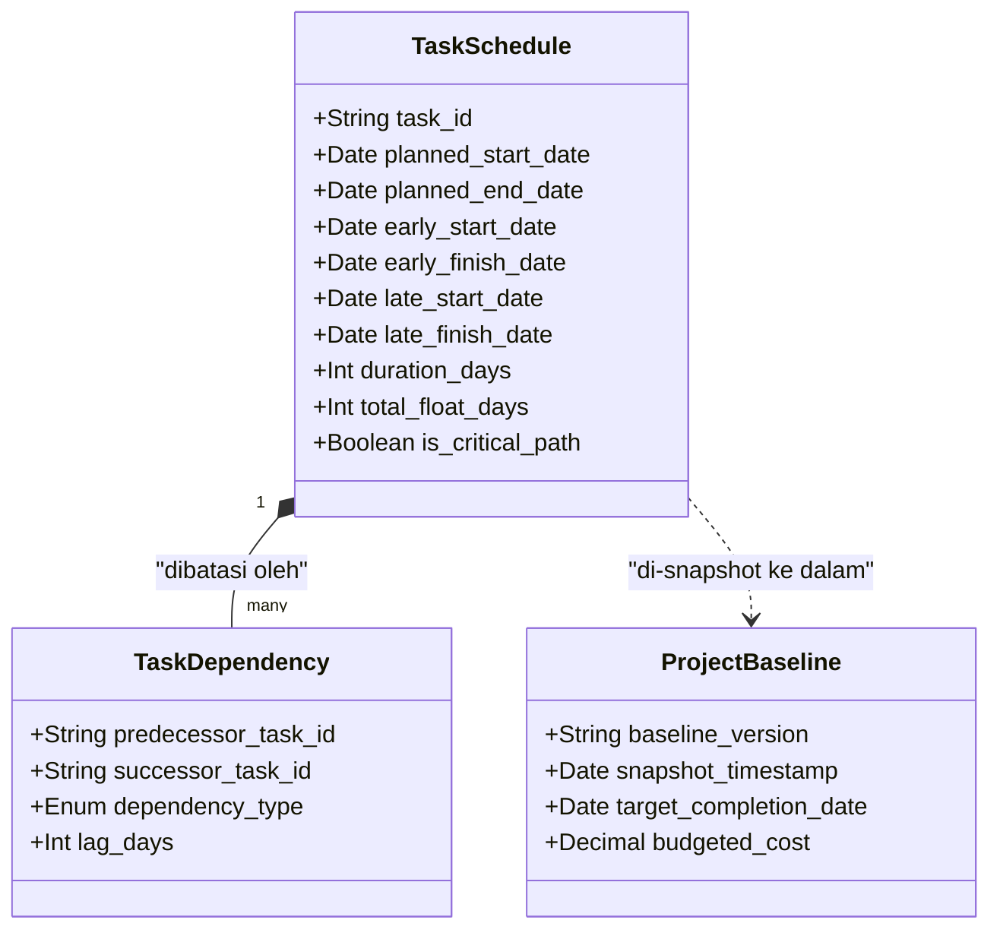

# Project Planning & Scheduling

## Definition

Dalam sistem ERP, **Project Planning (Perencanaan Proyek)** dan **Project Scheduling (Penjadwalan Proyek)** adalah dua proses sekuensial yang saling melengkapi dalam mendefinisikan dimensi ruang lingkup, biaya, dan waktu:

- **Project Planning (Perencanaan)** berfokus pada pertanyaan **APA** dan **BERAPA**: Menentukan ruang lingkup deliverable (*WBS*), estimasi kebutuhan anggaran (*cost estimation*), metode penagihan, serta pengadaan material dan jasa yang dibutuhkan.
- **Project Scheduling (Penjadwalan)** berfokus pada pertanyaan **KAPAN** dan **SIAPA**: Mengonversi paket kerja WBS ke dalam rangkaian aktivitas temporal, menghitung durasi kerja, menetapkan hubungan ketergantungan antar-tugas (*predecessor-successor dependencies*), menghitung jalur kritis (*Critical Path*), serta memetakan beban kerja personel pada kalender kerja efektif.

---

## Purpose

1. **Penetapan Garis Tolok Ukur Kinerja (*Project Baseline Lockdown*)**: Mengunci komitmen jadwal dan biaya resmi saat proyek disahkan, sehingga deviasi keterlambatan (*Schedule Variance*) dapat diukur secara kuantitatif sepanjang fase eksekusi.
2. **Identifikasi Jalur Kritis (*Critical Path Identification*)**: Menemukan rangkaian aktivitas yang memiliki kelonggaran waktu nol (*Zero Float*), di mana keterlambatan satu hari pada tugas di jalur kritis akan langsung memundurkan tanggal penyelesaian akhir seluruh proyek.
3. **Pencegahan Kelebihan Beban Kerja Personel (*Resource Over-Allocation Prevention*)**: Mendeteksi konflik jadwal di mana seorang personel kunci (misal: *Senior Solution Architect*) ditugaskan melebihi kapasitas jam kerja normal (misal ditugaskan 16 jam dalam satu hari kerja).
4. **Penyelarasan Logistik Rantai Pasok (*Lead-Time Coordination*)**: Menyelaraskan tanggal mulai aktivitas instalasi perangkat keras di pabrik dengan tanggal kedatangan barang dari pemasok pada modul [[04-purchasing/purchase-order|Purchasing (P2P)]].
5. **Otomatisasi Penjadwalan Maju dan Mundur (*Forward & Backward Scheduling*)**: Menghitung tanggal selesai tercepat (*Early Finish*) berdasarkan tanggal mulai proyek atau menghitung tanggal mulai paling lambat (*Late Start*) untuk memenuhi tenggat waktu kontrak klien (*Strict Deadline*).

---

## Hubungan Ketergantungan Antar-Tugas (Task Dependency Types)

ERP mendukung empat logika hubungan ketergantungan standar industri konstruksi dan manajemen proyek:

### Jeda Waktu (Lead Time & Lag Time):
- **Lag Time (+ Hari)**: Jeda waktu tunggu wajib setelah aktivitas selesai sebelum aktivitas berikutnya dapat dimulai (misal: menunggu pengeringan semen pondasi selama 3 hari sebelum memasang mesin pabrik).
- **Lead Time (- Hari)**: Percepatan waktu tumpang tindih di mana tugas kedua dapat dimulai beberapa hari sebelum tugas pertama selesai penuh.

---

## Analisis Jalur Kritis (Critical Path Method - CPM) & Float

Mesin kalkulasi ERP mengevaluasi parameter waktu setiap aktivitas untuk menentukan fleksibilitas jadwal:

$$\text{Total Float (Slack)} = \text{Late Start (LS)} - \text{Early Start (ES)} = \text{Late Finish (LF)} - \text{Early Finish (EF)}$$

- **Critical Path (Jalur Kritis)**: Rangkaian aktivitas terpanjang dari awal hingga akhir proyek yang memiliki **$\text{Total Float} = 0$**. Aktivitas pada jalur kritis tidak memiliki toleransi keterlambatan sama sekali.
- **Non-Critical Path**: Aktivitas yang memiliki $\text{Total Float} > 0$, yang berarti tanggal pelaksanaannya dapat digeser mundur tanpa menunda tanggal penyelesaian akhir proyek.
- **Free Float**: Jumlah waktu tunda suatu aktivitas yang tidak menunda tanggal mulai tercepat dari aktivitas penerus langsungnya (*immediate successors*).

---

## Penyeimbangan Sumber Daya (Resource Leveling)

Ketika jadwal awal menyebabkan kelebihan alokasi (*over-allocation*) pada personel kunci:
- **Metode Penjadwalan Terkendala Sumber Daya (*Resource-Constrained Scheduling*)**: ERP secara otomatis menggeser tanggal pelaksanaan tugas-tugas non-kritis (*utilizing float*) agar kurva pemanfaatan staf menjadi merata (*smooth load profile*).
- Jika tugas yang mengalami benturan berada pada jalur kritis, sistem memperingatkan Manajer Proyek bahwa tanggal selesai akhir proyek akan bergeser mundur kecuali dialokasikan personel tambahan (*fast-tracking* atau *crashing*).

---

## Business Rules

1. **Baseline Immutability Rule**: Jadwal komitmen awal (*Original Schedule Baseline*) dikunci secara permanen saat status proyek disahkan menjadi *In-Progress*. Perubahan jadwal resmi hanya dapat dicatat sebagai *Revised Baseline* melalui dokumen persetujuan revisi lingkup kerja (*Change Request*).
2. **Prohibition of Circular Dependencies**: Mesin penjadwalan ERP wajib menolak penyimpanan hubungan dependensi jika terdeteksi perulangan tertutup (*Circular Loop*, misal: Tugas A bergantung pada B, B bergantung pada C, dan C bergantung kembali pada A).
3. **Working Calendar Enforcement**: Sistem dilarang menghitung konsumsi durasi jam kerja atau menjadwalkan pekerjaan pada hari libur nasional atau akhir pekan yang telah dikonfigurasi sebagai hari non-kerja (*non-working days*) pada kalender proyek, kecuali terdapat penugasan lembur resmi (*overtime approval*).
4. **Automatic Schedule Recalculation**: Setiap kali durasi aktual suatu tugas di jalur kritis bertambah atau terlambat diselesaikan, sistem wajib secara otomatis menghitung ulang (*re-calculate schedule*) tanggal mulai dan selesai seluruh tugas penerusnya (*downstream activities*).
5. **No Negative Lead Time Exceeding Predecessor**: Durasi *Lead Time* (percepatan) dilarang dikonfigurasi melampaui total durasi tugas pendahulunya.

---

## Data Model Konseptual: Penjadwalan Proyek

---

## Accounting & Financial Impact

Meskipun penjadwalan berorientasi pada waktu, dampaknya terhadap keuangan sangat signifikan:
- **Peramalan Arus Kas Proyek (*Cash Inflow & Outflow Forecasting*)**: Jadwal penyelesaian tugas dan milestone menentukan tanggal penerbitan faktur piutang ke klien serta tanggal jatuh tempo pembayaran tagihan vendor subkontraktor pada modul [[07-finance/cash-flow-planning|Finance (Phase 8)]].
- **Klausul Denda Keterlambatan (*Liquidated Damages*)**: Keterlambatan tanggal penyelesaian akhir di luar batas komitmen kontrak klien dapat memicu pengakuan kewajiban denda penalti keterlambatan pada Laporan Laba Rugi.

---

## Canonical Scenario: Penjadwalan Proyek PT Maju Bersama

Untuk proyek **Implementasi ERP Naventra** (`PRJ-ERP-2026-001`) berdurasi 6 bulan (01 Mei s.d. 31 Oktober 2026), jadwal rencana *Baseline Schedule* dikonfigurasikan sebagai berikut:

| Kode Aktivitas | Uraian Tugas & Deliverable | Durasi Kerja | Tanggal Mulai | Tanggal Selesai | Dependensi | Jalur Kritis? |
| :--- | :--- | :--- | :--- | :--- | :--- | :--- |
| **ACT-01** | Analisis Proses Bisnis & Requirement | 20 Hari Kerja | 01 Mei 2026 | 20 Mei 2026 | None | **Ya (Critical)** |
| **ACT-02** | Finalisasi Blueprint & Arsitektur Solusi | 11 Hari Kerja | 21 Mei 2026 | 31 Mei 2026 | ACT-01 (FS) | **Ya (Critical)** |
| **ACT-03** | Konfigurasi Core ERP (Finance & Supply Chain) | 42 Hari Kerja | 01 Jun 2026 | 30 Jul 2026 | ACT-02 (FS) | **Ya (Critical)** |
| **ACT-04** | Pengembangan Kustom Laporan Pajak & Dashboard | 22 Hari Kerja | 01 Jul 2026 | 31 Jul 2026 | ACT-03 (SS + 20) | Tidak (Float: 15h) |
| **ACT-05** | Ekstraksi & Migrasi Data Master Pelanggan/Stok | 15 Hari Kerja | 01 Agu 2026 | 15 Agu 2026 | ACT-03 (FS) | **Ya (Critical)** |
| **ACT-06** | Pengujian Pengguna Akhir (UAT) & Bug Fixing | 31 Hari Kerja | 16 Agu 2026 | 15 Sep 2026 | ACT-05 (FS) | **Ya (Critical)** |
| **ACT-07** | Pelatihan Pengguna Akhir (*End-User Training*) | 22 Hari Kerja | 16 Sep 2026 | 15 Okt 2026 | ACT-06 (FS) | **Ya (Critical)** |
| **ACT-08** | Persiapan Cutover Data & Go-Live Resmi | 16 Hari Kerja | 16 Okt 2026 | 31 Okt 2026 | ACT-07 (FS) | **Ya (Critical)** |

*Hasil Analisis CPM: Rangkaian `ACT-01 -> ACT-02 -> ACT-03 -> ACT-05 -> ACT-06 -> ACT-07 -> ACT-08` membentuk Jalur Kritis dengan Total Float = 0 hari. Aktivitas ACT-04 memiliki Total Float 15 hari sehingga keterlambatan 10 hari pada laporan kustom tidak akan menunda Go-Live 31 Oktober.*

---

## ERP Implementation

Perbandingan fungsional modul perencanaan jadwal proyek lintas software ERP enterprise:

| Parameter Penjadwalan | Odoo Enterprise | ERPNext | Microsoft Dynamics 365 | SAP S/4HANA Finance |
| :--- | :--- | :--- | :--- | :--- |
| **Tampilan Gantt Interaktif** | Tampilan *Gantt View* bawaan dengan penarikan dependensi visual | Tampilan *Gantt Chart* berbasis SVG dengan drag-and-drop | Tampilan *Interactive Gantt Chart* pada Project Operations | Terintegrasi dengan modul *SAP Enterprise Project Scheduling* |
| **Mesin Analisis Jalur Kritis (CPM)** | Terbatas pada pergeseran tanggal manual | Menampilkan garis jalur kritis visual pada Gantt chart | Kalkulasi otomatis jalur kritis dan batas kelonggaran (*float*) | Mesin komputasi CPM sangat tangguh via *Network Activities Scheduling* |
| **Penyelarasan Kalender Kerja** | Pengaturan jam kerja pada resource calendar | Master *Holiday List* diterapkan pada kalkulasi durasi tugas | *Work templates & Resource calendar exceptions* komprehensif | Terintegrasi penuh dengan *Factory Calendar & Shift Management* |
| **Penguncian Baseline Jadwal** | Memerlukan modul custom tambahan | Fitur *Project Baseline* untuk membandingkan jadwal | Fitur *Snapshot baseline & Schedule variance comparison* | Standar *Project Baseline & Progress Tracking (CNE5)* |

---

## Naventra Consideration

Rancangan arsitektur modul Planning & Scheduling pada Naventra ERP:

1. **Topological Sort Scheduling Engine**: Penjadwalan Naventra dieksekusi oleh mesin algoritma graf terarah (*Directed Acyclic Graph - DAG*) yang menerapkan algoritma *Topological Sort* dan *Critical Path Method*. Sistem menghitung tanggal awal tercepat, tanggal akhir terlambat, dan total float untuk ribuan tugas dalam hitungan detik.
2. **Immutable Baseline Snapshotting**: Naventra menyimpan rekaman snapshot jadwal ke dalam tabel `project_schedule_baselines` setiap kali proyek beralih status ke `IN_PROGRESS`. Dasbor Gantt Chart menyajikan tampilan dua lapis (*Dual-Bar Gantt*): bilah abu-abu untuk jadwal rencana awal (*Baseline*) dan bilah biru/merah untuk jadwal realisasi berjalan (*Current Schedule*).
3. **Conflict Detection Webhook**: Jika pengubahan jadwal pada suatu tugas berdampak pada pergeseran tanggal penagihan milestone atau tanggal ketersediaan material gudang, Naventra memicu *event webhook* yang memperingatkan manajer pengadaan dan akuntan proyek secara *real-time*.

---

## References

- Project Management Institute (PMI). *Practice Standard for Scheduling*, 3rd Edition.
- Kerzner, Harold. *Project Management: A Systems Approach to Planning, Scheduling, and Controlling (Chapter 11: Network Scheduling Techniques)*.
- SAP SE. *Scheduling of Networks and WBS Elements in SAP S/4HANA Project System*. SAP Help Portal.
- Microsoft Corporation. *Manage project schedules and dependencies in Dynamics 365 Project Operations*. Microsoft Learn.
- Antill, James M., & Woodhead, Ronald W. *Critical Path Methods in Construction Practice*. John Wiley & Sons.
