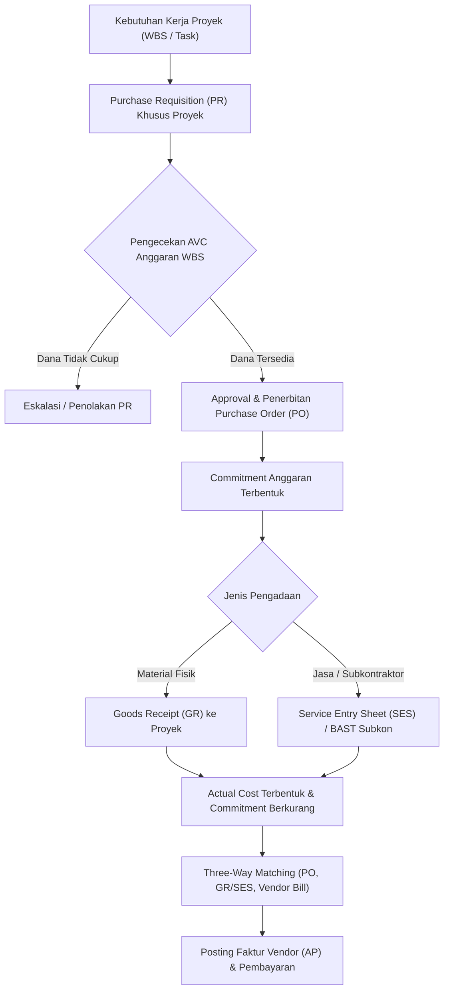

# Project Procurement

## Definition

**Project Procurement** adalah proses perencanaan, pemesanan, penerimaan, dan verifikasi barang serta jasa pihak ketiga yang diadakan secara khusus (*project-specific procurement*) untuk memenuhi kebutuhan suatu proyek di dalam Enterprise Resource Planning (ERP).

Berbeda dari pengadaan operasional standar (*standard operational purchasing*) yang ditujukan untuk persediaan umum gudang (*stock replenishment*) atau pengeluaran departemen umum, pengadaan proyek dialokasikan langsung ke objek biaya proyek (*Account Assignment to Project / WBS*), sehingga komitmen dan beban finansialnya terkonsolidasi langsung ke dalam struktur biaya proyek terkait.

---

## Purpose

Tujuan dari integrasi Project Procurement di dalam ERP meliputi:

1. **Atribusi Biaya Presisi (*Cost Allocation Accuracy*)**: Memastikan seluruh pengeluaran pihak ketiga (subkontraktor, konsultan eksternal, sewa alat, lisensi khusus) langsung dibebankan ke elemen rincian kerja (WBS) yang relevan tanpa rekayasa manual.
2. **Penguncian Anggaran Proaktif (*Commitment Management*)**: Membentuk komitmen finansial (*encumbrance*) saat *Purchase Order* (PO) diterbitkan, mencegah *over-spending* terhadap pagu anggaran proyek yang telah ditetapkan.
3. **Penyelarasan Jadwal Operasional**: Mengaitkan tanggal kebutuhan material atau tanggal kedatangan subkontraktor langsung dengan jadwal aktivitas proyek (*Task Milestones*).
4. **Verifikasi Prestasi Pihak Ketiga (*Service Confirmation*)**: Menyediakan mekanisme formal pengakuan jasa kerja (*Service Entry Sheet* / BAST Subkontraktor) sebelum vendor diperkenankan menerbitkan faktur tagihan (*Vendor Bill*).
5. **Mitigasi Risiko Kontraktual**: Mengelola klausul pembayaran subkontraktor berbasis termin atau pencapaian tonggak prestasi proyek (*milestone-based subcontractor billing*).

---

## Business Process

Alur pengadaan proyek dalam lingkungan ERP terintegrasi digambarkan sebagai berikut:

### Tahapan Proses Bisnis

1. **Identification of Need & Sourcing**:
   - Manajer proyek atau *lead engineer* mengidentifikasi kebutuhan jasa tenaga ahli eksternal atau perangkat infrastruktur yang tidak tersedia secara internal.
2. **Purchase Requisition (PR) with Project Assignment**:
   - Dokumen PR dibuat dengan atribut wajib berupa ID Proyek dan nomor kode WBS (*Account Assignment Category* = `P` / Project).
3. **Availability Control (AVC) Check**:
   - ERP secara otomatis mengevaluasi apakah anggaran yang tersedia pada WBS tersebut mencukupi untuk menampung estimasi nilai pengadaan ini.
4. **Purchase Order (PO) Issuance & Commitment Posting**:
   - Setelah penawaran vendor disepakati, PO diterbitkan. ERP langsung mencatat nilai PO sebagai *Committed Cost* pada WBS proyek.
5. **Delivery / Service Performance Confirmation**:
   - Untuk material: Bagian logistik melakukan *Goods Receipt* (GR) dengan penanda khusus proyek.
   - Untuk jasa konsultan/subkontraktor: PM memvalidasi hasil kerja dan menerbitkan *Service Entry Sheet* (SES) atau menandatangani Berita Acara Serah Terima (BAST) Subkontraktor.
6. **Actual Cost Incurrence**:
   - Konfirmasi SES atau GR memicu pemindahan nilai dari *Commitment* menjadi *Actual Cost* di modul manajemen proyek dan jurnal akuntansi akrual.
7. **Three-Way Matching & Vendor Invoicing**:
   - Bagian *Accounts Payable* mencocokkan PO, GR/SES, dan *Vendor Bill*. Setelah cocok, tagihan dijadwalkan untuk pembayaran.

---

## Business Rules

### 1. Account Assignment Mandatori
Dokumen pengadaan proyek tidak boleh dialokasikan ke akun beban operasional umum (*general overhead*) tanpa mengaitkan kode WBS. Setiap baris item pengadaan wajib memiliki:
- **Project ID**
- **WBS Element Code**
- **Cost Element / Analytic Tag**

### 2. Validasi Siklus Hidup Proyek (*Lifecycle State Check*)
PO pengadaan proyek hanya dapat diterbitkan apabila status proyek berada dalam status aktif (*In Progress* / *Released*). Sistem akan menolak pembuatan PO jika proyek berstatus *Draft*, *Planning*, *On Hold*, atau *Closed*.

### 3. Subcontractor Retention & Milestone Linkage
Untuk pekerjaan subkontraktor berskala besar, sistem dapat menahan sebagian pembayaran (*retention money*, misalnya 5% – 10%) hingga masa pemeliharaan (*warranty period*) proyek berakhir. Pembayaran subkontraktor juga dapat disyaratkan harus merujuk pada penyelesaian tonggak proyek utama (*Customer Milestone Sign-Off*).

---

## Accounting Impact

Pencatatan akuntansi pengadaan proyek bergantung pada apakah pengadaan berupa material proyek atau jasa subkontraktor, serta kebijakan kapitalisasi proyek:

### 1. Saat Pengakuan Jasa Subkontraktor (Service Entry Sheet / Akrual)

Saat jasa subkontraktor telah disetujui (sebelum faktur vendor diterima), sistem membukukan akrual biaya proyek:

$$\begin{array}{llrr}
\text{Debit:} & \text{Work-in-Progress (WIP) / Project Expense} & \text{Rp55.000.000} & \\
\text{Kredit:} & \text{Unbilled Subcontractor Accrual / GR/IR Clearing} & & \text{Rp55.000.000}
\end{array}$$

### 2. Saat Penerimaan Faktur Vendor (Vendor Bill / AP Posting)

Saat faktur resmi dari vendor/subkontraktor diverifikasi:

$$\begin{array}{llrr}
\text{Debit:} & \text{Unbilled Subcontractor Accrual / GR/IR Clearing} & \text{Rp55.000.000} & \\
\text{Debit:} & \text{VAT In (Pajak Masukan - Asumsi 11% untuk pembelajaran)} & \text{Rp6.050.000} & \\
\text{Kredit:} & \text{Accounts Payable (Hutang Usaha)} & & \text{Rp61.050.000}
\end{array}$$

*Catatan*: Tarif PPN masukan 11% digunakan sebagai asumsi konsistensi permodelan pembelajaran; tarif efektif aktual wajib mengikuti peraturan perpajakan yang berlaku pada saat transaksi. Nilai Rp55.000.000 langsung tercatat sebagai realisasi biaya (*Actual Cost*) pada sub-elemen WBS terkait di modul Project Management dan Cost Accounting.

---

## Example: Implementasi ERP Naventra

Dalam skenario proyek `PRJ-ERP-2026-001` untuk `PT Maju Bersama`:

- **Kategori Biaya Pengadaan Rencana (*Planned Procurement*)**: Rp60.000.000
  - *Rincian*: Subkontraktor Spesialis Integrasi & Migrasi Data (Rp35.000.000) + Lisensi Database & Setup Cloud Environment (Rp25.000.000).
- **Alokasi WBS**: `PRJ-03` (Infrastruktur & Integrasi).

### Pelaksanaan dan Realisasi:

1. **Penerbitan PO Subkontraktor Integrasi**:
   - PO diterbitkan ke `PT Integrasi Solusi Nusantara` sebesar **Rp32.000.000** (efisiensi negosiasi dari rencana Rp35.000.000).
   - Status komitmen WBS `PRJ-03` bertambah Rp32.000.000.
2. **Penerbitan PO Layanan Cloud & Lisensi**:
   - PO diterbitkan ke penyedia layanan cloud sebesar **Rp23.000.000** (efisiensi dari rencana Rp25.000.000).
   - Status komitmen WBS `PRJ-03` bertambah Rp23.000.000.
3. **Penyelesaian Pekerjaan & BAST**:
   - Subkontraktor menyelesaikan konfigurasi integrasi API dan migrasi data awal. BAST jasa ditandatangani oleh PM Naventra.
   - Layanan cloud terverifikasi aktif.
4. **Realisasi Akhir (*Actual Procurement Cost*)**:
   - Total Biaya Aktual Pengadaan: $\text{Rp32.000.000} + \text{Rp23.000.000} = \mathbf{Rp55.000.000}$.
   - **Cost Variance Pengadaan**: $\text{Rp60.000.000} - \text{Rp55.000.000} = +\mathbf{Rp5.000.000}$ (*Favorable Variance*).

---

## ERP Implementation

Perbandingan penanganan pengadaan proyek pada sistem ERP utama:

### Odoo Implementation
- **Analytic Accounts pada Purchase Order**: Setiap baris PO Odoo memiliki kolom *Analytic Distribution*. Pengguna mengisikan akun analitik proyek terkait.
- **Purchase from Project Task**: Odoo memungkinkan pembuatan RFQ/PO langsung dari tampilan *Project* atau *Task*.
- **Bill Control Policy**: Mengatur apakah tagihan vendor dibentuk berdasarkan *Ordered Quantities* atau *Received Quantities* (pembelian jasa biasanya dikontrol via penerimaan konfirmasi).
- **Vendor Bill Recognition**: Saat *Vendor Bill* diposting, *Analytic Item* langsung terbentuk secara otomatis dengan jenis beban debit ke proyek.

### ERPNext Implementation
- **Project Field on Procurement Documents**: Dokumen `Material Request`, `Purchase Order`, `Purchase Receipt`, dan `Purchase Invoice` memiliki field mandatori `Project`.
- **Project Cost Update**: Realisasi pembelian langsung mengupdate field `total_purchase_cost` pada master data dokumen `Project`.
- **Subcontracting Feature**: ERPNext menyediakan fitur *Subcontracting Order* khusus yang membedakan penyediaan bahan baku internal (*supplied items*) dengan jasa pengerjaan oleh pihak ketiga.

### Dynamics 365 Implementation
- **Project Purchase Orders**: Dynamics 365 Supply Chain & Project Operations menyediakan dokumen PO dengan tipe baris proyek (*Project line type*).
- **Item Requirement / Service Tasks**: Memungkinkan reservasi material atau pemesanan subkontraktor yang tertaut langsung ke *Task* dalam WBS.
- **Pending Vendor Invoices & Project Posting**: Tagihan vendor yang masih dalam status *Pending* langsung tercermin dalam laporan *Committed Cost*, dan saat diposting akan mengalir ke *Project Transactions* buku besar proyek.

---

## Naventra Consideration

Dalam perancangan fungsionalitas Project Procurement pada Naventra ERP:

1. **Mandatory WBS Tagging on PR**: Setiap pembuatan *Purchase Requisition* dengan kategori proyek wajib menyertakan kode WBS tingkat terendah (*Work Package*). Sistem memvalidasi ketersediaan saldo anggaran WBS sebelum PR dapat dikirim ke departemen *Procurement*.
2. **BAST Subkontraktor Terintegrasi**: Naventra menyediakan dokumen digital *Service Acceptance Sheet* / BAST yang mewajibkan lampiran bukti kerja (*deliverables*). Persetujuan dokumen ini otomatis melepaskan *hold* pada pembuatan faktur tagihan vendor.
3. **Penyelarasan Tanggal Pengiriman ke Gantt Chart**: Perubahan tanggal estimasi pengiriman barang/jasa dari vendor secara otomatis memicu notifikasi peringatan jika tanggal tersebut berisiko memundurkan *Task* pada jalur kritis (*Critical Path*).

---

## References

- Project Management Institute (PMI). (2021). *A Guide to the Project Management Body of Knowledge (PMBOK Guide)* (7th ed.). Project Management Institute.
- SAP Help Portal. *Procurement in Project System (PS)*.
- Microsoft Learn. *Project Procurement and Subcontracting in Dynamics 365 Project Operations*.
- ERPNext Documentation. *Procurement Cycle Linked to Projects*.
- Odoo 17.0 Documentation. *Purchase and Project Integration*.
