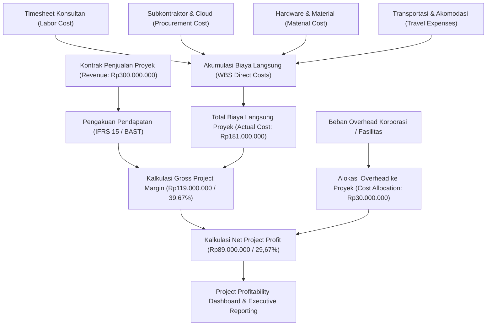

# Project Profitability

## Definition

**Project Profitability** adalah pengukuran dan analisis kinerja finansial suatu proyek di dalam Enterprise Resource Planning (ERP) yang mengevaluasi margin keuntungan bersih yang dihasilkan dengan mempertemukan pendapatan yang diakui (*recognized revenue*) terhadap seluruh biaya langsung (*direct costs*) serta alokasi beban *overhead* yang diatribusikan ke objek biaya proyek tersebut.

Di dalam ERP, analisis profitabilitas proyek tidak sekadar melihat selisih kas masuk dan kas keluar, melainkan menyajikan Laporan Laba Rugi Mini (*Project Mini-P&L*) yang terstruktur menurut elemen rincian kerja (WBS), kategori sumber daya, dan fase penyelesaian pekerjaan.

---

## Purpose

Analisis Project Profitability dalam ERP bertujuan untuk:

1. **Evaluasi Keberhasilan Komersial**: Mengukur apakah proyek memberikan kontribusi laba yang sesuai atau melebihi ekspektasi kelayakan bisnis (*feasibility study*) awal.
2. **Identifikasi Penyebab Deviasi Margin (*Margin Variance Analysis*)**: Membongkar sumber perbedaan antara margin rencana (*planned margin*) dan margin realisasi (*actual margin*), apakah disebabkan oleh efisiensi tenaga kerja, penghematan pengadaan, atau negosiasi subkontraktor.
3. **Optimasi Penetapan Harga Masa Depan (*Pricing Refinement*)**: Memberikan data historis akurat mengenai struktur biaya riil untuk meningkatkan akurasi proposal penawaran (*bidding/tendering*) pada proyek sejenis berikutnya.
4. **Alokasi Beban Overhead yang Adil (*Cost Absorption*)**: Memastikan biaya tidak langsung perusahaan (administrasi umum, lisensi software korporat, manajemen risiko) diserap secara proporsional oleh proyek yang memanfaatkan fasilitas tersebut.
5. **Penilaian Produktivitas Sumber Daya (*Billing Realization Rate*)**: Menghitung seberapa efektif jam kerja konsultan dapat dikonversi menjadi pendapatan nyata dibandingkan tarif standar industri (*list billing rate*).

---

## Business Process

Alur pengumpulan dan analisis profitabilitas proyek digambarkan dalam bagan berikut:

### Tingkatan Profitabilitas Proyek

Dalam akuntansi manajemen ERP, profitabilitas proyek dianalisis dalam beberapa tingkatan:

1. **Project Contribution Margin**:
   - Selisih antara Pendapatan Proyek dengan Biaya Variabel Langsung (misalnya biaya tenaga kerja lepas, tiket perjalanan dinas, material konsumsi).
2. **Gross Project Margin**:
   - Selisih antara Pendapatan Proyek dengan seluruh Biaya Langsung Proyek (*Total Direct Project Costs*).
   $$\text{Gross Project Margin} = \text{Project Revenue} - \text{Total Direct Costs}$$
3. **Net Project Margin (Operating Margin Proyek)**:
   - Margin kotor proyek dikurangi alokasi biaya *overhead* tidak langsung perusahaan (misalnya alokasi biaya manajemen kantor, amortisasi peralatan kantor umum, asuransi proyek).
   $$\text{Net Project Margin} = \text{Gross Project Margin} - \text{Allocated Corporate Overhead}$$

---

## Business Rules

### 1. Konsistensi Pengakuan Biaya dan Pendapatan (*Matching Principle*)
Pendapatan dan biaya yang terkait langsung dengan pencapaian suatu fase atau tonggak prestasi (*milestone*) harus diakui pada periode akuntansi yang sama guna menghindari distorsi margin laba bulanan yang semu.

### 2. Aturan Alokasi Overhead Proyek
Pembebanan biaya tidak langsung (*indirect cost allocation*) ke proyek harus didasarkan pada basis pendorong biaya (*cost driver*) yang konsisten dan telah disepakati:
- Persentase tetap dari biaya tenaga kerja langsung (*Labor Surcharge Rate*).
- Persentase tetap dari total nilai kontrak (misalnya 10% dari nilai pendapatan).
- Jam kerja riil yang dihabiskan pada proyek (*Direct Labor Hours*).

### 3. Tingkat Realisasi Penagihan (*Billing Realization Rate*)
Metrik efisiensi komersial dihitung dengan formula:
$$
\text{Billing Realization Rate} = \frac{\text{Actual Revenue Recognized}}{\text{Logged Billable Hours} \times \text{Standard List Rate}}
$$
Rasio ini mendeteksi apakah terjadi penurunan tarif (*discounting*) yang berlebihan selama fase negosiasi kontrak.

---

## Accounting Impact

Analisis profitabilitas proyek bersumber dari akun-akun pendapatan dan beban yang terhubung ke buku pembantu analitik proyek (*Analytic Ledger / Project Subledger*):

1. **Laba Rugi Analitik (*Analytic P&L*)**:
   - Menghasilkan ringkasan laporan keuangan yang membedah saldo akun nominal kelas 4 (Pendapatan), kelas 5 (Harga Pokok Proyek / HPP), dan kelas 6 (Beban Operasional Proyek) khusus untuk kode proyek terkait.
2. **Pembebanan Overhead (*Secondary Cost Allocation*)**:
   - Jika alokasi overhead dilakukan melalui jurnal biaya sekunder dalam akuntansi manajemen:
     - **Debit**: Beban Overhead Proyek (WBS Proyek Terkait).
     - **Kredit**: Akun Kliring Alokasi Biaya Overhead Departemen Pendukung.

---

## Example: Implementasi ERP Naventra

Meneruskan skenario kanonik proyek `PRJ-ERP-2026-001` untuk pelanggan `PT Maju Bersama`:

- **Nilai Kontrak Proyek (Revenue)**: **Rp300.000.000**
- **Estimasi Biaya Rencana (Planned Cost)**: **Rp200.000.000**
- **Target Gross Margin Rencana**: **Rp100.000.000** ($33,33\%$)

### 1. Laporan Laba Rugi Proyek Realisasi (Actual Project P&L)

| Elemen Finansial | Anggaran Rencana (Planned) | Realisasi Aktual (Actual) | Varians Nominal | Status Varians |
| :--- | :--- | :--- | :--- | :--- |
| **Pendapatan Proyek (Revenue)** | Rp300.000.000 | Rp300.000.000 | Rp0 | Sesuai Kontrak |
| **Biaya Tenaga Kerja (Labor)** | (Rp100.000.000) | (Rp90.000.000) | +Rp10.000.000 | Favorable (Hemat 80 Jam) |
| **Biaya Pengadaan (Procurement)** | (Rp60.000.000) | (Rp55.000.000) | +Rp5.000.000 | Favorable (Efisiensi Vendor) |
| **Biaya Material Jaringan (Material)** | (Rp30.000.000) | (Rp28.000.000) | +Rp2.000.000 | Favorable (Retur Sisa Kabel) |
| **Biaya Perjalanan & Lainnya (Expenses)** | (Rp10.000.000) | (Rp8.000.000) | +Rp2.000.000 | Favorable (Efisiensi Akomodasi) |
| **Total Biaya Langsung (Direct Cost)** | **(Rp200.000.000)** | **(Rp181.000.000)** | **+Rp19.000.000** | **Favorable / Under Budget** |
| **Gross Project Margin (Rp)** | **Rp100.000.000** | **Rp119.000.000** | **+Rp19.000.000** | **Ekspansi Margin** |
| **Gross Project Margin (%)** | **33,33%** | **39,67%** | **+6,34%** | **Kinerja Sangat Baik** |
| **Alokasi Overhead Korporat (10%)** | (Rp30.000.000) | (Rp30.000.000) | Rp0 | Sesuai Kebijakan |
| **Net Project Profit (Rp)** | **Rp70.000.000** | **Rp89.000.000** | **+Rp19.000.000** | **Laba Bersih Meningkat** |
| **Net Project Margin (%)** | **23,33%** | **29,67%** | **+6,34%** | **Laba Bersih 29,67%** |

### 2. Analisis Kinerja Margin
- Proyek berhasil meningkatkan *Gross Margin* dari target awal **33,33%** menjadi **39,67%** (kenaikan bersih sebesar **6,34 poin persentase**).
- Penghematan total biaya langsung sebesar **Rp19.000.000** secara utuh mengalir menjadi penambahan laba bersih proyek, menghasilkan *Net Project Profit* sebesar **Rp89.000.000**.

---

## ERP Implementation

Penyajian laporan profitabilitas proyek pada platform ERP enterprise:

### Odoo Implementation
- **Analytic Accounting Profitability View**: Odoo menyajikan tab *Profitability* langsung pada tampilan formulir proyek.
- **Visual Breakdown**: Menampilkan grafik dan tabel perbandingan antara *Invoiced Revenue*, *Timesheet Costs*, *Vendor Bills*, dan *Other Costs*.
- **Margin Calculation**: Menghitung persentase margin laba secara instan setiap kali faktur penjualan atau tagihan vendor baru diposting ke akun analitik terkait.

### ERPNext Implementation
- **Project Profitability Report**: ERPNext menyediakan laporan standar *Project Profitability* yang mengagregasi data dari modul *Accounts* dan *Projects*.
- **P&L per Project**: Pengguna dapat menjalankan Laporan Laba Rugi umum (*Profit and Loss Statement*) dengan filter dimensi `Project`, menyajikan pendapatan dan beban hingga level laba kotor dan laba operasional proyek.
- **Cost Center Integration**: Memetakan setiap proyek ke *Cost Center* terdedikasi untuk memisahkan pelaporan manajemen secara hierarkis.

### Dynamics 365 Implementation
- **Project Statements**: Dynamics 365 Project Operations memiliki fitur *Project Statements* yang menampilkan laporan finansial komparatif mendalam (*Actual vs Budget vs Baseline*).
- **Cost and Revenue Profiles**: Mendukung analisis profitabilitas multi-dimensi berdasarkan *Transaction Type* (Hour, Expense, Item, Fee).
- **WIP and Profit Recognition**: Menghitung estimasi laba kotor yang belum direalisasikan pada proyek jangka panjang yang menggunakan metode pengakuan pendapatan persentase penyelesaian (*Cost-to-Cost*).

---

## Naventra Consideration

Dalam perancangan modul analisis profitabilitas Naventra ERP:

1. **Real-time Margin Tracking Dashboard**: Dashboard manajer proyek menampilkan visualisasi *burn rate* biaya dan prediksi margin akhir (*Projected Final Margin*) yang diperbarui setiap hari berdasarkan entri timesheet yang disetujui.
2. **Automated Overhead Surcharge Engine**: Naventra mengintegrasikan modul *Cost Accounting* yang secara otomatis menghitung dan membebankan alokasi *indirect overhead* bulanan ke WBS proyek berdasarkan formula yang dapat disesuaikan tanpa intervensi manual.
3. **Variance Drill-Down to Source Documents**: Klik pada deviasi margin langsung membuka rincian dokumen sumber pendukung (misalnya klik pada deviasi biaya tenaga kerja langsung membuka daftar lembar kerja timesheet konsultan terkait).

---

## References

- Kaplan, R. S., & Atkinson, A. A. (2015). *Advanced Management Accounting* (3rd ed.). Pearson.
- Project Management Institute (PMI). (2021). *A Guide to the Project Management Body of Knowledge (PMBOK Guide)* (7th ed.). Project Management Institute.
- SAP Help Portal. *Project Profitability Analysis in Controlling (CO-PA)*.
- Microsoft Learn. *Project Statements and Profitability Analysis in Dynamics 365*.
- ERPNext Documentation. *Project Profitability Analysis*.
- Odoo 17.0 Documentation. *Track Project Profitability*.
