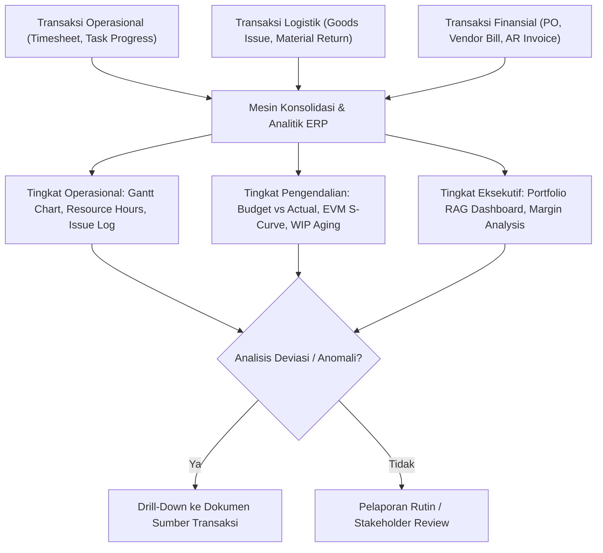

# Project Reporting and Analytics

## Definition

**Project Reporting and Analytics** adalah kapabilitas intelijen bisnis dan pelaporan komprehensif di dalam Enterprise Resource Planning (ERP) yang mengumpulkan, mengonsolidasikan, memvisualisasikan, dan menganalisis data operasional dan finansial proyek secara multi-dimensi dan *real-time*.

Berbeda dari laporan proyek konvensional berbasis spreadsheet yang terisolasi dan statis, pelaporan proyek dalam ERP menyatukan data operasional (progres tugas, utilisasi jam kerja konsultan, log kendala) dengan data finansial buku besar (anggaran, komitmen pengadaan, faktur vendor, penagihan pelanggan, pengakuan pendapatan IFRS 15), dengan kemampuan penelusuran balik (*drill-down*) hingga ke tingkat dokumen transaksi sumber.

---

## Purpose

Tujuan implementasi Project Reporting and Analytics di dalam ERP adalah:

1. **Visibilitas Kinerja Tiga Dimensi (*Triple Constraint Transparency*)**: Memantau keseimbangan antara kemajuan ruang lingkup (*scope*), kepatuhan jadwal (*schedule*), dan kesehatan penyerapan biaya (*budget/cost*).
2. **Pengambilan Keputusan Berbasis Fakta (*Data-Driven Decisions*)**: Menyediakan indikator peringatan dini (seperti tren penurunan CPI/SPI atau potensi kelebihan jam kerja) sebelum proyek mengalami kegagalan.
3. **Pelaporan Berjenjang (*Multi-Tier Reporting*)**: Menyajikan informasi yang relevan sesuai tingkatan pemangku kepentingan (Direksi, PMO, Manajer Proyek, hingga Konsultan Lapangan).
4. **Audit Trail dan Akuntabilitas Finansial**: Menjamin bahwa angka biaya dan pendapatan yang dilaporkan dapat diverifikasi hingga ke lembar kerja (*timesheet*), pesanan pembelian (*Purchase Order*), dan faktur tagihan (*Invoice*).
5. **Optimasi Alokasi Portofolio Proyek**: Membantu pimpinan operasional mengevaluasi kapasitas dan utilisasi sumber daya manusia lintas departemen dan lintas proyek secara berkelanjutan.

---

## Business Process

Alur pengolahan dan konsolidasi data analitik proyek disajikan dalam diagram berikut:



### Tiga Lapisan Pelaporan Proyek (*Reporting Layers*)

1. **Operational Layer (Tingkat Operasional Proyek)**:
   - **Target Audiens**: Manajer Proyek, *Lead Engineer*, Konsultan Lapangan.
   - **Fokus Pelaporan**: Pemenuhan jadwal aktivitas harian/mingguan, diagram Gantt dinamis, tingkat penyelesaian tugas (*Task Completion Rate*), jam kerja riil konsultan, dan log kendala teknis (*Issue/Bug Tracking*).
2. **Control & Financial Layer (Tingkat Pengendalian & Finansial)**:
   - **Target Audiens**: Pengendali Biaya (*Cost Controller*), Manajer Keuangan (*Finance Manager*).
   - **Fokus Pelaporan**: Laporan ketersediaan anggaran (*Budget Availability Report*), perbandingan *Planned vs Committed vs Actual Cost*, kurva-S EVM (*PV, EV, AC, CPI, SPI*), penuaan saldo pekerjaan dalam pelaksanaan (*WIP Aging*), dan rekonsiliasi piutang tagihan.
3. **Executive & Portfolio Layer (Tingkat Eksekutif & Portofolio)**:
   - **Target Audiens**: Direksi Operasional, *Steering Committee*, Kepala PMO (*Project Management Office*).
   - **Fokus Pelaporan**: Indikator kesehatan portofolio (*RAG Status - Red, Amber, Green*), kontribusi laba kotor portofolio (*Portfolio Gross Margin*), tingkat utilisasi divisi konsultan, dan perkiraan arus kas masuk/keluar masa depan.

---

## Business Rules

### 1. Kemampuan Penelusuran Balik (*Drill-Down Capability*)
Setiap angka ringkasan finansial pada dashboard analitik proyek wajib memiliki fungsionalitas penelusuran balik (*drill-down*) bertingkat:
$$\text{Portfolio Summary} \longrightarrow \text{Project Summary} \longrightarrow \text{WBS Element} \longrightarrow \text{Cost Element} \longrightarrow \text{Source Document (PO/Timesheet/Journal Entry)}$$

### 2. Standardisasi Indikator Kesehatan (RAG Status Rules)
Status kesehatan proyek dikategorikan secara otomatis oleh sistem berdasarkan deviasi jadwal dan biaya:
- **Green (Sehat)**: $\text{CPI} \ge 0,95$ dan $\text{SPI} \ge 0,95$. Proyek berjalan sesuai atau mendekati rencana.
- **Amber (Waspada)**: $0,85 \le \text{CPI} < 0,95$ atau $0,85 \le \text{SPI} < 0,95$. Terjadi deviasi moderat yang membutuhkan rencana tindakan korektif.
- **Red (Kritis)**: $\text{CPI} < 0,85$ atau $\text{SPI} < 0,85$, atau proyek mengalami pemblokiran *Availability Control* (AVC). Memerlukan eskalasi segera ke komite pengarah (*Steering Committee*).

---

## Example: Implementasi ERP Naventra

Meneruskan skenario kanonik proyek `PRJ-ERP-2026-001` untuk pelanggan `PT Maju Bersama`:

### 1. Dashboard Ringkasan Kinerja Final Proyek

| Dimensi Kinerja | Target Rencana (Baseline) | Realisasi Akhir (Actual) | Varians / Indeks | Status Kinerja |
| :--- | :--- | :--- | :--- | :--- |
| **Durasi Proyek** | 184 Hari Kalender | 184 Hari Kalender | 0 Hari | Tepat Waktu (On-Time) |
| **Jam Kerja Konsultan** | 1.000 Jam | 920 Jam | +80 Jam Hemat | 92% Efisiensi Waktu |
| **Nilai Pendapatan** | Rp300.000.000 | Rp300.000.000 | Rp0 | 100% Ditagihkan & Lunas |
| **Pagu Anggaran Disetujui** | Rp250.000.000 | Rp181.000.000 Konsumsi | Rp69.000.000 Sisa | 72,4% Penyerapan Anggaran |
| **Total Biaya Langsung** | Rp200.000.000 | Rp181.000.000 | +Rp19.000.000 | Favorable (Hemat Biaya) |
| **Gross Margin Proyek** | Rp100.000.000 (33,33%) | Rp119.000.000 (39,67%) | +Rp19.000.000 (+6,34%) | Ekspansi Margin Laba |
| **Cost Performance Index (CPI)** | 1,00 | 1,105 | +0,105 | Sangat Efisien (Green) |
| **Schedule Performance Index (SPI)** | 1,00 | 1,00 | 0,00 | Tepat Jadwal (Green) |
| **Status Kesehatan Proyek** | Normal | **GREEN** | Optimal | Sukses Penuh |

### 2. Kurva-S Analitik EVM (Earned Value S-Curve Breakdown)

```text
Nilai Finansial
  (Rp Juta)
   300 |                                            --- Rencana Kontrak (Rp300M)
       |
   250 |                                            === Pagu Anggaran (Rp250M)
       |
   200 |                                    * * * * * PV = EV (Rp200M pada 100% Progres)
       |                            * * * * 
       |                    * * * *         # # # # # AC Aktual (Rp181M - Hemat Rp19M)
   150 |            * * * *         # # # # 
       |    * * * *         # # # #
   100 |            # # # #
       |    # # # #
    50 |
       |____________________________________________
       Bln-1    Bln-2    Bln-3    Bln-4    Bln-5    Bln-6 (Bulan Kalender)
```

*Interpretasi Kurva-S*:
- Garis **PV** (*Planned Value*) dan **EV** (*Earned Value*) bertemu pada angka Rp200.000.000 saat proyek mencapai penyelesaian 100% tepat pada bulan ke-6.
- Garis **AC** (*Actual Cost*) berada konsisten di bawah garis EV, berakhir di nominal **Rp181.000.000**, mencerminkan efisiensi biaya nyata sebesar Rp19.000.000 (*favorable cost variance*).

> [!NOTE]
> **Verifikasi Kinerja Jadwal (SPI vs Kalender Riil)**:
> Rasio $SPI = 1,00$ pada dashboard akhir merupakan hasil matematis kumulatif dari penyelesaian 100% ruang lingkup proyek ($\text{EV} = \text{PV} = \text{Rp200.000.000}$). Kepatuhan jadwal operasional riil diverifikasi melalui penyelesaian seluruh aktivitas kritis tepat pada tanggal target *Baseline Schedule* (01 Mei s.d. 31 Oktober 2026, 184 hari kalender) tanpa memicu klaim denda penalti keterlambatan.

---

## ERP Implementation

Kapabilitas pelaporan proyek pada platform ERP enterprise (disajikan secara deskriptif berdasarkan dokumentasi resmi versi yang dirujuk):

### Odoo Implementation
- **Project Pivot & Graph Views**: Odoo menyediakan antarmuka pivot interaktif untuk membedah data jam kerja (*timesheet*) per pengguna, tugas, atau departemen.
- **Integrated Spreadsheet**: Memungkinkan pembacaan data dinamis dari modul proyek dan keuangan langsung ke dokumen spreadsheet terintegrasi dengan pembaruan otomatis.
- **Profitability Dashboard**: Tab bawaan pada formulir proyek yang menampilkan perbandingan visual antara pendapatan difakturkan dan seluruh pengeluaran analitik.

### ERPNext Implementation
- **Standard Project Reports**: ERPNext menyediakan laporan standar bawaan: *Project Summary*, *Project Profitability*, *Project Billing Summary*, dan *Timesheet Summary*.
- **Interactive Gantt View**: Menyajikan tampilan Gantt interaktif yang memungkinkan penyesuaian dependensi tugas dan pemantauan persentase penyelesaian secara visual.
- **Custom Scripting & Query Reports**: Memungkinkan analis bisnis membangun laporan khusus SQL (*Query Report*) untuk menggabungkan data WBS dengan buku besar akun secara fleksibel.

### Dynamics 365 Implementation
- **Power BI Embedded Dashboards**: Dynamics 365 Project Operations menyediakan integrasi mendalam dengan dashboard Power BI bawaan (analisis portofolio, utilisasi sumber daya, margin kotor per segmen industri).
- **Cost Tracking Views**: Antarmuka *Cost Tracking* dan *Effort Tracking* yang menghitung varians biaya (*Cost Variance*) dan varians jadwal (*Schedule Variance*) secara otomatis pada tingkat rincian WBS.
- **Multi-Entity Analytics**: Kemampuan mengonsolidasi pelaporan kinerja proyek yang melibatkan banyak entitas legal anak perusahaan (*intercompany project reporting*).

---

## Naventra Consideration

Dalam perancangan modul pelaporan dan analitik proyek Naventra ERP:

1. **Eksekutif Dashboard Real-Time**: Antarmuka PMO yang memvisualisasikan seluruh portofolio proyek dalam bentuk matriks kuadran interaktif (Margin vs Jadwal) dengan penanda otomatis status kesehatan proyek (*RAG Status*).
2. **Automated Weekly Progress Report Generator**: Sistem secara otomatis menyusun ringkasan kemajuan mingguan berformat PDF resmi (mencakup progres fisik, grafik S-Curve, status penagihan BAST, dan daftar isu kritis) yang siap dikirimkan kepada pemangku kepentingan klien.
3. **Komprehensif Audit Trail & Snapshot**: Naventra menyimpan rekaman jejak (*snapshot*) mingguan untuk seluruh metrik proyek, memungkinkan rekonstruksi historis atas evolusi estimasi biaya dan pergeseran jalur kritis sepanjang siklus hidup proyek.

---

## References

- Project Management Institute (PMI). (2019). *Practice Standard for Earned Value Management*. PMI.
- Few, S. (2013). *Information Dashboard Design: Displaying Data for At-a-Glance Monitoring* (2nd ed.). Analytics Press.
- SAP Help Portal. *Project Reporting and Information System in Project System (PS)*.
- Microsoft Learn. *Project Analytics and Reporting in Dynamics 365 Project Operations*.
- ERPNext Documentation. *Project Reports and Analytics*.
- Odoo 17.0 Documentation. *Reporting and Project Dashboards*.
