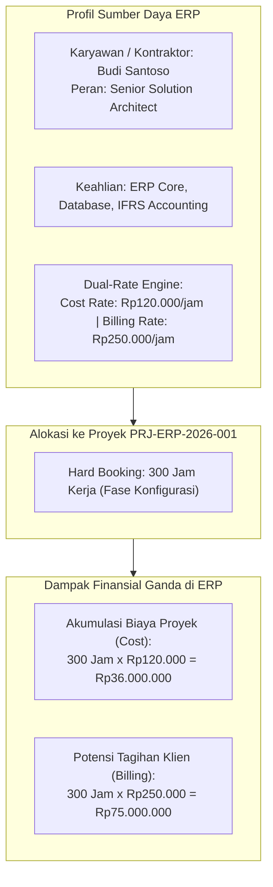
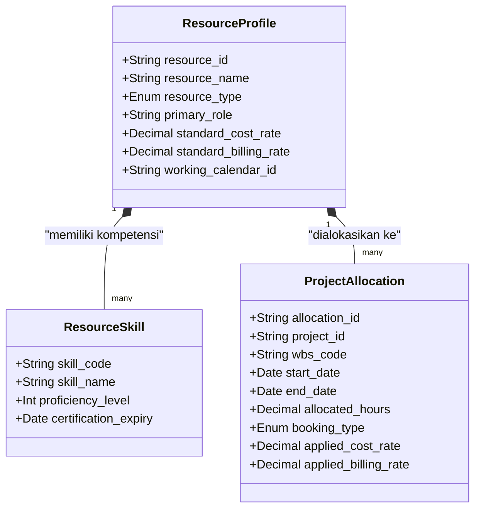

# Project Resource Management

## Definition

**Project Resource Management** dalam sistem ERP adalah tata kelola menyeluruh atas perencanaan kapasitas (*capacity planning*), pengalokasian (*staffing & allocation*), penjadwalan, dan evaluasi utilisasi sumber daya—baik **sumber daya manusia (SDM)** seperti konsultan internal, insinyur, dan kontraktor eksternal, maupun **sumber daya fisik non-manusia** seperti mesin khusus, perkakas berat, dan laboratorium pengujian—yang ditugaskan pada proyek.

Di dalam ERP enterprise, manajemen sumber daya tidak sekadar mencocokkan nama orang dengan nama tugas, melainkan menerapkan **arsitektur tarif ganda (*Dual-Rate Architecture*)**:
- **Tarif Biaya (*Cost Rate*)**: Nilai moneter per jam yang merefleksikan beban pengeluaran riil perusahaan atas sumber daya tersebut (gaji pokok, tunjangan, dan biaya overhead tenaga kerja), yang digunakan untuk menghitung **Beban Pokok Proyek (*Project Cost*)**.
- **Tarif Tagih (*Billing Rate*)**: Nilai moneter per jam yang disepakati dalam kontrak untuk ditagihkan kepada pelanggan atas jasa sumber daya tersebut, yang digunakan untuk menghasilkan **Pendapatan Proyek (*Project Billing*)**.

---

## Purpose

1. **Optimalisasi Tingkat Utilisasi Personel (*Resource Utilization*)**: Memaksimalkan persentase waktu kerja staf profesional yang dapat ditagihkan ke proyek klien (*billable hours*) dan meminimalkan waktu menganggur (*bench time*).
2. **Pencegahan Alokasi Berlebih (*Over-Allocation Prevention*)**: Mencegah benturan jadwal di mana seorang spesialis kunci ditugaskan pada dua proyek berbeda pada waktu yang sama melebihi jam kerja normal.
3. **Pencocokan Penugasan Berbasis Kompetensi (*Skill-Based Staffing*)**: Mengidentifikasi kandidat personel yang memiliki sertifikasi, keahlian teknis (*competencies*), dan ketersediaan waktu yang paling sesuai dengan profil kebutuhan proyek.
4. **Presisi Estimasi Biaya Tenaga Kerja (*Accurate Labor Costing*)**: Menghitung estimasi biaya tenaga kerja langsung (*Planned Labor Cost*) secara matematis berdasarkan jam kerja rencana dikalikan tarif biaya per jam masing-masing peran.
5. **Pemisahan Penugasan Definitif vs Tentatif (*Hard vs Soft Booking*)**: Memungkinkan manajer proyek memesan sementara staf berkeahlian langka pada tahap perencanaan proposal (*Soft Booking*) sebelum dikunci secara definitif saat kontrak disahkan (*Hard Booking*).

---

## Dua Metode Alokasi Sumber Daya: Soft Booking vs Hard Booking

Dalam siklus penugasan staf, ERP membedakan dua tingkatan komitmen sumber daya:

| Dimensi | Soft Booking (Pemesanan Tentatif) | Hard Booking (Penugasan Definitif) |
| :--- | :--- | :--- |
| **Status Proyek** | Proyek masih dalam tahap penawaran (*Draft/Proposal*). | Proyek telah disahkan menjadi kontrak aktif (*In-Progress*). |
| **Dampak Kapasitas** | Personel dicadangkan sementara; masih dapat dialihkan ke proyek lain jika ada prioritas lebih tinggi. | Kapasitas personel dikunci penuh; tidak dapat ditugaskan ke proyek lain pada jam yang sama. |
| **Otoritas Persetujuan** | Cukup diajukan oleh Manajer Proyek. | Wajib disetujui bersama oleh Manajer Proyek dan Manajer Sumber Daya (*Resource/Department Manager*). |
| **Dampak Finansial** | Hanya memengaruhi estimasi anggaran rencana. | Menjadi dasar jadwal kerja resmi dan komitmen biaya tenaga kerja. |

---

## Pengukuran Efisiensi: Rasio Utilisasi Sumber Daya

Metrik utama yang dipantau oleh manajemen divisi konsultasi dan rekayasa dalam ERP adalah **Tingkat Utilisasi (*Resource Utilization Rate*)**:

$$\text{Utilization Rate (\%)} = \frac{\text{Total Jam Kerja Tertagih (Billable Hours)}}{\text{Total Jam Kerja Tersedia (Standard Available Hours)}} \times 100\%$$

- **Jam Kerja Tertagih (*Billable Hours*)**: Jam kerja yang dihabiskan untuk proyek komersial klien yang dapat ditagihkan pembayarannya.
- **Jam Kerja Non-Tertagih (*Non-Billable Hours*)**: Waktu yang dihabiskan untuk proyek internal, riset, pelatihan (*training*), cuti tahunan, atau waktu tunggu menganggur (*bench time*).

Target standar industri jasa profesional umumnya berkisar antara **$75\% - 85\%$** untuk konsultan pelaksana dan **$60\% - 70\%$** untuk konsultan manajerial.

---

## Business Rules

1. **Anti-Double Booking Constraint**: Sistem ERP wajib secara otomatis menolak penugasan definitif (*Hard Booking*) jika personel yang bersangkutan telah dialokasikan 100% pada proyek lain pada rentang tanggal yang sama.
2. **Cost Rate Confidentiality & Role-Based Masking**: Tarif biaya per jam riil (*Cost Rate*) dari karyawan internal bersifat rahasia manajerial; sistem wajib menyembunyikan angka tarif ini dari tampilan layar anggota tim biasa dan hanya menampilkannya kepada Manajer Proyek berwenang dan akuntan biaya (*field-level security*).
3. **Leave Calendar Integration**: Alokasi kerja harian personel dilarang dijadwalkan pada hari-hari di mana karyawan telah memiliki pengajuan cuti yang disetujui (*Approved Leave*) pada modul SDM / HR.
4. **Competency Gate on Critical Tasks**: Tugas-tugas proyek yang ditandai dengan prasyarat sertifikasi keahlian khusus dilarang ditugaskan kepada personel yang belum memiliki rekaman validitas sertifikasi aktif pada profil master karyawan.
5. **Contractor Requisition Control**: Penugasan konsultan pihak ketiga (*External Contractor*) wajib melalui alur penerbitan pesanan pembelian jasa (*Service PO*) pada modul Purchasing dan tidak boleh dialokasikan ke proyek tanpa persetujuan pagu anggaran subkontraktor.

---

## Data Model Konseptual: Sumber Daya Proyek

---

## Accounting & Financial Impact

Manajemen sumber daya menggerakkan perhitungan beban tenaga kerja langsung (*Direct Labor Cost*):
- Setiap jam kerja yang disetujui pada penugasan sumber daya mengalokasikan nilai moneter ($\text{Jam Kerja} \times \text{Cost Rate}$) sebagai penambah biaya proyek di buku besar aktiva/beban dan kredit akun penyeimbang beban gaji (*Payroll Clearing Account*).

---

## Canonical Scenario: Rencana Sumber Daya Proyek PT Maju Bersama

Untuk proyek **Implementasi ERP Naventra** (`PRJ-ERP-2026-001`), estimasi biaya tenaga kerja rencana (*Planned Labor Cost*) ditetapkan sebesar **Rp100.000.000** yang dialokasikan pada 4 peran spesialis utama dengan total 1.000 jam kerja:

| Peran Sumber Daya | Nama Personel Terpilih | Jam Kerja Rencana | Tarif Biaya (Cost Rate) | Total Biaya Tenaga Kerja (IDR) | Tarif Tagih (Billing Rate) | Nilai Komersial (IDR) |
| :--- | :--- | :--- | :--- | :--- | :--- | :--- |
| **Project Manager** | Hendra Wijaya | 200 Jam | Rp150.000 / jam | 30.000.000 | Rp350.000 / jam | 70.000.000 |
| **Senior Solution Architect** | Budi Santoso | 300 Jam | Rp120.000 / jam | 36.000.000 | Rp300.000 / jam | 90.000.000 |
| **Technical Consultant / Dev** | Rizky Pratama | 400 Jam | Rp75.000 / jam | 30.000.000 | Rp200.000 / jam | 80.000.000 |
| **Quality Assurance (QA) Lead** | Siti Rahma | 100 Jam | Rp40.000 / jam | 4.000.000 | Rp150.000 / jam | 15.000.000 |
| **TOTAL** | **4 Personel Inti** | **1.000 Jam** | — | **100.000.000** | — | **255.000.000** |

*Verifikasi Konsistensi: Total Biaya Tenaga Kerja Rencana ($\text{Rp30M} + \text{Rp36M} + \text{Rp30M} + \text{Rp4M} = \mathbf{Rp100.000.000}$) persis sesuai dengan alokasi komponen Labor pada Planned Cost proyek.*

---

## ERP Implementation

Perbandingan kapabilitas alokasi sumber daya proyek lintas software ERP enterprise:

| Parameter Sumber Daya | Odoo Enterprise | ERPNext | Microsoft Dynamics 365 | SAP S/4HANA Finance |
| :--- | :--- | :--- | :--- | :--- |
| **Pengelolaan Kapasitas Personel** | Tampilan *Planning / Resource Grid* terhubung ke modul HR | Dokumen *Activity Cost* dan *Sales Person / Employee* | Mesin penjadwalan *Universal Resource Scheduling (URS)* | Modul komprehensif *SAP Commercial Project Management (CPM)* & *MRS* |
| **Arsitektur Dual-Rate (Cost vs Bill)** | Pengaturan cost per employee & billing rate per role/task | Konfigurasi *Costing Rate* dan *Billing Rate* per user | Matriks harga canggih *Price Lists & Transfer Pricing* per peran | Penentuan tarif biaya aktivitas (*Activity Types - KP26*) di modul CO |
| **Dukungan Soft vs Hard Booking** | Memerlukan pengaturan status modul Planning kustom | Status alokasi berbasis tanggal penugasan task | Pembedaan native *Hard vs Soft committed resources* | Pembedaan status reservasi kapasitas staf di modul *SAP MRS* |
| **Pencocokan Keahlian (Skill Matching)** | Modul *Skills* pada profil HR terhubung ke penugasan | Tagging keahlian standar pada master Employee | Pencocokan otomatis *Skill-based resource matching & proficiency* | Integrasi modul *SAP SuccessFactors / Qualifications* |

---

## Naventra Consideration

Rancangan arsitektur modul Resource Management pada Naventra ERP:

1. **Dual-Rate Matrix Engine**: Naventra mengelola tarif sumber daya melalui tabel multidimensi `resource_rate_matrices` (`role_id`, `resource_id`, `project_type_id`, `cost_rate`, `billing_rate`, `valid_from`, `valid_to`). Saat jam kerja di-posting, sistem menentukan tarif yang berlaku secara deterministik berdasarkan tanggal pelaksanaan kerja.
2. **Interactive Resource Heatmap**: Dasbor Naventra menyajikan *Resource Utilization Heatmap* visual: sel berwarna hijau untuk staf dengan utilisasi optimal (75–85%), kuning untuk utilisasi rendah (< 50%), dan merah untuk staf yang mengalami *over-allocation* (> 100%), memudahkan manajer proyek melakukan penyeimbangan beban kerja (*resource re-balancing*).
3. **Automated HR Leave Synchronization**: Modul alokasi Naventra terhubung secara reaktif dengan modul HR. Setiap kali pengajuan cuti karyawan disetujui, sistem secara otomatis mengevaluasi alokasi kerja yang terdampak dan memberi peringatan kepada Manajer Proyek terkait.

---

## References

- Project Management Institute (PMI). *A Guide to the Project Management Body of Knowledge (PMBOK Guide: Resource Management)*.
- SAP SE. *Resource Planning and Activity Allocation in SAP Project System and Controlling*. SAP Help Portal.
- Microsoft Corporation. *Resource management overview and scheduling in Dynamics 365 Project Operations*. Microsoft Learn.
- Frappe Technologies. *Activity Cost and Resource Allocation in ERPNext*. ERPNext Documentation.
- Odoo S.A. *Planning Shifts, Roles, and Resource Management*. Odoo Documentation.
