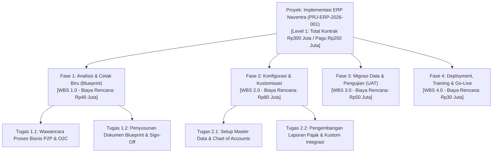
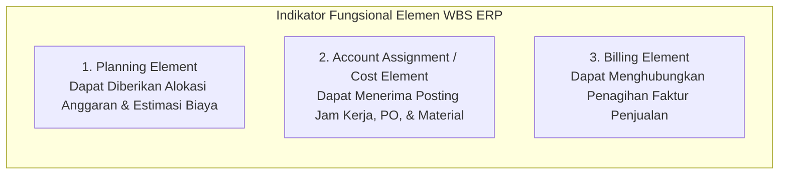
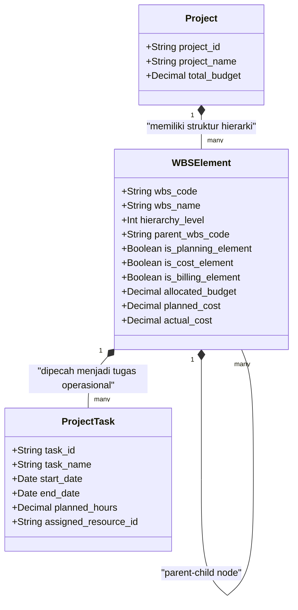

# Project Structure & Work Breakdown Structure (WBS)

## Definition

**Work Breakdown Structure (WBS / Struktur Rincian Kerja)** dalam arsitektur ERP adalah dekomposisi hierarkis dan terstruktur dari seluruh ruang lingkup total proyek menjadi komponen-komponen penyusun yang lebih kecil, terukur, dan dapat dikelola (*manageable work deliverables*).

Dalam sistem ERP enterprise, WBS memegang **peran ganda (Dual Role)** yang sangat penting:
1. **Peran Operasional**: Membagi pekerjaan besar menjadi fase (*phases*), paket kerja (*work packages*), dan aktivitas tugas (*tasks*) untuk memudahkan penjadwalan, penugasan personel, dan pelacakan kemajuan fisik.
2. **Peran Finansial & Akuntansi**: Setiap simpul WBS (*WBS Element*) dapat berfungsi sebagai **objek penetapan akun buku besar (*Account Assignment & Controlling Object*)**, wadah alokasi pagu anggaran (*Budget Element*), titik akumulasi biaya riil (*Cost Collector*), atau titik pemicu penagihan piutang (*Billing Element*).

---

## Purpose

1. **Penerapan Aturan Cakupan Total (The 100% Rule)**: Memastikan WBS mencakup 100% dari seluruh ruang lingkup pekerjaan yang disepakati dalam kontrak tanpa ada aktivitas siluman atau ruang lingkup yang tertinggal.
2. **Akumulasi Biaya Berjenjang (*Hierarchical Cost Roll-Up*)**: Memungkinkan manajer proyek memantau biaya aktual secara terperinci di tingkat tugas terbawah yang secara otomatis terakumulasi naik (*rolled-up*) ke tingkat fase dan total proyek.
3. **Pendelegasian Batas Pagu Anggaran (*Budget Distribution*)**: Mendistribusikan total pagu anggaran korporat ke masing-masing elemen WBS untuk mencegah satu fase proyek menghabiskan seluruh dana proyek.
4. **Pemisahan Elemen Penagihan (*Billing Elements*)**: Menetapkan simpul WBS mana yang menjadi dasar penerbitan faktur tagihan ke pelanggan sesuai penyelesaian deliverable kontrak.
5. **Kejelasan Kepemilikan Tanggung Jawab (*Accountability Mapping*)**: Memetakan setiap paket kerja ke satu penanggung jawab spesifik (*Work Package Owner*) sehingga tidak ada duplikasi atau kekosongan wewenang.

---

## Tiga Atribut Finansial Elemen WBS dalam ERP

Dalam ERP kelas atas (seperti SAP PS atau Dynamics Project Operations), setiap elemen WBS dapat diberikan indikator fungsi khusus:

- **Planning Element**: Simpul WBS tempat manajer merencanakan pagu anggaran dan biaya.
- **Account Assignment / Cost Object**: Simpul WBS yang dapat dipilih oleh staf saat menginput *timesheet*, pesanan pembelian (PO), atau pengeluaran gudang.
- **Billing Element**: Simpul WBS yang terhubung langsung ke baris kontrak penjualan untuk menghasilkan faktur tagihan (*Customer Invoice*).

---

## Prinsip Desain Struktur Rincian Kerja yang Efektif

1. **Aturan 100% (The 100% Rule)**: Penjumlahan dari seluruh pekerjaan pada level anak (*children*) wajib sama persis dengan 100% pekerjaan pada level induk (*parent*). Tidak boleh ada pekerjaan di luar WBS yang dikerjakan menggunakan anggaran proyek.
2. **Saling Lepas (Mutually Exclusive)**: Tidak boleh ada tumpang tindih ruang lingkup (*scope overlap*) antar-elemen WBS. Setiap deliverable harus memiliki batas kepemilikan yang terisolasi untuk mencegah pencatatan biaya ganda.
3. **Orientasi Hasil Akhir (*Deliverable-Oriented*)**: Elemen WBS harus mendefinisikan apa yang dihasilkan (*deliverables*, misal: "Dokumen Cetak Biru", "Modul Konfigurasi"), bukan sekadar daftar kata kerja tanpa hasil terukur.
4. **Kedalaman Dekomposisi Optimal (Decomposition Granularity)**:
   - Jika terlalu dangkal (hanya 1 level): Pengendalian biaya menjadi buram dan risiko pembengkakan tidak terdeteksi.
   - Jika terlalu dalam (lebih dari 5-6 level): Beban administrasi penginputan *timesheet* dan pelaporan transaksi menjadi terlalu rumit dan kontraproduktif bagi tim lapangan.

---

## Business Rules

1. **Unique Hierarchical Numbering Schema**: Setiap elemen WBS wajib mengikuti skema penomoran pohon standar berbasis titik (misal: `PRJ-001.1`, `PRJ-001.1.1`, `PRJ-001.1.2`) yang mencerminkan tingkat kedalaman hierarkinya.
2. **Cost & Budget Roll-Up Integrity**: Total anggaran yang didistribusikan ke sub-elemen WBS dilarang melebihi pagu anggaran yang dialokasikan pada elemen WBS induknya ($\sum \text{Budget}_{\text{children}} \le \text{Budget}_{\text{parent}}$).
3. **Transaction Posting Constraint to Leaf Nodes**: Penginputan jam kerja (*timesheet*) dan pengeluaran material gudang hanya diizinkan untuk di-posting pada elemen WBS tingkat terendah (*leaf nodes*) atau tugas operasional di bawahnya, dilarang memposting langsung ke node induk ringkasan (*summary nodes*).
4. **Immutability of WBS with Historical Postings**: Elemen WBS yang telah memiliki riwayat transaksi jurnal akuntansi, komitmen pesanan pembelian (PO), atau catatan jam kerja dilarang keras dihapus (*hard delete*) dari sistem; elemen tersebut hanya boleh ditandai non-aktif (*deactivated/closed*).
5. **Mandatory WBS Assignment on Project Transactions**: Setiap transaksi pengadaan barang/jasa atau konsumsi material yang merujuk pada suatu proyek wajib mencantumkan kode elemen WBS yang berstatus aktif dan terbuka (*open for posting*).

---

## Data Model Konseptual: WBS dan Tugas

---

## Accounting & Financial Impact

Struktur WBS mengendalikan akumulasi dan pelaporan biaya proyek:
- Biaya riil yang diposting pada tingkat tugas terbawah secara otomatis terakumulasi naik (*rolled up*) ke node fase di atasnya, menghasilkan laporan varian biaya (*Planned vs Actual*) di setiap tingkatan manajerial.
- Elemen WBS yang berstatus *Billing Element* bertindak sebagai referensi pencatatan piutang dan pendapatan pada buku besar umum (*General Ledger*).

---

## Canonical Scenario: Struktur WBS Proyek PT Maju Bersama

Untuk proyek **Implementasi ERP Naventra** (`PRJ-ERP-2026-001`) senilai kontrak **Rp300.000.000** dengan total pagu anggaran **Rp250.000.000** dan estimasi biaya rencana **Rp200.000.000**, struktur WBS resmi disusun sebagai berikut:

| Kode WBS | Nama Elemen WBS / Deliverable | Level | Tipe Elemen | Pagu Anggaran (IDR) | Biaya Rencana (IDR) | Target Selesai |
| :--- | :--- | :--- | :--- | :--- | :--- | :--- |
| **`PRJ-001`** | **Implementasi ERP Naventra (Total)** | **1** | **Root Project** | **250.000.000** | **200.000.000** | **31 Okt 2026** |
| `PRJ-001.1` | **Fase 1: Blueprint & Architecture** | **2** | **Planning & Billing** | **50.000.000** | **40.000.000** | **31 Mei 2026** |
| `PRJ-001.1.1` | Analisis Proses Bisnis & Requirement | 3 | Cost Object | 25.000.000 | 20.000.000 | 20 Mei 2026 |
| `PRJ-001.1.2` | Finalisasi Dokumen Blueprint & Arsitektur | 3 | Cost Object | 25.000.000 | 20.000.000 | 31 Mei 2026 |
| `PRJ-001.2` | **Fase 2: Konfigurasi & Custom Development** | **2** | **Planning & Billing** | **100.000.000** | **80.000.000** | **31 Jul 2026** |
| `PRJ-001.2.1` | Konfigurasi Modul Finansial & Operasional | 3 | Cost Object | 50.000.000 | 40.000.000 | 30 Jun 2026 |
| `PRJ-001.2.2` | Custom Development Laporan Pajak & Integrasi | 3 | Cost Object | 50.000.000 | 40.000.000 | 31 Jul 2026 |
| `PRJ-001.3` | **Fase 3: Migrasi Data & UAT** | **2** | **Planning & Billing** | **65.000.000** | **50.000.000** | **15 Sep 2026** |
| `PRJ-001.3.1` | Ekstraksi, Transformasi & Upload Data Master | 3 | Cost Object | 30.000.000 | 25.000.000 | 15 Agu 2026 |
| `PRJ-001.3.2` | Eksekusi UAT & Perbaikan Temuan Issue | 3 | Cost Object | 35.000.000 | 25.000.000 | 15 Sep 2026 |
| `PRJ-001.4` | **Fase 4: Deployment & Go-Live Cutover** | **2** | **Planning & Billing** | **35.000.000** | **30.000.000** | **31 Okt 2026** |
| `PRJ-001.4.1` | Pelatihan Pengguna Akhir (*End-User Training*) | 3 | Cost Object | 20.000.000 | 15.000.000 | 15 Okt 2026 |
| `PRJ-001.4.2` | Go-Live Cutover & Pendampingan Awal | 3 | Cost Object | 15.000.000 | 15.000.000 | 31 Okt 2026 |

*Verifikasi Konsistensi: Total Biaya Rencana ($\text{Rp40M} + \text{Rp80M} + \text{Rp50M} + \text{Rp30M} = \mathbf{Rp200.000.000}$); Total Pagu Anggaran ($\text{Rp50M} + \text{Rp100M} + \text{Rp65M} + \text{Rp35M} = \mathbf{Rp250.000.000}$).*

---

## ERP Implementation

Perbandingan kapabilitas pengelolaan struktur WBS lintas sistem ERP:

| Parameter Struktur WBS | Odoo Enterprise | ERPNext | Microsoft Dynamics 365 | SAP S/4HANA Finance |
| :--- | :--- | :--- | :--- | :--- |
| **Model Pohon Hierarki** | Menggunakan relasi parent-child pada model `project.task` | Struktur pohon multi-level via field `Parent Project` dan `Task` | Struktur hirarki *Work Breakdown Structure (WBS)* komprehensif | Konsep terdepan *WBS Elements (WBS-E)* dengan penomoran hirarki terstandar |
| **Pemisahan Finansial & Operasional** | Akun analitik mengumpulkan biaya; task memegang jadwal | Cost Center dan Project mengumpulkan biaya; task memegang progress | *Work breakdown structure* terintegrasi ke *Cost breakdown structure (CBS)* | Pemisahan tegas antara *WBS Elements (Finansial)* dan *Network Activities (Logistik)* |
| **Akumulasi Biaya Otomatis (Roll-Up)** | Agregasi otomatis waktu jam kerja ke tingkat induk | Laporan *Project Cost Breakdown* mengakumulasikan biaya anak | Agregasi otomatis nilai *Planned/Committed/Actual* ke level WBS induk | Mesin kalkulasi *Cost Roll-Up & Budget Distribution* bawaan sistem |
| **Indikator Elemen Penagihan (Billing)** | Penagihan diatur pada tingkat Sales Order line item | Pengaturan billing via dokumen *Sales Invoice* | *Project billing rules* dapat dipetakan ke tingkat simpul WBS | Pengaturan eksplisit checkbox *Billing Element* pada master WBS |

---

## Naventra Consideration

Rancangan arsitektur struktur WBS pada Naventra ERP:

1. **Adjacency-List with Materialized Path**: Tabel `project_wbs_nodes` pada Naventra menggunakan kombinasi model relasional *Adjacency List* (`parent_id`) dan *Materialized Path* (`path = 'PRJ-001/PRJ-001.2/PRJ-001.2.1'`). Struktur ini memungkinkan kueri pohon WBS dan kalkulasi akumulasi biaya seluruh anak cabang dieksekusi dalam satu kueri SQL cepat tanpa perulangan komputasi yang berat.
2. **Decoupled Financial WBS & Operational Task**: Naventra memisahkan node pengumpul biaya (*WBS Element*) dari unit kerja personal (*Operational Task*). Satu node WBS dapat menaungi puluhan tugas teknis harian tanpa mengotori laporan keuangan manajerial dengan baris tugas mikro.
3. **Automated Budget Ceiling Gatekeeper**: Saat pengguna menginput perubahan anggaran pada suatu sub-elemen WBS, sistem Naventra mengeksekusi *validation trigger* yang memastikan jumlah alokasi anak cabang tidak melanggar batas plafon node induk di atasnya.

---

## References

- Project Management Institute (PMI). *Practice Standard for Work Breakdown Structures*, 3rd Edition.
- International Organization for Standardization. *ISO 21511: Work breakdown structures for project and programme management*.
- SAP SE. *Work Breakdown Structure (WBS) in SAP Project System (PS)*. SAP Help Portal.
- Microsoft Corporation. *Work breakdown structures in Dynamics 365 Project Operations*. Microsoft Learn.
- Kerzner, Harold. *Project Management: A Systems Approach to Planning, Scheduling, and Controlling*, 13th Edition. John Wiley & Sons.
