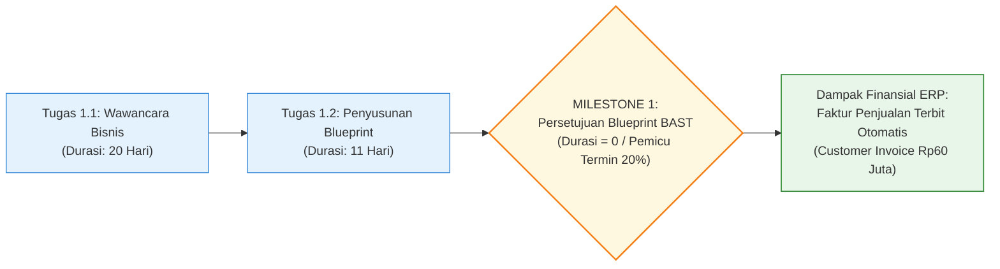
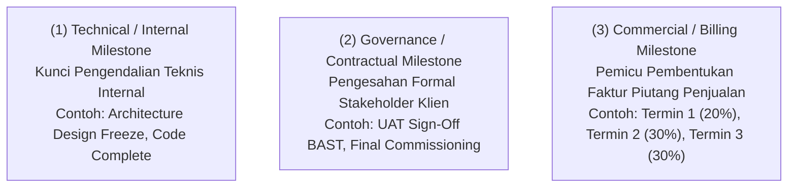
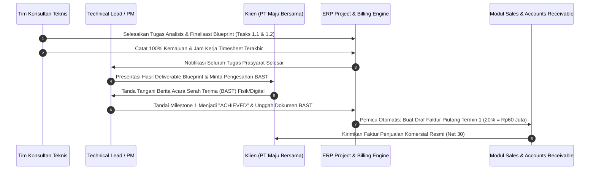
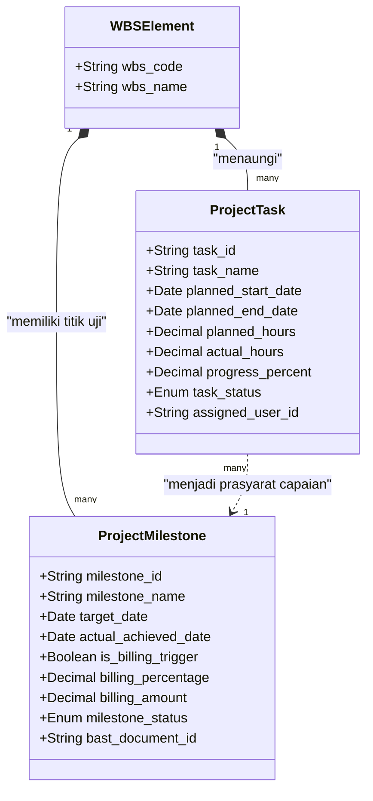

# Project Task & Milestone Management

## Definition

Dalam sistem ERP, **Task (Tugas Operasional)** dan **Milestone (Tonggak Proyek)** adalah dua entitas fundamental dalam struktur kerja proyek yang memiliki fungsi, karakteristik temporal, dan konsekuensi finansial yang berbeda:

- **Task (Tugas)** adalah satuan aktivitas operasional terkecil yang memiliki durasi waktu terukur ($\text{Durasi} > 0$), membutuhkan alokasi sumber daya tenaga kerja atau material, memiliki estimasi jam kerja, serta mencatat persentase kemajuan fisik (*physical progress*).
- **Milestone (Tonggak Proyek)** adalah titik penanda waktu tanpa durasi ($\text{Durasi} = 0$) yang menandakan penyelesaian suatu fase utama, pencapaian deliverable krusial, persetujuan formal manajemen, atau **titik pemicu penagihan piutang (*Billing Trigger*)** ke pelanggan.

---

## Purpose

1. **Pengukuran Kemajuan Proyek Berbasis Capaian Riil (*Deliverable-Based Progress*)**: Menghindari ilusi kemajuan pekerjaan (*progress illusion*) dengan mengikat pengakuan persentase proyek pada penyelesaian tugas dan pengesahan tonggak nyata (*earned milestones*).
2. **Otomatisasi Penagihan Termin Kontrak (*Milestone Billing Automation*)**: Menghubungkan penyelesaian pekerjaan fisik di lapangan secara seketika dengan pembuatan draf faktur penjualan (*Billing Request*) pada modul [[03-sales/sales-order|Sales (Phase 4)]].
3. **Pintu Gerbang Pengendalian Mutu (*Quality Gatekeeping*)**: Bertindak sebagai titik peninjauan formal (*Stage-Gate Review*) yang mengunci rilis fase proyek berikutnya sebelum tonggak fase sebelumnya disahkan oleh klien.
4. **Alokasi Beban Jam Kerja Personel**: Menyediakan wadah bagi tim teknis untuk mencatat jam kerja harian pada formulir *timesheet* yang terhubung langsung ke tugas operasional spesifik.
5. **Mitigasi Sengketa Pembayaran (*Payment Dispute Prevention*)**: Menyediakan jejak audit digital dokumen serah terima Berita Acara (BAST) yang menjadi dasar penagihan faktur piutang.

---

## Perbedaan Mendasar: Task vs Milestone

| Parameter Evaluasi | Task (Tugas Operasional) | Milestone (Tonggak Proyek) |
| :--- | :--- | :--- |
| **Durasi Waktu** | Memiliki rentang waktu kerja ($\text{Durasi} \ge 1 \text{ hari}$ atau jam). | Tidak memiliki durasi kerja ($\text{Durasi} = 0 \text{ hari}$). |
| **Konsumsi Sumber Daya** | Mengonsumsi jam kerja staf (*Man-Hours*) dan/atau material. | Tidak mengonsumsi sumber daya secara langsung. |
| **Input Timesheet** | Menjadi wadah penginputan jam kerja personel. | Dilarang untuk diinput jam kerja *timesheet*. |
| **Representasi Gantt** | Direpresentasikan sebagai bilah horizontal (*Gantt Bar*). | Direpresentasikan sebagai simbol intan / wajik (*Diamond Symbol*). |
| **Dampak Finansial** | Membentuk akumulasi biaya aktual (*Direct Cost / Labor Cost*). | Memicu penerbitan tagihan penjualan (*Customer Invoice*) atau pengakuan pendapatan (*Revenue Recognition*). |

---

## Tiga Kategori Milestone dalam ERP

Dalam implementasi ERP enterprise, milestone diklasifikasikan ke dalam tiga kategori fungsional:

1. **Technical Milestone**: Pintu kendali mutu internal tim teknis. Penyelesaian tugas-tugas arsitektur mengunci desain agar tidak terjadi perubahan spesifikasi liar (*scope creep*).
2. **Governance Milestone**: Pengesahan resmi antara manajer proyek dan komite pengarah (*Steering Committee*), yang sering kali mensyaratkan dokumen tanda tangan fisik Berita Acara Serah Terima (BAST).
3. **Billing Milestone**: Titik integrasi komersial dengan modul keuangan. Ketika milestone ditandai *Achieved* dan disetujui, ERP secara otomatis menghasilkan draf faktur piutang pelanggan persis sebesar nominal atau persentase termin kontrak.

---

## Business Process: Dari Penyelesaian Tugas ke Penagihan Milestone

---

## Business Rules

1. **Zero-Duration Milestone Constraint**: Sistem ERP wajib secara mutlak mengunci durasi nilai hari dan jam pada entitas milestone bernilai nol ($\text{Duration} = 0$); pencatatan jam kerja *timesheet* pada milestone dilarang.
2. **Prerequisite Tasks Completion Gate**: Suatu milestone tidak dapat diubah statusnya menjadi *Achieved* jika masih terdapat tugas-tugas prasyarat (*predecessor tasks*) yang berstatus belum selesai (*In-Progress* atau *Open*), kecuali disertai *override authorization* resmi dari Manajer Proyek.
3. **Mandatory Deliverable Evidence for Billing Milestones**: Pengesahan milestone penagihan (*Billing Milestone*) wajib menyertakan lampiran dokumen bukti serah terima (seperti berkas BAST yang ditandatangani klien) sebelum sistem mengizinkan penerbitan faktur penjualan.
4. **Billing Milestone Reversal Lockout**: Milestone yang telah memicu faktur penjualan dan faktur tersebut telah berstatus disetujui (*Posted*) atau lunas dibayar (*Paid*) dilarang keras untuk dibatalkan (*un-achieved*) tanpa melalui prosedur pembatalan faktur resmi (*Credit Note*) pada modul AR.
5. **No Orphan Tasks Allowance**: Setiap tugas operasional (*Task*) wajib terikat pada satu simpul elemen WBS (*WBS Element*) yang valid; sistem dilarang mengizinkan pembentukan tugas mandiri yang mengambang tanpa induk hierarki.

---

## Data Model Konseptual: Tugas dan Milestone

---

## Accounting & Financial Impact

Pencapaian milestone penagihan menggerakkan pengakuan piutang komersial:
- **Penerbitan Tagihan Termin**: Saat milestone disahkan, sistem memposting Debit pada akun Piutang Usaha (*Accounts Receivable*) dan Kredit pada akun Pendapatan Ditangguhkan (*Unearned Revenue*) atau Pendapatan Proyek langsung jika performa telah selesai.
- *(Untuk detail jurnal penagihan termin, perlakuan PPN, dan pengakuan pendapatan IFRS 15, rujuk ke [[09-project/project-billing-and-revenue|Project Billing & Revenue]], [[03-sales/accounts-receivable-integration|Phase 4]], dan [[02-accounting/accounts-receivable|Phase 3]])*.

---

## Canonical Scenario: Matriks Milestone Proyek PT Maju Bersama

Untuk proyek **Implementasi ERP Naventra** (`PRJ-ERP-2026-001`) dengan nilai kontrak **Rp300.000.000**, skema penagihan disepakati melalui 4 Milestone Komersial:

| ID Milestone | Uraian Capaian Milestone & Deliverable | Tanggal Target | Bobot Termin | Nilai Tagihan (IDR) | Syarat Dokumen Pengesahan |
| :--- | :--- | :--- | :--- | :--- | :--- |
| **`MLS-01`** | **Persetujuan Dokumen Blueprint & Arsitektur** | **31 Mei 2026** | **20%** | **60.000.000** | BAST Blueprint & Dokumen Spesifikasi Sistem |
| **`MLS-02`** | **Penyelesaian Konfigurasi Core & CRP Test** | **31 Jul 2026** | **30%** | **90.000.000** | Berita Acara Uji Conference Room Pilot (CRP) |
| **`MLS-03`** | **Penyelesaian UAT & Migrasi Saldo Awal** | **15 Sep 2026** | **30%** | **90.000.000** | BAST UAT Lolos Tanpa Isu Kritis (*Zero Severity 1*) |
| **`MLS-04`** | **Go-Live Resmi & Serah Terima Akhir Sistem** | **31 Okt 2026** | **20%** | **60.000.000** | BAST Go-Live Cutover & Handover Operasional |
| **TOTAL** | **4 Termin Penagihan Kontrak** | — | **100%** | **300.000.000** | — |

*Verifikasi Nilai: $\text{Rp60.000.000} + \text{Rp90.000.000} + \text{Rp90.000.000} + \text{Rp60.000.000} = \mathbf{Rp300.000.000}$ (100% Kontrak).*

---

## ERP Implementation

Perbandingan kapabilitas pengelolaan tugas dan milestone lintas sistem ERP enterprise:

| Parameter Fungsional | Odoo Enterprise | ERPNext | Microsoft Dynamics 365 | SAP S/4HANA Finance |
| :--- | :--- | :--- | :--- | :--- |
| **Entitas Tugas (Task)** | Model terpusat `project.task` dengan kanban & timesheet | Doctype terpusat `Task` dengan tracking jam kerja & status | *Project tasks* terhubung ke penugasan resource | Objek *Network Activities* pada modul *SAP Project System (PS)* |
| **Dukungan Milestone Finansial** | Tagging milestone pada task atau modul custom | Fitur *Milestone Tracking* pada proyek & invoice | Fitur native *Milestone billing rules* pada Project Operations | Komponen terdedikasi *Milestones in PS* terhubung ke *SD Billing Plan* |
| **Pemicu Penagihan Otomatis** | Penagihan berbasis Sales Order line milestone | Tombol *Create Invoice from Milestone* | Integrasi otomatis *Milestone billing backlog generation* | Transaksi *Milestone Billing via SD/PS (VF01)* terotomatisasi |
| **Validasi Prasyarat Tugas** | Pengecekan visual pada checklist subtask | Pengaturan *Depends on Task* secara hierarkis | Validasi dependensi tugas sebelum milestone aktif | Fitur *Progress Tracking & Status Gates* yang sangat ketat |

---

## Naventra Consideration

Rancangan arsitektur Task & Milestone pada Naventra ERP:

1. **Automated Billing Signal Dispatcher**: Saat status suatu record di tabel `project_milestones` diperbarui menjadi `ACHIEVED`, sistem Naventra mempublikasikan domain event `MilestoneAchievedEvent`. Modul penagihan (*Billing Service*) menangkap sinyal ini dan secara otomatis menerbitkan draf faktur piutang di modul Sales tanpa campur tangan staf admin.
2. **Digital BAST Attachment Hook**: Formulir pengesahan milestone pada Naventra mewajibkan pengunggahan berkas bukti (PDF BAST) dan tanda tangan digital penanggung jawab. Sistem mencatat stempel waktu SHA-256 pada berkas untuk mencegah modifikasi dokumen bukti audit di masa depan.
3. **Interactive Progress Barometer**: Dasbor Naventra menyajikan visualisasi *Milestone Timeline* interaktif yang menampilkan status lampu lalu lintas (*Traffic-Light Status*): hijau untuk milestone selesai tepat waktu, kuning untuk mendekati tenggat waktu, dan merah untuk milestone yang tertunda (*delayed*).

---

## References

- Project Management Institute (PMI). *A Guide to the Project Management Body of Knowledge (PMBOK Guide: Deliverables & Milestones)*.
- SAP SE. *Milestones in Project System and Billing Plans Integration with Sales & Distribution (SD)*. SAP Help Portal.
- Microsoft Corporation. *Define milestone billing rules for project contracts in Dynamics 365*. Microsoft Learn.
- Frappe Technologies. *Managing Tasks and Milestones in ERPNext*. ERPNext Documentation.
- International Accounting Standards Board (IASB). *IFRS 15: Performance Obligations Satisfied at a Point in Time*.
