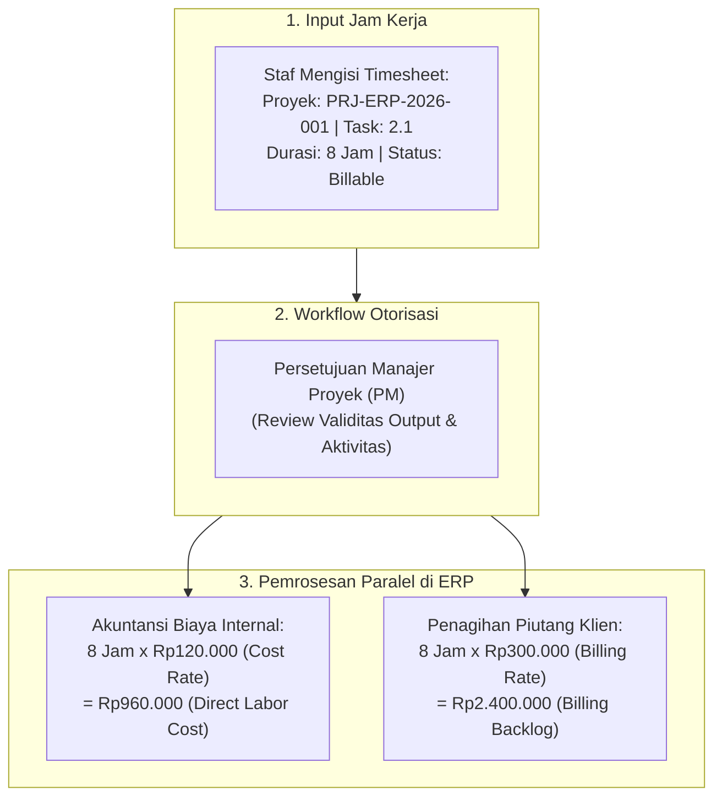
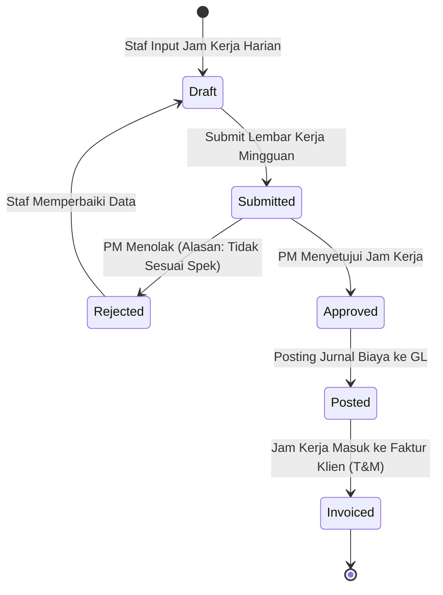
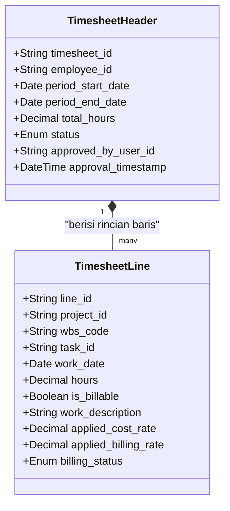

# Timesheet & Effort Tracking

## Definition

**Timesheet & Effort Tracking** dalam sistem ERP adalah mekanisme pencatatan, validasi, otorisasi, dan monetisasi atas jam kerja (*man-hours*) yang dihabiskan oleh personel (karyawan internal maupun konsultan eksternal) untuk menyelesaikan tugas-tugas spesifik pada simpul WBS suatu proyek.

Dalam konteks ERP enterprise, *timesheet* bukan sekadar kartu absensi kehadiran (*attendance card*). Timesheet bertindak sebagai **transaksi bisnis berdimensi ganda** yang secara simultan menggerakkan dua modul akuntansi:
1. **Pencatatan Biaya Internal (*Internal Project Costing*)**: Mengalikan jam kerja dengan tarif biaya (*Cost Rate*) untuk membentuk beban pokok tenaga kerja langsung (*Direct Labor Cost*) pada buku besar proyek.
2. **Penagihan Eksternal (*External Customer Billing*)**: Pada kontrak berbasis *Time & Material*, mengalikan jam kerja yang disetujui dengan tarif tagih (*Billing Rate*) untuk menghasilkan faktur tagihan piutang kepada pelanggan (*Customer Invoice*).

---

## Purpose

1. **Akurasi Pengukuran Biaya Pokok Tenaga Kerja**: Menghitung kontribusi biaya tenaga kerja manusia (*human effort cost*) secara presisi ke masing-masing fase proyek WBS, bukan dibebankan secara gelondongan ke biaya umum kantor pusat.
2. **Transparansi Penagihan Jasa Profesional (*Billing Transparency*)**: Menyediakan lampiran rincian lembar kerja terverifikasi (*Itemized Timesheet Attachment*) kepada klien untuk mendukung klaim pembayaran faktur pada kontrak *Time & Material*.
3. **Pembedaan Jam Tertagih vs Tidak Tertagih (*Billable vs Non-Billable Classification*)**: Memisahkan jam kerja produktif yang dibayar oleh klien dari jam kerja rework (pengerjaan ulang akibat kesalahan internal) atau jam pelatihan yang harus ditanggung sebagai beban operasional internal.
4. **Pengendalian Batas Jam Kerja Rencana (*Effort Burn-Down Monitoring*)**: Memantau konsumsi jam kerja riil terhadap pagu estimasi rencana (*Planned Hours*) guna mendeteksi gejala pembengkakan waktu (*schedule slippage*) sedini mungkin.
5. **Kepatuhan Regulasi Ketenagakerjaan**: Memantau batas jam kerja normal harian/mingguan dan memastikan lembur terkompensasi sesuai aturan ketenagakerjaan.

---

## Perbedaan Mendasar: Timesheet Proyek vs Penggajian HR (Payroll)

Salah satu kesalahpahaman umum dalam implementasi sistem informasi adalah menganggap bahwa *Timesheet Proyek* identik dengan *HR Payroll*. Keduanya memiliki domain dan fungsi yang terpisah:

| Dimensi | Timesheet Proyek (Project Management) | Penggajian Bulanan (HR Payroll) |
| :--- | :--- | :--- |
| **Tujuan Utama** | Mengalokasikan biaya jam kerja ke objek proyek WBS dan menghasilkan tagihan ke klien. | Membayar kompensasi hak keuangan kepada karyawan dan menyetorkan pajak/iuran resmi. |
| **Satuan Ukur** | Jam kerja per tugas/aktivitas (*Hours per Task/WBS*). | Periode bulanan, hari kehadiran, cuti, dan tunjangan. |
| **Tarif yang Dipakai** | *Standard Cost Rate* (gaji + beban tunjangan teralokasi) dan *Billing Rate*. | Gaji pokok riil, lembur resmi, potongan PPh 21, dan iuran BPJS Ketenagakerjaan. |
| **Dampak Finansial** | Menambah biaya persediaan proyek / beban pokok proyek (*Project WIP / Cost of Services*). | Mengkredit kas bank perusahaan dan mendebit akun beban gaji (*Salaries Expense / Payroll Clearing*). |

> [!important]
> Total jam kerja pada *Timesheet Proyek* tidak selalu sama persis dengan jam kehadiran kantor (*Attendance*). Seorang staf mungkin hadir di kantor selama 8 jam, namun hanya 6 jam yang dialokasikan ke Proyek A, sedangkan 2 jam sisanya dihabiskan untuk rapat internal divisi (*non-project time*).

---

## Siklus Hidup Dokumen Timesheet (Timesheet Lifecycle)

ERP mengelola status lembar kerja melalui tahapan alur kerja berikut:

1. **Draft**: Staf mengisi jam kerja, memilih kode proyek dan tugas, serta menginput deskripsi pekerjaan harian. Belum ada pemotongan anggaran atau pengakuan biaya.
2. **Submitted**: Lembar kerja dikunci oleh staf dan diajukan ke antrean persetujuan (*Approval Queue*) Manajer Proyek.
3. **Approved**: Manajer Proyek memvalidasi bahwa pekerjaan benar-benar dilakukan sesuai standar mutu. Jam kerja resmi mengikat (*committed*).
4. **Posted (Terbukukan)**: Mesin akuntansi mengeksekusi perhitungan biaya tenaga kerja dan memposting entri debit ke buku besar proyek.
5. **Invoiced (Tertagih)**: Pada proyek berbasis waktu, jam kerja yang telah disetujui ditarik ke dalam faktur penjualan dan statusnya dikunci agar tidak ditagihkan ganda (*unbilled to billed transition*).

---

## Business Rules

1. **Maximum Daily Working Hour Limit**: Sistem ERP wajib secara otomatis memblokir atau menandai peringatan keras jika seorang staf mencoba menginput jam kerja melebihi batas wajar harian (misal: penginputan $\ge 16 \text{ jam/hari}$ pada hari kerja biasa memerlukan persetujuan khusus Kepala Departemen).
2. **No Timesheet Posting to Closed Tasks/WBS**: Staf dilarang menginput jam kerja pada tugas (*Task*) atau simpul WBS yang statusnya telah berstatus *Completed*, *Cancelled*, atau *Closed*.
3. **Accounting Period Lockout**: Pengajuan *timesheet* dilarang dilakukan untuk tanggal-tanggal yang berada pada periode fiskal akuntansi yang telah ditutup (*Closed Accounting Period*).
4. **Segregation of Duties in Timesheet Approval**: Pengguna sistem dilarang keras memiliki hak untuk menyetujui lembar kerja *timesheet*-nya sendiri (*self-approval prohibition*), termasuk untuk pengguna dengan peran Manajer Proyek (timesheet PM wajib disetujui oleh Direktur Operasional atau Project Sponsor).
5. **Mandatory Description for Billable Hours**: Setiap baris penginputan jam kerja yang ditandai sebagai *Billable* wajib menyertakan deskripsi aktivitas terperinci (minimal 15 karakter) sebagai bukti transparan yang dapat dipertanggungjawabkan saat audit penagihan klien.

---

## Data Model Konseptual: Timesheet

---

## Accounting & Financial Impact

Persetujuan dan pembukuan *timesheet* memicu pencatatan biaya tenaga kerja langsung (*Direct Labor Cost*):

### Jurnal Pembukuan Jam Kerja Timesheet (Labor Cost Posting)
Membukukan 8 jam kerja Senior Solution Architect (Tarif Biaya Rp120.000/jam = Rp960.000) pada tugas konfigurasi proyek PT Maju Bersama:

| Akun | Debit (IDR) | Kredit (IDR) | Keterangan |
| :--- | :--- | :--- | :--- |
| `510300 - Beban Pokok Proyek: Tenaga Kerja Langsung` | 960.000 | - | Diakui pada Proyek `PRJ-ERP-2026-001` (WBS `2.1`) |
| `211950 - Akun Kliring Biaya Gaji Proyek (Payroll Clearing)` | - | 960.000 | Akun penyeimbang liabilitas alokasi gaji internal |

*(Catatan: Saat modul Payroll HR memproses gaji bulanan karyawan, akun beban gaji umum didebit dan akun `Payroll Clearing` dikredit, sehingga saldo alokasi gaji saling menghapus/reconciled).*

---

## Canonical Scenario: Realisasi Timesheet Proyek PT Maju Bersama

Pada proyek **Implementasi ERP Naventra** (`PRJ-ERP-2026-001`), target rencana alokasi tenaga kerja adalah **1.000 Jam Kerja** dengan estimasi biaya rencana **Rp100.000.000**:

### 1. Realisasi Akumulasi Jam Kerja Aktual Sepanjang 6 Bulan Proyek

| Peran Sumber Daya | Nama Staf | Jam Rencana | Jam Aktual | Deviasi Jam | Tarif Biaya (Cost Rate) | Biaya Aktual (IDR) |
| :--- | :--- | :--- | :--- | :--- | :--- | :--- |
| **Project Manager** | Hendra Wijaya | 200 Jam | 180 Jam | -20 Jam | Rp150.000 / jam | 27.000.000 |
| **Senior Solution Architect** | Budi Santoso | 300 Jam | 280 Jam | -20 Jam | Rp120.000 / jam | 33.600.000 |
| **Technical Consultant / Dev** | Rizky Pratama | 400 Jam | 360 Jam | -40 Jam | Rp75.000 / jam | 27.000.000 |
| **QA Lead** | Siti Rahma | 100 Jam | 100 Jam | 0 Jam | Rp40.000 / jam | 4.000.000 |
| **TOTAL** | **4 Personel** | **1.000 Jam** | **920 Jam** | **-80 Jam** | — | **Rp90.000.000** |

### 2. Analisis Efisiensi Biaya Tenaga Kerja (Labor Cost Variance)
- **Planned Labor Cost**: **Rp100.000.000** (1.000 jam).
- **Actual Labor Cost**: **Rp90.000.000** (920 jam).
- **Varian Tenaga Kerja (*Favorable Variance*)**:
  $$\text{Labor Variance} = \text{Rp100.000.000} - \text{Rp90.000.000} = \mathbf{+Rp10.000.000 \text{ (Hemat 10\%)}}$$
- Penyebab: Tingkat keahlian konsultan senior yang tinggi memungkinkan fase konfigurasi inti dan migrasi data diselesaikan 80 jam lebih cepat dari estimasi konservatif awal tanpa mengurangi mutu deliverable.

---

## ERP Implementation

Perbandingan kapabilitas modul timesheet proyek pada software ERP terkemuka:

| Parameter Timesheet | Odoo Enterprise | ERPNext | Microsoft Dynamics 365 | SAP S/4HANA Finance |
| :--- | :--- | :--- | :--- | :--- |
| **Antarmuka Input Jam Kerja** | Modul *Timesheets* bawaan (Grid mingguan & mobile timer) | Doctype *Timesheet* terhubung ke Project, Task, dan Employee | Aplikasi mobile & web *Time entry grid* pada Project Operations | Lembar kerja terpusat legendaris *Cross-Application Time Sheet (CATS)* |
| **Alur Persetujuan Bertingkat** | Validasi oleh Project Manager via modul Project | Alur persetujuan berbasis *Workflow* dan status submit | Persetujuan dua tingkat (*Project Manager & Resource Manager*) | Alur persetujuan fleksibel via *CATS Approval (CATS_APPR_LITE)* |
| **Integrasi Otomatis ke Biaya GL** | Memposting biaya ke akun analitik secara seketika | Dokumen *Salary Slip / Timesheet Costing* terintegrasi | Posting otomatis transaksi jurnal biaya tenaga kerja aktual | Transaksi transfer *CATS to Controlling (CAT6 / CATA)* otomatis |
| **Pembedaan Billable vs Non-Billable** | Checkbox *Billable* pada baris tugas/timesheet | Field *Is Billable* dengan penentuan tarif tagih | Pemetaan eksplisit *Billing type (Billable, Non-billable, Compl.)* | Penentuan karakteristik jam kerja via *Attendances / Wage Types* |

---

## Naventra Consideration

Rancangan arsitektur modul Timesheet & Effort Tracking pada Naventra ERP:

1. **One-Click Mobile Timer & Weekly Grid**: Naventra menyediakan dua mode penginputan: (1) *Live Stopwatch Timer* pada aplikasi web/mobile yang dapat dinyalakan saat staf mulai bekerja pada suatu task, dan (2) *Weekly Timesheet Matrix* untuk penginputan cepat berbasis matriks hari $\times$ tugas.
2. **Dual-Lock Approval Pipeline**: Sistem menerapkan pipa validasi otomatis: saat tombol *Submit* ditekan, mesin sistem memvalidasi batas maksimum jam kerja dan status keterbukaan periode GL. Manajer Proyek dapat menyetujui seluruh lembar kerja secara massal (*Bulk Approval*) atau menolak baris tertentu dengan menyertakan catatan koreksi.
3. **Atomic Cost & Backlog Generation**: Persetujuan *timesheet* memicu transaksi basis data atomik yang secara simultan memperbarui tabel akumulasi biaya proyek `project_actual_costs` dan tabel penagihan piutang belum tertagih `project_unbilled_revenue`.

---

## References

- Project Management Institute (PMI). *A Guide to the Project Management Body of Knowledge (PMBOK Guide: Project Resource & Time Management)*.
- SAP SE. *Cross-Application Time Sheet (CATS) Integration with Project System and Controlling in S/4HANA*. SAP Help Portal.
- Microsoft Corporation. *Time entry and approval in Dynamics 365 Project Operations*. Microsoft Learn.
- Frappe Technologies. *Timesheet Management and Activity Costing in ERPNext*. ERPNext Documentation.
- Odoo S.A. *Track Project Time and Timesheet Validation*. Odoo Documentation.
