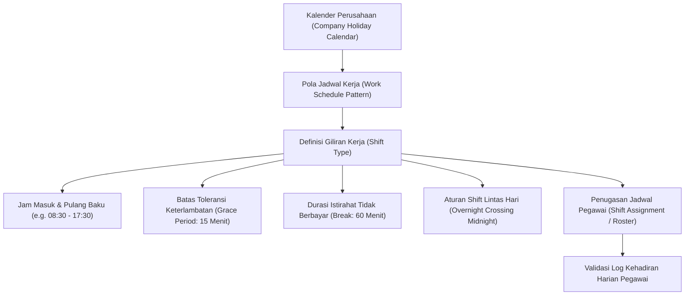

# Attendance and Work Schedule

## Definition

**Attendance and Work Schedule** adalah domain manajemen waktu operasional di dalam Enterprise Resource Planning (ERP) yang mengatur perancangan kalender kerja (*working calendars*), penetapan pola giliran kerja (*shifts & rosters*), penangkapan log kehadiran mentah (*raw punch logs*), serta validasi rekonsiliasi data presensi menjadi parameter jam kerja resmi yang siap diproses oleh modul penggajian (*payroll inputs*).

Di dalam ERP enterprise, pencatatan kehadiran tidak sekadar berfungsi sebagai buku absensi harian, melainkan merupakan **fondasi penentu kapasitas operasional dan kepatuhan hukum ketenagakerjaan**:
1. Menentukan ketersediaan kapasitas tenaga kerja pada jadwal proyek (*Project Resource Availability*) dan pusat kerja manufaktur (*Work Center Capacity*).
2. Menjadi dasar verifikasi kelayakan pemberian tunjangan kehadiran (*attendance allowances*), pemotongan upah akibat mangkir (*unpaid absence deductions*), serta dasar perhitungan kompensasi lembur (*overtime calculation*).

---

## Purpose

Tujuan pengelolaan Attendance and Work Schedule di dalam ERP adalah:

1. **Standardisasi Pola Waktu Kerja (*Work Schedule Governance*)**: Mengatur jam kerja formal, durasi istirahat, toleransi keterlambatan, dan hari libur nasional sesuai peraturan perundang-undangan ketenagakerjaan dan kesepakatan kerja bersama (KKB).
2. **Otomatisasi Pengolahan Log Presensi (*Automated Punch-to-Attendance Processing*)**: Mengonversi ribuan stempel waktu mentah (*raw punch timestamps*) dari mesin biometrik atau aplikasi mobile menjadi data kehadiran terstruktur (Hadir, Terlambat, Pulang Cepat, Mangkir).
3. **Penyelesaian Anomali Presensi (*Attendance Regularization*)**: Menyediakan alur kerja persetujuan mandiri (*Self-Service Workflow*) untuk menyelesaikan kasus lupa presensi (*missing punch*) atau tugas luar kantor.
4. **Penyelarasan Kapasitas Lintas Modul**: Mengintegrasikan ketersediaan kehadiran harian dengan sistem pembebanan jam kerja proyek (*Timesheet*) dan pelacakan jam henti kerja (*Shop Floor Downtime*).
5. **Kepatuhan Terhadap Batas Maksimum Jam Kerja**: Memantau akumulasi jam kerja mingguan guna mencegah pelanggaran batas maksimum jam kerja dan memastikan waktu istirahat yang memadai bagi kesehatan pegawai.

---

## Arsitektur Jadwal Kerja dan Giliran Kerja (Shift)

ERP enterprise mengorganisasikan manajemen jadwal kerja melalui model hierarkis:



### 1. Working Calendars & Standard Schedules
- **Standar 5 Hari Kerja (40 Jam/Minggu)**: Pola kerja umum kantor profesional (Senin – Jumat, 8 jam kerja efektif per hari).
- **Standar 6 Hari Kerja (40 Jam/Minggu)**: Pola operasional ritel atau manufaktur ringan (Senin – Sabtu, 7 jam kerja efektif per hari kerja penuh dan 5 jam pada hari pendek).
- **Pola Continuous Shift (Pabrik 24/7)**: Pembagian 3 giliran kerja bergiliran (*Shift 1: Pagi, Shift 2: Sore, Shift 3: Malam*) dengan rotasi jadwal otomatis (*Shift Rostering*).

### 2. Parameter Kunci Definisi Shift
- **Start & End Time**: Batas waktu jam kerja normal yang diharapkan.
- **Grace Period (Toleransi Keterlambatan)**: Jeda toleransi waktu (misalnya 15 menit) di mana kedatangan pegawai belum dihitung sebagai keterlambatan yang memotong tunjangan.
- **Minimum Hours for Full-Day**: Jam kerja minimum yang harus dipenuhi agar pegawai diakui hadir satu hari penuh (misalnya minimal 4 jam untuk setengah hari, 7 jam untuk hari penuh).
- **Break Rules**: Jadwal waktu istirahat (apakah berbayar atau dipotong dari total jam kerja harian).

---

## Mekanisme Penangkapan Presensi & Pemrosesan Log

ERP mengolah data presensi melalui dua lapisan data:

1. **Raw Punch Log (Log Mentah Presensi)**:
   - Data stempel waktu murni yang dikirimkan oleh terminal perangkat fisik (mesin sidik jari, pemindai wajah, kartu RFID gedung) atau aplikasi *mobile GPS geo-fencing*. Berisi: `employee_id`, `timestamp`, `terminal_ip`, dan `direction (IN/OUT/UNSPECIFIED)`.
2. **Processed Daily Attendance (Data Kehadiran Terproses)**:
   - Hasil olahan mesin evaluasi presensi ERP yang memasangkan log masuk (*Clock-In*) dan log pulang (*Clock-Out*) terhadap jadwal shift resmi, menghasilkan status final: *Present, Late, Early Exit, Half Day, Absent, On-Duty*.

---

## Penanganan Kasus Eksepsi (Edge Cases)

Mesin kehadiran ERP dirancang untuk menangani berbagai anomali presensi lapangan:

| Kasus Eksepsi | Karakteristik Masalah Lapangan | Solusi & Aturan Sistem ERP |
| :--- | :--- | :--- |
| **Missing Punch (Lupa Clock-Out)** | Pegawai melakukan *clock-in* di pagi hari tetapi lupa *clock-out* saat pulang. | Sistem menandai status *Incomplete / Missing Punch*. Jam kerja harian ditangguhkan (*flagged*) dan pegawai wajib mengajukan permohonan koreksi (*Attendance Regularization*) disertai persetujuan atasan. |
| **Duplicate Punches (Pengetukan Ganda)** | Pegawai menempelkan kartu RFID dua kali dalam rentang waktu beberapa detik karena ragu. | Sistem menerapkan filter deduplikasi (*Anti-Bounce Rule*): pengetukan berulang dalam jendela waktu 3 – 5 menit dari terminal yang sama diabaikan sebagai data *duplicate*. |
| **Overnight Shift (Shift Lintas Tengah Malam)** | Shift malam pabrik (pukul 22:00 s.d. 06:00 keesokan harinya). Log masuk tercatat di Hari T, log keluar di Hari T+1. | Sistem mengaitkan seluruh pasangan log ke tanggal dimulainya shift (*Shift Start Date Attribution*), mencegah log keluar pada pukul 06:00 dianggap sebagai keterlambatan masuk hari baru. |
| **Late Arrival & Early Exit** | Pegawai hadir melampaui batas toleransi atau meninggalkan tempat kerja sebelum jam shift berakhir. | Sistem menghitung selisih menit deviasi keterlambatan secara otomatis yang dapat dikonfigurasi memotong persentase tunjangan kehadiran. |
| **Tugas Luar Kantor (Business Trip / On-Duty)** | Pegawai bekerja di lokasi proyek klien sehingga tidak dapat melakukan presensi di mesin kantor pusat. | Pegawai mengajukan dokumen *Official Duty Request* yang telah disetujui, sehingga sistem menandai status *Present (On-Duty)* tanpa mencatat absensi mangkir. |

---

## Business Rules

1. **Hierarki Penentuan Shift Harian**: Jika pegawai memiliki jadwal giliran kerja khusus (*Assigned Shift Schedule*), jadwal tersebut menggantikan kalender kerja baku perusahaan (*Default Company Schedule*).
2. **Batas Waktu Koreksi Presensi (*Attendance Regularization Cut-Off*)**: Seluruh permohonan koreksi lupa presensi wajib disetujui oleh atasan langsung paling lambat 2 hari kerja sebelum tanggal batas tutup buku penggajian (*Payroll Cut-Off Date*). Permohonan yang melewati batas ini akan diproses pada siklus bulan berikutnya.
3. **Pemisahan Pengakuan Kehadiran dengan Pembayaran Gaji**: Data kehadiran harian tidak langsung mengubah nilai buku besar akuntansi; kehadirian dievaluasi sebagai kumpulan data kuantitatif yang dikirimkan ke modul penggajian (*Payroll Engine*) pada akhir periode.
4. **Pencegahan Fraud Presensi Mobile (*Geo-Fencing & Biometric Liveness*)**: Aplikasi presensi mobile wajib memvalidasi radius koordinat GPS kantor (maksimal 50–100 meter dari titik koordinat resmi) serta mendeteksi manipulasi lokasi (*Fake GPS Detection*).
5. **Kebijakan Hari Libur Nasional & Istirahat Mingguan**: Kehadiran pegawai pada hari libur resmi kalender perusahaan (*Public Holiday*) atau hari istirahat mingguan (*Rest Day*) tidak diperlakukan sebagai jam kerja biasa, melainkan dialihkan secara otomatis menjadi usulan lembur (*Overtime Pre-authorization*).

---

## Skenario Kanonikal: Jadwal & Presensi Andi Pratama

Penerapan jadwal kerja pegawai kanonikal `Andi Pratama` (`EMP-2026-0042`) di `PT Maju Bersama`:

- **Jadwal Kerja Baku**: *Regular Office Hours (Mon - Fri)*
- **Jam Kerja Shift**: Pukul 08:30 s.d. 17:30 WIB
- **Durasi Istirahat**: 12:00 – 13:00 WIB (60 Menit - Tidak Berbayar)
- **Jam Kerja Efektif**: 8 Jam/Hari (40 Jam/Minggu)
- **Toleransi Keterlambatan (*Grace Period*)**: 15 Menit (s.d. Pukul 08:45 WIB)

### Catatan Kehadiran Bulan Berjalan (Contoh Hari Kerja Normal):

```text
Tanggal      : Rabu, 15 April 2026
Jadwal Shift : REG-01 (08:30 - 17:30)
Log Masuk    : 08:24 WIB (Terminal: RFID-LOBBY-01) -> Tepat Waktu (On-Time)
Log Keluar   : 17:38 WIB (Terminal: RFID-LOBBY-01) -> Selesai Jam Kerja Normal
Total Durasi : 9 Jam 14 Menit (Kurang 1 Jam Istirahat = 8 Jam 14 Menit Kerja Efektif)
Status Akhir : PRESENT (Hadir Penuh)
```

*Dampak Penggajian*: Memenuhi 1 hari kehadiran penuh untuk kelayakan tunjangan makan dan transport harian tanpa penalti keterlambatan.

---

## ERP Implementation

Penerapan sistem kehadiran pada platform ERP enterprise:

### Odoo Implementation
- **Attendances App (`hr.attendance`)**: Pengelolaan presensi sederhana dengan mode *Kiosk Mode* (PIN / Barcode) dan tombol *Check In/Check Out* pada portal web.
- **Working Hours Schedules (`resource.calendar`)**: Mendefinisikan jam kerja mingguan per pegawai untuk menghitung absensi dan kapasitas lembar waktu.
- **Penyelarasan Absensi Otomatis**: Odoo menghitung durasi jam kerja secara otomatis dengan mengurangkan selisih waktu antara *Check In* dan *Check Out*.

### ERPNext Implementation
- **Attendance DocType**: Menyimpan status kehadiran harian (*Present, Absent, On Leave, Half Day*).
- **Shift Type & Shift Assignment**: Mendukung definisi shift fleksibel dengan toleransi keterlambatan (*Late Entry Grace Period*) dan ambang jam minimum (*Threshold Hours*).
- **Auto Attendance Processor**: ERPNext menyediakan layanan latar belakang (*Background Job*) yang secara otomatis memproses tabel `Employee Checkin` mentah menjadi dokumen `Attendance` setiap pergantian hari.

### Dynamics 365 Implementation
- **Time and Attendance (Supply Chain & HR)**: Modul canggih yang mendukung pendaftaran waktu jam kerja pabrik (*Shop Floor Clock-In/Clock-Out*).
- **Profile Calendar System**: Menyediakan kalender kerja yang memisahkan jam reguler, jam istirahat terbayar, dan jam lembur otomatis.
- **Electronic Time Card Approvals**: Mengumpulkan seluruh catatan kehadiran dan jam henti mesin ke dalam kartu waktu elektronik (*Electronic Time Cards*) untuk disetujui manajer sebelum ditransfer ke buku besar penggajian.

---

## Naventra Consideration

Dalam perancangan modul kehadiran dan jadwal kerja Naventra ERP:

1. **Mesin Pemroses Log Biometrik Terpadu**: Naventra menyediakan *API Gateway Ingestion* yang mampu menampung puluhan ribu stempel presensi per menit dari mesin sidik jari dan RFID lintas cabang, memproses status kehadiran secara *near real-time*.
2. **Sistem Pengenalan Shift Otomatis (*Auto-Shift Detection*)**: Untuk staf operasional yang bekerja tanpa jadwal shift kaku, mesin Naventra secara cerdas mencocokkan jam *clock-in* pertama pegawai ke jadwal shift terdekat tanpa memerlukan penugasan manual dari HR.
3. **Penyelarasan Presensi dengan Lembar Waktu Proyek**: Sistem melakukan validasi silang antara total jam kehadiran harian pada modul HR dengan total jam lembar kerja (*Timesheet*) yang diinput pegawai pada modul [[09-project/timesheet-and-effort-tracking|Project Management]]. Pengguna diperingatkan jika jam kerja proyek melebihi jam kehadiran fisik di kantor.

---

## References

- Society for Human Resource Management (SHRM). *Managing Employee Attendance and Work Schedules*. SHRM.
- International Labour Organization (ILO). *Working Time Conventions and Recommendations*.
- SAP Help Portal. *Time and Attendance Management in SAP ERP HCM*.
- Microsoft Learn. *Time and Attendance Overview in Dynamics 365 Supply Chain & HR*.
- ERPNext Documentation. *Shift and Attendance Management*.
- Odoo 17.0 Documentation. *Attendances Management*.
