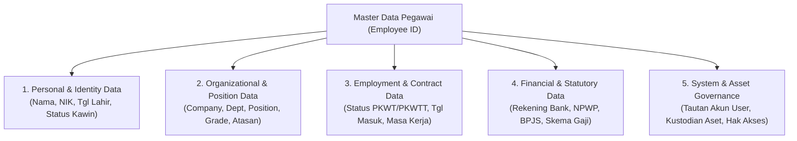

# Employee Master Data

## Definition

**Employee Master Data** adalah kumpulan rekaman data induk terstruktur di dalam Enterprise Resource Planning (ERP) yang memuat seluruh atribut identitas personal, hubungan hukum ketenagakerjaan, penempatan organisasi, parameter kompensasi, dan hak akses operasional seorang pegawai sepanjang masa baktinya di perusahaan.

Di dalam arsitektur sistem informasi enterprise, Employee Master Data merupakan simpul referensi sentral (*central reference node*). Data ini tidak hanya dikonsumsi oleh departemen Sumber Daya Manusia (SDM), melainkan menjadi rujukan wajib bagi modul Keuangan (pembayaran gaji & klaim), Pengadaan (persetujuan PR/PO), Penjualan (komisi & penetapan staf), Manufaktur (kualifikasi operator), Aset Tetap (penanggung jawab aktiva), dan Manajemen Proyek (alokasi jam kerja).

---

## Purpose

Tujuan pengelolaan Employee Master Data yang terstandarisasi dalam ERP adalah:

1. **Konsistensi Data Tunggal (*Single Source of Truth*)**: Menghilangkan duplikasi dan inkonsistensi biodata pegawai lintas modul bisnis dan unit operasional.
2. **Kepatuhan Hukum dan Ketenagakerjaan**: Memastikan kelengkapan data statutori (nomor identitas kependudukan, nomor pokok wajib pajak, kepesertaan jaminan sosial ketenagakerjaan dan kesehatan) guna memenuhi audit kepatuhan regulasi.
3. **Penegakan Hierarki Persetujuan (*Approval Workflow Automation*)**: Menyediakan data rantai komando manajerial (*reporting line*) yang menggerakkan alur kerja persetujuan otomatis untuk cuti, lembur, klaim biaya, hingga dokumen pembelian.
4. **Otomatisasi Parameter Finansial**: Menyediakan rekening bank valid dan parameter perpajakan yang siap diproses oleh mesin penggajian (*payroll engine*) tanpa entri ulang manual.
5. **Keamanan Data dan Privasi Informasi Pribadi (*PII Protection*)**: Membatasi akses terhadap data sensitif pegawai sesuai prinsip kepatuhan perlindungan data pribadi.

---

## Segmentasi Data Master Pegawai

ERP enterprise mengorganisasikan data induk pegawai ke dalam lima segmen logis:



### 1. Segmen Data Personal & Identitas (Personal & Identity)
- **Nama Lengkap & Panggilan**: Sesuai kartu identitas resmi.
- **Identitas Kependudukan**: Nomor Induk Kependudukan (NIK) / Paspor.
- **Tempat & Tanggal Lahir, Jenis Kelamin**: Kebutuhan verifikasi usia pensiun dan demografi.
- **Status Pernikahan & Tanggungan**: Menentukan klasifikasi status Penghasilan Tidak Kena Pajak (PTKP) pada kalkulasi pajak penghasilan.
- **Kontak Personal & Kontak Darurat**: Alamat domisili, email pribadi, nomor telepon seluler, dan kontak keluarga terdekat.

### 2. Segmen Organisasi & Posisi (Organizational & Position)
- **Company Code**: Entitas badan hukum pemberi kerja (*Legal Entity*).
- **Business Unit / Division**: Divisi operasional bisnis.
- **Department**: Departemen tempat pegawai bertugas (misalnya *Technology*).
- **Position & Job Code**: Formasi jabatan spesifik (*Software Engineer*) dan klasifikasi profesi generik.
- **Job Grade / Banding**: Tingkatan hierarki kepegawaian yang menentukan rentang gaji, plafon tiket dinas, dan fasilitas tunjangan.
- **Direct Manager (Reports To)**: ID atasan langsung pemegang wewenang persetujuan.
- **Work Location / Branch**: Kantor pusat, pabrik, atau cabang penugasan fisik.

### 3. Segmen Hubungan Kerja & Kontrak (Employment & Contract)
- **Employment Type**: Status hubungan kerja hukum (Pegawai Tetap / PKWTT, Pegawai Kontrak Waktu Tertentu / PKWT, atau Masa Percobaan / *Probation*).
- **Hire Date (Tanggal Mulai Kerja)**: Titik tolak perhitungan masa kerja, hak cuti tahunan, dan hak pesangon.
- **Probation End Date**: Tanggal evaluasi akhir masa percobaan.
- **Contract Start & End Date**: Tanggal berlaku kontrak kerja untuk pegawai tidak tetap.
- **Notice Period**: Batas waktu pemberitahuan pengunduran diri sesuai kesepakatan kerja.

### 4. Segmen Finansial & Pajak (Financial & Statutory Compliance)
- **Data Rekening Bank**: Nama bank, kantor cabang, nomor rekening, dan nama pemilik rekening untuk penyaluran gaji otomatis (*bank disbursement file*).
- **Nomor Pokok Wajib Pajak (NPWP)**: Dasar pelaporan pemotongan pajak penghasilan pasal 21.
- **Nomor Jaminan Sosial Ketenagakerjaan & Kesehatan**: Nomor kepesertaan BPJS Ketenagakerjaan dan BPJS Kesehatan di Indonesia (atau nomor *Social Security* di yurisdiksi lain).
- **Salary Structure Assignment**: Skema struktur gaji acuan yang menentukan komponen hak penerimaan dan potongan.

### 5. Segmen Tata Kelola Sistem & Aset (System & Governance)
- **ERP User ID Link**: Tautan ke akun login sistem untuk mengaktifkan portal layanan mandiri (*Employee Self-Service* - ESS).
- **Asset Custodian Link**: Daftar aktiva tetap perusahaan (laptop, kendaraan dinas, alat kerja) yang diserahkan dan menjadi tanggung jawab fisik pegawai pada modul [[08-assets/asset-master-data|Fixed Assets (Phase 9)]].

---

## Effective-Dating pada Master Pegawai

Perubahan informasi pegawai di dalam ERP dikelola menggunakan mekanisme **Effective Dating** guna menjaga kesinambungan historis (*Historical Integrity*):

| Atribut Master Data | Tanggal Berlaku (`effective_from`) | Tanggal Berakhir (`effective_to`) | Nilai Data Baru | Alasan Perubahan Bisnis |
| :--- | :--- | :--- | :--- | :--- |
| **Job Grade** | 01 Januari 2024 | 31 Desember 2025 | `Grade 3 - Junior Engineer` | Pengangkatan Awal |
| **Job Grade** | 01 Januari 2026 | 31 Desember 9999 | `Grade 4 - Mid Engineer` | Promosi Kinerja Tahunan |
| **Departemen** | 01 Januari 2024 | 30 Juni 2025 | `IT Infrastructure` | Penempatan Awal |
| **Departemen** | 01 Juli 2025 | 31 Desember 9999 | `Technology (Software Dev)` | Mutasi Internal Antar Tim |

*Prinsip Sistem*: Tanggal penutupan record lama (`effective_to`) diisi otomatis dengan tanggal satu hari sebelum tanggal mulai berlakunya record baru (`effective_from`). Tidak ada gap tanggal atau tumpang tindih (*overlapping*) pada penugasan posisi aktif.

---

## Business Rules

1. **Keunikan Nomor Induk Pegawai (Employee ID Uniqueness)**: Setiap pegawai idealnya memiliki nomor identifikasi unik sistemik yang tidak digunakan ulang (*re-used*), bahkan setelah pegawai tersebut berhenti bekerja, guna menjaga konsistensi referensi historis.
2. **Kerahasiaan Data Pribadi (*PII Access Segregation*)**: Rekening bank, gaji pokok, dan riwayat kesehatan pegawai dibatasi aksesnya hanya untuk staf berwenang dan pemilik data bersangkutan melalui prinsip hak akses terkecil (*least privilege*).
3. **Integritas Rantai Pelaporan (*No Circular Hierarchy*)**: Sistem memvalidasi struktur pohon organisasi untuk mencegah hubungan pelaporan melingkar (misalnya Pegawai A melapor ke Pegawai B, namun Pegawai B melapor kembali ke Pegawai A).
4. **Validasi Kontrak Berjangka (*Contract Expiration Alert*)**: Sistem dapat memicu notifikasi peringatan dini otomatis kepada pihak terkait menjelang berakhirnya kontrak kerja PKWT.
5. **Prasyarat Status Penggajian**: Perubahan nomor rekening bank atau komponen gaji yang diajukan setelah tanggal batas tutup buku penggajian (*Payroll Cut-Off Date*) lazimnya ditangguhkan ke periode penggajian bulan berikutnya.

---

## Skenario Kanonikal: Master Pegawai Andi Pratama

Meneruskan profil pegawai kanonikal di `PT Maju Bersama`:

```text
================================================================================
                    RECORD MASTER DATA PEGAWAI (ERP-HR)
================================================================================
[SEGMEN 1: IDENTITAS PERSONAL]
Employee ID          : EMP-2026-0042
Nama Lengkap         : Andi Pratama
NIK / KTP            : 3271XXXXXXXX0005
Jenis Kelamin        : Laki-Laki
Status Pernikahan    : Menikah (1 Tanggungan Anak - Status Pajak K/1)
Email Kantor         : andi.pratama@majubersama.co.id

[SEGMEN 2: PENEMPATAN ORGANISASI]
Company Code         : 1000 - PT Maju Bersama
Departemen           : Technology
Posisi / Jabatan     : Software Engineer (POS-TECH-042)
Klasifikasi Job      : Software Engineering (JOB-SWE)
Job Grade / Band     : Grade 4 (Professional Staff)
Atasan Langsung      : EMP-2026-0010 (Budi Santoso - Engineering Manager)
Pusat Biaya (Cost Ctr: CC-TECH-01 (Teknologi & R&D)
Lokasi Kerja         : Kantor Pusat Jakarta (Head Office)

[SEGMEN 3: HUBUNGAN KETENAGAKERJAAN]
Status Karyawan      : PKWTT (Pegawai Tetap)
Tanggal Mulai Kerja  : 01 Januari 2024
Masa Percobaan       : Lulus (01 Jan 2024 s.d. 31 Mar 2024)
Status Operasional   : Active

[SEGMEN 4: KEUANGAN & KEPATUHAN]
Bank Penyalur Gaji   : Bank Mandiri (Cabang Jakarta Thamrin)
Nomor Rekening Bank  : 123-00-9876543-2 (A.n. Andi Pratama)
NPWP                 : 81.XXX.XXX.X-012.000
BPJS Ketenagakerjaan : 2401XXXXXXXX
BPJS Kesehatan       : 0001XXXXXXXX
Struktur Gaji Acuan  : STRUC-TECH-ENG (Gaji Pokok Rp10.000.000)

[SEGMEN 5: AKSES SISTEM & ASET KANTOR]
Tautan User Login    : user.andipratama (Role: Developer / Self-Service)
Aset Kustodian Aktif : AST-NB-2024-088 (Laptop ThinkPad T14 Gen 4)
================================================================================
```

---

## ERP Implementation

Penerapan struktur Employee Master Data pada software ERP terkemuka:

### Odoo Implementation
- **Model `hr.employee`**: Mengelompokkan data ke dalam tab visual:
  - *Work Information*: Departemen, manajer, lokasi kerja, jam kerja standar.
  - *Private Information*: Alamat pribadi, rekening bank, status keluarga, paspor/NIK.
  - *HR Settings*: Tautan akun login pengguna (`user_id`), PIN absensi, badge ID.
- **Model `hr.contract`**: Memisahkan rekaman hukum kontrak kerja dari data profil fisik, mencakup masa berlaku, besaran upah, dan tunjangan berkala.

### ERPNext Implementation
- **Employee DocType**: Terdiri dari beberapa seksi lipat terstruktur:
  - *Basic Details*: Nama, jenis kelamin, tanggal lahir, NIK.
  - *Joining & Employment*: Tanggal masuk, departemen, penanggung jawab langsung (*Reports to*).
  - *Salary & Bank Details*: Modus pembayaran gaji, rincian rekening, dan penugasan *Salary Structure*.
  - *Connections Dashboard*: Menampilkan pintasan langsung ke dokumen cuti, klaim expense, lembar waktu kerja, dan riwayat slip gaji pegawai.

### Dynamics 365 Implementation
- **Worker & Employment Entities**: Memisahkan secara modular antara:
  - *Person / Party Record*: Biodata global yang bersifat agnostik perusahaan.
  - *Worker*: Representasi pegawai sebagai tenaga kerja.
  - *Employment*: Hubungan kerja spesifik dengan satu badan hukum (*Legal Entity*), memungkinkan satu orang memiliki riwayat kerja di beberapa entitas anak perusahaan grup (*multi-company employment*).
- **Position Hierarchy**: Penugasan posisi menggunakan model *Position-to-Position Hierarchy* yang independen dari orang yang menjabatnya.

---

## Naventra Consideration

Dalam perancangan modul master data pegawai Naventra ERP:

1. **Arsitektur Tiga Lapis (Party - Employment - User)**: Mengadopsi arsitektur data model di mana entitas `Person` memegang biodata personal permanen, entitas `Employment` memegang kontrak legal dan penempatan departemen per entitas usaha, dan entitas `User` mengelola kredensial sistem.
2. **Validasi Format Statutori Otomatis**: Formulir input pegawai dilengkapi modul validasi otomatis untuk panjang digit dan *checksum* NIK (16 digit), NPWP (16 digit format baru), serta format nomor rekening bank utama di Indonesia.
3. **Kustodian Aset Terintegrasi Real-Time**: Kolom penugasan aset pada formulir pegawai tertaut langsung dengan modul [[08-assets/asset-master-data|Fixed Assets]], sehingga mutasi posisi pegawai otomatis mengirimkan notifikasi ke petugas logistik umum (*General Affairs*) untuk pemutakhiran lokasi barang aktiva.

---

## References

- Society for Human Resource Management (SHRM). (2021). *Managing Employee Master Data and Privacy*. SHRM Foundation.
- SAP Help Portal. *Managing Employee Master Data in SAP S/4HANA Human Resources*.
- Microsoft Learn. *Maintain Worker and Employment Information in Dynamics 365 Human Resources*.
- ERPNext Documentation. *Employee Master Data*.
- Odoo 17.0 Documentation. *Employees Management and Contract Tracking*.
